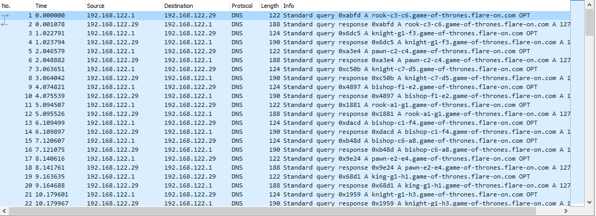

4 - Dnschess
============

**Time spent:** 1.5 hours

**Tools used:** Ghidra, Wireshark, Python


The fourth challenge in the series were two Linux binaries, implementing a GUI application for the game of chess (ChessUI), and an AI called DeepFLARE (ChessAI.so). Along with it was a PCAP file and a note that stated the traffic that was captured was somehow related to this chess program that was running on an Ubuntu machine. The final sentence of the note dictated:

```
You'll need to make the right moves to solve this one. Good luck!
```

Leading me to believe we need to play a game of (hacker)chess!


Now if you are anything like me, I have no clue about how to play chess. I know how the pieces move across the board, but that's about it. This is when I decided to start reversing the ChessAI.so binary. That seemed to be an easier job than teaching myself chess in a short period of time. 

Furthermore, there seems to be something wrong with the AI. No matter what move you try in the ChessUI program, the AI always seems to resign right away. Odd!

But before I did any reversing, I quickly peeked into the PCAP file using Wireshark. I was quickly surprised the capture only contained DNS queries to some very interesting domain names:



If we take a quick guess and interpret the domains as chess moves, they unfortunately seem to be in the wrong order. For example, if we take the first packet and interpret it as a move in a chess game (rook from c3 to c6), it is an invalid move for the beginning state of the game (as there is no rook at position c3 in this state).

Let's put this aside for now, and start reversing!

ChessAI
-------

Opening up the shared object file in Ghidra reveals that we are dealing with a couple of exported functions:


`getNextMove` immediately catches my eyes. Here is the first part of it:

```c
ulong getNextMove(uint uParm1,char *pcParm2,uint uParm3,uint uParm4,uint *puParm5)
{
  char *pcVar1;
  hostent *phVar2;
  ulong uVar3;
  long in_FS_OFFSET;
  char local_58 [72];
  long local_10;
  
  local_10 = *(long *)(in_FS_OFFSET + 0x28);
  strcpy(local_58,pcParm2);
  FUN_00101145(local_58,(ulong)uParm3,(ulong)uParm3);
  FUN_00101145(local_58,(ulong)uParm4,(ulong)uParm4);
  strcat(local_58,".game-of-thrones.flare-on.com");
  phVar2 = gethostbyname(local_58);
  
  /* ... */
```

We can see that we built up some string `local_58` ending with `".game-of-thrones.flare-on.com"`, using `strcpy`, `strcat` and some mysterious function `FUN_00101145`. Luckily for us, the hardcoded string matches the domains we saw in the PCAP file. We also see a call to [gethostbyname](http://man7.org/linux/man-pages/man3/gethostbyname.3.html), which is used to obtain information (such as IP address) of a host name.

If we look back at our PCAP file, we saw domain names in the following format:
```
rook-c3-c6.game-of-thrones.flare-on.com 
```

From this we can deduce that `pcParm2` is probably the name of the piece to move, `uParm3` is most likely the position of the piece and `uParm4` the new position of the piece. We also know that `phVar2` contains the obtained information that is associated to the host name that we built up.

Let's look at some more code:
```c
/* ... */

host = gethostbyname(final_url);
if ((((host == (hostent *)0x0) || (pcVar2 = *host->h_addr_list, *pcVar2 != '\x7f')) ||
    ((pcVar2[3] & 1U) != 0)) || (param_1 != ((uint)(byte)pcVar2[2] & 0xf))) {
    uVar3 = 2;
} 
else 
{
    sleep(1);
    (&DAT_00104060)[(ulong)(param_1 * 2)] = (&DAT_00102020)[(ulong)(param_1 * 2)] ^ pcVar2[1];
    (&DAT_00104060)[(ulong)(param_1 * 2 + 1)] =
         (&DAT_00102020)[(ulong)(param_1 * 2 + 1)] ^ pcVar2[1];
    *param_5 = (uint)((byte)pcVar2[2] >> 4);
    param_5[1] = (uint)((byte)pcVar2[3] >> 1);
    strcpy((char *)(param_5 + 2),(&PTR_s_A_fine_opening_00104120)[(ulong)param_1]);
    uVar3 = (ulong)((byte)pcVar2[3] >> 7);
}

if (lVar1 == *(long *)(in_FS_OFFSET + 0x28)) {
    return uVar3;
}
```

We can see that `uVar3` is the return value, and see that the function is also terminated prematurily if a couple of conditions are not met. 

First we check if `gethostname` was succesful. This can only be succesful if the host name is actually known to the machine. Since these domains are made up, it will always fail on a normal machine, which explains why the AI resigned immediately no matter what!

Now suppose it didn't fail, then `host->h_addr_list` returns a pointer to a list of IP addresses of the host known to the machine. `pcVar2` is therefore the IP address that was obtained. Therefore, looking at the remaining conditions, we can deduce that the IP's first number must start with 127, the third byte must have the least significant bit set, but more importantly, `param_1` (which we don't know the meaning of yet) must be equal to the last 4 bits of the third number in the IP address for it to be a valid move! So our next goal is to find out what `param_1` is, and one way to find that out is see where this `getNextMove` is called by the main program.

ChessUI
-------
Opening up the UI application and inspecting the imports table reveals no entry for `ChessAI!getNextMove`, however it does reveal entries for `dlopen`, `dlerror` and `dlsym`, which can be used to dynamically open libraries and resolve functions. Cross-referencing indeed confirms this suspicion, as `FUN_00103ab0` calls `dlopen` with the name `ChessAI.so`, and then dynamically starts resolving functions:

```c
void FUN_00103ab0(undefined8 uParm1)
{
    /*...*/
    lVar11 = dlopen("./ChessAI.so",1);
    if (lVar11 != 0) {
        pcVar12 = (code *)dlsym(lVar11,"getAiName");
        if (pcVar12 == (code *)0x0) {
            uVar1 = dlerror();
            __fprintf_chk(stderr,1,"%s: %s\n","dlsym",uVar1);
        }
        pcVar13 = (code *)dlsym(lVar11,"getAiGreeting");
        if (pcVar13 == (code *)0x0) {
            uVar1 = dlerror();
            __fprintf_chk(stderr,1,"%s: %s\n","dlsym",uVar1);
        }
        _DAT_0010d0b8 = dlsym(lVar11,"getNextMove");
        if (_DAT_0010d0b8 == 0) {
            uVar1 = dlerror();
            __fprintf_chk(stderr,1,"%s: %s\n","dlsym",uVar1);
        }
    /*...*/
}

```

We now know that `DAT_0010db8` contains the dynamically resolved address to `getNextMove`.  Cross referencing again on this pointer reveals that `FUN_00104310` calls this function. Here is a snippet of it:

```c

undefined8 FUN_00104310(uint *puParm1)
{
    /* ... */
    iVar2 = (*_pGetNextMove)((ulong)DAT_0010d120,puParm1 + 2,(ulong)*puParm1,(ulong)puParm1[1], &local_138);    
    /* ... */
    if (iVar2 == 0) {
        /* ... */
        FUN_001038a0("Your Move. Click or drag a piece");
    }
    else 
    {
        if (iVar2 == 1) {
            FUN_00103900(local_130,0);
            FUN_00104290(5);
        }
        else {
            FUN_00103900("has resigned",1);            
            /* ... */
            uVar5 = gtk_message_dialog_new(uVar4,3,0,1,"Game Over: %s %s",uVar5,"has resigned",uVar6);
            /* ... */
        }
    }    
    DAT_0010d120 = DAT_0010d120 + 1;
    /* ... */
}
```

We can see that `DAT_0010d120` is passed on as the first parameter, and that it is increased by one every time this function is called. A good guess is that this function handles the current move, and that `DAT_0010d120`, and thus `param_1`, is the turn number!

Solving the challenge
---------------------
We now know everything that we need to know to solve the challenge!

First, we need to make sure that our machine knows all these fake IP addresses, so that the application actually works on our own machine. Next, we need to sort all entries in the PCAP by the last 4 bits of the third number in the IP address (since it indicated the turn number).

To do both, I came up with this little Python script:
```python
from scapy.all import *
packets = rdpcap("capture.pcap")

# Declare result vars:
moves = [[] for _ in range(16)]
hosts = []

# Go over each packet.
for packet in packets:
    if packet.haslayer(DNSRR):
        # Grab IP address and host name.
        ip = [int(x) for x in packet.an.rdata.split('.')]
        host = repr(packet.an.rrname).split('.')

        # Add move to the list.
        turn_number = ip[2] & 0xF
        moves[turn_number].append(host[0])
        
        # Add "<ip> <host>" to the hosts file contents.
        hosts.append("{} {}".format(packet[DNS].an.rdata, repr(packet[DNS].an.rrname)[2:-2]))

print("Possible moves per turn number:")
for i in range(len(moves)):
    print(i, moves[i])

print("\n")

print("Hosts file:")
for m in hosts:
    print(m)
```

Then its just a matter of playing the game and choosing the only possible move for every turn:

```
pawn-d2-d4
pawn-c2-c4
knight-b1-c3
pawn-e2-e4
knight-g1-f3
bishop-c1-f4
knight-f1-e2
bishop-e2-f3
bishop-f4-g3
pawn-e4-e5
bishop-f3-c6
bishop-c6-a8
pawn-e5-e6
queen-d1-h5
queen-h5-f7
```

which reveals the flag:


Transcript:
```
DeepFLARE: Finally, a worthy opponent. Let us begin
DeepFLARE: A fine opening
DeepFLARE: Still within book
DeepFLARE: Interesting gambit
DeepFLARE: I must find counterplay
DeepFLARE: That's risky...
DeepFLARE: Good development, but I control the center
DeepFLARE: A respectable sacrifice
DeepFLARE: I am blockaded, but have an escape
DeepFLARE: Careful! Mind your defense
DeepFLARE: I have gained a tempo
DeepFLARE: You have weak squares around your king
DeepFLARE: With my next move I will seize control
DeepFLARE: An exchange of pieces is in order
DeepFLARE: A bold move
DeepFLARE: LooksLikeYouLockedUpTheLookupZ@flare-on.com
```

