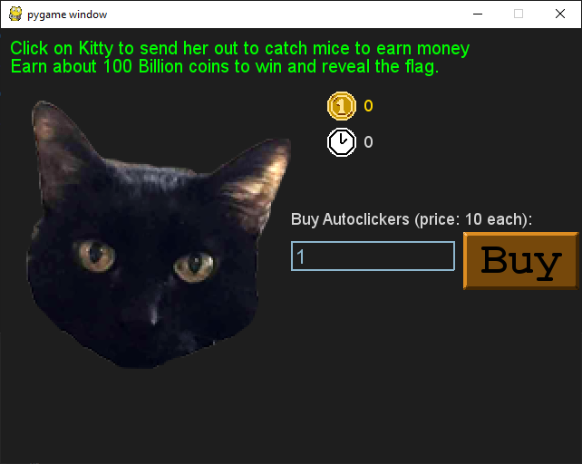

1 - Fidler
==========

**Time spent:** around 10 minutes

**Tools used:** Python

The first challenge of the anual flare-on CTF always starts relatively easy and this year is no exception. We are given a game written in Python, and a message that tells us to beat the game to reveal the flag.

The password screen
-------------------

Starting up the main python script `fidler.py` prompts us with the following password screen:


The first question that you should ask yourself here, is which parts of the code is responsible for prompting this dialog, and checking whether the input password is correct or not? Let's have a look at the python script. Below are the relevant parts:

```python
def password_check(input):
    altered_key = 'hiptu'
    key = ''.join([chr(ord(x) - 1) for x in altered_key])
    return input == key

def password_screen():
    # ...

    while not done:
        # ...

        if input_box.submitted:
            if password_check(input_box.text):
                return True
            else:
                return False

        # ...

# ...

def main():
    if password_screen():
        game_screen()
    else:
        password_fail_screen()
    pg.quit()

if __name__ == '__main__':
    main()
```

Immediately we can see that the script does very little to protect itself. We can see that `main` first shows the password screen, and if that succeeds, then the main game screen is opened. Looking into `password_screen`, we can see that the contents of the `input_box` is fed into `password_check`, which returns `true` if the input text is some calculated value. Although we cannot see the key directly, we can quickly find out what the contents should be, by simply copying the password check code to a new file, and changing the last `return`  with a `print`.

```python
altered_key = 'hiptu'
key = ''.join([chr(ord(x) - 1) for x in altered_key])
print(key)
```

This gives us:

```
ghost
```

Typing this into the real game results in unlocking the actual game.

Beating the game
----------------

The main game is a simple autoclicker game, and it tells use to get to 100 billion coins to win.



Obviously, we don't want to wait for 100 billion coins, so let's figure out how we can trick the game into thinking that we already have the required amount of coins. 

Looking into the games main screen code, we can see something interesting:

```python
ef game_screen():
    # ...

    while not done:
        target_amount = (2**36) + (2**35)
        if current_coins > (target_amount - 2**20):
            while current_coins >= (target_amount + 2**20):
                current_coins -= 2**20
            victory_screen(int(current_coins / 10**8))
            return
        # ...
```

In the above, we can see that `victory_screen` is called when `current_coins > (target_amount - 2**20)`. To trick the game into thinking we already won, we can insert the following line just before the if statement:

```python
current_coins = target_amount
```

Running the app one final time, automatically reveals the flag:

