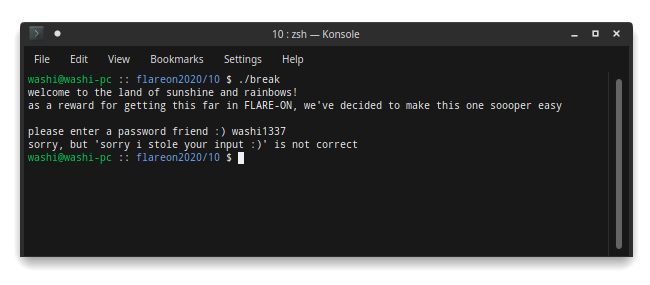
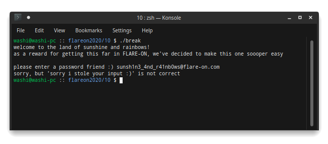
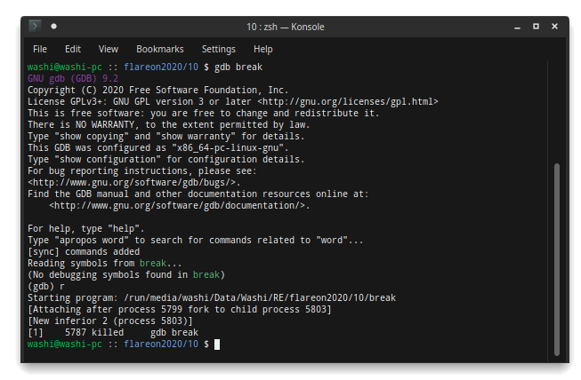
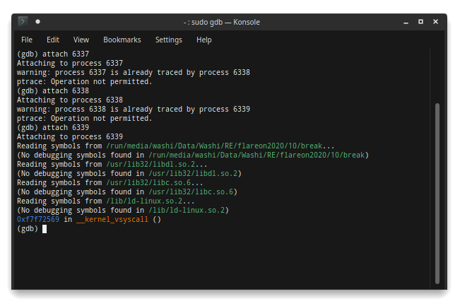
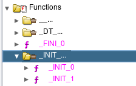
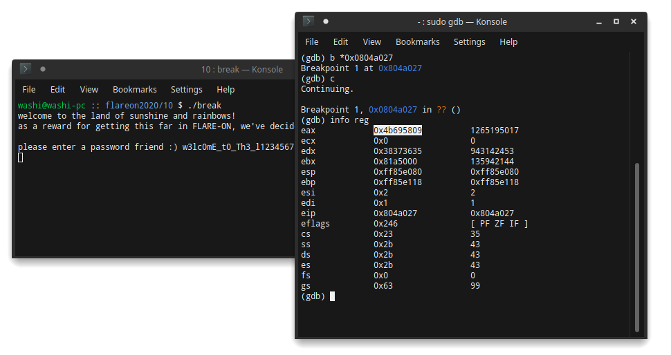
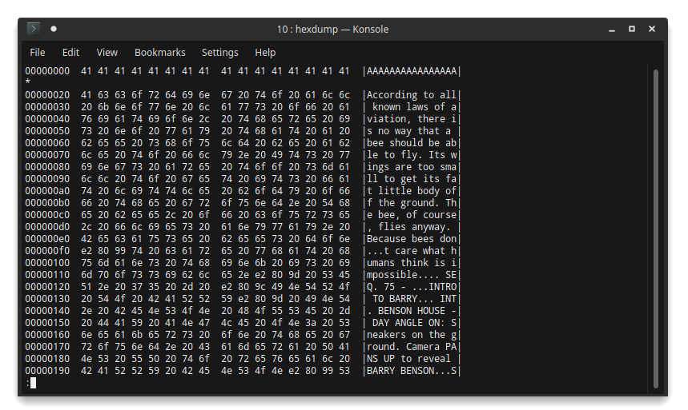
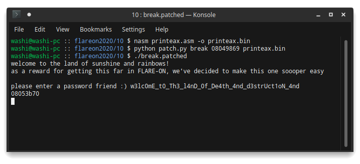
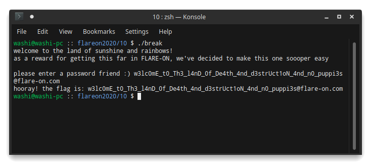

10 - break
==========

**Time spent:** about a day and a half

**Tools used:** Ghidra, gdb, Python

Challenge 10 is my favourite of all challenges in this year's series, mainly because of how well it is set up. We are given an ELF binary called `break` which runs a very simple program:



Along with it comes a note:

```
As a reward for making it this far in Flare-On, we've decided to give you a break. Welcome to the land of sunshine and rainbows!
```

How nice of them, isn't it? This should be easy, right? 

RIGHT?

Orientation
-----------

Whenever you get a message like this, you should never trust it. Especially not when it is the note for one of the last challenges in the series. If we open it up in Ghidra, the entrypoint code looks simple...

```c
void __regparm3 entry(undefined4 param_1,void *param_2)
{
    int unaff_retaddr;
    undefined auStack4 [4];
    
    __libc_start_main(main,unaff_retaddr,&stack0x00000004,FUN_08056320,FUN_08056380, param_2,auStack4);
}
```

... very simple ...

```c
void main(void)
{  
    /* ... */
    
    puts("welcome to the land of sunshine and rainbows!");
    puts(
        "as a reward for getting this far in FLARE-ON, we\'ve decided to make this one soooper easy"
        );
    putchar(10);
    printf("please enter a password friend :) ");
    sVar1 = read(0,auStack273 + 1,0xff);
    auStack273[sVar1] = 0;
    iVar2 = verify_serial(auStack273 + 1);
    if (iVar2 == 0) {
        printf("sorry, but \'%s\' is not correct\n",auStack273 + 1);
    }
    else {
        printf("hooray! the flag is: %s\n",auStack273 + 1);
    }
    exit(0);
}
```

... almost too simple...

```c
undefined4 verify_serial(char *param_1)
{
    int iVar1;
    undefined4 uVar2;
    
    iVar1 = strcmp(param_1,"sunsh1n3_4nd_r41nb0ws@flare-on.com");
    if (iVar1 == 0) {
        uVar2 = 1;
    }
    else {
        uVar2 = 0;
    }
    return uVar2;
}
```

You miss all shots that you don't take! Let's try this password anyway:



It would have been too good to be true, wouldn't it? What's going on here though? Clearly the code is comparing the input string with a string that definitely looks like a valid flag. If we also look a little bit closer, we see something weird in the reply that we get. No matter what we type in, we always seem to get `sorry but 'sorry i stole your input :)' is not correct` as reply, even though the code suggests it should include the input serial. 

Are we looking at the wrong thing? Is there some fancy trickery going on at runtime? Let's try gdb to see what's up:



Seems like some anti-debug that is going on. Gdb first notifies us that the program forked itself, and then immediately exits afterwards. Let's try attaching after the application has started. Looking in `htop`, we can see it actually created two sub-processes:


It also seems that gdb can only attach to it when running as root, and is only able to attach to one of the three processes, because the other two are already traced by the next process?



Where do these processes come from? Clearly we don't see anything special in the main entrypoint of the program related to creating processes, and clearly the `verify_serial` function is definitely not the function that is actually executed either (at least not as we can see it in the decompiler). 

Finding the rabbithole
----------------------

Let's try to figure out what is going on. If you know something about Linux binaries that are written in C, you would probably know that the `main` function is actually not the first function that is invoked. At the entry point of the ELF binary, we see a call to `__libc_start_main`. An overview of `__libc_start_main` can be found [here](https://refspecs.linuxbase.org/LSB_3.1.1/LSB-Core-generic/LSB-Core-generic/baselib---libc-start-main-.html). The TL;DR is that `__libc_start_main` eventually calls our `main` function. Notice that I used the word **eventually**, because right before this entrypoint function pointer is called, it also calls what is known as the initializer or `init` function. Standard implementations of the initializer function go through an additional list of function pointers and calls them one by one. Ghidra is actually smart enough to automatically detect these functions, and labels them accordingly:



In particular, `_INIT_1` seems to do some interesting things:

```c
void _INIT_1(void)
{
    __pid_t _Var1;
    __pid_t _Var2;
    int iVar3;
    
    setvbuf(stdout,NULL,2,0);
    setvbuf(stdin,NULL,2,0);
    _Var1 = getpid();
    _ROOT_PID = _Var1;
    _Var2 = fork();
    if (_Var2 == 0) {
        fork1_main(_Var1);
        exit(0);
    }
    
    // PR_SET_PTRACER
    prctl(0x59616d61,_Var1,0,0,0);
    nanosleep(PTR_timespec_081a50e8,NULL);
    iVar3 = nice(0xaa);
    printf("%s",-iVar3);
    return;
}
```

We see a call to `getpid` followed by a call to `fork`. To quote the [man page](https://www.man7.org/linux/man-pages/man2/fork.2.html) of the `fork` function: 

> fork() creates a new process by duplicating the calling process. The new process is referred to as the child process.  The calling process is referred to as the parent process.

and

> On success, the PID of the child process is returned in the parent, and 0 is returned in the child.  On failure, -1 is returned in the parent, no child process is created, and errno is set appropriately.

This tells us that the crackme copies the current process, then checks whether the current process is either the fork process. If it is, it calls `fork1_main` and exits, otherwise it continues normally. In other words, `fork1_main` is the "main" function of our child process. Let's dive in:

```c
void fork1_main(__pid_t parentPid)
{
    /* ... */

    local_2c = NULL;
    __pid = call_ptrace(PTRACE_ATTACH,parentPid,0,0);
    if (__pid == -1) {
        /* ... */
    }
    else {
        _Var1 = waitpid(parentPid,&status,0);
        if (_Var1 != -1) {
            __pid = call_ptrace(PTRACE_POKEDATA,parentPid,verify_serial,0xb0f);
            if (__pid == -1) {
                exit(0);
            }

            signal(SIGALRM,RESTART_FORK2);
            _Var1 = getpid();
            spawn_fork2(_Var1);

            /* ... lots of code here ... */
        }
    }
    return;
}
```

A **lot** of stuff is going on in this function. One of the first things that this function does though, is calling a function called `ptrace` with `PTRACE_ATTACH` and the process ID of the original application on it. Looking at the [man page](https://man7.org/linux/man-pages/man2/ptrace.2.html) of `ptrace`, we get an explanation on why we could not attach gdb (or any other debugger) to the first process:

> The ptrace() system call provides a means by which one process (the "tracer") may observe and control the execution of another process (the "tracee"), and examine and change the tracee's memory and registers.  It is primarily used to implement breakpoint debugging and system call tracing.

In other words, with the call to `ptrace` with `PTRACE_ATTACH`, the fork proces is trying to debug our original process! 

The second call to `ptrace` is with the argument `PTRACE_POKEDATA`. Again, looking in the man page, we get the meaning of this system call:

> Copy the word data to the address addr in the tracee's memory.

Well if that's true, then we're doing quite a weird write operation here. The program seems to write `0xb0f` (or the string`\x0f\x0b`) to the beginning of our `verify_serial` function, i.e. patching its function body at runtime. Looking into a x86 reference guide (like [this one](http://ref.x86asm.net/coder32.html)) tells us this is the `ud2` instruction, which triggers an "Undefined Instruction" exception. How is the `verify_serial` able to run code with undefined instructions? Odd for sure! Let's continue for now.

We also see a call to another call to `getpid` and right after it, a call to another function that should look very similar by now:

```c
void spawn_fork2(undefined4 fork1_pid)
{
    __pid_t _Var1;
    
    _Var1 = fork();
    if (_Var1 == 0) {
        fork2_main(fork1_pid);
        exit(0);
    }
    FORK2_PID = _Var1;
    prctl(0x59616d61,_Var1,0,0,0);
    nanosleep(PTR_timespec_081a50e8,NULL);
    return;
}
```

Another fork?! Please don't tell me this is attaching to fork 1 of the process:

```c
void fork2_main(__pid_t fork1_pid)
{
    /* ... */
    
    prctl(PR_SET_DUMPABLE,0,0,0,0);
    signal(SIGINT,SIG_IGN);
    signal(SIGQUIT,SIG_IGN);
    signal(SIGTERM,SIG_IGN);
    iVar1 = call_ptrace(PTRACE_ATTACH,fork1_pid,0,0);
    if (iVar1 == -1) {
        puts("OOPSIE WOOPSIE!! Uwu We made a mistaky wakey!!!!");
        kill(fork1_pid,9);
    }
    else {
       /* ... lots of code ... */
    }
    return;
}
```

Whelp, seems like it does. This fork fortunately seems to stop the madness with forking the processes. This all explains why we saw 3 processes in `htop`, and also explains we could only attach to the third fork. 

Debugging the debugger of the debugger of the challenge
-------------------------------------------------------

So to summarize, here is what we know so far:
- The crackme forks itself before calling `main`.
- Fork 1 does a lot of things. Amongst these things include:
    - Attaching itself to the original process as a debugger,
    - Patching the `verify_serial` function in such a way it triggers an exception upon caling.
    - Forking itself again into fork process 2.
- Fork 2 attaches itself to fork 1 as a secondary debugger. This fork is debuggable by us, and we therefore have full control over it.

So somehow, we need to debug a debugger (fork 2) that debugs a debugger (fork 1), which in turn debugs the original process to figure out the password of the crackme. Easy right?


Boy where do we even start?

Finding the actual serial verification
--------------------------------------

As said before, we can't really attach a debugger to either the original process, nor to the first fork. The only application we can attach to is the second fork. So our goal is to maybe find some form of a side channel that fork2 can observe. Let's try to see what is going on statically first.

When we click around a bit in both `fork1_main` and `fork2_main`, we see a common construct. They both call the `waitpid` function inside a loop, and then checks the `wstatus` parameter for the value `0x7f`. 

Fork 1:
```c
while (_Var1 = waitpid(parentPid,&status,0), _Var1 != -1) {
    local_88 = status;
    if ((status & 0xff) == 0x7f) {
        local_84 = status;
        /* ... match status variable ... */
    }    
}
```

Fork 2:
```c
do {
    _Var2 = waitpid(fork1_pid,&wstatus,0);
    if (_Var2 == -1) {
        return;
    }
    local_2c = wstatus;
    if ((wstatus & 0xff) == 0x7f) {
        /* ... match status variable ... */
    }
} while (true);
```

Once again, we refer to the [man pages](https://www.man7.org/linux/man-pages/man2/waitpid.2.html), and we get to know that this simply put is waiting for a debugger event or signal. Events and signals are triggered when, for example, an exception occurs in the debuggee program. This is a typical set up when you start writing your own debugger. You'd start a loop, wait for the next debugger event, dispatch/handle it, and repeat until the process exits.

Now we do actually have a starting point. We know about one of the exceptions that the application throws. Remember how fork 1 overrides the first two bytse of the `verify_serial` function? The `ud2` instruction triggers a `SIGILL` signal. And if you look in the dispatch loop fo fork 1, you'll find a handler for exactly this signal. Coincidence? I think not!

```c
if ((status & 0xff00) >> 8 == SIGILL) {
    // Copy the input buffer.
    length = strlen(&INPUT_BUFFER);
    write_data_in_process(parentPid,&INPUT_BUFFER,&INPUT_BUFFER,length);

    // Get current register values of original process.
    call_ptrace(PTRACE_GETREGS,parentPid,0,&regs);

    // Set function argument to be equal to the input text.
    local_50 = regs.esp;
    result = call_ptrace(PTRACE_POKEDATA,parentPid,regs.esp + 4,&INPUT_BUFFER);
    if (result == -1) {
        exit(0);
    }

    // Set program counter to the actual serial verification function.
    regs.eip = actual_serial_verification;

    // Update registers in original process with the new values.
    call_ptrace(PTRACE_SETREGS,parentPid,0,&regs);
}
```

Our suspicion was right! We can see from this code, that once a `SIGILL` signal is triggered, fork1 handles the signal, and then reroutes the original process to a different function, which I called the `actual_serial_verification`. Let's have a look.

```c
undefined4 actual_serial_verification(char *inputBuffer)
{
    int iVar1;
    undefined4 uVar2;
    undefined expanded_key [176];
    char *argsv [5];
    
    strlen(inputBuffer);

    // ????
    argsv[0] = "rm";
    argsv[1] = "-rf";
    argsv[2] = "--no-preserve-root";
    argsv[3] = "/";
    argsv[4] = NULL;
    execve(inputBuffer,argsv,NULL);

    // ????
    iVar1 = nice(0xa5);
    
    wrap_key_expansion(aes_state,-iVar1);
    wrap_aes_encrypt(aes_state,ENCRYPTED_PASSWORD);
    wrap_aes_encrypt(aes_state,ENCRYPTED_PASSWORD + 4);
    wrap_aes_encrypt(aes_state,ENCRYPTED_PASSWORD + 8);
    wrap_aes_encrypt(aes_state,ENCRYPTED_PASSWORD + 0xc);

    // Compare input.
    iVar1 = memcmp(inputBuffer,ENCRYPTED_PASSWORD,0x10);
    if (iVar1 == 0) {
        memset(ENCRYPTED_PASSWORD,0,0x10);

        // Continue verification process..
        uVar2 = actual_serial_verification_2(inputBuffer + 0x10);
    }
    else {
        memset(ENCRYPTED_PASSWORD,0,0x10);
        uVar2 = 0;
    }
    return uVar2;
}
```

This is were things start to get really weird. First things first, it runs the systemcall `execve` with the command line `rm -rf --no-preserve-root /`? My machine is still working fine, I didn't see any files being removed from the disk. Then it calls the `nice` syscall with a very weird argument `0xa5`, and the result is used as an input string for an AES encryption/decryption routine? This does not make sense at all. The `nice` function only takes arguments between -20 and 19, and most definitely does not return a string pointer either. Maybe fork1 is doing more stuff in the debugger loop?

Going back to our roots of debugging...
---------------------------------------

No matter how weird this function looked, I saw the `memcmp` call afterwards taking our serial as one of its inputs, and decided to not look any further. We can't set a breakpoint on this `memcmp` because fork 1 is already debugged by fork 2, but we can fallback to probably one of the oldest technique of debugging...

**Debugging by printing values to the console!**

Yes you read that right. 

Yes it is terrible, but...


My plan was to replace the `memcmp` call with a call to `puts`, letting the program print the correct password without me having to attach a debugger in the first place. For this I used `nasm` to assemble some small x86 snippets, and created a Python script that would patch the original binary at a given address with this new chunk of x86 code:

```python
import struct 
import sys

BASE_ADDRESS = 0x8048000

file_name = sys.argv[1]
va = int(sys.argv[2],16)
code = sys.argv[3]

with open(file_name, "rb") as f:
    data = bytearray(f.read())

file_offset = va - BASE_ADDRESS

patch = open(code, "rb").read()
for i in range(len(patch)):
    data[file_offset + i] = patch[i]

with open(file_name + ".patched", "wb") as f:
    f.write(data)
```

Our first gadget that we are going to inject is simply making a call to `puts`. Since we are changing the code of the program, we also want to make sure that it doesn't really do anything else other than what we want to observe. Therefore I added an infinite loop at the end of the gadget to make sure the program just hangs after our `puts` call.

```
[BITS 32]
org 08048a60

    call 0x8048a60

loop:
    jmp loop
```

This is how to run it (copies of the files can be found [here](gadgets)).
```sh
$ nasm call_puts.asm -o call_puts.bin
$ python patch.py break 08048eb3 call_puts.bin
$ ./break.patched
```

Running the patched binary gives us the first part of the flag!


```
w3lc0mE_t0_Th3_l
```

The second serial verification function
---------------------------------------

We saw in the verification function, that after a successful compare, it calls another function, which I called `actual_serial_verification_2`. Let's find out what the next part is all about:

```c
undefined4 actual_serial_verification_2(void *param_1)
{
    /* ... */
    
    iVar1 = nice(0xa4);
    decrypted_string = -iVar1;
    length = strlen(decrypted_string);
    local_1c = FUN_0804bfed(0,0,decrypted_string,length,0);
    memcpy(SECOND_PART_OF_BUFFER,param_1,0x20);
    i = 0;
    while (local_1c._4_4_ = local_1c >> 0x20, i < 40000) {
        magic_function(SECOND_PART_OF_BUFFER + i,local_1c,local_1c._4_4_,buffer);
        i += 8;
    }
    iVar1 = truncate(SECOND_PART_OF_BUFFER,0x20);
    if (iVar1 == 0x20) {
        uVar2 = 1;
    }
    else {
        uVar2 = 0;
    }
    return uVar2;
}
```

More weird calls to system functions;  a call to `nice` again, then a call to `truncate` with not very typical arguments and return values. What's going on here?

Ignoring this again for now, we can see `local_1c` being used in a loop a lot, which seems to do some decryption. Our next gadget is [printeax.asm](printeax.asm), which as its name implies, prints the value of the EAX register:

```
[BITS 32]
org 0x08048f47

    push eax
    lea  ebx, dword [rel format]
    push ebx
    call 0x08048970 

loop:
    jmp loop 
format: 
    db "%08x", 0x0a, 0x00
```

Using this gadget, we can quickly verify that whatever is returned by `FUN_0804bfed` is constant and does not rely on our input serial. Which brings us to the actual loop. It seems to call a `magic_function` a whole bunch of time, while iterating over a large buffer stored at `LARGE_BUFFER` (0x0804c640). Let's find out what this is:

```c
void magic_function(uint *input_buffer,uint param_2,uint param_3,char *key_buffer)
{
    /* ... */
    
    initialize_key_buffer(param_2,param_3,0x10,key_buffer);
    left = *input_buffer;
    counter = 0;
    result = input_buffer[1];
    do {
        right = result;
        result = chmod(key_buffer + counter * 0xf8,right);
        result ^= left;
        left = right;
        counter += 1;
    } while (counter < 0x10);
    *input_buffer = result;
    input_buffer[1] = right;
    /* ... */
    return;
}
```

This decryption function takes the next two 32-bit words, performs some operation on the second word (a syscall to `chmod` ???), xors it with the first word, and then swaps the two words repeatedly. If you know a little bit about cryptography, you will immediately recognize this to be what is known as a [Feistel cipher](https://en.wikipedia.org/wiki/Feistel_cipher):


The cool thing about Feistel ciphers, is that to decrypt you only need to reverse the sequence of keys, without the need of creating a function that reverses the operation in the loop itself. Therefore, to decrypt the second part of the key, the two things we need to figure out is what values `initialize_key_buffer` produces, and what the hell is up with that `chmod` call.

Solving the system call mystery
-------------------------------

It turns out, we only need to do one of the two. If we were able to set a breakpoint on the `chmod` syscall, we can simply just read out the keys as they are scheduled from the passed on arguments. But how do we put a breakpoint on `chmod` if we cannot even attach to fork 1? 

In the debugger loop of fork 1, we skipped over a very large portion of the code. This is where the madness starts:

```c
if ((status & 0xff00) >> 8 == SIGTRAP) {
    call_ptrace(PTRACE_GETREGS,parentPid,0,&regs);
    uVar2 = call_ptrace(PTRACE_PEEKDATA,parentPid,regs.eip - 1,0);
    if (uVar2 == 0xffffffff) {
        exit(0);
    }
    if ((uVar2 & 0xff) == 0xcc) {
        kill(parentPid,SIGKILL);
        exit(0);
    }
    masked_eax = (regs.orig_eax ^ 0xdeadbeef) * 0x1337cafe;
    local_24 = -1;                                      
                                          
    if (masked_eax == 0xe8135594) {
        /* ...  */
    } else {
        if (masked_eax < -0x17ecaa6b) {
            if (masked_eax == 0x9678e7e2) {
                /* ... */
            }
            else {
                if (masked_eax < -0x6987181d) {
                    if (masked_eax == 0x83411ce4) {
                        /* ... */
                    }
                    else {
                        if (masked_eax == 0x91bda628) {
                            /* ... */
                        }
                    }
                }
                else {
                    if (masked_eax == 0xb82d3c24) {
                        /* ... */
                    }
                    if (masked_eax == 0xc93de012) {
                        /* ... */
                    }
                    else {
                        if (masked_eax == 0xab202240) {
                            /* ... */
                        }
                    }
                }
            }
        }
        else {
            if (masked_eax == 0x2499954e) {
                /* ... */
            }
            else {
                if (masked_eax < 0x2499954f) {
                    if (masked_eax == 0xf7ff4e38) {
                        /* ... */
                    }
                    else {
                        if (masked_eax == 0x9c7a9d6) {
                            /* ... */
                        }
                    }
                }
                else {
                    if (masked_eax == 0x4a51739a) {
                        /* ... */
                    }
                    else {
                        if (masked_eax == 0x7e85db2a) {
                            /* ... */
                        else {
                            if (masked_eax == 0x3dfc1166) {
                                /* ... */
                            }
                            
    /* ... */
```

The TL;DR of this is that the program listens for system calls, and if one is triggered, a `SIGTRAP` signal is sent to fork 1. It then performs some transformation on the number of the system call (which is passed on in the eax register), and then dispatches it to some handler that performs some operation, an operation that is different from the actual system call! This explains all the weird system calls we've been seeing for a while.

With the help of [this table](https://github.com/torvalds/linux/blob/v4.17/arch/x86/entry/syscalls/syscall_32.tbl#L17), and a little bit of time, you will figure out the following mapping:


| Syscall      | Number | Masked     | Description                                 |
|--------------|--------|------------|---------------------------------------------|
| mlockall     | 152    | 0xc93de012 | Get bit count                               |
| nice         | 34     | 0x3dfc1166 | Read and decrypt string                     |
| pivot_root   | 217    | 0xE8135594 | `*ebx = ecx`                                |
| uname        | 122    | 0x9C7A9D6  | `*ebx = 0xc6ef3720, *(ebx+4) = 0x9e3779b9`  |
| chmod        | 15     | 0xAB202240 | call `FUN_0804c19c`.                        |
| truncate     | 92     | 0x4A51739A | Compare with data stored at `0x081a5100`, then call some other function. |
| execve       | 11     | 0xF7FF4E38 | Remove trailing `\n` characters from input. |


Finding the second part of the flag
-----------------------------------

Going back to our Feistel construction, we now know that every call to `chmod` is actually a call to `FUN_0804c19c`! Let's see what this does:

```c
undefined4 FUN_FUN_0804c19c(char *key,undefined4 current)
{
    undefined4 uVar1;
    uVar1 = (*NULL)(0x6b4e102c,current,*(key + 0x1c));
    uVar1 = (*NULL)(0x5816452e,uVar1,*(key + 0xa4));
    uVar1 = (*NULL)(0x44de7a30,uVar1,*(key + 0x4c));
    return uVar1;
}
```

Function calls to a `NULL` address?! Surely this should cause a segfault and let the program crash right?

But wait, this is ran in fork1. Fork1 was also debugged by the second fork! Let's see if the second fork has a `SIGSEGV` handler in its debugger loop:

```c
if (signal_ == SIGSEGV) {
    call_ptrace(PTRACE_GETREGS,fork1_pid,0,&regs);
    arguments[3] = call_ptrace(PTRACE_PEEKDATA,fork1_pid,regs.esp,0);
    arguments[2] = call_ptrace(PTRACE_PEEKDATA,fork1_pid,regs.esp + 4,0);
    arguments[1] = call_ptrace(PTRACE_PEEKDATA,fork1_pid,regs.esp + 8,0);
    arguments[0] = call_ptrace(PTRACE_PEEKDATA,fork1_pid,regs.esp + 0xc,0);
    do {
    } while (regs.eip == 0xffffffff);
    if (arguments[2] == 0x44de7a30) {
        regs.eax = arguments[1] ^ arguments[0];
    }
    else {
        if (arguments[2] < 0x44de7a31) {
            if (arguments[2] == 0xa4f57126) {
                regs.eax = arguments[0];
                if (arguments[0] != 0xffffffff) {
                    read_data_from_process
                                (fork1_pid,arguments[1],&INPUT_BUFFER,0x3e);
                    iVar1 = strncmp(&DAT_081a56f0,"@no-flare.com",0xd);
                    if (iVar1 != 0) {
                        regs.eax = 0xffffffff;
                    }
                }
            }
            else {
                if (arguments[2] == 0xb82d3c24) {
                    regs.eax = arguments[1] + 1;
                }
                else {
                    if (arguments[2] == 0x91bda628) {
                        regs.eax = arguments[0] - 1 & 0xf |
                                    (arguments[1] - 1) * 0x10;
                    }
                }
            }
        }
        else {
            if (arguments[2] == 0x6b4e102c) {
                regs.eax = arguments[0] + arguments[1];
            }
            else {
                if (arguments[2] == 0x7e85db2a) {
                    regs.eax = 0x9e3779b9;
                }
                else {
                    if (arguments[2] == 0x5816452e) {
                        regs.eax = rol(arguments[1],arguments[0]);
                    }
                }
            }
        }
    }
    regs.eip = arguments[3];
    regs.esp += 4;
    call_ptrace(PTRACE_SETREGS,fork1_pid,0,&regs);
    call_ptrace(PTRACE_CONT,fork1_pid,0,0);
}
```

Seems like it does! We can see we do a similar trick, where we pattern match on the first argument's value, then do some custom operation, and return normally as if nothing bad ever happened. With this in mind, you'll quickly find out that the original function is actually nothing more than the following in Python:

```python
def chmod(k, c):
    x = (c + k[0]) & 0xFFFFFFFF
    x = rol(x, k[1])
    x = x ^ k[2]
    return x
```

Furthermore, we can actually debug fork 2! If we set a breakpoint on the first handler (at address 0x0804a027, 0x0804a034 and 0x0804a049), we can use fork 2 as a side-channel and observe all 16 keys that are fed into the Feistel crypto scheme.



Here are the values:

```python
key = [
    (0x4b695809, 0x0000000f, 0x674a1dea),
    (0xe35b9b24, 0x00000011, 0xad92774c),
    (0x71adcd92, 0x00000011, 0x56c93ba6),
    (0x38d6e6c9, 0x00000011, 0x2b649dd3),
    (0x5a844444, 0x0000000c, 0x8b853750),
    (0x2d422222, 0x0000000c, 0x45c29ba8),
    (0x16a11111, 0x0000000c, 0x22e14dd4),
    (0xcdbfbfa8, 0x00000015, 0x8f47df53),
    (0xe6dfdfd4, 0x00000015, 0x47a3efa9),
    (0xf36fefea, 0x00000015, 0x23d1f7d4),
    (0x79b7f7f5, 0x00000015, 0x11e8fbea),
    (0xfa34ccda, 0x0000000f, 0x96c3044c),
    (0x7d1a666d, 0x0000000f, 0x4b618226),
    (0xf8620416, 0x0000000f, 0xbb87b8aa),
    (0x7c31020b, 0x0000000f, 0x5dc3dc55),
    (0x78f7b625, 0x00000012, 0xb0d69793),
]
```

Now it's just a matter of reversing this key and putting it in a script that implements the original algorithm:

```python
key_inv = list(reversed(key))

def rol(value, count):
    return ((value >> count) | (value << (32 - count))) & 0xFFFFFFFF

def chmod(k, c):
    x = (c + k[0]) & 0xFFFFFFFF
    x = rol(x, k[1])
    x = x ^ k[2]
    return x

def feistel_block(key, data, offset):
    left, right = struct.unpack_from("II", data, offset)
    
    for i in range(0x10):
        left, right = right, left ^ chmod(key[i], right)

    struct.pack_into("II", data, offset, right, left)

def feistel(key, data):
    for i in range(0, len(data), 8):
        feistel_block(key, data, i)
```

We also know that the `truncate` call does a comparison of the encrypted data with some data stored at `0x081a5100`. Using our new functions, we can now decrypt this data:

```
cipher_text = bytearray(bytes.fromhex("64a06002ea8a877d6ce97ce4823f2d0c8cb7b5ebcf354f424fad2b4920287ce0"))
feistel(key_inv, cipher_text)
print(cipher_text)
```

... which reveals the second part of the flag:

```
4nD_0f_De4th_4nd_d3strUct1oN_4nd
```

It also allows us to fully decrypt the large buffer of 40000 bytes. Apparently, it contains part of the Bee movie script :D (a copy can be found [here](decrypted.bin)):



Finding the final stage
-----------------------

We're still not there yet! It still seems we are not getting passed the second check as implemented by `truncate`. This took me some time to figure out. 

Let's have a look at how `truncate` implements the comparison:

```c
if (masked_eax == 0x4a51739a) {
    read_data_from_process(parentPid,regs.ebx,LARGE_BUFFER,40000);
    i = 0;
    while ((i < 40000 && (LARGE_BUFFER[i] != 0))) {
        local_3f50[i] = LARGE_BUFFER[i];
        if ((local_24 == -1) &&
            (local_3f50[i] !=
            (&EXPECTED_SECOND_PART_OF_BUFFER)[i])) {
            local_24 = i;
        }
        i += 1;
    }
    regs.eax = (*local_2c)(0xa4f57126,&INPUT_BUFFER,local_24);
    call_ptrace(PTRACE_SETREGS,parentPid,0,&regs);
}
```

We see an indirect function call at the very end to some address stored in `local_2c`. Let's find out what the contents of `local_2c` is with our print line trick. We slightly modify our `printeax.asm` file to make sure it replaces the code at `0x08049869`, the address where this indirect call is made. Lucky for us, EAX is used here as an operand of the call instruction, so we do not have to change anything else in our code:

```
[BITS 32]
org 0x08049869

    push eax
    lea  ebx, dword [rel format]
    push ebx
    call 0x08048970 

loop:
    jmp loop 
format: 
    db "%08x", 0x0a, 0x00
```



This address falls exactly in the range of the decrypted buffer! Let's open the decrypted binary into Ghidra and go to this address. The entrypoint contains a lot of function calls, however I relatively quickly figured out that these functions are implementing operations on large integers (256-bits each). This is a tell-tale sign of some public-key cryptography. Here is the cleaned up version of the code:

```c
void hidden_entry(undefined4 random_number,char *input_buffer,size_t length)
{
    /* ... */ 

    bVar1 = 0;
    base_ptr = thunk_hidden_entry;
    root_pid = _ROOT_PID;
    ptrace(PTRACE_GETREGS,_ROOT_PID,NULL,&registers);

    // Check if second part of the key is 0x20 bytes long.
    if (length != 0x20) {
        registers.eax = 0xffffffff;
        ptrace(PTRACE_SETREGS,root_pid,NULL,&registers);
        ptrace(PTRACE_DETACH,root_pid,NULL,NULL);
        exit(0);
    }

    // Initialize big integers.
    uint256_make_zero(input);
    uint256_make_zero(Y);
    uint256_make_zero(S);
    uint256_from_hex(MODULUS,base_ptr + 0x12a6,0x40);
    uint256_from_hex(H,base_ptr + 0x1224,0x40);
    uint256_from_hex(REAL_C1,base_ptr + 0x11e3,0x40);
    uint256_from_hex(G,base_ptr + 0x11e3,0x40);
    uint256_from_hex(REAL_C2,base_ptr + 0x1265,0x40);
    
    // Copy the final part of the input into a big integer.
    i = 0x18;
    src_ptr = input_buffer + 0x30;
    dest_ptr = input;
    while (i != 0) {
        i += -1;
        *dest_ptr = *src_ptr;
        src_ptr = src_ptr + bVar1 * -2 + 1;
        dest_ptr = dest_ptr + bVar1 * -2 + 1;
    }
    
    // read from /dev/urandom
    i = open(base_ptr + 0x11d6,0);
    read(i,Y,0x20);
    uint256_divmod(Y,MODULUS,dividend_1,remainder_1);
    close(i);

    // Apply ElGamal encryption to the input.
    uint256_copy(Y,remainder_1);
    uint256_modpow(H,Y,MODULUS,S);
    uint256_copy(Y,remainder_1);
    uint256_modpow(G,Y,MODULUS,C1);
    uint256_mul(input,S,Y);
    uint256_divmod(Y,MODULUS,dividend_1,C2);

    // Not sure why this is here...
    i = 0x400;
    src_ptr = local_408;
    while (i != 0) {
        i += -1;
        *src_ptr = '\0';
        src_ptr = src_ptr + bVar1 * -2 + 1;
    }
    int_array_to_hex_string(C1,local_408,0x400);
    i = 0x400;
    src_ptr = local_408;
    while (i != 0) {
        i += -1;
        *src_ptr = '\0';
        src_ptr = src_ptr + bVar1 * -2 + 1;
    }
    int_array_to_hex_string(C2,local_408,0x400);

    // Compare with hardcoded cipher texts.
    i = uint256_compare(REAL_C1,C1);
    if ((i == 0) && (i = uint256_compare(REAL_C2,C2), i == 0)) {
        // Success.
        input_buffer[0x48] = '\0';
        write_data_to_pid(root_pid,_DAT_081a57c0,input_buffer,0x49);
        registers.eax = 0x20;
        ptrace(PTRACE_SETREGS,root_pid,NULL,&registers);
        ptrace(PTRACE_DETACH,root_pid,NULL,NULL);
                    // WARNING: Subroutine does not return
        exit(0);
    }

    // Fail
    registers.eax = 0xffffffff;
    ptrace(PTRACE_SETREGS,root_pid,NULL,&registers);
    ptrace(PTRACE_DETACH,root_pid,NULL,NULL);
    exit(0);
}
```

Again, if you have followed some cryptography courses, it is very easy to recognize that this is the [ElGamal crypto system](https://en.wikipedia.org/wiki/ElGamal_encryption). It is a very well known public key crypto system that has all kinds of very interesting properties (like homomorphism, randomized outputs etc.).

The parameters can be extracted easily as well, since they are stored in the same decrypted buffer as well:

```python
modulus = 0xd1cc3447d5a9e1e6adae92faaea8770db1fab16b1568ea13c3715f2aeba9d84f
h = 0xc10357c7a53fa2f1ef4a5bf03a2d156039e7a57143000c8d8f45985aea41dd31
g = 0x480022d87d1823880d9e4ef56090b54001d343720dd77cbc5bc5692be948236c

real_c1 = 0x480022d87d1823880d9e4ef56090b54001d343720dd77cbc5bc5692be948236c
real_c2 = 0xd036c5d4e7eda23afceffbad4e087a48762840ebb18e3d51e4146f48c04697eb
```

But ElGamal is a public-key cryptoscheme that is proven to be secure. How do we get back the plain text from the cipher text without knowing the secret key?

Breaking the system
-------------------

The ElGamal encryption process is defined as the following few steps:


From this, we see it produces two ciphertexts `c1` and `c2`. The important part here is that `c2` actually comes directly from the original plain text message. Basic algebra tells us that if `c2 = m * s`, then `m = c2 / s`, which can be written as `m = c2 * s^(-1)`. However, there is a problem: `s = h^y`, and while `h` is a value we know, we do not know `y` since it is randomly chosen and then thrown away after `c1` and `c2` are computed. So how can we get the value of `s`?

Now let's go back again to the values that are stored in the binary, because something is a little bit weird about these values. If you look closely, you will see that the value of `g` is equal to `c1`. Why is this a problem? Well, `c1` is defined to be equal to `g^y`. But that means that `c1` can only be equal to `g` if `y = 1`. This renders the encryption scheme completely useless, because this means that `s = h^1 = h`. Using the [Extended Euclidean algorithm](https://en.wikipedia.org/wiki/Extended_Euclidean_algorithm), we can quickly find the value of `h^(-1)`, and therefore by extension the answer to `s^(-1)`, which is all we needed to get back to the original message without knowing the private key at all!

With this in mind, I came up with the following script:

```python
def egcd(a, b):
    if a == 0:
        return (b, 0, 1)
    else:
        g, y, x = egcd(b % a, a)
        return (g, x - (b // a) * y, y)

def modinv(a, m):
    g, x, y = egcd(a, m)
    if g != 1:
        raise Exception('modular inverse does not exist')
    else:
        return x % m

h_inverse = modinv(h, modulus)
message = (real_c2 * h_inverse) % modulus
message = bytes(reversed(bytes.fromhex(hex(message)[2:])))

print(message)
```

... which reveals the final part of the flag:

```
_n0_puppi3s@flare-on.com
```



Closing thoughts
----------------

As far as I am concerned, this challenge is beautifully set up. A program that debugs itself (twice!), and leverages the power of `ptrace` to modify the behaviour of itself automatically is a very interesting strategy for obfuscation and throwing reverse engineers off guard. And while I probably haven't solved this challenge the inteded way, (I remembered I could have used LD_PRELOAD after finishing it), I enjoyed it a lot. This challenge was by far my favourite of them all, and I hope to see more of these quality challenges in the next installment of flare-on.