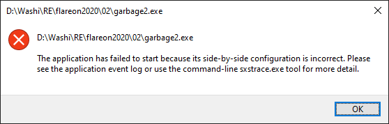
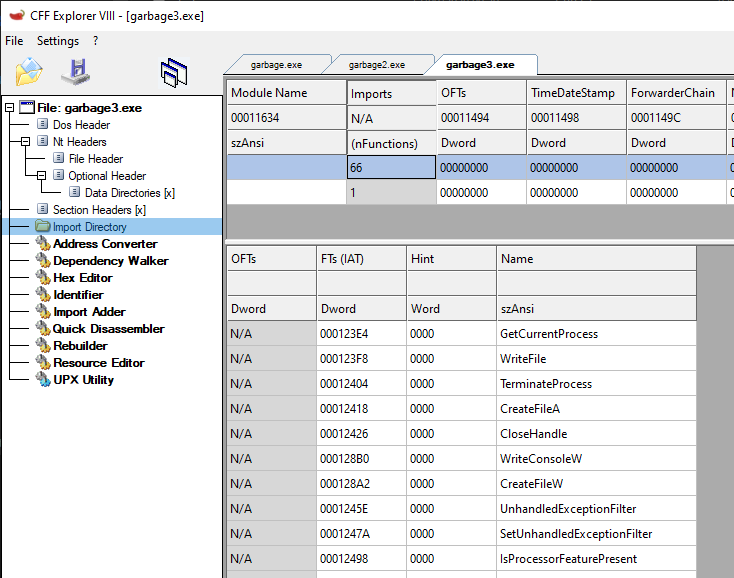
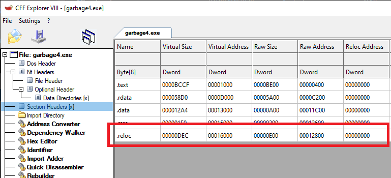
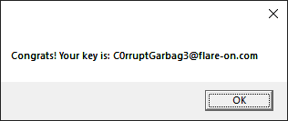

2 - garbage
===========

**Time spent:** 20 minutes

**Tools used:** CFF Explorer, HxD, UPX

The second challenge of flare-on 2020 can either be very easy, or very difficult if you don't know what you should be looking for. You are given a file called `garbage.exe`, along with a message that tells you the executable was recovered using digital forensics, but is incomplete. The task is to repair it and acquire the flag. 

I heard a lot of people got stuck on this one, which is very understandable if you are not very familiar with the PE file format. Let's go through it step-by-step.

Orientation 
-----------

The first thing to try, is to just run it. As you might have guessed, this does not work. 

Opening it up in a tool such as CFF explorer, however, gives us some clues. Looking at the sections of the executable, we can see the names `UPX0` and `UPX1`:


UPX stands for the **U**ltimate **P**acker for e**X**ecutables, and is a well-known packer that attempts to compress an executable file to a smaller size. It can be downloaded at https://upx.github.io/.

The cool thing about the UPX project is that it not only comes with a compressor, but also a built-in decompressor, by specifying the `-d` commandline flag. Unfortunately for us, this does not seem to work that well:

```sh
D:\Washi\RE\flareon2020\02>upx.exe -d garbage.exe
                       Ultimate Packer for eXecutables
                          Copyright (C) 1996 - 2020
UPX 3.96w       Markus Oberhumer, Laszlo Molnar & John Reiser   Jan 23rd 2020

        File size         Ratio      Format      Name
   --------------------   ------   -----------   -----------
upx: garbage.exe: OverlayException: invalid overlay size; file is possibly corrupt
```

It seems some of the PE headers are corrupt. It complains about some size being incorrect. 

"Fixing" the sections
---------------------

When a file is incomplete, it usually means it is too short. Looking again at the sections, we can see that the last section `.rsrc` starts at file offset 0x9E00, and has a size of 0x400. However, if we look in a hex editor, such as HxD, we can quickly see that some of the section's data got cut off:


We are missing a total of 0x400 - 0x124 = 0x2DC bytes. Let's append 0x2DC 00 bytes to the end of the file. Let's run UPX again.

```
D:\Washi\RE\flareon2020\02>upx.exe -d garbage2.exe
                       Ultimate Packer for eXecutables
                          Copyright (C) 1996 - 2020
UPX 3.96w       Markus Oberhumer, Laszlo Molnar & John Reiser   Jan 23rd 2020

        File size         Ratio      Format      Name
   --------------------   ------   -----------   -----------
     79360 <-     41472   52.26%    win32/pe     garbage2.exe

Unpacked 1 file.
```

This time around, it does not complain. Success!

"Fixing" resources
------------------

Except there is a problem. Running the application results in the following error:



It complains about "side-by-side configuration". This is probably because while we did fill up the resources section up to the right size, we didn't really fill it up with the right data. There's two ways of going about this: Either we can fix the resources directory by coming up with the right contents, or just remove it entirely and guess that the program doesn't really need the resources at all. 

I chose the latter one :). This can be done by simply clearing out the directory entry in the optional header of the PE:


Save it, and run it. Should be fine now right?

Fixing imports
--------------

Nope, we are still greeted with a message that `.DLL` could not be found. That's a weird file name! 


Let's have a look at the libraries that this PE file imports.



No wonder it could not find the imported DLLs. The module names are cleared out! We can easily figure out the original names of these modules by simply doing a quick Google search for one of the imported functions for each and every import. The module names are "kernel32.dll" and "shell32.dll".

Fixing relocations
------------------

The application still does not run as expected, but it does not give an error anymore. Looking again at the sections and the data directories, we can observe one final issue. 



The binary contains a section called `.reloc`, which is used for storing base relocations. However, if a binary contains relocations, it must contain a data directory entry in the optional header for it. But if we look into the optional header, we see it is cleared out:


Copying over the virtual address and the size from the `.reloc` section to the appropriate data directory fixes the binary, and the app is runnable.

Getting the flag
-----------------

Turns out, this is all we need to do. The final application drops a vbs script and executes it. This script prompts the flag:



