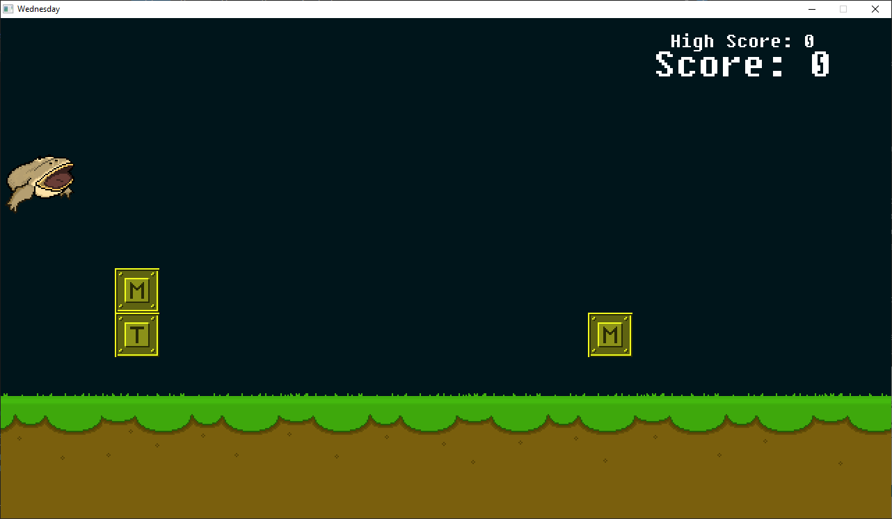
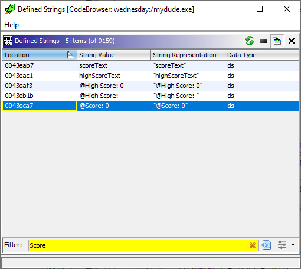
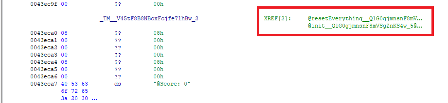
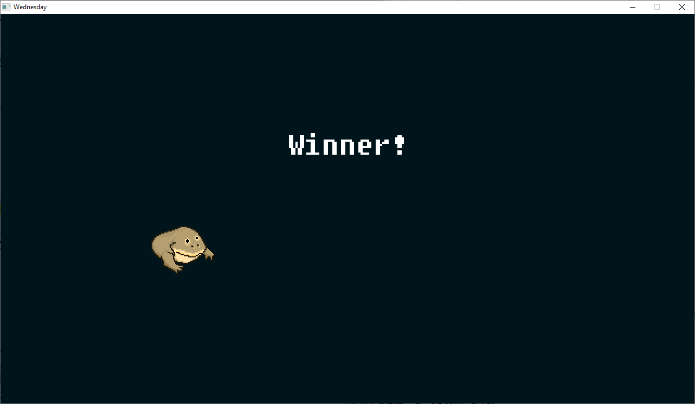
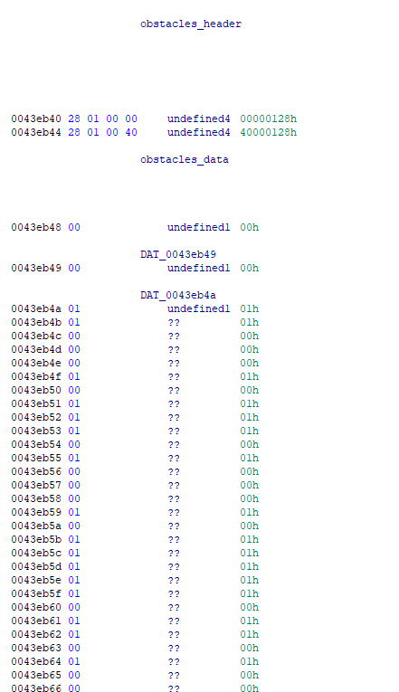
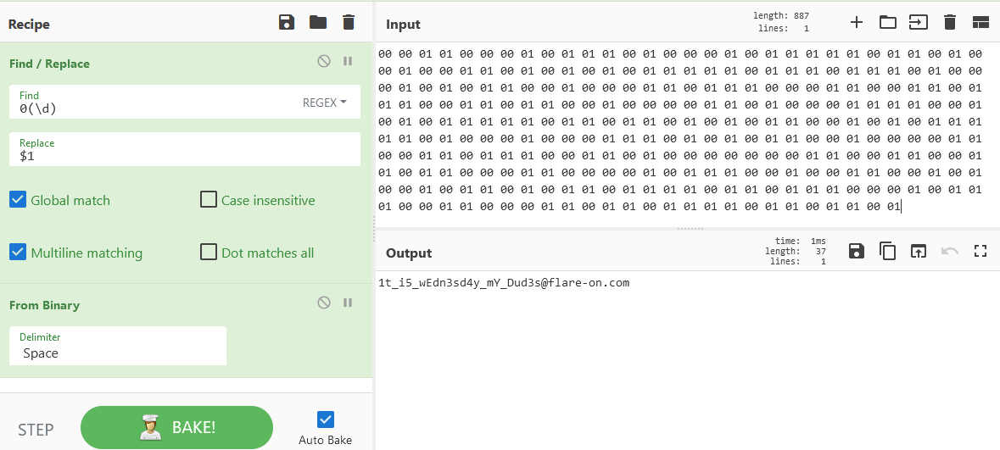

3 - wednesday
=============

**Time spent:** 2 hours (1 hour probably wasted)

**Tools used:** Ghidra, x64dbg, Cyberchef

The third challenge is another game. In the game, you play as a frog on an obstacle course, where you can either duck under or jump over each obstacle on the track. 



Orientation
-----------

If you play the game a few times, you will quickly notice you'll die quite often randomly, even if it looks like you ducked in time or jumped over the obstacle correctly. It seems the game lacks some visual cues on whether to duck or jump for every obstacle.

If we open the binary in Ghidra, we also notice that our binary is most likely not obfuscated. It has a lot of symbols present, and a huge list of strings that are used throughout the game. The problem however is that it is a game, and the source code of a game is substantially larger than a typical crackme / keygenme. Most of the code is probably relevant to drawing and updating the game, and therefore not really relevant to us at all. The challenge of this task is to figure out what is important to us, and what is not.

Naturally, we want to try to beat the game and hope that there is a flag at the end of it all. I started out by looking for code that updates the score. In particular, when it resets the score after colliding with one of the obstacles (visible or invisible). 

We know that the game draws the text "Score: #" on our screen. Let's see if we can find some references to it. If we have a look at the strings that are present, we can see some interesting things:



The last one seems to not only just print "Score:" but also a hardcoded 0. Let's have a look at references to this string:



This is convenient. Since symbols are not stripped from this executable, we can quickly see that this string is used upon initialization of the game, as well as another function which resets everything. A good guess would be that the latter one is called when the game has decided you lost. Let's have a look:

```c
void __fastcall @resetEverything__Q1G0gjmnsnF8mVSgZnKS4w_3@4(int param_1)
{
    /* ... */

    // Reset score.
    _score__h34o6jaI3AO6iOQqLKaqhw = 0;
    __prev_score__55xT1lC51wWU8x2SoheEqg = 0;
    @setText__8eh9cPEhHFuwDBVIJ9bHNz9cA@16(*(param_1 + 0x34),&_TM__V45tF8B8NBcxFcjfe7lhBw_2,0);
    
    // Reset day_index.
    _day_index__HImZp3MMPNE3pGzeJ4pUlA = 0;
    
    /* ... */
    
    // Reset obstacle 1.
    @reset__SAtOZDlchGyR6ynmbkI6aw@24
              (*(param_1 + 0x3c),0,0x40845000,0,0x40668000,
               _obstacles__Xqz7GG9aS72pTPD9ceUjZPNg[_day_index__HImZp3MMPNE3pGzeJ4pUlA + 8]);

    /* ... */

    _day_index__HImZp3MMPNE3pGzeJ4pUlA = _day_index__HImZp3MMPNE3pGzeJ4pUlA + 1;
    
    /* ... */
    
    // Reset obstacle 2.
    @reset__SAtOZDlchGyR6ynmbkI6aw@24
              (*(param_1 + 0x40),0,0x408ef000,0,0x40668000,
               _obstacles__Xqz7GG9aS72pTPD9ceUjZPNg[_day_index__HImZp3MMPNE3pGzeJ4pUlA + 8]);

    /* ... */
}
```

In this function, a lot of things happen, most of which is not really important to us. The key take away from this function however, is that it tells us something about a lot of important variables that we can start cross-referencing on:
- **_score__h34o6jaI3AO6iOQqLKaqhw:** The current score.
- **__prev_score__55xT1lC51wWU8x2SoheEqg:** The previous score.
- **_obstacles__Xqz7GG9aS72pTPD9ceUjZPNg:** Some data related to obstacles.
- **_day_index__HImZp3MMPNE3pGzeJ4pUlA:** An index that is used to access elements inside the obstacles array. 

We can also see in the cross references of this `resetEverything` function, that this function is called in one of the `update` functions of the game. Let's have a look at this function:

```c
void __thiscall @update__giAKdkRYJ1A0Qn9asB8s9ajA@12(void *this,double param_1)
{
    /* ... */

    if (*(*(this + 0x28) + 0xf9) == '\x01') {
        @resetEverything__Q1G0gjmnsnF8mVSgZnKS4w_3@4(this);
    }

    /* ... */
 
    if (-(uVar9 * 0.50000000) < *(*(this + 0x40) + 0x48)) goto LAB_00433e79;

    // Update day index.
    uVar8 = _day_index__HImZp3MMPNE3pGzeJ4pUlA + 1;
    /* ... */
    _day_index__HImZp3MMPNE3pGzeJ4pUlA = uVar8;

    /* ... */

    // Load next obstacle.
    @reset__SAtOZDlchGyR6ynmbkI6aw@24
              (*(this + 0x3c),0,0x40845000,0,0x40668000,
               _obstacles__Xqz7GG9aS72pTPD9ceUjZPNg[_day_index__HImZp3MMPNE3pGzeJ4pUlA + 8]);

    /* ... */

    uVar8 = _day_index__HImZp3MMPNE3pGzeJ4pUlA + 1;
    /* ... */
    _day_index__HImZp3MMPNE3pGzeJ4pUlA = uVar8;
    
    /* ... */

    // Load second next obstacle.
    @reset__SAtOZDlchGyR6ynmbkI6aw@24
              (*(this + 0x40),0,0x408ef000,0,0x40668000,
               _obstacles__Xqz7GG9aS72pTPD9ceUjZPNg[_day_index__HImZp3MMPNE3pGzeJ4pUlA + 8]);
    
    /* ... */

    // Check if score needs to be updated.
LAB_00433e79:
    if (__prev_score__55xT1lC51wWU8x2SoheEqg != _score__h34o6jaI3AO6iOQqLKaqhw) {
        __prev_score__55xT1lC51wWU8x2SoheEqg = _score__h34o6jaI3AO6iOQqLKaqhw;

        // Update score label.
        puVar4 = @nimIntToStr@4(_score__h34o6jaI3AO6iOQqLKaqhw);
        if (puVar4 == 0x0) {
            /* ... */
        }
        else {
            puVar5 = @rawNewString@4(*puVar4 + 7);
            uVar8 = *puVar5;
            *(puVar5 + uVar8 + 8) = 0x726f6353; // "Scor"
            *(puVar5 + uVar8 + 0xc) = 0x203a65; // "e: "
            *puVar5 = uVar8 + 7;
            _memcpy(puVar5 + uVar8 + 0xf,puVar4 + 2,*puVar4 + 1);
            *puVar5 = *puVar5 + *puVar4;
        }
        @setText__8eh9cPEhHFuwDBVIJ9bHNz9cA@16(*(this + 0x34),puVar5,0);

        // Update high score and high score label if necessary:
        if (__high_score__zZRxWe9cBeocEphfWmZaLtA < _score__h34o6jaI3AO6iOQqLKaqhw) {
            __high_score__zZRxWe9cBeocEphfWmZaLtA = _score__h34o6jaI3AO6iOQqLKaqhw;
            puVar4 = @nimIntToStr@4(_score__h34o6jaI3AO6iOQqLKaqhw);
            if (puVar4 == 0x0) {
                /* ... */
            }
            else {
                puVar5 = @rawNewString@4(*puVar4 + 0xc);
                puVar1 = puVar5 + *puVar5 + 8;
                *puVar1 = 0x68676948;   // "High"
                puVar1[1] = 0x6f635320; // " Sco"
                puVar1[2] = 0x203a6572; // "re: "
                *(puVar1 + 3) = 0;
                uVar8 = *puVar5;
                *puVar5 = uVar8 + 0xc;
                _memcpy(puVar5 + uVar8 + 0x14,puVar4 + 2,*puVar4 + 1);
                *puVar5 = *puVar5 + *puVar4;
            }
            @setText__8eh9cPEhHFuwDBVIJ9bHNz9cA@16(*(this + 0x38),puVar5,0);
        }
    }

    // Win condition:
    piVar2 = *(*(this + 0x28) + 0xfc);
    if ((piVar2 != 0x0) && (*piVar2 == 0x128)) {
        // Switch to win scene.
        @sceneeq___HC7o4hYar8OQigU09cNyehg@8(_game__7aozTrKmb7lwLeRmW9a9cs9cQ,_winScene__eVaCVkG1QBiYVChMxpMGBQ);
    }
    return;
}
```

Again, a very large function for which most of the code is not really relevant to us. The key take away again is how the previously mentioned variables are used and updated. Similar to the `resetEverything` function, we can see that `_day_index` is increased twice. We can also see that a `reset` function is called twice. Towards the end, we see a big if statement that handles updating the score labels, and finally we see a very interesting if statement, which is the deciding factor on whether the game should switch to the win scene or not.

Letting the game think we have won
----------------------------------

My first attempt to win the game was making two small changes in the program. The first change is to patch out the if statement that decides on whether to reset the game (`0x00433d5c`), and patching out the condition where we check whether we won the game or not (`0x00433fa7-0x00433fb3`).

This did let me "win" the game immediately, but unfortunately this didn't seem to be enough. We are greeted with the following screen:



Let's be a bit more smart about this
------------------------------------

Maybe the program requires you to actually win the game by successfully avoiding all obstacles (who would have thought?!). I decided to look at how obstacles are actually generated. For this, this `reset` function that we have seen a few times already seemed interesting. Let's have a look:

```c
void __thiscall
@reset__SAtOZDlchGyR6ynmbkI6aw@24
          (void *this,undefined4 param_1,undefined4 param_2,undefined4 param_3,undefined4 param_4,char obstacleData)

{
    undefined8 uVar1;
    
    *(this + 0x18) = 0;
    *(*(this + 0xf8) + 0x18) = 0;
    @assignDay__cz9bfHkuka9cVFg87ZfWKc8g@8(this, obstacleData);
    *(this + 0x48) = param_1;
    *(this + 0x4c) = param_2;
    *(this + 0x50) = param_3;
    *(this + 0x54) = param_4;
    *(*(this + 0xf8) + 0xf8) = obstacleData;
    uVar1 = @dim__bpDLBzGNY4prT1xkxCzkTQ@4(*(this + 0x1c));
    *(*(this + 0xf8) + 0x48) = uVar1 * 0.50000000 + CONCAT44(param_2,param_1);
    *(*(this + 0xf8) + 0x50) = 0;
    return;
}
```

A lot of noise in this function that is related to objects. What we can see though, is that the obstacle data is passed onto a call to `assignDay`. Let's follow the trail:

```c
void __fastcall @assignDay__cz9bfHkuka9cVFg87ZfWKc8g@8(void *param_1,char obstacleData)
{
    /* ... */
    
    if (obstacleData == '\x01') {
        ppiVar5 = @sample__3xfZAw0SQXCnAoXzmGGnMA@8(&TABLE_1,3);
    }
    else {
        ppiVar5 = @sample__3xfZAw0SQXCnAoXzmGGnMA@8(&TABLE_2,3);
    }
    puVar3 = @X5BX5D___oZtnouS45hQGXVXpvrCNuA@8(_gfxData__TftuyNzrt9cB3jrOs59bhBFw,ppiVar5);
  
    /* ... */

    *(param_1 + 0x1c) = puVar1;
    uVar6 = @dim__bpDLBzGNY4prT1xkxCzkTQ@4(puVar1);
    @initSprite__a7AIRKo9cwk8OAhU21EI0ew@28(param_1,uVar6,uVar6 >> 0x20,0,0,0,0);
    
    /* ... */
}
```

From this function, we can finally see how the obstacle data is used. We see that the obstacle data is nothing more than a single char, and depending on the contents of this char, it calls the `sample` function on either `TABLE_1` or `TABLE_2`. In particular, it looks like the obstacle data is either 1 or not 1 (0? is this binary?). After that, it ends up in a call to `initSprite`. Looking at these two tables in Ghidra, we see it is a table of strings...


... which match very conveniently some of the file names in the `gfx` directory of the game:


Tying it together
-----------------

We now know that our obstacles array is nothing more than an array of characters, and that the actual obstacles are generated based on this array. Let's have a look at its raw contents:



That data looks awfully lot like a binary string, prepended by a length. Let's copy the bytes as a hex string, throw it in cyberchef, filter out the leading zero, and convert from binary:



... revealing the flag.