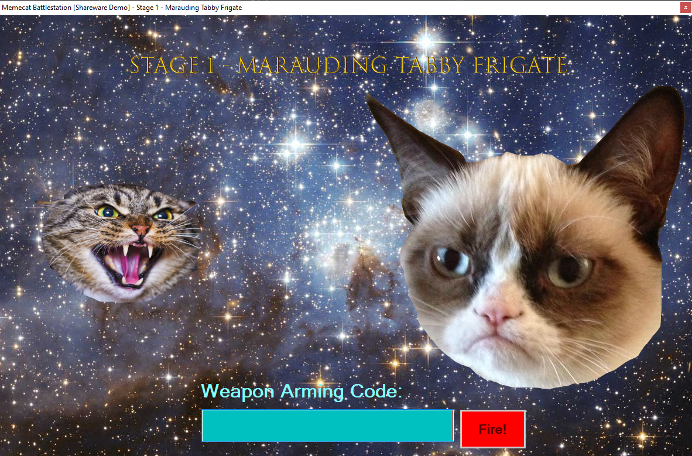
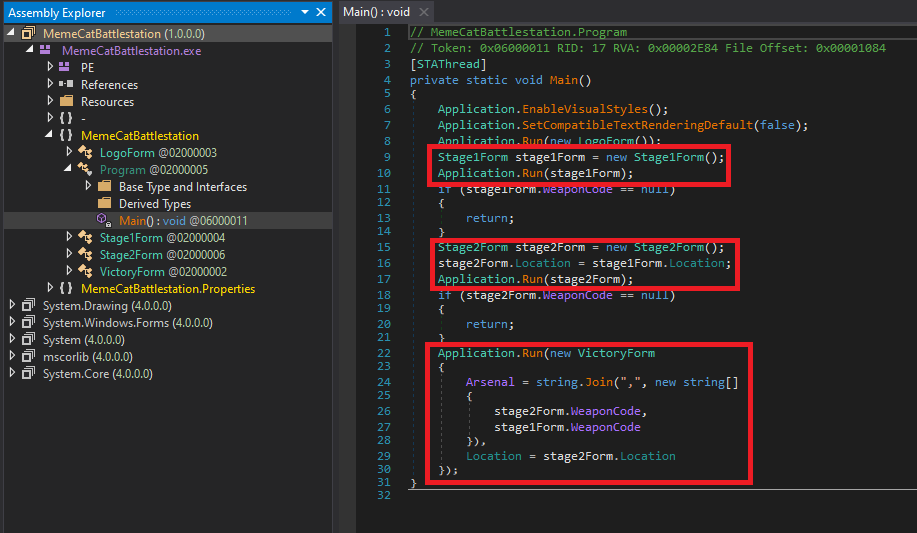
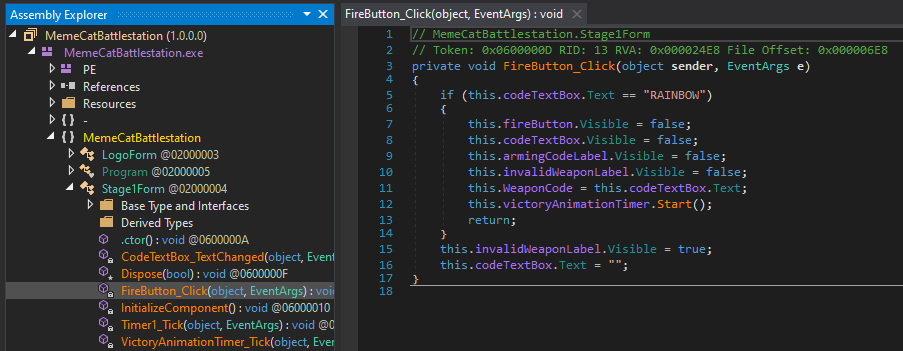

1 - Memecat Battlestation
=========================

**Time spent:** around 15 minutes (I did the BHUSA 2019 variant)

**Tools used:** dnSpy, little bit of Python

The first challenge was titled Memecat Battlestation. The "game" consists of two stages (three if you did the BHUSA 2019 variant first), and for each stage we have to figure out the right "weapon code". The note also indicates the executable is a .NET binary. 




Let's open it up in dnSpy, and checkout the main entrypoint:



Immediately we see that the Main method runs three different Forms, each for every stage, and, judging from the last call to Application.Run, the last form depends on the entered weapon codes of the previous two. This probably means no shortcuts to the last Form unfortunately!

Stage 1
-------

Let's inspect stage 1. This one is fairly easy. It contains a `FireButton_Click` event handler that directly compares the string to "RAINBOW". Easy! One down!



Stage 2
-------

Stage 2 is a little more interesting. It also contains a `FireButton_Click` event handler, but this time it calls `isValidWeaponCode`:

```csharp
private bool isValidWeaponCode(string s)
{
	char[] array = s.ToCharArray();
	int length = s.Length;
	for (int i = 0; i < length; i++)
	{
		char[] array2 = array;
		int num = i;
		array2[num] ^= 'A';
	}
	return array.SequenceEqual(new char[]
	{
		'\u0003', ' ', '&', '$',  '-', '\u001e', '\u0002', ' ', '/', '/', '.', '/'
	});
}
```

From the looks of it, it is a normal XOR cipher with a single character key 'A'. The ciphertext is then compared to another hardcoded ciphtertext. Since XOR is both an encryption and a decryption function, we can just run the hardcoded ciphertext through the same function, and reveal that the next password is "Bagel_Cannon".

Stage 3 (BHUSA 2019 only)
-------------------------

If you participated in Flare-On 2019 only, you'd be done. The third stage was only present if you participated in the BHUSA 2019 event. For the sake of completeness, I will discuss this one as well.

Again, a call to `isValidWeaponCode` is made, but this time it has another implementation:

```csharp
private bool isValidWeaponCode(string s)
{
    string catGenetics = this.getCatGenetics();
    return BattleCatManagerInstance.InitializeBattleCat(Encoding.UTF8.GetBytes(catGenetics), Encoding.UTF8.GetBytes(s)).SequenceEqual(new byte[]
    {
        95, 193, 50, 12, 127, 228, 98, 6, 215, 46,
        200, 106, 251, 121, 186, 119, 109, 73, 35, 14, 20
    });
}
```
We can see that again, the input string is processed in some way, and then compared to some byte array. Inspecting `getCatGenetics` we see that it is just a call that base64 encodes the weapon code of stage 2.

```csharp
private string getCatGenetics()
{
    return Stage3Form.Base64Encode(this.PriorWeaponCode);
}
```

and `InitializeBattleCat` is a call that is just a wrapper for the following function, where `cat` contains the data of the previous weapon code, and `data` contains the bytes of the final input.

```csharp
private static IEnumerable<byte> AssignFelineDesignation(byte[] cat, IEnumerable<byte> data)
{
    byte[] s = BattleCatManagerInstance.InvertCosmicConstants(cat);
    int i = 0;
    int j = 0;
    return data.Select(delegate(byte b)
    {
        i = (i + 1 & 255);
        j = (j + (int)s[i] & 255);
        BattleCatManagerInstance.CatFact(s, i, j);
        return b ^ s[(int)(s[i] + s[j] & byte.MaxValue)];
    });
}
```

At this point I praised the creativity that the people at Flare had for coming up with names for these methods. There are quite hilarious :').

Regardless, we can see that `InvertCosmicConstants` does some initial processing of the previous weapon code, which means we can just use the output of this function and do not really have to decompile it! Inspecting `CatFact` shows that it just swaps two values in an array:

```csharp
private static void CatFact(byte[] s, int i, int j)
{
    byte b = s[i];
    s[i] = s[j];
    s[j] = b;
}
```

We can now create a little python script to decrypt the target byte array:

```python
prior = [
     ... 
    ]
goal = [ 
     95, 193, 50, 12, 127, 228, 98, 6, 215, 46,
     200, 106, 251, 121, 186, 119, 109, 73, 35, 14, 20
    ]

result = []
i = 0
j = 0
for b in goal:
    i = (i + 1) & 0xFF
    j = (j + prior[i]) & 0xFF
    prior[i], prior[j] = prior[j], prior[i]
    result.append(b ^ prior[(prior[i] + prior[j]) & 0xFF])

print("".join([chr(x) for x in result]))
```

Which results in "Defeat_them_with_love". This is the final weapon code!