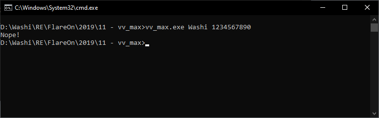
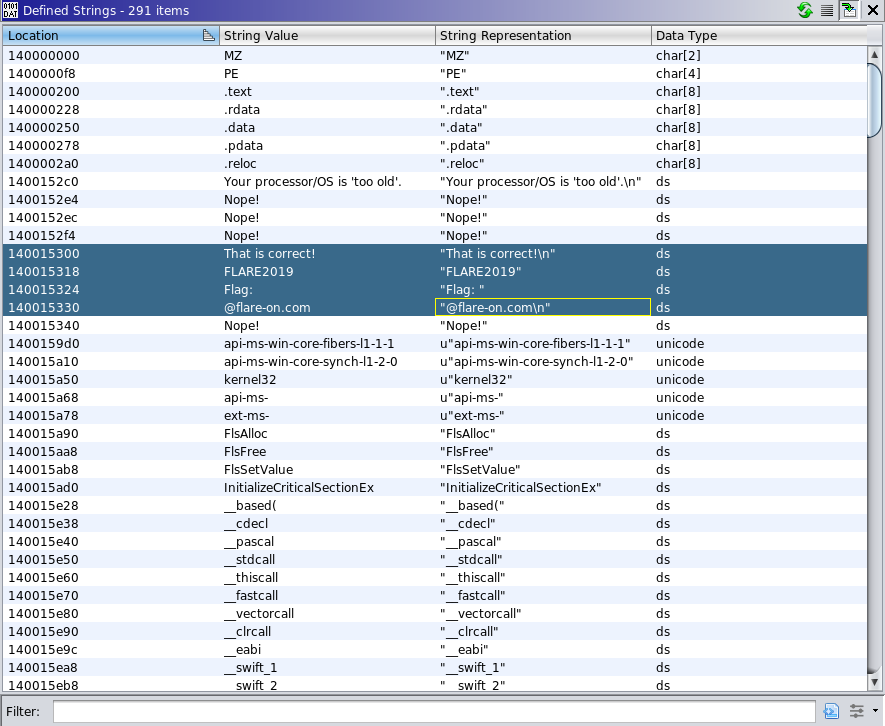
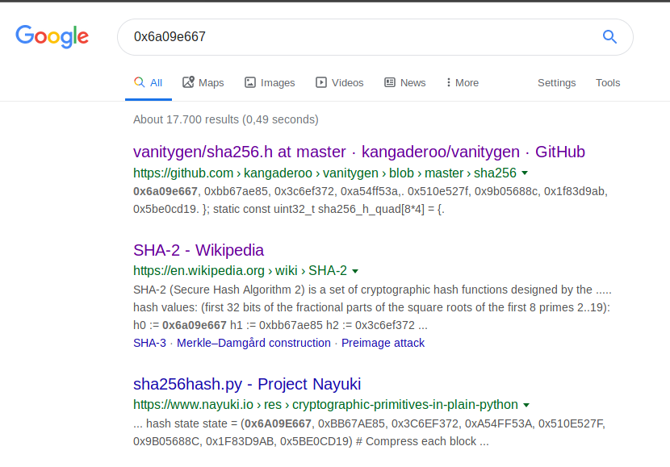
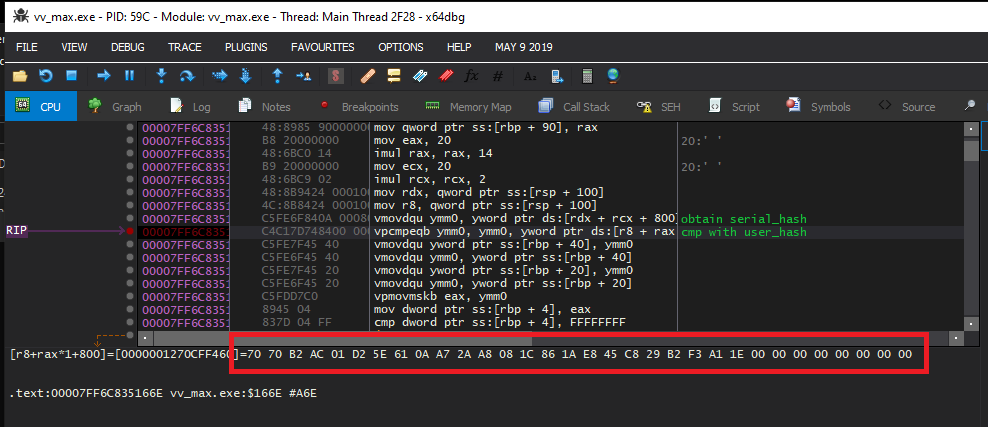
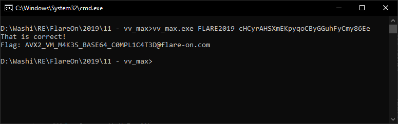

# 11 - vv_max

**Time spent:** About a day

**Tools used:** Ghidra, x64dbg, Python

The eleventh challenge was one of my favourite challenges out of all twelve this year. The zip came with a single command-line crackme file. As usual, the flag can only be decrypted and printed out if the correct username and serial combination are provided:




## Orientation

Opening the executable in Ghidra and scanning for strings gives us a nice starting point:



4 strings that give a good indication of where the flag is being exposed to the user. What also is interesting is the string listed 4 items before; `"Your processor/OS is 'too old'\n"`, a rather unusual message.

Either way, let's cross-reference on the good-boy message. We find this function (`FUN_140001610`):

```c
void KeyVerification(void *param_1,char *param_2,longlong param_3)
{
  /* ... */
  
  uVar2 = DAT_14001f008 ^ (ulonglong)auStack248;
  result = vmovdqu_avx(*(undefined *)((longlong)param_1 + 0x840));
  result = vpcmpeqb_avx2(result,*(undefined *)((longlong)param_1 + 0xa80));
  result = vmovdqu_avx(result);
  result = vmovdqu_avx(result);
  flag = vmovdqu_avx(result);
  result = vmovdqu_avx(flag);
  iVar1 = vpmovmskb_avx2(result);
  if (iVar1 == -1) {
    printf("That is correct!\n");
    j = 10;
    p2 = "FLARE2019";
    p1 = s_FLARE2019;
    while (j != 0) {
      j = j + -1;
      *p1 = *p2;
      p2 = p2 + 1;
      p1 = p1 + 1;
    }
    if ((param_3 == 9) && (cmpresult = strcmp(param_1,param_2,s_FLARE2019,9), (int)cmpresult == 0))
    {
      result = vmovdqu_avx(*(undefined *)((longlong)param_1 + 0x820));
      result = vpxor_avx2(result,*(undefined *)((longlong)param_1 + 0xbe0));
      result = vmovdqu_avx(result);
      result = vmovdqu_avx(result);
      flag = vmovdqu_avx(result);
      printf("Flag: ");
      i = 0;
      while (i < 0x20) {
        printf("%c",(ulonglong)(byte)flag[(longlong)i]);
        i = i + 1;
      }
      printf("@flare-on.com\n");
    }
  }
  else {
    printf("Nope!");
  }
  
  /* ... */
}
```

I suppose this is what the "your processor is too old" message was about; The function is littered with funky AVX/2 assembly instructions! If you don't know what these are, neither did I, we will cover them later. What is important for now is that they are only supported since Intel's Haswell processors.

Furthermore, at first glance it seems like `param_1` is a very big structure (for exmaple look at `param_1 + 0x820`). It seems the structure must start with the string `FLARE2019` (`strcmp(param_1, param_2, s_FLARE2019)`), but there's also some more magic going on prior to this comparison. 

Let's find out where this function is called so we can figure out what the parameters are. We find that `FUN_14000122` is responsible for it. Here's an excerpt of the somewhat cleaned-up version of it (Ghidra had some trouble decompiling it):

```c
void InterestingFunction(void)
{
  /* ... */
  is64Bit = CheckIfInstructionsAvailable();
  if (is64Bit == '\0') {
    /* ... */
    printf("Your processor/OS is \'too old\'.\n");
  } else {
    if (*(int *)(&stack0x00001478 + lVar1) == 3) {  
      /* ... */
      usernameLength = strlen(_Str,*(undefined *)((longlong)&uStack16 + lVar1));
      *SOME_BUFFER = usernameLength;
      if ((*SOME_BUFFER < 4) || (0x20 < *SOME_BUFFER)) 
        /* ... */
        printf("Nope!");
      } else {  
        /* ... */
        passwordLength = strlen(pPassword,*(undefined *)((longlong)&uStack16 + lVar1));
        SOME_BUFFER[1] = passwordLength;
        if (SOME_BUFFER[1] == 0x20) {
          /* ... */
          FUN_140001390(SOME_BUFFER + 4);
          /* ... */
          pUsername = *(undefined8 *)(*(longlong *)(&stack0x00001480 + lVar1) + 8);
          /* ... */
          FUN_140001830(SOME_BUFFER + 4,pUsername,pPassword,usernameLength_00);          
          /* ... */
          KeyVerification(SOME_BUFFER + 4,_Str,usernameLength_00,
                          *(undefined *)((longlong)&uStack16 + lVar1));
        } else {
          /* ... */
          printf("Nope!");
        }
      }
    }
    else {
      *(undefined8 *)((longlong)&uStack16 + lVar1) = 0x140001289;
      printf("Nope!");
    }
  }

  /* ... */
}

```

At the beginning of the method we see the check that verifies whether our processor is up for the task to execute our AVX/2 instructions. After that we see some basic checks that the username must be between 4 and 0x20 characters, and the key has to be exactly 0x20 bytes long. Finally, we see that our key verification function is using some globally allocated buffer, which is also used by two other functions `FUN_140001830` and `FUN_140001390`. Since the last one seems to be operating on both the username and password, let's have a look:

```c
void FUN_140001390(void *pBuffer,char *pUsername,char *pPassword,longlong usernameLength)
{
  longlong i;
  int p2;
  int p1;
  
  *(undefined8 *)((longlong)pBuffer + 0xc00) = 0;
  p1 = 3;
  p2 = 0;

  // Copy username in pBuffer
  i = usernameLength;
  while (i != 0) {
    *(char *)((longlong)pBuffer + (longlong)p1) = pUsername[(longlong)p2];
    p1 = p1 + 1;
    p2 = p2 + 1;
    i = i + -1;
  }
  p1 = 0x25;
  p2 = 0;

  // Copy password in pBuffer
  while (p2 != 0x20) {
    *(char *)((longlong)pBuffer + (longlong)p1) = pPassword[(longlong)p2];
    p1 = p1 + 1;
    p2 = p2 + 1;
  }
  
  // Some magic here:
  while (*(char *)((longlong)pBuffer + *(longlong *)((longlong)pBuffer + 0xc00)) != -1) {
    (**(code **)((longlong)pBuffer +
                (ulonglong)*(byte *)((longlong)pBuffer + *(longlong *)((longlong)pBuffer + 0xc00)) *
                8 + 0xc08))(pBuffer);
  }
  return;
}
```

It seems we are copying both the username and the password into the beginning of the large buffer. Looking back at the code we found in the key verification function, this already tells us the username to the correct decryption of the flag is `FLARE2019`. After that, we do some very interesting loop that seems to be reading bytes from the large buffer using the offset stored at `buffer+0xC00`, and executes a function that is obtained from some kind of lookup table.

A trained eye will know what is going on now. This is a very basic setup for Virtual Machine using a lookup table as an opcode dispatcher, and this function is really just the fetch-execute loop of it. For the not so untrained eye, let me explain:

The idea is as follows: Somewhere in the executable, a chunk of binary data is stored. This binary data is essentially encoding some program, but not using the normal x86 instruction set (or any known instruction set for that matter). Instead, the program is encoded using a custom defined instruction set that the author made up themselves. Obviously, the processor that runs the application does not understand this custom instruction encoding. Therefore,  the executable also comes with an interpreter that executes the instruction, and essentially emulates this custom made machine, a virtual machine. This is a very effective trick to make reverse engineering a lot harder, as the reverse engineer has to learn a completely new instruction set, and the only way to do so is by reverse engineering the entire interpreter.

Let's do some renaming and typing in Ghidra:

```c
void VM_EXECUTE(VM_CONTEXT *vm_context,char *pUsername,char *pPassword,longlong usernameLength)

{
  longlong i;
  int p2;
  int p1;
  
  vm_context->PC = 0;
  p1 = 3;
  p2 = 0;
  i = usernameLength;
  while (i != 0) {
    vm_context->Memory0[(longlong)p1] = pUsername[(longlong)p2];
    p1 = p1 + 1;
    p2 = p2 + 1;
    i = i + -1;
  }
  p1 = 0x25;
  p2 = 0;
  while (p2 != 0x20) {
    vm_context->Memory0[(longlong)p1] = pPassword[(longlong)p2];
    p1 = p1 + 1;
    p2 = p2 + 1;
  }
  while (vm_context->Memory0[vm_context->PC] != -1) {
    (*vm_context->OpCodeTable[(ulonglong)(byte)vm_context->Memory0[vm_context->PC]])(vm_context);
  }
  return;
}
```

Going to the other function that is executed before this execution loop (`FUN_140001830`), we can see it is actually an initialization of the VM:

```c
VM_CONTEXT * VM_INIT(VM_CONTEXT *vm_context)
{
  longlong i;
  longlong j;
  longlong k;
  char *p2;
  char *p;
  char *p3;
  
  // Copy over VM code:
  i = 0x5fb;
  p2 = (char *)&VMCODE;
  p = (char *)vm_context;
  while (i != 0
    i = i + -1;
    *p = *p2;
    p2 = p2 + 1;
    p = p + 1;
  }

  // Clear some memory
  j = 0x205;
  p3 = vm_context->Memory1;
  while (j != 0) {
    j = j + -1;
    *p3 = '\0';
    p3 = p3 + 1;
  }

  // Set up opcode lookup table:
  vm_context->OpCodeTable[0] = OPCODE_HANDLER_0;
  vm_context->OpCodeTable[1] = OPCODE_HANDLER_1;
  vm_context->OpCodeTable[2] = OPCODE_HANDLER_2;
  vm_context->OpCodeTable[3] = OPCODE_HANDLER_3;
  vm_context->OpCodeTable[4] = OPCODE_HANDLER_4;
  vm_context->OpCodeTable[5] = OPCODE_HANDLER_5;
  vm_context->OpCodeTable[6] = OPCODE_HANDLER_6;
  vm_context->OpCodeTable[7] = OPCODE_HANDLER_7;
  vm_context->OpCodeTable[8] = OPCODE_HANDLER_8;
  vm_context->OpCodeTable[9] = OPCODE_HANDLER_9;
  vm_context->OpCodeTable[10] = OPCODE_HANDLER_A;
  vm_context->OpCodeTable[0xb] = OPCODE_HANDLER_B;
  vm_context->OpCodeTable[0xc] = OPCODE_HANDLER_C;
  vm_context->OpCodeTable[0xd] = OPCODE_HANDLER_D;
  vm_context->OpCodeTable[0xe] = OPCODE_HANDLER_E;
  vm_context->OpCodeTable[0xf] = OPCODE_HANDLER_F;
  vm_context->OpCodeTable[0x10] = OPCODE_HANDLER_10;
  vm_context->OpCodeTable[0x11] = OPCODE_HANDLER_11;
  vm_context->OpCodeTable[0x12] = OPCODE_HANDLER_12;
  vm_context->OpCodeTable[0x13] = OPCODE_HANDLER_13;
  vm_context->OpCodeTable[0x14] = OPCODE_HANDLER_14;
  vm_context->OpCodeTable[0x15] = OPCODE_HANDLER_15;
  vm_context->OpCodeTable[0x16] = OPCODE_HANDLER_16;
  vm_context->OpCodeTable[0x17] = OPCODE_HANDLER_17;

  // Clear more memory:
  k = 0x738;
  p3 = vm_context->BiggerMemory;
  while (k != 0) {
    k = k + -1;
    *p3 = '\0';
    p3 = p3 + 1;
  }
  return vm_context;
}
```

From these two functions, we can deduce that our `VM_CONTEXT` type looks something like the following:

```c
struct VM_CONTEXT
{
    char      Memory0[1531];
    char      Memory1[1541];
    longlong  PC;
    void (*OpCodeHandler)(VM_CONTEXT * context) OpCodeTable[24];
    char      BiggerMemory[1856];
};
```

Using x64dbg we can quickly find out what the contents of `VMCODE` must be, by simply setting a breakpoint on the initialization of the VM. I put the contents into a file called [vm.bin](vm.bin).

Now it is time to figure out what this vm code actually does. For that we need to analyse all the opcode handlers, and write some custom tooling.

## Creating a disassembler

Browsing quickly through the opcode handlers we find that most opcode handlers are very straight forward. Most of the opcodes take two input variables (or registers if you will) of 0x20 bytes each, perform some magic AVX/2 operation on it, and store the result in a third variable. This is for example the handler for opcode with byte `0x01`:

```c
void OPCODE_HANDLER_1(VM_CONTEXT *context)
{
  undefined auVar1 [32];
  byte op0;
  byte op1;
  byte op2;
  
  // Read operands:
  context->PC = context->PC + 1;
  op0 = context->Memory0[context->PC];
  context->PC = context->PC + 1;
  op1 = context->Memory0[context->PC];
  context->PC = context->PC + 1;
  op2 = context->Memory0[context->PC];
  context->PC = context->PC + 1;

  // Obtain value of variables[op1]
  auVar1 = vmovdqu_avx(*(undefined *)(context->Memory1 + (ulonglong)op1 * 0x20 + 0x205));

  // Obtain value of variables[op2] and do some AVX2 magic:
  auVar1 = vpmaddubsw_avx2(auVar1,*(undefined *)(context->Memory1 + (ulonglong)op2 * 0x20 + 0x205));
  auVar1 = vmovdqu_avx(auVar1);
  auVar1 = vmovdqu_avx(auVar1);
  auVar1 = vmovdqu_avx(auVar1);

  // Store result in variables[op0]:
  *(undefined *)(context->Memory1 + (ulonglong)op0 * 0x20 + 0x205) = auVar1;
  return;
}
```

Let's talk AVX/2. The `vmovdqu_avx` function is a function that tells the compiler to emit the `VMOVDQU` instruction. A quick google search for this instruction [reveals](https://hjlebbink.github.io/x86doc/html/MOVDQU,VMOVDQU8_16_32_64.html) that this really is just like a normal x86 `mov` instruction, except it operates on vectors of 0x20 bytes each. Similarly, `vpmaddubsw_avx2` tells the compiler to emit `VPMADDUBSW`. However, this is where things get hairy. Most AVX/2 instructions are ridiculously complex operations all crammed within a single instruction. Explaining all these here will probably result in an even longer write up than it already is in comparison to the others. Let's ignore them for now and just paste them into our disassembler (SPOILER alert: we won't need to understand all of them).

As said before, most of these handlers are like this, with a few exceptions; OpCode `0x00`, `0x10`, `0x11`, `0x17` are slightly different. Here's the handler for opcode `0x00`:

```c
void OPCODE_HANDLER_0(VM_CONTEXT *context)
{
  undefined auVar1 [32];
  ulonglong i;
  
  context->PC = context->PC + 1;
  i = 0;
  while (i < 0x20) {
    // Set auVar1 to the zero-vector (00000000, 00000000, ...)
    auVar1 = vmovdqu_avx((undefined  [32])0x0);
    auVar1 = vmovdqu_avx(auVar1);
    auVar1 = vmovdqu_avx(auVar1);
    auVar1 = vmovdqu_avx(auVar1);

    // Write auVar1 to memory.
    *(undefined *)(context->Memory1 + i * 0x20 + 0x205) = auVar1;
    i = i + 1;
  }
  return;
}
```

Not too much AVX/2 crazyiness is going on here fortunately, this is a simple loop that clears the contents of `Memory1`. Let's look at the handler for opcode `0x10`:

```c
void OPCODE_HANDLER_10(VM_CONTEXT *param_1)
{
  byte bVar1;
  byte bVar2;
  undefined auVar3 [32];
  
  // Read operands op0 and op1
  param_1->PC = param_1->PC + 1;
  bVar1 = param_1->Memory0[param_1->PC];
  param_1->PC = param_1->PC + 1;
  bVar2 = param_1->Memory0[param_1->PC];
  param_1->PC = param_1->PC + 1;
  
  // Get value for variables[op1]
  auVar3 = vmovdqu_avx(*(undefined *)(param_1->Memory1 + (ulonglong)bVar2 * 0x20 + 0x205));
  auVar3 = vmovdqu_avx(auVar3);

  // Put value into variables[op0]
  *(undefined *)(param_1->Memory1 + (ulonglong)bVar1 * 0x20 + 0x205) = auVar3;

  return;
}
```

A simpler handler than opcode `0x00`. It simply assigns a value of a variable to another variable, comparable to a normal `mov` instruction using two registers. 

Moving on to the handler for `0x11`:

```c
void OPCODE_HANDLER_11(VM_CONTEXT *param_1)
{
  undefined auVar1 [32];
  byte operand;
  
  // Read operand.
  param_1->PC = param_1->PC + 1;
  operand = param_1->Memory0[param_1->PC];
  
  // Read a vector operand.
  param_1->PC = param_1->PC + 1;
  auVar1 = vmovdqu_avx(*(undefined *)(param_1->Memory0 + param_1->PC));
  auVar1 = vmovdqu_avx(auVar1);
  auVar1 = vmovdqu_avx(auVar1);
  auVar1 = vmovdqu_avx(auVar1);

  // Set variables[operand] = vector.
  *(undefined *)(param_1->Memory1 + (ulonglong)operand * 0x20 + 0x205) = auVar1;

  param_1->PC = param_1->PC + 0x20;
  return;
}
```

Not too bad either; It assigns to a variable a vector that is inlined in the code buffer, comparable to a `mov register, constant` instruction.

Finally, `0x17` is really boring and just emulates a `nop`:

```c
void OPCODE_HANDLER_17(VM_CONTEXT *param_1)
{
  param_1->PC = param_1->PC + 1;
  return;
}
```

From analysing all handlers, we can obtain the following opcode table:

|  Byte  | Operation                              |
|--------|----------------------------------------|
| `0x00` | `clearmemory`                          |
| `0x01` | `v[op0] = VPMADDUBSW(v[op1], v[op2])`  |
| `0x02` | `v[op0] = VPMADDWD(v[op1], v[op2])`    |
| `0x03` | `v[op0] = VPXOR(v[op1], v[op2])`       |
| `0x04` | `v[op0] = VPOR(v[op1], v[op2])`        |
| `0x05` | `v[op0] = VPAND(v[op1], v[op2])`       |
| `0x06` | `v[op0] = VPXOR(v[op1], v[op2])`       |
| `0x07` | `v[op0] = VPADDB(v[op1], v[op2])`      |
| `0x08` | `v[op0] = VPSUBB(v[op1], v[op2])`      |
| `0x09` | `v[op0] = VPADDW(v[op1], v[op2])`      |
| `0x0A` | `v[op0] = VPSUBW(v[op1], v[op2])`      |
| `0x0B` | `v[op0] = VPADDD(v[op1], v[op2])`      |
| `0x0C` | `v[op0] = VPSUBD(v[op1], v[op2])`      |
| `0x0D` | `v[op0] = VPADDQ(v[op1], v[op2])`      |
| `0x0E` | `v[op0] = VPSUBQ(v[op1], v[op2])`      |
| `0x0F` | `v[op0] = VPMULDQ(v[op1], v[op2])`     |
| `0x10` | `v[op0] = v[op1]`                      |
| `0x11` | `v[op0] = constant vector`             |
| `0x12` | `v[op0] = VPSRLD(v[op1], op2)`         |
| `0x13` | `v[op0] = VPSLLD(v[op1], op2)`         |
| `0x14` | `v[op0] = VPSHUFB(v[op1], v[op2])`     |
| `0x15` | `v[op0] = VPERMD(v[op1], v[op2])`      |
| `0x16` | `v[op0] = VPCMPEQB(v[op1], v[op2])`    |
| `0x17` | `nop`                                  |

From this we can easily create a disassembler, by simply following the table. The disassembler code can be found in [disassembler.py](disassembler.py). Note that the disassembler doesn't handle every opcode, just the ones that were needed to disassemble the embedded VM binary data. The entirety of the disassembled pseudo code can be found in [disassembly.asm](disassembly.asm).


## Analysing the devirtualized code

Now what we can do of course, is go over the code line-by-line, and try to analyse whats going on. Hoewever the code is really long and seems to implement quite a complex cryptographic function. Seems like too much work to me!

While opening the devirtualized code, we are greeted with a bunch of vectors being initialized:

```
clearmemory
v0 = [0x00000000, 0x00000000, 0x00000000,  ... ]
v1 = [0x00000000, 0x00000000, 0x00000000,  ... ]
v3 = [0x1a1b1b1b, 0x1a131111, 0x11111111,  ... ]
v4 = [0x10101010, 0x10101010, 0x08040804,  ... ]
v5 = [0x00000000, 0x00000000, 0xb9b9bfbf,  ... ]
v6 = [0x2f2f2f2f, 0x2f2f2f2f, 0x2f2f2f2f,  ... ]
v10 = [0x01400140, 0x01400140, 0x01400140, ... ]
v11 = [0x00011000, 0x00011000, 0x00011000, ... ]
v12 = [0xffffffff, 0x0c0d0e08, 0x090a0405, ... ]
v13 = [0xffffffff, 0xffffffff, 0x00000006, ... ]
v16 = [0xffffffff, 0xffffffff, 0xffffffff, ... ]
v17 = [0x6a09e667, 0xbb67ae85, 0x3c6ef372, ... ]
v18 = [0x428a2f98, 0x71374491, 0xb5c0fbcf, ... ]
v19 = [0x00000003, 0x00000002, 0x00000001, ... ]
v20 = [0x00000000, 0x00000000, 0x00000000, ... ]
v21 = [0x00000001, 0x00000001, 0x00000001, ... ]
v22 = [0x00000002, 0x00000002, 0x00000002, ... ]
v23 = [0x00000003, 0x00000003, 0x00000003, ... ]
v24 = [0x00000004, 0x00000004, 0x00000004, ... ]
v25 = [0x00000005, 0x00000005, 0x00000005, ... ]
v26 = [0x00000006, 0x00000006, 0x00000006, ... ]
v27 = [0x00000007, 0x00000007, 0x00000007, ... ]
```

What I often find working really well - when I am trying to make heads or tails of some cryptographic function - is to try to look at some weird and oddly specific constants, and paste them into Google. Since cryptographic functions use very carefully chosen constants that are often exclusively used by said function, 9 out of 10 times if you paste one or two of them into Google, you will find the corresponding algorithm without having to analyse anything! 

This case was no exception. Pasting the first oddly specific constant from v17 into Google gave me the answer:



This is where I started to lose faith in my original plan a bit. SHA-2 256 bit is known as a cryptographically secure hashing algorithm, secure enough to prevent any form of bruteforcing on a space of 0x20 input bytes. So either the implemented algorithm has a weakness in it and/or deviates from the original algorithm, or the solution is somewhere else and I missed something. 

I started looking at how this VM code is actually invoked. I remembered something that I saw in our `VM_EXECUTE` function. The username was written at offset 3 in the VM code block, and the password was written at offset 25. These offsets correspond **exactly** with the operands of the assignments of the variables v0 and v1. In other words: v0 and v1 are the vector representations of our username and password.

Then I started wondering how the username and password were hashed using SHA256. Here's where it gets interesting. If we take a very close look at where v0 and v1 are used in the code, and see how the two variables relate to each other, we quickly find out that all statements that relate to v0 (the username) are completely independent of all statements that relate to v1. In other words, the virtualized code is not one algorithm, but two separate algorithms interleaved into each other that process v0 and v1 completely separately! Since we know the answer for v0 already (we found out earlier the username had to be `FLARE2019`), we can ignore all the computations that are related to v0. What you end up with is a much shorter piece of devirtualized code. More importantly, a piece of code that does **not** work with the SHA-256 constants; something that is actually reversible!

```
v5 = [0x00000000, 0x00000000, 0xb9b9bfbf, 0x04131000, 0x00000000, 0x00000000, 0xb9b9bfbf, 0x04131000]
v6 = [0x2f2f2f2f, 0x2f2f2f2f, 0x2f2f2f2f, 0x2f2f2f2f, 0x2f2f2f2f, 0x2f2f2f2f, 0x2f2f2f2f, 0x2f2f2f2f]
v10 = [0x01400140, 0x01400140, 0x01400140, 0x01400140, 0x01400140, 0x01400140, 0x01400140, 0x01400140]
v11 = [0x00011000, 0x00011000, 0x00011000, 0x00011000, 0x00011000, 0x00011000, 0x00011000, 0x00011000]
v12 = [0xffffffff, 0x0c0d0e08, 0x090a0405, 0x06000102, 0xffffffff, 0x0c0d0e08, 0x090a0405, 0x06000102]
v13 = [0xffffffff, 0xffffffff, 0x00000006, 0x00000005, 0x00000004, 0x00000002, 0x00000001, 0x00000000]

v7 = vpsrld(v1, 4)
v7 = vpand(7, v6)
v8 = vpcmpeqb(v1, v6)
v8 = vpcmpeqb(v1, v6)
v7 = vpaddb(v8, v7)
v7 = vpshufb(v5, v7)
v2 = vpaddb(v1, v7)
v7 = vpmaddubsw(v2, v10)
v2 = vpmaddwd(v7, v11)
v2 = vpshufb(v2, v12)
v2 = vpermd(v2, v13)
```

Reversing these AVX/2 instructions was a tricky job, but more doable than reversing a SHA-256 algorithm. It takes some pen and paper to figure out all the crazy operations and how to reverse them (let me know if you want a more detailed explanation here). The full solution can be found in [solution.py](solution.py).

## Final steps

The only thing to find out is what hash to reverse. Looking back at the key verification function, we see:

```c
void KeyVerification(VM_CONTEXT *param_1,char *mustbe_s_FLARE2019,longlong mustbe_9)
{
  /* ... */
  
  // Gets v2 (computed hash from serial)
  result = vmovdqu_avx(*(undefined *)(param_1->Memory1 + 0x245));
                    
  // Compare with v20 (computed hash from username)
  result = vpcmpeqb_avx2(result,*(undefined *)(param_1->Memory1 + 0x485));

  result = vmovdqu_avx(result);
  result = vmovdqu_avx(result);
  flag = vmovdqu_avx(result);
  result = vmovdqu_avx(flag);
  iVar1 = vpmovmskb_avx2(result);
  if (iVar1 == -1) {
    printf("That is correct!\n");
    /* ... */
  }
}
```

It prints out the flag after comparing the hash from the serial with the hash of the username. Using x64dbg, we can quickly find out the hash of the username by simply breakpointing on the `vpcmpeqb` instruction:



We can then plug it into our `solution.py`, which gives us:

```
$ python solution.py
--[Correctness test]--
Testing: 56555453 5251504f 4e4d4c4b 4a494847 46454443 42413039 38373635 34333231
Encoded: 00000000 00000000 15354911 f4380db3 28097218 05310801 40f7fcae e7f86dd7
Decoded: 56555453 5251504f 4e4d4c4b 4a494847 46454443 42413039 38373635 34333231

--[Actual solution]--
Serial (encoded): 00000000 00000000 1ea1f3b2 29c845e8 1a861c08 a82aa70a 615ed201 acb27070
Serial (decoded): 65453638 796d4379 46687547 47794243 6f717970 4b456d58 53484172 79434863
Serial (ascii):   cHCyrAHSXmEKpyqoCByGGuhFyCmy86Ee
```

Entering this in the original application reveals the flag:

