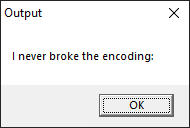

2 - Overlong
============

**Time spent:** A little less than 5 minutes.

**Tools used:** Ghidra

The second challenge was titled Overlong. The note that came with the `Overlong.exe` file stated:

```
The secret of this next challenge is cleverly hidden. However, with the right approach, finding the solution will not take an <b>overlong</b> amount of time.
```

Running the application reveals:



And then closes immediately.

Opening up the file in Ghidra, we see the following code:

```c
undefined4 entry(void)

{
  byte local_88 [128];
  uint local_8;
  
  local_8 = FUN_00401160(local_88,&DAT_00402008,0x1c);
  local_88[local_8] = 0;
  MessageBoxA((HWND)0x0,(LPCSTR)local_88,s_Output_00403000,0);
  return 0;
}
```

`local_88` is used in the `MessageBoxA` call as the message parameter, and also in the mysterious `FUN_00401160` function. This tells us `local_88` is a zero terminated string, and that `FUN_00401160` probably uses it as an output buffer. We see that it has two more arguments, some constant `DAT_00402008` passed on by reference, and an integer constant.

Most C-like functions that work with buffers provide three arguments: An output buffer, an input buffer, and a length. 0x1C seems like a reasonable length for a string input buffer, which means that `DAT_00402008` must be the input buffer of length 0x1C. Highlighting the constant in the decompiler and pressing Ctrl+L to retype to `char[0x1c]` lets Ghidra do some automagic stuff:

```c
local_8 = FUN_00401160(local_88,(byte *)
                                  "I never broke the encoding:I_a_M_t_h_e_e_n_C_o_D_i_n_g@flare-on.com"
```

revealing the flag.