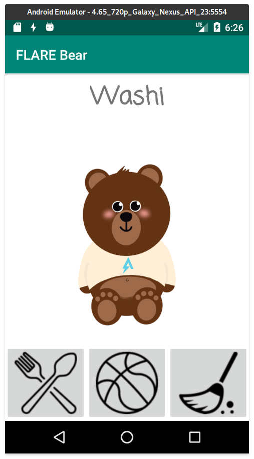
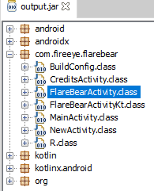
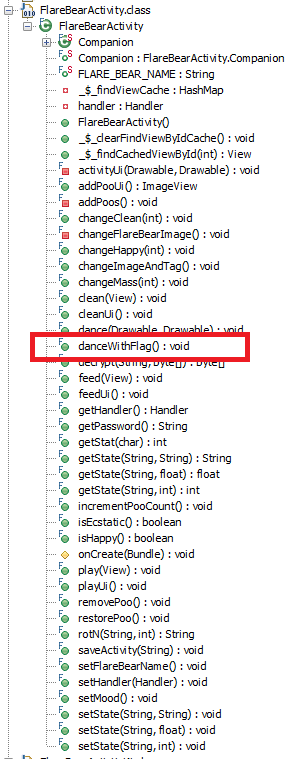
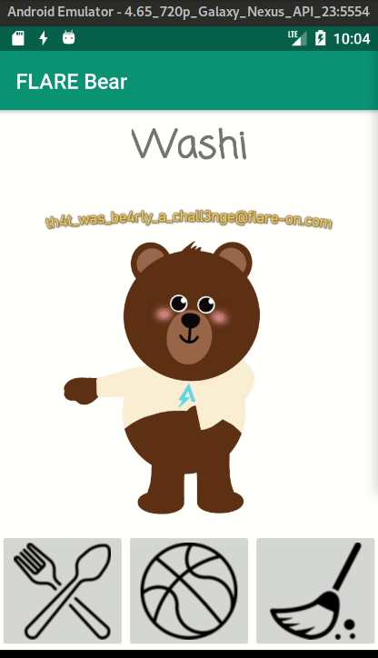

3 - Flarebear
=============

**Time spent:** 1 to 2 hours

**Tools used:** dex2jar, JD-GUI, Android Studio's Android Emulator

The third challenge was titled Flarebear and was an APK file to be installed on an Android device. The app is a simple game that allows you to create a virtual pet bear, and feed him, play with him and clean him. The note that came along with it told us to make the bear happy in some way or another.



To reverse engineer APK files, one can use tools like [dex2jar](https://github.com/pxb1988/dex2jar) to convert the *.apk file to a *.jar file:

```sh
./d2j-dex2jar.sh -o flarebear.jar flarebear.apk
```

The output can simply be opened in any Java decompiler such as [JD-GUI](http://java-decompiler.github.io/).

Android apps work with Activities, a class that amongst other things handles all events of a single "screen" in an Android app. Each "screen" in an Android app is usually associated to one Activity, and the flarebear app is no exception of that:



Judging by the names of each class and the number of methods inside each of them, we can make a good guess that FlareBearActivity is the activity containing the game. Opening this up, we see a list of very interestingly named methods:



The first one that caught my eye was `danceWithFlag`. Sounds promising! Let's have a look:

```java
public final void danceWithFlag() {
    InputStream inputStream1 = getResources().openRawResource(2131427328);
    Intrinsics.checkExpressionValueIsNotNull(inputStream1, "ecstaticEnc");
    arrayOfByte1 = ByteStreamsKt.readBytes(inputStream1);
    InputStream inputStream2 = getResources().openRawResource(2131427329);
    Intrinsics.checkExpressionValueIsNotNull(inputStream2, "ecstaticEnc2");
    byte[] arrayOfByte2 = ByteStreamsKt.readBytes(inputStream2);
    String str = getPassword();
    try {
        arrayOfByte1 = decrypt(str, arrayOfByte1);
        arrayOfByte2 = decrypt(str, arrayOfByte2);
        Bitmap bitmap1 = BitmapFactory.decodeByteArray(arrayOfByte1, 0, arrayOfByte1.length);
        BitmapDrawable bitmapDrawable1 = new BitmapDrawable(getResources(), bitmap1);
        Bitmap bitmap2 = BitmapFactory.decodeByteArray(arrayOfByte2, 0, arrayOfByte2.length);
        BitmapDrawable bitmapDrawable2 = new BitmapDrawable(getResources(), bitmap2);
        dance((Drawable)bitmapDrawable1, (Drawable)bitmapDrawable2);
    } catch (Exception arrayOfByte1) {}
}
```

We can see that the method opens the bytes of two embedded resources, then obtains some password, decrypts the two byte arrays, interprets the results as bitmaps, and calls the `dance` method with those two bitmaps. 

Let's have a look at `getPassword`:

```java
  public final String getPassword() {
    String str2;
    int i = getStat('f');
    int j = getStat('p');
    int k = getStat('c');
    String str1 = "*";
    switch (i % 9) {
        // lots of cases here.
    }
    
    switch (k % 7) {
        // even more cases here.
    } 
    String str3 = StringsKt.repeat((CharSequence)"flare", i / k);
    String str4 = StringsKt.repeat((CharSequence)rotN("bear", i * j), j * 2);
    String str5 = StringsKt.repeat((CharSequence)"yeah", k);
    StringBuilder stringBuilder = new StringBuilder();
    stringBuilder.append(str3);
    stringBuilder.append(str2);
    stringBuilder.append(str4);
    stringBuilder.append(str1);
    stringBuilder.append(str5);
    return stringBuilder.toString();
  }
```

It depends on the values of three stats `f`, `p` and `c`, which hint to the three actions that you can perform in the game (feed, play, clean). Based on these values, the password is generated. Therefore, only the correct combination of these three stats produce the right key that decrypt the bitmaps. No luck here yet!

Let's find out where the `danceWithFlag` method is called. A quick Ctrl+F in JD-GUI reveals that it is called in the `setMood` method:

```java
public final void setMood() {
    if (isHappy()) {
        ((ImageView)_$_findCachedViewById(R.id.flareBearImageView)).setTag("happy");
        if (isEcstatic())
            danceWithFlag(); 
    } else {
        ((ImageView)_$_findCachedViewById(R.id.flareBearImageView)).setTag("sad");
    } 
}
```

We can see that it is only called when `isEcstatic()` returns true, just as the note that came with the challenge suggested. Below is the decompiled code of this method:

```java
public final boolean isEcstatic() {
    byte b = 0;
    int i = getState("mass", 0);
    int j = getState("happy", 0);
    int k = getState("clean", 0);
    int m = b;
    if (i == 72) {
        m = b;
        if (j == 30) {
            m = b;
        if (k == 0)
            m = 1; 
        } 
    } 
    return m;
}
```

We know now that the stats that we are looking for should be:

| stat  | goal value |
|-------|------------|
| mass  | 72         |
| happy | 30         |
| clean | 0          |

Our primary goal now is to figure out how to get to these stats, or in other words; which sequence of actions we need to perform in the game to get to these exact values.

Luckily for us, we have for each action in the game a method:

```java
...

public final void clean(@NotNull View paramView) {
    Intrinsics.checkParameterIsNotNull(paramView, "view");
    saveActivity("c");
    removePoo();
    cleanUi();
    changeMass(0);
    changeHappy(-1);
    changeClean(6);
    setMood();
}

...

public final void feed(@NotNull View paramView) {
    Intrinsics.checkParameterIsNotNull(paramView, "view");
    saveActivity("f");
    changeMass(10);
    changeHappy(2);
    changeClean(-1);
    incrementPooCount();
    feedUi();
}

...

public final void play(@NotNull View paramView) {
    Intrinsics.checkParameterIsNotNull(paramView, "view");
    saveActivity("p");
    changeMass(-2);
    changeHappy(4);
    changeClean(-1);
    playUi();
}

...
```

To summarize, these methods tell us that each action results in the following effect:

|         | mass  | happy | clean |
|---------|-------|-------|-------|
| clean() | +0    | -1    | +6    |
| feed()  | +10   | +2    | -1    |
| play()  | -2    | +4    | -1    |

Which means, we need to solve the following system of linear equations:
```
72 = 10f - 2p
30 = -c + 2f + 4p
0  = 6c - f - p
```
Where `c` denotes the number of times to clean the bear, `f` denotes the number of times to feed the bear, and `p` the number of times to play with the bear. Some basic high school algebra will give us that:
```
f = 8
p = 4
c = 2
```

Feeding the bear 8 times, playing with him 4 times and then cleaning him twice will let the bear dance with the flag.

