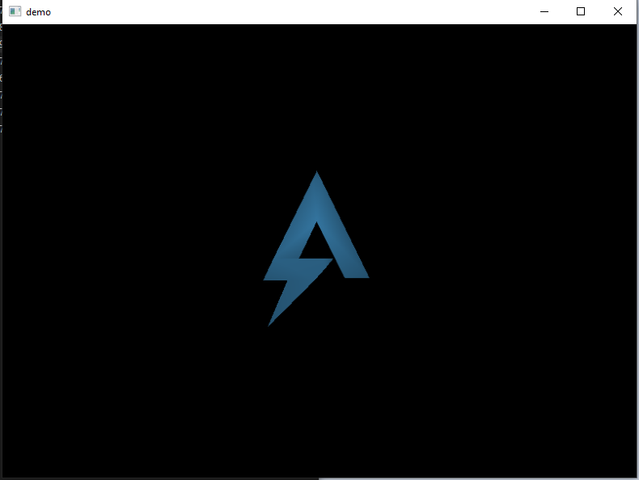
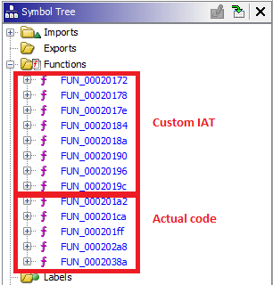
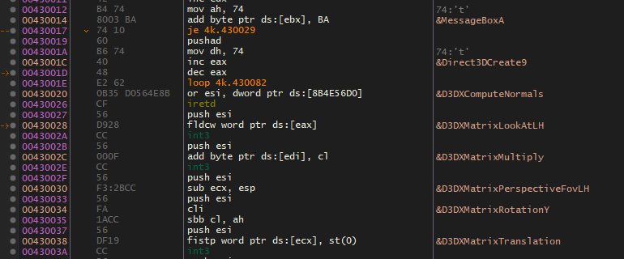
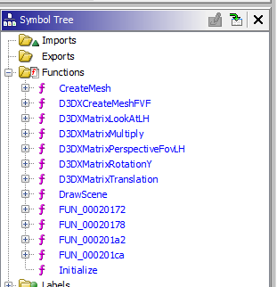
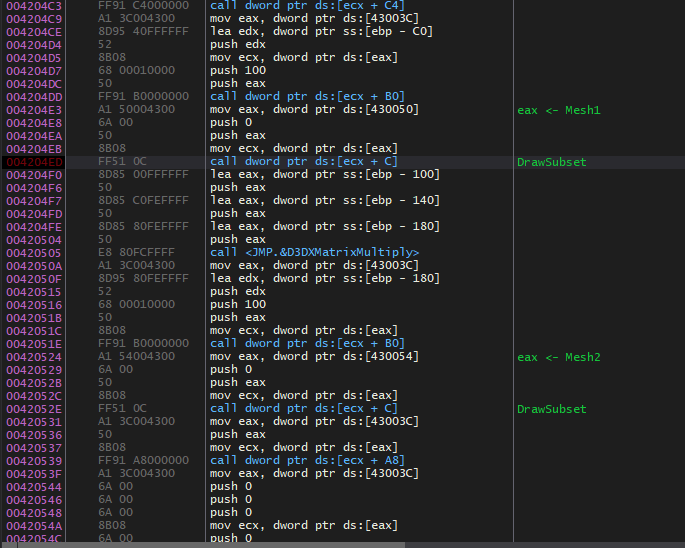

# 5 - demo

Note: this writeup is definitely not an efficient way of solving the challenge. I realized after the fact I could have used tools to automatically extract meshes from running DirectX applications, and save myself a lot of trouble. I just didn't think of it at the time. 

**Time spent:** Way too long

**Tools used:** Ghidra, x64dbg, paracetamol and other medicine to cure my headaches that I got from this challenge

Demo is the fifth in the series of Flare-on 2019, and caused me way too much trouble for what it really was. The zip comes with an executable file 4k.exe displaying a spinning 3D model of the FLARE logo, and a note which states amongst other things:

```
... It seems blank. See if you can figure it out ...
```

There is no feedback on keystrokes or mouse clicks or anything. Just a spinning logo:



Embarrasing note: It took me way too long to realize that "It seems blank" might mean there is something hidden in the graphics that are displayed. Big oopsie by me.

First, the ugly
---------------

Opening the binary in CFF explorer (or just a hex editor) reveals that something weird is going on. The PE headers are all over the place and don't add up at all. Opening it up in Ghidra reveals that the entrypoint seems to be doing a bunch of stuff writing a whole bunch of data to address 420000 in memory.

```c

void __fastcall entry(undefined4 uParm1,uint uParm2)
{
    puVar12 = (uint *)&DAT_00400144;
    uVar4 = 1;
    uVar6 = 0;
    uVar9 = 2;
    uVar10 = 0;
    pbVar13 = &DAT_00420000;

    // Do a lot of weird and mathemagical stuff using puVar12 and pbVar13...
}
```

Seems like some kind of decompression method I have not seen before myself. Either way, not really important, let's just let the program do the unpacking job for us: Run the program and then dump the memory page using x64dbg.

We can now open the new binary in Ghidra (open as raw, not as PE), and let it analyse and detect all functions again. This takes longer than normal PEs, as there is no information or metadata that helps Ghidra out. 

After it has done so, we see a couple of functions that it auto-detected. Luckily for us, quickly browsing through them reveals that FUN_00020172 up to FUN_0002019c are just wrappers around dynamically resolved functions.



This is one of them:

```c
void FUN_00020172(void)
{
  (*_DAT_0043001c)();
  return;
}
```

Looking up those addresses in x64dbg reveals the actual names of the functions:



I went to the painful process of manually adjusting each of these function signatures, by following each address using x64dbg, finding the appropriate msdn page, and copy pasting the function definition into Ghidra. Why you might ask? Not sure. I guess it makes the code is a bit more readable.

After renaming most of the custom IAT, and looking at the remaining functions, you'll end up with something like the following:



Initialize (FUN_000201ff), CreateMesh (FUN_000202a8) and DrawScene (FUN_0002038a) are not in the IAT, but I called them this way based on what kind of functions they were calling.

Now onto business!
------------------

Note: The following decompiled source snippets contain renamed symbols and added comments for clarity. These do not appear this way when opening the file for the first time.

Looking at Initialize, we see one 3D model spinning in the application, yet the Initialize method calls the CreateMesh twice. Odd!

```c

void Initialize(void)
{
  Mesh1 = CreateMesh((uint *)&MESH1_FACES,0x1e,(uint *)&MESH1_VERTICES,0x38,0xe816f5ec,0x68a0d4d3,
                     0x4993f8c4);
  Mesh2 = CreateMesh((uint *)&MESH2_FACES,0x128,(uint *)&MESH2_VERTICES,0x10a,(uint)&DAT_0cb343c8,
                     0x867b81f0,0x84af72c3);
                    /* SetRenderState( lighting ) */
  (*(code *)DIRECTX9OBJECT->vtable[0x39])(DIRECTX9OBJECT,0x89,1);
                    /* D3DRS_AMBIENT                      */
  (*(code *)DIRECTX9OBJECT->vtable[0x39])(DIRECTX9OBJECT,0x8b,0xff323232);
                    /* cullmode */
  (*(code *)DIRECTX9OBJECT->vtable[0x39])(DIRECTX9OBJECT,0x16,1);
                    /* D3DRS_ZENABLE                      */
  (*(code *)DIRECTX9OBJECT->vtable[0x39])(DIRECTX9OBJECT,7,1);
  return;
}
```

Furthermore, the DrawScene method seems to draw and update the rotation of both meshes, yet we only see one:

```c

void DrawScene(void)

{
  undefined local_184 [64];
  undefined rotatedMatrix2 [64];
  undefined matrix1 [64];
  undefined rotatedMatrix1 [64];
  undefined perspectiveMatrix [64];
  undefined lookAtMatrix [64];
  
                    /* clear */
  (*(code *)DIRECTX9OBJECT->vtable[0x2b])(DIRECTX9OBJECT,0,0,7,0,0x3f800000,0);
                    /* begin */
  (*(code *)DIRECTX9OBJECT->vtable[0x29])(DIRECTX9OBJECT);
                    /* SetFVF */
  (*(code *)DIRECTX9OBJECT->vtable[0x59])(DIRECTX9OBJECT,0x12);
  D3DXMatrixLookAtLH(lookAtMatrix,&DAT_00420604,&DAT_00430058,&DAT_00421ce4);
                    /* SetTransform */
  (*(code *)DIRECTX9OBJECT->vtable[0x2c])(DIRECTX9OBJECT,2,lookAtMatrix);
  D3DXMatrixPerspectiveFovLH(perspectiveMatrix,0x3f490fdb,0x3faaaaab,0x3f800000,0x43960000);
                    /* SetTransform */
  (*(code *)DIRECTX9OBJECT->vtable[0x2c])(DIRECTX9OBJECT,3,perspectiveMatrix);
  D3DXMatrixTranslation(matrix1,0,0,0x43160000);
  MESH1_ANGLE = MESH1_ANGLE + _MESH1_ROTATION_SPEED;
  D3DXMatrixRotationY(rotatedMatrix1,MESH1_ANGLE);
  MESH2_ANGLE = MESH2_ANGLE + _MESH2_ROTATION_SPEED;
  D3DXMatrixRotationY(rotatedMatrix2,MESH2_ANGLE);
                    /* SetMaterial */
  (*(code *)DIRECTX9OBJECT->vtable[0x31])(DIRECTX9OBJECT,&MESH_MATERIAL);
                    /* SetTransform */
  (*(code *)DIRECTX9OBJECT->vtable[0x2c])(DIRECTX9OBJECT,0x100,rotatedMatrix1);
                    /* DrawSubset */
  (**(code **)(*Mesh1 + 0xc))(Mesh1,0);
  D3DXMatrixMultiply(local_184,rotatedMatrix2,matrix1);
                    /* SetTransform */
  (*(code *)DIRECTX9OBJECT->vtable[0x2c])(DIRECTX9OBJECT,0x100,local_184);
                    /* DrawSubset */
  (**(code **)(*Mesh2 + 0xc))(Mesh2,0);
                    /* endscene */
  (*(code *)DIRECTX9OBJECT->vtable[0x2a])(DIRECTX9OBJECT);
                    /* present */
  (*(code *)DIRECTX9OBJECT->vtable[0x11])(DIRECTX9OBJECT,0,0,0,0);
  return;
}
```

It seems that one of the meshes is invisible, yet the other one is displayed properly. It doesn't really matter how it happened, we just know that it happened. Let's switch back to x64dbg, and go to the address of this method.



From this code, we can see that DrawSubset is called with the mesh located at address 430050 (loaded at address 4204E3) and 430054 (loaded at address 420524). If we replace the first mov instruction with the second one, we get to see our second mesh spinning around, revealing the flag:

