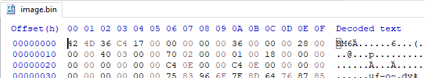
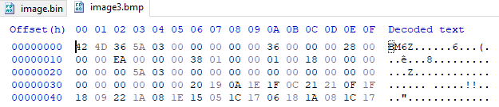

# 6 - BMP Hide

**Time spent:** 1.5 hours

**Tools used:** dnSpy, some C# coding

The next challenge is again a .NET binary. This should be easy right? Not for the untrained eye this time around! Some pretty cool anti reversing techniques are happening here that some .NET obfuscators like to use to set reverse engineers off on the wrong foot.

The zip archive comes with an `image.bmp`, together with a note stating that we probably cannot really trust the photo. Along with it is an executable called `bmphide.exe`. This basically screams a steganography challenge.

## Orientation

Opening up the `bmphide.exe` in dnSpy, we see that the main method takes three commandline arguments, all of which seem to be file paths:

```csharp
// BMPHIDE.Program
// Token: 0x06000018 RID: 24 RVA: 0x00002C18 File Offset: 0x00002C18
private static void Main(string[] args)
{
	Program.Init();
	Program.yy += 18;
	string filename = args[2];
	string fullPath = Path.GetFullPath(args[0]);
	string fullPath2 = Path.GetFullPath(args[1]);
	byte[] data = File.ReadAllBytes(fullPath2);
	Bitmap bitmap = new Bitmap(fullPath);
	byte[] data2 = Program.h(data);
	Program.i(bitmap, data2);
	bitmap.Save(filename);
}
```

The first argument is loaded as a `Bitmap` and the second as a byte array. Then it does some magic in `Program.h` and `Program.i` using both the data and the bitmap, and then saves a new bitmap to the third file path.

This already pretty much confirms that our suspicion is probably right: `bmphide.exe` is probably a steganography tool to hide data in images, and was probably executed using the following commandline to produce the image that we were given:

```
bmphide.exe original.bmp secretmessage.txt image.bmp
```

Unfortunately, `bmphide.exe` does not implement a reverse for the process, so we need to create one. To do that, we first need to know how `bmphide.exe` stores the secret information in the image. Let's try to recreate the program. 

A lot of work already has been done by dnSpy's decompiler. We can just copy-paste the code from the `Program` class to reimplement the code. Right? 

## The funky business

Wrong! If we try to debug the application using dnSpy, we notice it immediately throws a StackOverflow exception in the `Program.Init` method, that does not occur when we run the program without the debugger. What kind of weird initialization procedure does a simple steganography program really need? Let's have a look:

```csharp
// Token: 0x0600000D RID: 13 RVA: 0x00002568 File Offset: 0x00002568
private static void Init()
{
    Program.yy *= 136;
    Type typeFromHandle = typeof(A);
    Program.ww += "14";
    MethodInfo[] methods = typeFromHandle.GetMethods(BindingFlags.DeclaredOnly | BindingFlags.Instance | BindingFlags.Static | BindingFlags.Public | BindingFlags.NonPublic);
    foreach (MethodInfo methodInfo in methods)
    {
        RuntimeHelpers.PrepareMethod(methodInfo.MethodHandle);
    }
    A.CalculateStack();
    
    // Some code that determines m, m2, m3 and m4.

    A.VerifySignature(m, m2);
    A.VerifySignature(m3, m4);
}
```

This already looks suspicous. For some reason we are pre-JIT'ing from the type `A`, then call `A.CalculateStack()`, and then finally call `VerifySignature` twice. Let's first look at `CalculateStack`:

```csharp
// Token: 0x06000004 RID: 4 RVA: 0x000020E8 File Offset: 0x000020E8
public static void CalculateStack()
{
    Module module = typeof(A).Module;
    ModuleHandle moduleHandle = module.ModuleHandle;
    A.ver4 = (Environment.Version.Major == 4);
    bool flag = A.ver4;
    if (flag)
    {
        A.ver5 = (Environment.Version.Revision > 17020);
    }
    A.IdentifyLocals();
}
```

We see it verifies the version of the .NET runtime and calls `A.IdentifyLocals()`. Let's follow the trail:

```csharp
private unsafe static void IdentifyLocals()
{
    ulong* ptr = stackalloc ulong[(UIntPtr)16];
    bool flag = A.ver4;
    if (flag)
    {
        *ptr = 7218835248827755619UL;
        ptr[1] = 27756UL;
    }
    else
    {
        *ptr = 8388352820681864045UL;
        ptr[1] = 1819042862UL;
    }
    IntPtr lib = A.LoadLibrary(new string((sbyte*)ptr));
    *ptr = 127995569530215UL;
    A.getJit getJit = (A.getJit)Marshal.GetDelegateForFunctionPointer(A.GetProcAddress(lib, new string((sbyte*)ptr)), typeof(A.getJit));
    IntPtr intPtr = *getJit();
    
    // ...

    A.VirtualProtect(intPtr, (uint)IntPtr.Size, 64u, out flNewProtect);
    Marshal.WriteIntPtr(intPtr, Marshal.GetFunctionPointerForDelegate<A.locateNativeCallingConvention>(A.handler));
    A.VirtualProtect(intPtr, (uint)IntPtr.Size, flNewProtect, out flNewProtect);
}
```

`IdentifyLocals` checks this version that was determined, initializes some random pointers, and dynamically resolves an external native procedure using `LoadLibrary` and `GetProcAddress` based on these pointers. Converting the values stored in these pointers to bytes in a Python shell reveals some interesting names:

```python
>>> struct.pack("Q", 7218835248827755619)   
b'clrjit.d'
>>> struct.pack("Q", 27756)               
b'll\x00\x00\x00\x00\x00\x00'
>>> struct.pack("Q", 8388352820681864045)
b'mscorjit'
>>> struct.pack("Q", 1819042862)          
b'.dll\x00\x00\x00\x00'
>>> struct.pack("Q", 127995569530215)     
b'getJit\x00\x00'
```

We also see further down that the address of `A.handler` is written to the result of `getJit`. For the trained eye this is a no-brainer to what is happening here, but for the ones that don't know what is going on, let me explain: 

## Crash course JIT hooks

Let us have a look at the definition of `getJit` by looking at how this function is defined in [CoreCLR](
https://github.com/dotnet/coreclr/blob/c51aa9006c035ccdf8aab2e9a363637e8c6e31da/src/inc/corjit.h#L382
)):

```c++
extern "C" ICorJitCompiler* __stdcall getJit();
```

It returns a pointer to an instance of `ICorJitCompiler` which is defined as following:

```c++
class ICorJitCompiler
{
public:
    // compileMethod is the main routine to ask the JIT Compiler to create native code for a method. 
    // ...
    virtual CorJitResult __stdcall compileMethod (/* ... */) = 0;

    // ...

    virtual void clearCache() = 0;    
    virtual BOOL isCacheCleanupRequired() = 0;
    
    // more virtual methods here...
};
```

C++ is an object oriented language. This means that in particular it supports polymorphism; classes can define virtual methods that can be overridden by sub classes. `ICorJitCompiler` is such a class, and `compileMethod` is one of those virtual methods. This method is called for every method defined in our C# application when it gets executed for the first time.

To keep things short, the way it is implemented under the hood, is by using what is known as a **virtual table** or **vtable** for short. Essentially, it is an array that is prepended to the struct, containing all addresses to the method. The first 3 entries for `ICorJitCompiler` would therefore look like this:

```
+-------------------------+
| &compileMethod          |
| &clearCache             |
| &isCacheCleanupRequired |
|           :             |
+-------------------------+
```

Now, our C# code writes the address of `A.handler` to the start of the object returned by `getJit`. Since we just learnt that objects start with a `vtable`, it means that the C# progrma is overwriting the value at the first slot of the `vtable`, namely `compileMethod`, and replacing it with their own version of it:

```
+-------------------------+
| &A.handler              | <---- We write here
| &clearCache             |
| &isCacheCleanupRequired |
|           :             |
+-------------------------+
```

This effectively redirects the `compileMethod` to `A.handler`. A lot of obfuscators like to hack into the JIT compiler to alter the code at runtime. `bmphide.exe` is no exception. Our `A.handler` points to the `IncrementMaxStack` method, which indeed does some funky business with the `ILCode` of certain methods, before it calls the original `compileMethod`:

```csharp
// BMPHIDE.A
// Token: 0x0600000A RID: 10 RVA: 0x000023B8 File Offset: 0x000023B8
private unsafe static uint IncrementMaxStack(IntPtr self, A.ICorJitInfo* comp, A.CORINFO_METHOD_INFO* info, uint flags, byte** nativeEntry, uint* nativeSizeOfCode)
{
	bool flag = info != null;
	if (flag)
	{
		MethodBase methodBase = A.c(info->ftn);
		bool flag2 = methodBase != null;
		if (flag2)
		{
			bool flag3 = methodBase.MetadataToken == 100663317;
			if (flag3)
			{
				uint flNewProtect;
				A.VirtualProtect((IntPtr)((void*)info->ILCode), info->ILCodeSize, 4u, out flNewProtect);
				Marshal.WriteByte((IntPtr)((void*)info->ILCode), 23, 20);
				Marshal.WriteByte((IntPtr)((void*)info->ILCode), 62, 20);
				A.VirtualProtect((IntPtr)((void*)info->ILCode), info->ILCodeSize, flNewProtect, out flNewProtect);
			}
			else
			{
				bool flag4 = methodBase.MetadataToken == 100663316;
				if (flag4)
				{
					uint flNewProtect2;
					A.VirtualProtect((IntPtr)((void*)info->ILCode), info->ILCodeSize, 4u, out flNewProtect2);
					Marshal.WriteInt32((IntPtr)((void*)info->ILCode), 6, 309030853);
					Marshal.WriteInt32((IntPtr)((void*)info->ILCode), 18, 209897853);
					A.VirtualProtect((IntPtr)((void*)info->ILCode), info->ILCodeSize, flNewProtect2, out flNewProtect2);
				}
			}
		}
	}

	return A.originalDelegate(self, comp, info, flags, nativeEntry, nativeSizeOfCode);
}
```

We notice that the callback changes the code at offset and changesr 6 and 18 for method `Program.g`, and at offset 23 and 62 for method `Program.h`. Let's apply the same patches but on disk, and remove the call to `CalculateStack`. We now notice that in `Program.h`, the calls to `Program.f` are replaced by calls to `Program.g`, and that `Program.g` has some different hardcoded constants now! 

```csharp
// BMPHIDE.Program
// Token: 0x06000014 RID: 20 RVA: 0x00002D64 File Offset: 0x00000F64
public static byte g(int idx)
{
	byte b = (byte)((long)(idx + 1) * (long)((ulong)309030853));
	byte k = (byte)((idx + 2) * 209897853);
	return Program.e(b, k);
}

// BMPHIDE.Program
// Token: 0x06000015 RID: 21 RVA: 0x00002D98 File Offset: 0x00000F98
public static byte[] h(byte[] data)
{
	byte[] array = new byte[data.Length];
	int num = 0;
	for (int i = 0; i < data.Length; i++)
	{
		int num2 = (int)Program.g(num++);
		int num3 = (int)data[i];
		num3 = (int)Program.e((byte)num3, (byte)num2);
		num3 = (int)Program.a((byte)num3, 7);
		int num4 = (int)Program.g(num++);
		num3 = (int)Program.e((byte)num3, (byte)num4);
		num3 = (int)Program.c((byte)num3, 3);
		array[i] = (byte)num3;
	}
	return array;
}
```

The program now also runs again in dnSpy. So that makes things a lot easier.

## But there is more!

At this point I set a breakpoint on `Program.h` in dnSpy and stepped through the code to see what was going on. Then I noticed something is still not completely right here. The call to `Program.a` does not transfer control to `Program.a` but to `Program.b`, and `Program.c` transfers control to `Program.d`? What have we missed?

Remember that we went down the rabbit hole of `CalculateStack`, but we still have `VerifySignature` left to analyse: 

```csharp
public unsafe static void VerifySignature(MethodInfo m1, MethodInfo m2)
{
	RuntimeHelpers.PrepareMethod(m1.MethodHandle);
	RuntimeHelpers.PrepareMethod(m2.MethodHandle);
	int* ptr = (int*)((byte*)m1.MethodHandle.Value.ToPointer() + (IntPtr)2 * 4);
	int* ptr2 = (int*)((byte*)m2.MethodHandle.Value.ToPointer() + (IntPtr)2 * 4);
	*ptr = *ptr2;
}
```

This looks like some crazy internal .NET structure manipulation, that I don't know about. Setting a breakpoint on it however reveals that the two calls in `Program.Init` pass on the methods `Program.a` and `Program.b` for the first call, and `Program.c` and `Program.d` for the second call. What a coincidence :). Apparently, it seems `VerifySignature` does some magic that replaces one method handle with the other, and to be honest I am not sure how it works, but what is important is that does the job. The actual code of `Program.h` is therefore:

```csharp
public static byte[] h(byte[] data)
{
	byte[] array = new byte[data.Length];
	int num = 0;
	for (int i = 0; i < data.Length; i++)
	{
		int num2 = (int)Program.g(num++);
		int num3 = (int)data[i];
		num3 = (int)Program.e((byte)num3, (byte)num2);
		num3 = (int)Program.b((byte)num3, 7);
		int num4 = (int)Program.g(num++);
		num3 = (int)Program.e((byte)num3, (byte)num4);
		num3 = (int)Program.d((byte)num3, 3);
		array[i] = (byte)num3;
	}
	return array;
}
```

## Reversing the logic

We now have reversed enough to actually start reversing the code that was responsible for hiding the data in our image. Looking back at `Program.Main`, we see that we first call `Program.h` on our secret data. 

A quick look at `Program.b` and `Program.d` reveals that they are the inverse of each other(one does a division, one a multiplication on the provided arguments). Furthermore, `Program.g` calls `Program.e`, which looks scary at first, but closely analysing it reveals it really just implements a binary XOR:

```csharp
public static byte b(byte b, int r)
{
    for (int i = 0; i < r; i++)
    {
        byte b2 = (byte) ((b & 128) / 128);
        b = (byte) ((b * 2 & byte.MaxValue) + b2);
    }
    return b;
}

public static byte d(byte b, int r)
{
    for (int i = 0; i < r; i++)
    {
        byte b2 = (byte) ((b & 1) * 128);
        b = (byte) ((b / 2 & byte.MaxValue) + b2);
    }
    return b;
}

public static byte e(byte b, byte k)
{
    for (int i = 0; i < 8; i++)
    {
        bool flag = (b >> i & 1) == (k >> i & 1);
        if (flag)
        {
            b = (byte)((int)b & ~(1 << i) & 255);
        }
        else
        {
            b = (byte)((int)b | (1 << i & 255));
        }
    }
    return b;
}
```

This means that all operations in `Program.h` can be reversed, which means we can come up with an inverse of `Program.h`:

```csharp
public static byte[] DecryptData(byte[] data)
{
    byte[] result = new byte[data.Length];

    int num = 0;
    for (int i = 0; i < data.Length; i++)
    {
        byte num2 = g(num++);
        byte num4 = g(num++);

        byte num3 = b(data[i], 3);
        num3 = e(num3, num4);
        num3 = d(num3, 7);
        num3 = e(num3, num2);

        result[i] = num3;
    }

    return result;
}
```

Now let's have a look at how the data is actually stored in the image using `Program.i`. If we look at `Program.i`, we see that pretty much every integer in there is replaced with a call to `Program.j`. Deobfuscating is fairly easy, just call all `Program.j` instances using e.g. dnSpy's Watches window.

```csharp
public static void i(Bitmap bm, byte[] data)
{
    int num = 0;
    for (int i = 0; i < bm.Width; i++)
    {
        for (int j = 0; j < bm.Height; j++)
        {
            bool flag = num > data.Length - 1;
            if (flag)
            {
                break;
            }
            Color pixel = bm.GetPixel(i, j);
            int red = ((int)pixel.R & 248) | ((int)data[num] & 7);
            int green = ((int)pixel.G & 248) | (data[num] >> 3 & 7);
            int blue = ((int)pixel.B & 252) | (data[num] >> 6 & 3);
            Color color = Color.FromArgb(0, red, green, blue);
            bm.SetPixel(i, j, color);
            num += 1;
        }
    }
}
```

We can see that inside the loop, we alter for each pixel the red, green and blue channel slightly. Since these are just simple binary operations again, we can also reverse this function as well to extract the data:

```csharp
public static byte[] ExtractHiddenData(Bitmap bm)
{
    var data = new List<byte>();
    for (int i = 0; i < bm.Width; i++)
    {
        for (int j = 0; j < bm.Height; j++)
        {
            var pixel = bm.GetPixel(i, j);
            byte b = (byte) ((pixel.R & 7) | ((pixel.G & 7) << 3) | ((pixel.B & 7) << 6));
            data.Add(b);
        }
    }

    return data.ToArray();
}
```

Add a little main function:
```csharp
private static void Main(string[] args)
{
    string fullPath = Path.GetFullPath(args[0]);
    var image = new Bitmap(fullPath);
    var encryptedData = ExtractHiddenData(image);
    var decryptedData = DecryptData(encryptedData);

    File.WriteAllBytes(Path.ChangeExtension(fullPath, ".bin"), decryptedData);
}
```

And we can start decrypting!

## Decryption

Running our program with the provided image.bmp:

```
FlareOn6BmpHide.exe image.bmp
```

Gives us:



Another image?! Let's open it:


Let's try our tool again, but this time on the new image:



Yep another image:


But this time it contains the flag.