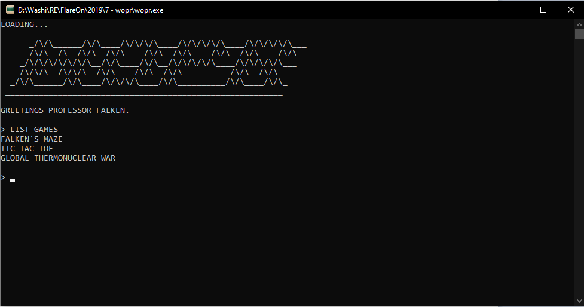

# 7 - wopr

**Time spent:** 3-4 hours 

**Tools used:** x64dbg, ghidra, pyinstxtractor, HxD, Python with Z3

Challenge 7 was called wopr, and came with another executable that opens a terminal with a list of games to play.



The only game that is playable, however, is the one titled "GLOBAL THERMONUCLEAR WAR". It then proceeds asking which city you want to get bombed, and then prompts you for the launch code.


Obviously I don't know the launch code, let's find out what it is!

## Orientation

Opening the file in ghidra, and inspecting the strings reveals the following:


This seems to be an executable with some embedded Python code in here. I never worked with that before, so this is going to be interesting. 

One of the strings that is interesting to me as well is `"_MEIPASS2"`. A quick Google search reveals that this binary is probably an executable produced by "PyInstaller". Another quick Google search reveals that there is a tool called [pyinstxtractor](https://github.com/countercept/python-exe-unpacker/blob/master/pyinstxtractor.py) that extracts the compiled Python code from these files:

```
python pyinstxtractor.py wopr.exe
```

This produces a new directory `wopr.exe_extracted` containing all the files it needs to run the embedded Python program:


All the files? I did't see a `main` file or anything that looks like one as many tutorials that I could find on the internet.

At this point I started wasting a lot of time on opening all kinds of `*.pyd` files, until I realized that the cleanup file was substantially bigger than any of the other bootstrapper files:


Then I revisited the output of `pyinstxtractor`, and realized my mistake:

```
[*] Processing .\wopr.exe
[*] Pyinstaller version: 2.1+
[*] Python version: 37
[*] Length of package: 5068358 bytes
[*] Found 64 files in CArchive
[*] Beginning extraction...please standby
[+] Possible entry point: pyiboot01_bootstrap
[+] Possible entry point: pyiboot02_cleanup
[*] Found 135 files in PYZ archive
[*] Successfully extracted pyinstaller archive: .\wopr.exe
```

It literally stated the "cleanup" file is potentially an entrypoint. Oopsie by me! 

Since these files were binary files, and not normal Python scripts, I searched Google again if there was anything like a disassembler or even a Python bytecode decompiler. Turns out, there is one called `uncompyle`, but for some reason I couldn't get it to work on this file (even after changing the header as many tutorials state). So instead, I went the hard way and wrote a little disassembler script based off another script I found on the internet:

```python
import dis
import  marshal, struct, sys, time, types

def show_file(fname):
    f = open(fname, "rb")
    magic = f.read(4)
    moddate = f.read(4)
    modtime = time.asctime(time.localtime(struct.unpack('L', moddate)[0]))
    code = marshal.load(f)
    show_code(code)
    
def show_code(code, indent=''):
    indent += '   '
    print(indent, "name", indent, code.co_name)
    print(indent, "argcount:", code.co_argcount)
    print(indent, "snlocals:", code.co_nlocals)
    print(indent, "sstacksize:", code.co_stacksize)
    print(indent, "sflags:", code.co_flags)
    dis.disassemble(code)
    print(indent,"sconsts")
    for const in code.co_consts:
        if type(const) == types.CodeType:
            show_code(const, indent+'   ')
    print(indent, "names", indent, code.co_names)
    print(indent, "varnames", indent, code.co_varnames)
    print(indent, "freevars", indent, code.co_freevars)
    print(indent, "cellvars", indent, code.co_cellvars)
    print(indent, "filename", indent, code.co_filename)
    
def show_hex(label, h, indent):
    h = h.hex()
    if len(h) < 60:
        print(indent, label, h)
    else:
        print(indent, label)
        for i in range(0, len(h), 60):
            print(indent, "   ", h[i:i+60])

show_file(sys.argv[1])
```

This produced a file that starts off with a huge documentation string. Here is a small excerpt of it:

```
\nOnce upon a midnight dreary, while I pondered, weak and weary,\t\t \t\t\t  \t\t    \t \t  \t\t\t      \t\t\t\t \t\t\t\t\t\t \t\t   \t  \t\t\t \t\t   \t\t\t\t \t\t\t \t\t\t\t\t \t \t  \t \t\t \t\t \t    \t\t\t   \t\t \t    \t \t  \t\t \t      \t \t\t   \t\t \t      \t \t\t\t\t \t\t\t  \t \t  \t\t   \t\t \t \t  \t\t \t\t \t\t   \t \t \t\t\t  \t \t \t\t   \t\t\t\t    \t \t    \t\t\t
```

I then went on and started working on the painful process of decompiling the bytecode **manually** (yes I am stupid). My decompiled version of the script with some slight modifications were as follows. The names of each variable that the FLARE-ON team came up with were quite creative I must say:

```python
BOUNCE = open("\\this\\key", "rb")
BINARY = # huge doc string....

def ho(h, g):
    k = bytes.fromhex(format(h, 'x')).decode()
    return g.get(k, k)


def eye(face):
    # Maps tabls and spaces to zeroes and ones...


def fire(wood, bounce):
    # Implements RC4 encryption algorithm...


if __name__ == '__main__':

    a = 1702389091
    b = 482955849332

    g = ho(29516388843672123817340395359, globals())
    aa = exec
    bb = print

    a = a ^ b
    b = b ^ a
    a = a ^ b

    for i in range(256):
        try:
            script = lzma.decompress(fire(eye(BINARY.encode()), bytes([i]) + BOUNCE))
            exec(script)
        except:
            pass

```

We see that the main function uses the humongous documentation string as input for a decryption + decompression function. The `fire` and `eye` functions interpret the tabs and spaces in the docs string as zeroes and ones for a binary stream,. If it succeeds for a particular integer, it executes the new script. Therefore, to obtain I slightly modified the script to output it to a file instead of executing it directly so we can analyse it better!

The resulting script is actually responsible for running the game, including all the slick ASCII art ;). The main interesting part, however, is the following code that does the verification of the launch codes:

```python
xor = [212, 162, 242, 218, 101, 109, 50, 31, 125, 112, 249, 83, 55, 187, 131, 206]
h = list(wrong())
h = [h[i] ^ xor[i] for i in range(16)]

# ...

target = input()

t.typewriteln("\nPREPARING NUCLEAR STRIKE FOR " + target.upper())
t.typewrite("ENTER LAUNCH CODE: ")
launch_code = input().encode()

# encoding map coordinates
x = list(launch_code.ljust(16, b'\0'))
b = 16 * [None]

# calculate missile trajectory
b[0] = x[2] ^ x[3] ^ x[4] ^ x[8] ^ x[11] ^ x[14]
b[1] = x[0] ^ x[1] ^ x[8] ^ x[11] ^ x[13] ^ x[14]
b[2] = x[0] ^ x[1] ^ x[2] ^ x[4] ^ x[5] ^ x[8] ^ x[9] ^ x[10] ^ x[13] ^ x[14] ^ x[15]
b[3] = x[5] ^ x[6] ^ x[8] ^ x[9] ^ x[10] ^ x[12] ^ x[15]
b[4] = x[1] ^ x[6] ^ x[7] ^ x[8] ^ x[12] ^ x[13] ^ x[14] ^ x[15]
b[5] = x[0] ^ x[4] ^ x[7] ^ x[8] ^ x[9] ^ x[10] ^ x[12] ^ x[13] ^ x[14] ^ x[15]
b[6] = x[1] ^ x[3] ^ x[7] ^ x[9] ^ x[10] ^ x[11] ^ x[12] ^ x[13] ^ x[15]
b[7] = x[0] ^ x[1] ^ x[2] ^ x[3] ^ x[4] ^ x[8] ^ x[10] ^ x[11] ^ x[14]
b[8] = x[1] ^ x[2] ^ x[3] ^ x[5] ^ x[9] ^ x[10] ^ x[11] ^ x[12]
b[9] = x[6] ^ x[7] ^ x[8] ^ x[10] ^ x[11] ^ x[12] ^ x[15]
b[10] = x[0] ^ x[3] ^ x[4] ^ x[7] ^ x[8] ^ x[10] ^ x[11] ^ x[12] ^ x[13] ^ x[14] ^ x[15]
b[11] = x[0] ^ x[2] ^ x[4] ^ x[6] ^ x[13]
b[12] = x[0] ^ x[3] ^ x[6] ^ x[7] ^ x[10] ^ x[12] ^ x[15]
b[13] = x[2] ^ x[3] ^ x[4] ^ x[5] ^ x[6] ^ x[7] ^ x[11] ^ x[12] ^ x[13] ^ x[14]
b[14] = x[1] ^ x[2] ^ x[3] ^ x[5] ^ x[7] ^ x[11] ^ x[13] ^ x[14] ^ x[15]
b[15] = x[1] ^ x[3] ^ x[5] ^ x[9] ^ x[10] ^ x[11] ^ x[13] ^ x[15]

if b == h:
    # ...
    eye = [219, 232, 81, 150, 126, 54, 116, 129, 3, 61, 204, 119, 252, 122, 3, 209, 196, 15, 148, 173, 206, 246, 242, 200, 201, 167, 2, 102, 59, 122, 81, 6, 24, 23]
    flag = fire(eye, launch_code).decode()
    t.typewrite(f"CONGRATULATIONS! YOU FOUND THE FLAG:\n\n{flag}\n")
else:
    t.typewrite("\nIDENTIFICATION NOT RECOGNIZED BY SYSTEM\n--CONNECTION TERMINATED--\n")
```

We can see that the input launch code is being fed through a huge system of linear equations with 16 variables, and then compared with a hardcoded launch code that is being decrypted upon runtime. If this equation is satisfied, the original launch code is used as a decryption key of the flag.

To solve this equation, we first need to know the final answer, that is the value of `h`. To do that, we need to know what `wrong()` does:

```python
def wrong():
    trust = windll.kernel32.GetModuleHandleW(None)
    
    computer = string_at(trust, 1024)
    dirty, = struct.unpack_from('=I', computer, 60)

    _, _, organize, _, _, _, variety, _ =  struct.unpack_from('=IHHIIIHH', computer, dirty)
    assert variety >= 144

    participate, = struct.unpack_from('=I', computer, dirty + 40)
    for insurance in range(organize):
        name, tropical, inhabitant, reader, chalk, _, _, _, _, _ = struct.unpack_from('=8sIIIIIIHHI', computer, 40 * insurance + dirty + variety + 24)
        if inhabitant <= participate < inhabitant + tropical:
            break
        
    spare = bytearray(string_at(trust + inhabitant, tropical))

    # ... 

    return hashlib.md5(spare).digest()
```

Yikes! It seems to be using data from the original executable, by calling the native procedure `GetModuleHandleW` and then traversing the PE file structures. Time to analyse and rewrite the code so it works on files stored on disk instead:

```python
def wrong():
    original_pe = open("wopr.exe", "rb").read()
    mz_header = original_pe[0:1024]
    e_lfanew, = struct.unpack_from('=I', mz_header, 60)

    # Find number of sections.
    _, _, nr_of_sections, _, _, _, sizeof_optional_header, _ =  struct.unpack_from('=IHHIIIHH', mz_header, e_lfanew)
    assert sizeof_optional_header >= 144

    # Find section containing entrypoint.
    address_of_entrypoint, = struct.unpack_from('=I', mz_header, e_lfanew + 40)
    for insurance in range(nr_of_sections):
        name, virtual_size, virtual_address, raw_size, raw_address, _, _, _, _, _ = struct.unpack_from('=8sIIIIIIHHI', mz_header, 40 * insurance + e_lfanew + sizeof_optional_header + 24)
        if virtual_address <= address_of_entrypoint < virtual_address + virtual_size:
            break
        
    text_section = bytearray(original_pe[raw_address:(raw_address + raw_size)])

    # Obtain relocation dir.
    reloc_rva, reloc_size = struct.unpack_from('=II', mz_header, e_lfanew + 0xa0)
    reloc_dir = original_pe[0x00049A00:(0x00049A00+0x00001800)]

    # Apply relocations.
    i = 0
    while i <= len(reloc_dir) - 8:
        rva, size_of_block = struct.unpack_from('=II', reloc_dir, i)

        if rva == 0 and size_of_block == 0:
            break

        slot = reloc_dir[i + 8:i + size_of_block]

        for i in range(len(slot) >> 1):
            item, = struct.unpack_from('=H', slot, 2 * i)
            fabricate = item >> 12
            if fabricate != 3: continue
            item = item & 4095
            ready = rva + item - virtual_address
            if 0 <= ready < len(text_section):
                v = struct.unpack_from('=I', text_section, ready)[0] - 0x00400000
                struct.pack_into('=I', text_section, ready, v)

        i += size_of_block

    # Hash the text section and return.
    return hashlib.md5(text_section).digest()
```

If we run the script now, we obtain that the result is:
```python
[0xa7, 0xbf, 0xd2, 0x9e, 0x0f, 0x01, 0x6b, 0x53, 0x68, 0x37, 0xb7, 0x60, 0x7c, 0xba, 0xb4, 0xa8]
```

Onto the system of equations. For this I used Z3 to solve it quickly for me:

```python
h = [0xa7, 0xbf, 0xd2, 0x9e, 0x0f, 0x01, 0x6b, 0x53, 0x68, 0x37, 0xb7, 0x60, 0x7c, 0xba, 0xb4, 0xa8] # Originally a call to wrong()
xor = [212, 162, 242, 218, 101, 109, 50, 31, 125, 112, 249, 83, 55, 187, 131, 206]
h = [h[i] ^ xor[i] for i in range(16)]

# Define variables and constants.
b = [BitVecVal(h[i], 32) for i in range(16)]
x = [BitVec('x' + str(i), 32) for i in range(16)]

s = Solver()

# Add constriants:
s.add(b[0]  == x[2] ^ x[3] ^ x[4] ^ x[8] ^ x[11] ^ x[14])
s.add(b[1]  == x[0] ^ x[1] ^ x[8] ^ x[11] ^ x[13] ^ x[14])
s.add(b[2]  == x[0] ^ x[1] ^ x[2] ^ x[4] ^ x[5] ^ x[8] ^ x[9] ^ x[10] ^ x[13] ^ x[14] ^ x[15])
s.add(b[3]  == x[5] ^ x[6] ^ x[8] ^ x[9] ^ x[10] ^ x[12] ^ x[15])
s.add(b[4]  == x[1] ^ x[6] ^ x[7] ^ x[8] ^ x[12] ^ x[13] ^ x[14] ^ x[15])
s.add(b[5]  == x[0] ^ x[4] ^ x[7] ^ x[8] ^ x[9] ^ x[10] ^ x[12] ^ x[13] ^ x[14] ^ x[15])
s.add(b[6]  == x[1] ^ x[3] ^ x[7] ^ x[9] ^ x[10] ^ x[11] ^ x[12] ^ x[13] ^ x[15])
s.add(b[7]  == x[0] ^ x[1] ^ x[2] ^ x[3] ^ x[4] ^ x[8] ^ x[10] ^ x[11] ^ x[14])
s.add(b[8]  == x[1] ^ x[2] ^ x[3] ^ x[5] ^ x[9] ^ x[10] ^ x[11] ^ x[12])
s.add(b[9]  == x[6] ^ x[7] ^ x[8] ^ x[10] ^ x[11] ^ x[12] ^ x[15])
s.add(b[10] == x[0] ^ x[3] ^ x[4] ^ x[7] ^ x[8] ^ x[10] ^ x[11] ^ x[12] ^ x[13] ^ x[14] ^ x[15])
s.add(b[11] == x[0] ^ x[2] ^ x[4] ^ x[6] ^ x[13])
s.add(b[12] == x[0] ^ x[3] ^ x[6] ^ x[7] ^ x[10] ^ x[12] ^ x[15])
s.add(b[13] == x[2] ^ x[3] ^ x[4] ^ x[5] ^ x[6] ^ x[7] ^ x[11] ^ x[12] ^ x[13] ^ x[14])
s.add(b[14] == x[1] ^ x[2] ^ x[3] ^ x[5] ^ x[7] ^ x[11] ^ x[13] ^ x[14] ^ x[15])
s.add(b[15] == x[1] ^ x[3] ^ x[5] ^ x[9] ^ x[10] ^ x[11] ^ x[13] ^ x[15])

# Solve!

try:
    s.check()
    m = s.model()

    code = [0] * 16
    for i in range(16):
        code[i] = int(str(m[x[i]]))

    print(", ".join(map(str, code)))
    print("".join(map(chr, code)))
except Z3Exception as e:
    print(e)
```

Z3, what a beast it is, only takes one split second to spit out the correct answer:
```
53, 67, 48, 71, 55, 84, 89, 50, 76, 87, 73, 50, 89, 88, 77, 66
5C0G7TY2LWI2YXMB
```

Entering the key lets the game "simulate" the nuclear launch trajectory, and then concludes with:

```
*** SIMULATION COMPLETED ***


A STRANGE GAME.
THE ONLY WINNING MOVE IS
NOT TO PLAY.

CONGRATULATIONS! YOU FOUND THE FLAG:

L1n34R_4L93bR4_i5_FuN@flare-on.com
```
