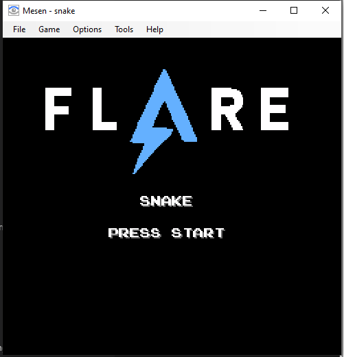
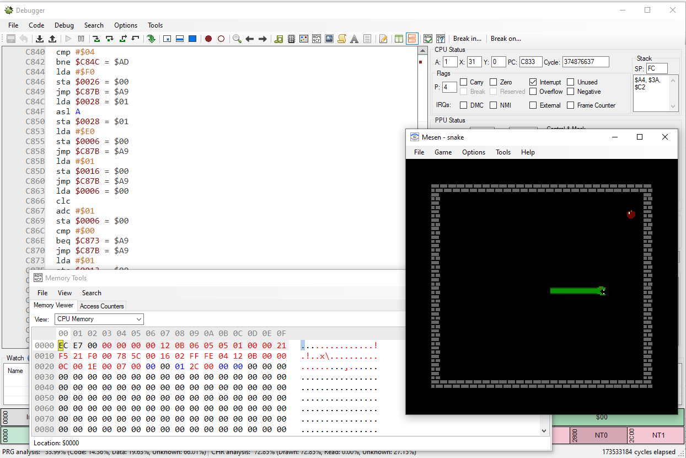
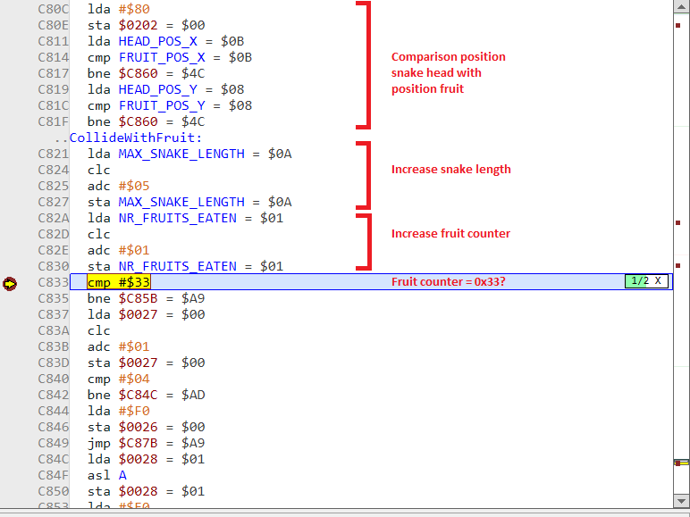
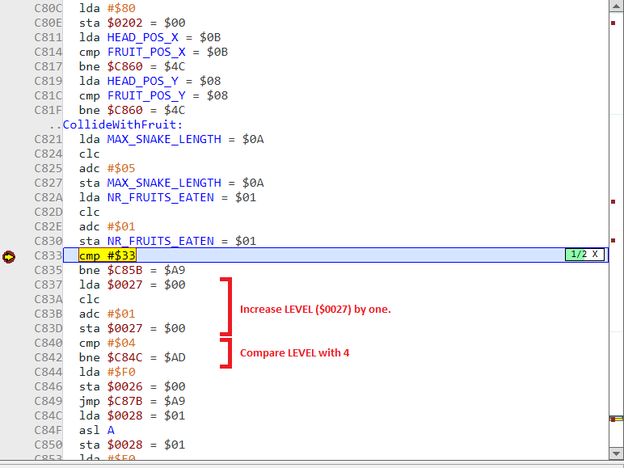
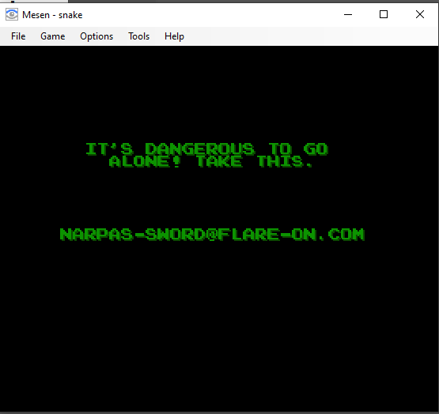

8 - snake
=========

**Time spent:** 2 hours

**Tools used:** Mesen

The 8th challenge is an interesting one. We are given a zip archive that does not contain a normal conventional executable file, but rather a NES ROM of a game. The note that was included states that we should beat the game.

Orientation
-----------

To run a NES ROM, we can use any NES emulator. Since we do not only wish to just play the game, but also reverse engineer it, we have that [Mesen](https://mesen.ca/index.php#Downloads) is a really good choice for our tooling, as it includes quite a comprehensive debugger with tons of features that make analysis of ROMs a lot easier.

Now we can try to beat the game, but honestly I am not that great at snake and frankly I do not have the patience for it either. Instead, let's try to trick the game into that we already won the game, by maybe changing the code slightly or poking around in the memory.

RE'ing a NES ROM
----------------

NES ROMs work quite differently from normal executable files running on a computer. For one, the NES didn't really come with a full-fletched operating system like Windows or Linux. This means that most of the basic features (like I/O handling, drawing graphics etc) are all statically linked into the same ROM. Starting to reverse engineer the ROM from the beginning is therefore a very daunting task, as we would be visiting lots of code that is really not relevant to what we are looking for.

What we do know, however, is that a normal snake game must have a few stats that the game should keep track of somewhere in memory. Think of variables like:
- Snake position (X and Y)
- Fruit position (X and Y)
- The length of the snake

Furthermore, since we want to adjust the victory conditions or trick the game that we already reached them, it is probably useful to locate the code responsible for verifying the win and lose conditions as well.

If you play a few games, and pay close attention to the CPU's memory in Mesen (Tools > Memory Tools), you'll quickly see that the memory changes quite predictably when you move the snake around:

| Offset | Possible meaning                       | Label name        |
|--------|----------------------------------------|-------------------|
| `$0004`| Movement direction                     | `MOVEMENT`        |
| `$0007`| Snake head position X                  | `HEAD_POS_X`      |
| `$0008`| Snake head position Y                  | `HEAD_POS_Y`      |
| `$0009`| Step counter                           | `STEPS`           |
| `$000A`| Visual snake length                    | `SNAKE_LENGTH`    |
| `$000B`| Actual snake length                    | `MAX_SNAKE_LENGTH`|
| `$0017`| Fruit position X                       | `FRUIT_POS_X`     |
| `$0018`| Fruit position Y                       | `FRUIT_POS_Y`     |
| `$001C`| Snake head position X (copy of $0007?) | `HEAD_POS_X2`     |
| `$001D`| Snake head position Y (copy of $0008?) | `HEAD_POS_Y2`     |
| `$0025`| Number of fruits eaten                 | `NR_FRUITS_EATEN` |

Altering these variables while the game is running seems to confirm these meanings as well (Try for example changing the head position and notice the funny glitches you get). Mesen allows you to assign a label to a memory address, which makes the huge mess of assembly code that I haven't seen before a lot more readable.

Let's find out where the snake eats the fruit. This means we are looking for code that e.g. compares the values for `HEAD_POS_X` and `FRUIT_POS_X` or similar. To cross reference, find a random instruction referencing one of the variables, and press Alt+Click. In the list of references, you'll end up finding this piece of code that does exactly what we were looking for:

It seems that the program is waiting for the player to have eaten exactly 51 (0x33) fruits, and then continues. Let's change the value at NR_FRUITS_EATEN to 32 and eat one fruit in the game.

What we see is that it resets the game, but this time, the snake is moving at a faster speed! Furthermore, NR_FRUITS_EATEN is reset back to 0. If we look a bit further in this code, we can see there's one more global variable that we didn't see before ($0027) being incremented, and then compared to 4. Seems like a level counter to me:

In other words, if we change the LEVEL variable to 3, NR_FRUITS_EATEN to 32, and eat one more fruit, we should be able to progress again in our game. 

Turns out, we cannot progress any further, as this is the end of the challenge:

