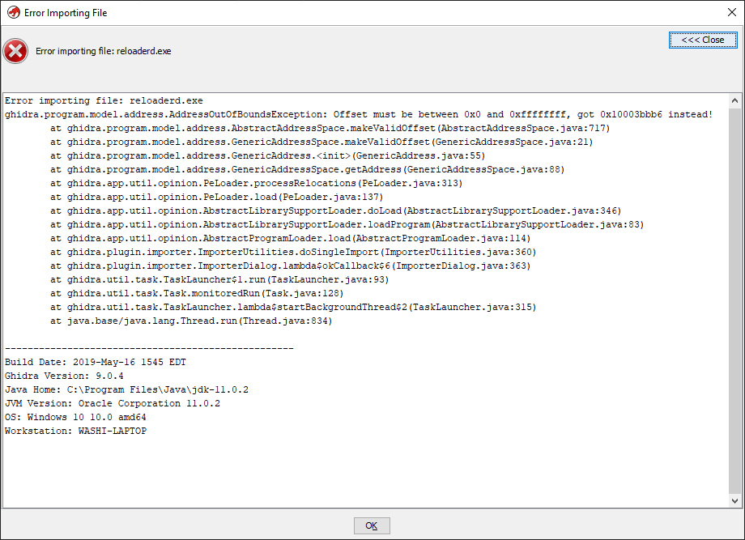
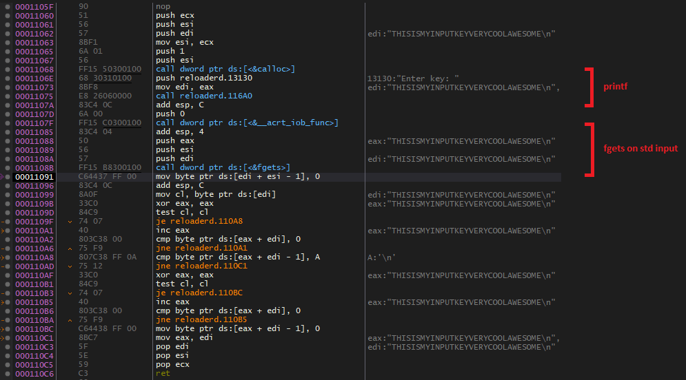
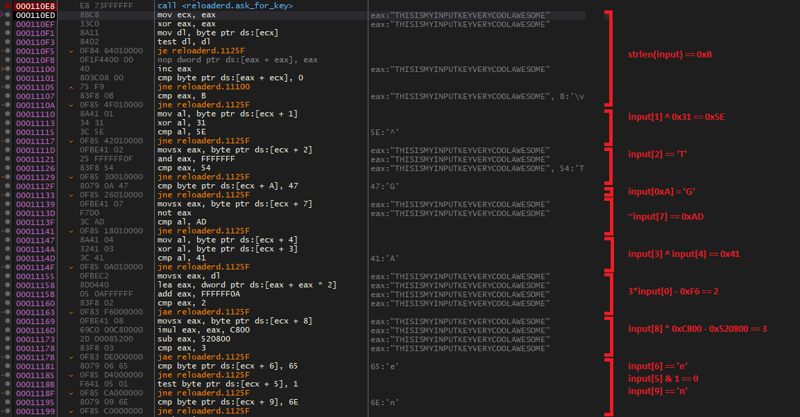
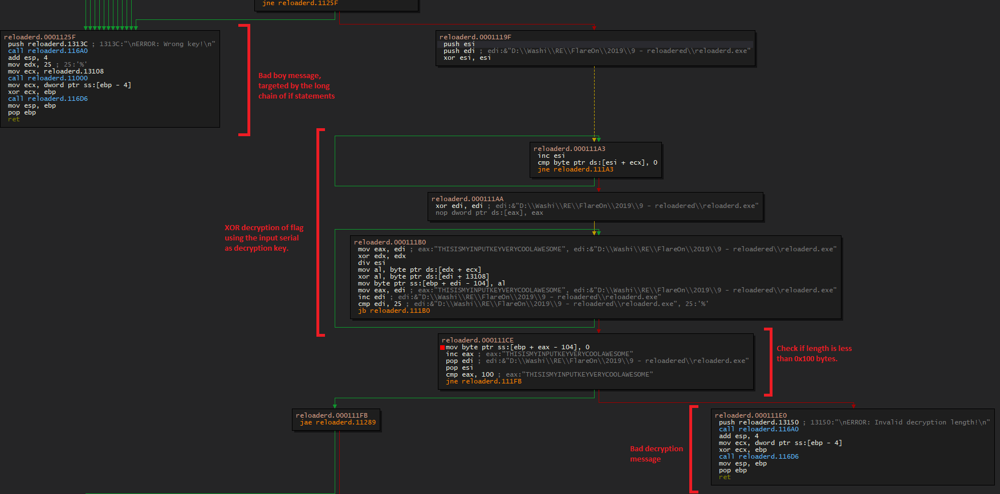
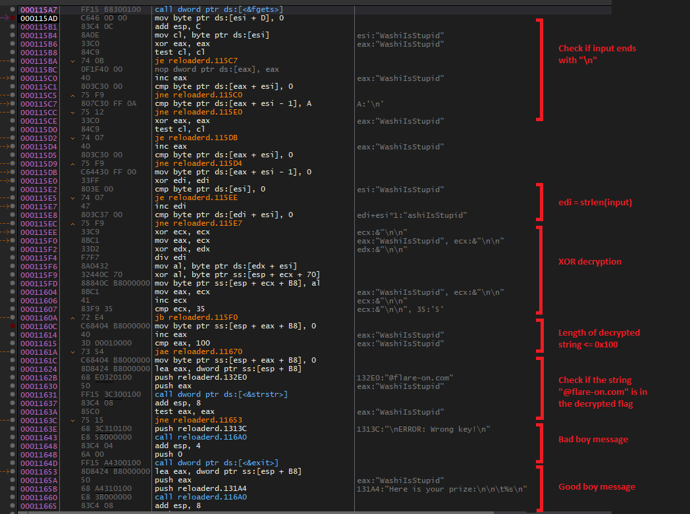

# 9 - Reloadered

**Time spent:** Little under 4 hours (but could've been a lot faster :L)

**Tools used:** Ghidra, x64dbg, Python

The ninth challenge is a straight forward challenge. A simple crackme with a very basic interface. Give the right key, get the right flag:


The note says, however, that ghidra seems to be having trouble opening this file. Of course I put this to the test, but unfortunately the note is right:



## Orientation

Since I do not own an IDA license and therefore do not have any other decompiler at my disposal that I am familiar with, I resorted to x64dbg. Opening it up in the debugger, we see that the file imports `fgets`. Lets put a breakpoint on it, enter a random key, and step till user code:



This small procedure seems like a pretty standard function that prompts the user for the input, and then returns it. Let's step out. We are greeted with a long series of if statements, checking various properties of the input string:



After the bunch of input key constraint checks, we see a simple XOR decryption of the flag, which is stored at `reloadered+0x13108`:



If the decryption key was in fact correct, the flag is displayed:


Oh by the way, this is the contents of `reloadered+0x13108`:

```
0x1C, 0x5C, 0x22, 0x00, 0x00, 0x17, 0x02, 0x62, 0x07, 0x00, 0x06, 0x0D, 0x08, 0x75, 0x45, 0x17, 0x17, 0x3C, 0x3D, 0x1C, 0x31, 0x32, 0x02, 0x2F, 0x12, 0x72, 0x39, 0x0D, 0x23, 0x1E, 0x28, 0x29, 0x69, 0x31, 0x00, 0x39
```

## Obtaining the serial key

Now we could delve into writing an entire solver for all the input key constraints, but we can take a shortcut. Even though we know that the flag can only be decrypted by the correct input serial (which we don't know), we do know that the decrypted string must end with the string `@flare-on.com`. This means we can do a chosen plain-text attack, and calculate the key from the encrypted data and the known suffix of the flag.

```python
def xor_decrypt(cipher, key):
    result = [0] * len(cipher)
    for i in range(len(cipher)):
        if key[i % len(key)]:
            result[i] = cipher[i] ^ key[i % len(key)]
    return bytes(result)  

encrypted_flag = bytes([0x1C, 0x5C, 0x22, 0x00, 0x00, 0x17, 0x02, 0x62, 0x07, 0x00, 0x06, 0x0D, 0x08, 0x75, 0x45, 0x17, 0x17, 0x3C, 0x3D, 0x1C, 0x31, 0x32, 0x02, 0x2F, 0x12, 0x72, 0x39, 0x0D, 0x23, 0x1E, 0x28, 0x29, 0x69, 0x31, 0x00, 0x39])

# Calculate key using known suffix.
key = [0] * 13
known_suffix = b"@flare-on.com"
padded_suffix = known_suffix.rjust(len(encrypted_flag), b'_')
for i in range(len(encrypted_flag) - 1, len(encrypted_flag) - len(key) - 1, -1):
    index = i % len(key)
    key[index] = encrypted_flag[i] ^ padded_suffix[i]

# Decrypt flag
flag = xor_decrypt(encrypted_flag, key)

# Print
print("Key:", bytes(key).decode())
print("Key (hex):", " ".join([hex(x)[2:] for x in  key]))
print("Flag:", flag)
```

Easy peasy, right? Except the decrypted flag doesn't make sense at all:

```
Key: XF3GGGRoTot
Key (hex): 58 7f 46 33 47 47 47 52 6f 54 6f 74 1e
Flag: b'D#d3GPE0hTiy\x16-:Q${z[c]V@flare-on.com'
```

Furthermore, the serial key doesn't work at all. 


What have we missed?

## Addressing the big fat elephant in the room

The observant reader and the observant reverse engineer should have spotted what is going on.

Let's see if you can figure it out. Can you spot the difference between:


and:


For the ones that are as blind as me, the first just straight up asks for the key, the second one first prints a big **fat**, **CHUNKY**, __**OBVIOUS**__ header and _then_ asks for the key. The first is ran without a debugger attached, the second one is. Coincidence? I think not! Somehow I completely missed this and this held me back for at least an hour. Embarassing!

Running the application normally, attaching the debugger after the prompt was printed, and stepping out of the `fgets` function reveals a lot simpler key verification procedure:



Just a normal XOR decryption only, with the encrypted flag stored at `esp+0x70` in the XOR decryption loop. This is the actual encrypted flag:

```
0x7A, 0x17, 0x08, 0x34, 0x17, 0x31, 0x3B, 0x25, 0x5B, 0x18, 0x2E, 0x3A, 0x15, 0x56, 0x0E, 0x11, 0x3E, 0x0D, 0x11, 0x3B, 0x24, 0x21, 0x31, 0x06, 0x3C, 0x26, 0x7C, 0x3C, 0x0D, 0x24, 0x16, 0x3A, 0x14, 0x79, 0x01, 0x3A, 0x18, 0x5A, 0x58, 0x73, 0x2E, 0x09, 0x00, 0x16, 0x00, 0x49, 0x22, 0x01, 0x40, 0x08, 0x0A, 0x14
```

Pasting the new encrypted key into the script reveals the flag:

```
Key: 3HeadedMonkey
Key (hex): 33 48 65 61 64 65 64 4d 6f 6e 6b 65 79
Flag: b'I_mUsT_h4vE_leFt_it_iN_mY_OthEr_p4nTs?!@flare-on.com'
```