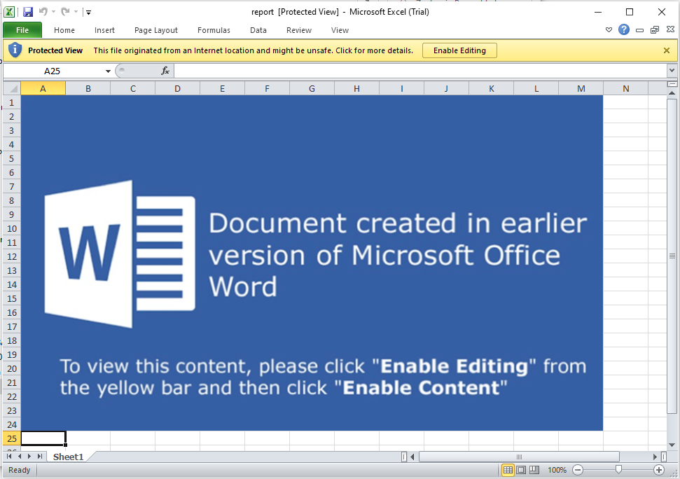
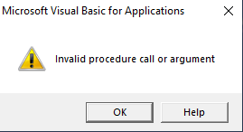
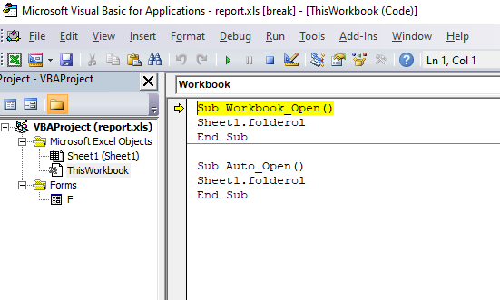
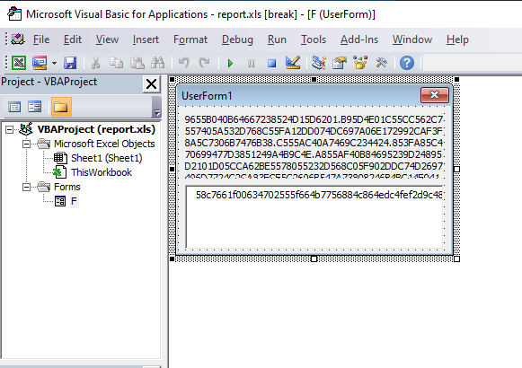
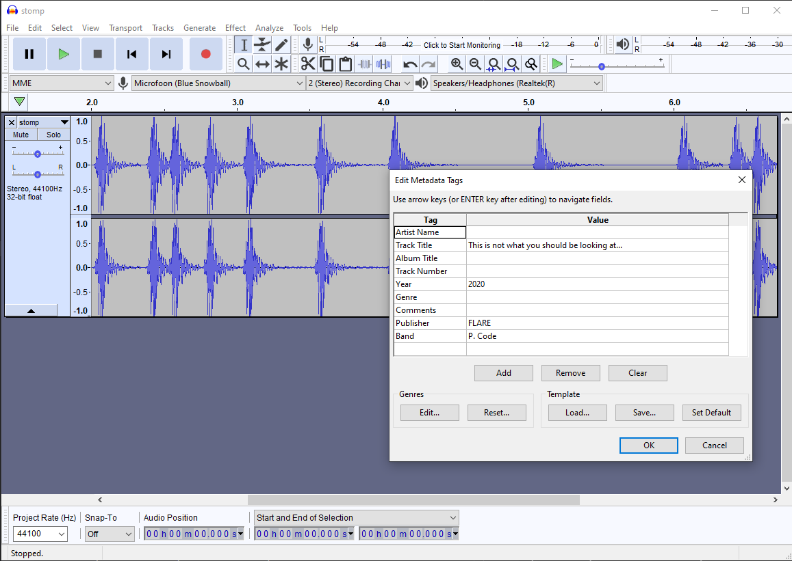

4 - report
==========

**Time spent:** 2 hours

**Tools used:** Office Excel 2010, Python

For the fourth challenge in the series, you are given nothing more than an Excel sheet called `report.xls`. The message tells us that the file is infected, and that we should have a look at it.

Orientation
-----------

Opening the report, we are greeted with a message that the document was made using an "older version of Office", and that we should click on "Enable content" to enable the totally-not-a-virus macros.



Newer versions of Office already notice that something is wrong with this document, and warn us to not enable any of its progrmamable content. Of course, we are stubborn and we do it anyway.

We immediately notice that the script fails to run properly, complaining about some invalid procedure call:



And we are transferred to the VBA editor:



Nothing seems to be out of the ordinary in terms of syntax errors. Odd! If we look at the VBA project structure, we see it consists of a couple of VBA script files called `ThisWorkbook`, and `Sheet1` (a copy can be found [here](Sheet1.vb)). Furthermore, we also see it contains a form with a weird label and textbox:



Recreating the script in Python
-------------------------------

Since the script doesn't run, let's try to recreate it. In `ThisWorkbook1` we see that `folderol` of `Sheet1` is our main procedure of the script. We immediately see the script is obfuscated, but not heavily. In particular, a lot of the strings seem to be stored in the `onzo` variable, and are decoded using the `rigmarole` function. Looking at line 38, `onzo` is nothing more than the contents of the `L` label in our form, splitted by `.`.

```vb
onzo = Split(F.L, ".")
```

Let's reimplement the decoder using Python and build up a strings table:

```python
def rigmarole(d): 
    result = ""
    for i in range(0, len(d), 4):
        c1 = int(d[i:i+2], 16)
        c2 = int(d[i+2:i+4], 16)
        c = c1 - c2 
        result += chr(c)
    return result 

with open("F.L.txt", "r") as f:
    data = f.read().split('.')
    
for j in range(len(data)):
    print(j, rigmarole(data[j]))
```

This gives us:

```
0 AppData
1 \Microsoft\stomp.mp3
2 play
3 FLARE-ON
4 Sorry, this machine is not supported.
5 FLARE-ON
6 Error
7 winmgmts:\\.\root\CIMV2
8 SELECT Name FROM Win32_Process
9 vbox
10 WScript.Network
11 \Microsoft\v.png
```

Now we can replace all occurrences of `rigmarole` with the strings. Here is the first part:

```vb
If GetInternetConnectedState = False Then
    MsgBox "Cannot establish Internet connection.", vbCritical, "Error"
    End
End If

Set fudgel = GetObject("winmgmts:\\.\root\CIMV2")
Set twattling = fudgel.ExecQuery("SELECT Name FROM Win32_Process", , 48)
For Each p In twattling
    Dim pos As Integer
    pos = InStr(LCase(p.Name), "vmw") + InStr(LCase(p.Name), "vmt") + InStr(LCase(p.Name), "vbox"))
    If pos > 0 Then
        MsgBox "Sorry, this machine is not supported.", vbCritical, rigmarole(onzo(6))
        End
    End If
Next
``` 

The code above checks for internet connection (which a lot of automatic malware analysis tools disable), and secondly it looks for a list of known processes that are running when using a virtual machine. If any of these checks are met, the program exits. This can therefore be classified as an anti analysis technique, and can be ignored.

Then we get to our second part:

```vb
xertz = Array(&H11, &H22, &H33, &H44, &H55, &H66, &H77, &H88, &H99, &HAA, &HBB, &HCC, &HDD, &HEE)

wabbit = canoodle(F.T.Text, 0, 168667, xertz)
mf = Environ("AppData") & "\Microsoft\stomp.mp3"
Open mf For Binary Lock Read Write As #fn
    Put #fn, , wabbit
Close #fn

mucolerd = mciSendString("play " & mf, 0&, 0, 0)
```

We see that it grabs the contents of the textbox on our form, feeds it into the `canoodle` function together with some hardcoded array, and then writes it to a file in AppData called `stomp.mp3`. Looking at `canoodle` reveals it is not much more than interpreting every 4th and 5th character in the input string as a hexadecimal number, and XOR'ing it with the second parameter, i.e. a typical xor encryption/decryption routine.

```python
def decrypt(data, start, length):
    result = bytearray([0]*length)
    quean = 0
    for cattywampus in range(start, len(data), 4):
        result[quean] = int(data[cattywampus:cattywampus+2], 16) ^ key[quean % len(key)]
        quean += 1
        if quean == len(result):
            break
    return result

with open("F.T.txt", "r") as f:
    data = f.read()

key = bytes([0x11, 0x22, 0x33, 0x44, 0x55, 0x66, 0x77, 0x88, 0x99, 0xAA, 0xBB, 0xCC, 0xDD, 0xEE])
result = decrypt(data, 0, 168667)

with open("stomp.mp3", "wb") as f:
    f.write(result)
```

However, it outputs a sound file ([stomp.mp3](stomp.mp3)) with the title "This is not what you should be looking at...", and the audio itself is nothing more than some drums playing a rhythm.



What did we miss?

Introduction to VBA stomping
----------------------------

The clue is in the file name of output mp3 file.

It so happens that documents containing VBA code do not directly interpret the VBA code as specified in the script files. Instead, the VBA is compiled into what is known as P-Code, a stack-based assembly-like language. This P-Code is stored next to the original source code, and evaluated instead. My guess for Microsoft doing this, is that evaluating P-Code is easier and potentially faster than trying to parse the VBA code every time the macro is invoked.

The problem with this is, when Excel notices that some P-Code exists in the file, it will execute this code, without compiling the original source first. This happens even if the P-Code does not match the original code. An attacker could therefore construct a malicious document, by compiling a VBA script to P-Code, and removing or replacing the original VBA code in the document with something completely different. This effectively hides the true program that is executed from the GUI editor that is built into Office products. This technique is also called VBA stomping, which was referred to in the name of the mp3 file.


Finding the real program
------------------------

Luckily, there are various tools to deal with stomped VBA documents and sheets. One of them is `oletools`, which can be found [here](https://github.com/decalage2/oletools). Running the `olevba` script on `report.xls`, confirms that the file is indeed stomped:

```sh
$ olevba report.xls
...
+----------+--------------------+---------------------------------------------+
|Type      |Keyword             |Description                                  |
+----------+--------------------+---------------------------------------------+
|AutoExec  |Auto_Open           |Runs when the Excel Workbook is opened       |
|AutoExec  |Workbook_Open       |Runs when the Excel Workbook is opened       |
|Suspicious|CreateObject        |May create an OLE object                     |
|Suspicious|Environ             |May read system environment variables        |
|Suspicious|Write               |May write to a file (if combined with Open)  |
|Suspicious|Put                 |May write to a file (if combined with Open)  |
|Suspicious|Open                |May open a file                              |
|Suspicious|Lib                 |May run code from a DLL                      |
|Suspicious|Chr                 |May attempt to obfuscate specific strings    |
|          |                    |(use option --deobf to deobfuscate)          |
|Suspicious|Xor                 |May attempt to obfuscate specific strings    |
|          |                    |(use option --deobf to deobfuscate)          |
|Suspicious|Binary              |May read or write a binary file (if combined |
|          |                    |with Open)                                   |
|Suspicious|Hex Strings         |Hex-encoded strings were detected, may be    |
|          |                    |used to obfuscate strings (option --decode to|
|          |                    |see all)                                     |
|IOC       |wininet.dll         |Executable file name                         |
|IOC       |winmm.dll           |Executable file name                         |
|Suspicious|VBA Stomping        |VBA Stomping was detected: the VBA source    |
|          |                    |code and P-code are different, this may have |
|          |                    |been used to hide malicious code             |
+----------+--------------------+---------------------------------------------+
```

While `olevba` is able to dump the actual P-Code that is run, P-Code is harder to read than normal VBA. Fortunately, there is another tool called [pcode2code](https://github.com/Big5-sec/pcode2code), which is able to decompile it back to normal VBA code. Feeding `report.xls` to pcode2code gives us an output similar to the one provided in [ActualCode.vb](ActualCode.vb).

The final part of the original main procedure is replaced with the following code:

```vb
Set groke = CreateObject(rigmarole(onzo(10)))   ' "WScript.Network"
firkin = groke.UserDomain
If firkin <> rigmarole(onzo(3)) Then   ' "FLARE-ON"
    MsgBox rigmarole(onzo(4)), vbCritical, rigmarole(onzo(6)) ' "Sorry, this machine is not supported", "Error"
    End
End If

n = Len(firkin)
For i = 1 To n
    buff(n - i) = Asc(Mid$(firkin, i, 1))
Next

wabbit = canoodle(F.T.Text, 2, 285729, buff)
mf = Environ(rigmarole(onzo(0))) & rigmarole(onzo(11))
Open mf For Binary Lock Read Write As #fn
wabbit = canoodle(F.T.Text, 2, 285729, buff)
mf = Environ(rigmarole(onzo(0))) & rigmarole(onzo(11)) '"AppData", "\Microsoft\v.png"
```

Instead of writing `output.mp3`, it writes `v.png`, and the parameters of the decryption function are different. The key is the reversed bytes of "FLARE-ON", and we start at index 2 instead of 0. Let's adjust our python script:

```python
key = bytes(reversed(b"FLARE-ON"))
result = decrypt(data, 2, 285729)

with open("v.png", "wb") as f:
    f.write(result)
```

This results in the answer:

