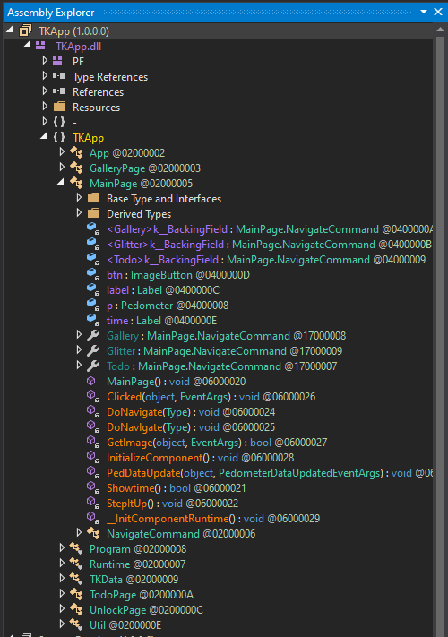

# 5 - TKApp

**Time spent:** 2 hours (one hour wasted on setting up and troubleshooting an emulator :( )

**Tools used:** dnSpy, C#, and NOT an emulator

The fifth challenge of this years is an interesting concept. You are given an app that runs on Android Wearables, and a note that tells you that you can play flare-on now on your smart watch as well, so long you have a good debugger for it. The app apparently is some sort of a gallery app, with some cool tiger pictures in it.


However, the conclusion of this write-up might be somewhat anticlimactic. I probably did not solve this the intended way. In fact, I ended up solving it without the need to run the program at all.


## Orientation

The first thing I did, was start downloading and installing an emulator to run the app on (I used Visual Studio's Android Emulator that comes with the Xamarin SDK).

While that is going on, we can already do some preparation work. We know it is an Android app. The cool thing about APK and TPK files, is that they are simply zip files with a certain structure to them. We can therefore just use any archiving tool that supports the zip archive format, and extract all relevant files from there. Here's the folder structure of the app:

- `/`
    - `bin/` (compiled binaries)
        - `TKapp.dll` (main code)
        - `ExifLib.Standard.dll`
        - other dependencies...
    - `lib/` (libraries used, empty)
    - `res/` (resource files, images etc.)
    - `shared/` (more images)
    - `author-signature.xml`
    - `signature1.xml`
    - `tizen-manifest.xml` (application's manifest)
    - `TKApp.deps.json`

From the `tizen-manifest.xml` we can find the application's entrypoint dll (`TKApp.dll`). Dragging this in a tool like CFF explorer reveals that this dll is written in a .NET language. 

Decompilers targeting .NET applications (such as dnSpy or ILSpy) are quite good nowadays, especially when the application in question is not obfuscated heavily. This app is no exception. Hardly any obfuscation is applied:



Let's start the detective work!


## UnlockPage

Since I was still waiting for the emulator to be downloaded and installed (sheesh), I decided to just click around a bit. If an application is not obfsucated, then we can already get a lot of information just by looking at the source code.

The app consists of a couple of pages. One that immediately stuck out to me was `UnlockPage`. This page defines a method called `IsPasswordCorrect`, which is called by a login button click handler. Here's the contents of these two methods:

```csharp
private async void OnLoginButtonClicked(object sender, EventArgs e)
{
    if (this.IsPasswordCorrect(this.passwordEntry.Text))
    {
        App.IsLoggedIn = true;
        App.Password = this.passwordEntry.Text;
        base.Navigation.InsertPageBefore(new MainPage(), this);
        await base.Navigation.PopAsync();
    }
    else
    {
        Toast.DisplayText("Unlock failed!", 2000);
        this.passwordEntry.Text = string.Empty;
    }
}

private bool IsPasswordCorrect(string password)
{
    return password == Util.Decode(TKData.Password);
}
```

`Password` is a hardcoded byte array in the `TKData` class:
```csharp
public static byte[] Password = new byte[]
{
    62, 38, 63, 63, 54, 39, 59, 50, 39
};
```

And the `Decode` method is a simple xor decryption routine:
```csharp
public static string Decode(byte[] e)
{
    string text = "";
    foreach (byte b in e)
    {
        text += Convert.ToChar((int)(b ^ 83)).ToString();
    }
    return text;
}
```

Plugging this decode function into any C# editor and running the code will give us the password:
```
mullethat
```

Great, but this is not a flag, as flags end with `@flare-on.com`. Obviously it couldn't be *that* easy!


## A rant about Visual Studio and Android emulators...

At this point the android emulator finally finished installing, and I started wasting lots of time on trying to get the app running. And at this moment, I was once again reminded of why I never use Visual Studio anymore. Besides the fact that it is absolutely the sluggiest IDE I probably have ever used, for the love of god, I couldn't get the emulator to work for at least 30 minutes. When it finally ran, I tried running a blank watch app project myself, which I eventually got running on my virtual machine, but could not figure out how to upload a custom TPK file for another 15 minutes. Then as a last resort I tried to fully decompile the TKApp, recompile it using Visual Studio, and see if I can run it like that, but apparently the App uses very outdated dependencies of Tizen, which stopped me from compiling the project properly, even though ILSpy's generated source code had no syntax errors whatsoever. I decided at this point to call it quits and just try this challenge completely statically. 

You'd expect from Visual Studio, a toolsuite that is gigabytes in size on the disk, developed by Microsoft, a reputable company, that it would be easy to upload a custom tpk file to the watch emulator and run it. I am probably missing something obvious but boy, they could have made it a lot easier. Once again, a downvote from me for you Visual Studio.


## MainPage

Let's do a step back: In the login click handler, we can see that after a correct password validation, we can see that the program opens `MainPage`. This page has a couple of very interesting, odd-looking methods that suspiciously look like some verification or decryption routine. One is called `PedDataUpdate`, and the other is `GetImage`. Here is the code:

```csharp
private void PedDataUpdate(object sender, PedometerDataUpdatedEventArgs e)
{
    if (e.StepCount > 50U && string.IsNullOrEmpty(App.Step))
    {
        App.Step = Application.Current.ApplicationInfo.Metadata["its"];
    }
    if (!string.IsNullOrEmpty(App.Password) && !string.IsNullOrEmpty(App.Note) && !string.IsNullOrEmpty(App.Step) && !string.IsNullOrEmpty(App.Desc))
    {
        HashAlgorithm hashAlgorithm = SHA256.Create();
        byte[] bytes = Encoding.ASCII.GetBytes(App.Password + App.Note + App.Step + App.Desc);
        byte[] first = hashAlgorithm.ComputeHash(bytes);
        byte[] second = new byte[]
        {
            50, 148, 76, 233, 110, 199, 228, 72, 114, 227, 78, 138, 93, 189, 189, 147, 
            159, 70, 66, 223, 123, 137, 44, 73, 101, 235, 129, 16, 181, 139, 104, 56
        };
        if (first.SequenceEqual(second))
        {
            this.btn.Source = "img/tiger2.png";
            this.btn.Clicked += this.Clicked;
            return;
        }
        this.btn.Source = "img/tiger1.png";
        this.btn.Clicked -= this.Clicked;
    }
}

private bool GetImage(object sender, EventArgs e)
{
    if (string.IsNullOrEmpty(App.Password) || string.IsNullOrEmpty(App.Note) || string.IsNullOrEmpty(App.Step) || string.IsNullOrEmpty(App.Desc))
    {
        this.btn.Source = "img/tiger1.png";
        this.btn.Clicked -= this.Clicked;
        return false;
    }
    string text = new string(new char[]
    {
        App.Desc[2],  App.Password[6],  App.Password[4], App.Note[4], App.Note[0],
        App.Note[17], App.Note[18], App.Note[16], App.Note[11], App.Note[13],
        App.Note[12], App.Note[15], App.Step[4], App.Password[6], App.Desc[1],
        App.Password[2], App.Password[2], App.Password[4], App.Note[18], App.Step[2],
        App.Password[4], App.Note[5], App.Note[4], App.Desc[0], App.Desc[3],
        App.Note[15], App.Note[8], App.Desc[4], App.Desc[3], App.Note[4],
        App.Step[2], App.Note[13], App.Note[18], App.Note[18], App.Note[8],
        App.Note[4], App.Password[0], App.Password[7], App.Note[0],
        App.Password[4], App.Note[11], App.Password[6], App.Password[4],
        App.Desc[4], App.Desc[3]
    });
    byte[] key = SHA256.Create().ComputeHash(Encoding.ASCII.GetBytes(text));
    byte[] bytes = Encoding.ASCII.GetBytes("NoSaltOfTheEarth");
    try
    {
        App.ImgData = Convert.FromBase64String(Util.GetString(Runtime.Runtime_dll, key, bytes));
        return true;
    }
    catch (Exception ex)
    {
        Toast.DisplayText("Failed: " + ex.Message, 1000);
    }
    return false;
}
```

We can see that `GetImage` seems to be building up a string based on a bunch of variables in the application, and then feeding it into `Util.GetString`, together with a hardcoded resource byte array called `Runtime.dll`. This method does nothing more than implement an AES decryption routine. One of these strings is our previously found password. Let's find out the values of the other bad boys.


## App.Note

Looking into `App.Note` in the analyzer of dnSpy, we can see that its value is set at the very end of the `SetupList()` method in the `TodoPage` class. 

```csharp
private void SetupList()
{
	List<TodoPage.Todo> list = new List<TodoPage.Todo>();
	if (!this.isHome)
	{
		list.Add(new TodoPage.Todo("go home", "and enable GPS", false));
	}
	else
	{
		TodoPage.Todo[] collection = new TodoPage.Todo[]
		{
			new TodoPage.Todo("hang out in tiger cage", "and survive", true),
			new TodoPage.Todo("unload Walmart truck", "keep steaks for dinner", false),
			new TodoPage.Todo("yell at staff", "maybe fire someone", false),
			new TodoPage.Todo("say no to drugs", "unless it's a drinking day", false),
			new TodoPage.Todo("listen to some tunes", "https://youtu.be/kTmZnQOfAF8", true)
		};
		list.AddRange(collection);
	}
	List<TodoPage.Todo> list2 = new List<TodoPage.Todo>();
	foreach (TodoPage.Todo todo in list)
	{
		if (!todo.Done)
		{
			list2.Add(todo);
		}
	}
	this.mylist.ItemsSource = list2;
	App.Note = list2[0].Note;
}
```
From this we can deduce that the note will contain the following string:
```
keep steaks for dinner
```

## App.Step

We already have seen the place where `App.Step` is assigned, namely in `PedDataUpdate`. The data comes from the application's metadata with the key `its`. Metadata like this is stored in the application's manifest:

```xml
<?xml version="1.0" encoding="utf-8"?>
<manifest package="com.flare-on.TKApp" version="1.0.0" api-version="5.5" xmlns="http://tizen.org/ns/packages">
    <author href="http://www.flare-on.com" />
    <profile name="wearable" />
    <ui-application appid="com.flare-on.TKApp" exec="TKApp.dll" multiple="false" nodisplay="false" taskmanage="true" api-version="6" type="dotnet" launch_mode="single">
        <label>TKApp</label>
        <icon>TKApp.png</icon>
        <metadata key="http://tizen.org/metadata/prefer_dotnet_aot" value="true" />
        <metadata key="its" value="magic" />
        <splash-screens />
    </ui-application>
    <shortcut-list />
    <privileges>
        <privilege>http://tizen.org/privilege/location</privilege>
        <privilege>http://tizen.org/privilege/healthinfo</privilege>
    </privileges>
    <dependencies />
    <provides-appdefined-privileges />
</manifest>
```

Here we can see the string is set to
```
magic
```

## App.Desc

Looking at the places where this property is set in the analyzer, we can find one reference to it in `IndexPage_CurrentPageChanged` of the `GalleryPage` class:

```csharp
private void IndexPage_CurrentPageChanged(object sender, EventArgs e)
{
	if (base.Children.IndexOf(base.CurrentPage) == 4)
	{
		using (ExifReader exifReader = new ExifReader(Path.Combine(Application.Current.DirectoryInfo.Resource, "gallery", "05.jpg")))
		{
			string desc;
			if (exifReader.GetTagValue<string>(ExifTags.ImageDescription, out desc))
			{
				App.Desc = desc;
			}
			return;
		}
	}
	App.Desc = "";
}
```

We can see it obtains the description of an image. We can simply copy the iamge and this code (don't forget to include the reference `ExifLib.Standard.dll`) to obtain this value: 
```
water
```

## Conclusion

We now have everything to decrypt `Runtime.dll`. Copy & paste the decryption routine, together with all the values we found, we find that the resulting byte array is an image, revealing the flag:

