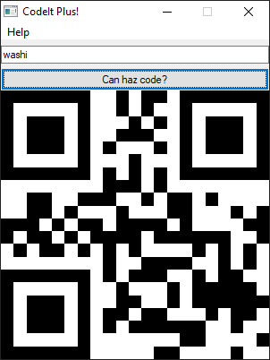
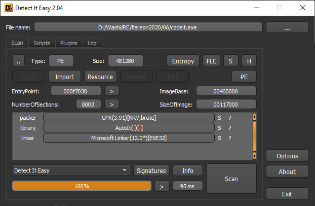
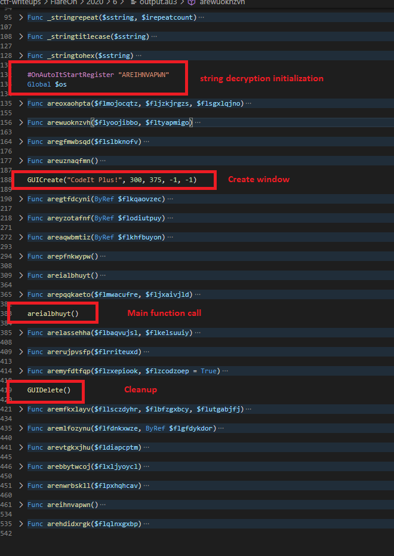
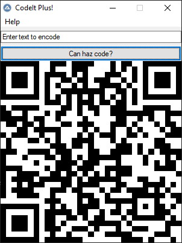
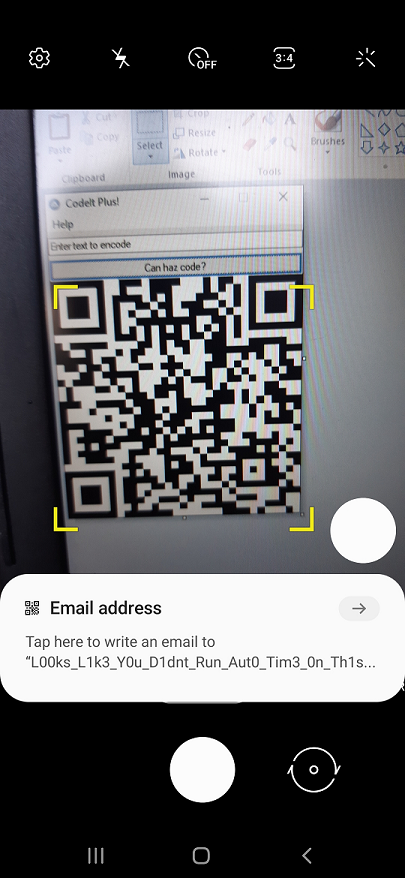

6 - codeit
==========

**Time spent:** 3 hours

**Tools used:** Detect It Easy, exe2aut, Python

The sixth challenge is called codeit, a simple application that asks you for some input which is transformed into a QR code and displayed. The note tells us that if a special string is given, the QR code of the flag would be generated. 



Orientation
-----------

If we drag this application into a program like Detect It Easy, we can quickly see that this program is UPX packed, and underneath it, an AutoIt program is conceiled.



There's tons of tools around on the internet to extract the original script out of this program. I used [Exe2Aut](http://domoticx.com/autoit3-decompiler-exe2aut/):
```
Exe2Aut.exe codeit.exe
```

This extracts three files:
- [codeit_au3](codeit_.au3): The main script.
- [qr_encoder.dll](qr_encoder.dll): A dll used for generating QR images.
- [sprite.bmp](sprite.bmp): The initial image that is displayed.

Although it is probably more readable than x86 code, the script is obfuscated by renaming all variables and functions to random strings, and replacing all constants with some string decoder function call or a random global variable. 

Deobfuscating all constants
---------------------------

The first thing to notice is that the program declares a lot of global variables that are assigned exactly once (lines 134-158).

```autoit
Global $flavekolca = Number(" 0 "), $flerqqjbmh = Number(" 1 "), $flowfrckmw = Number(" 0 "), $flmxugfnde = Number(" 0 "), $flvjxcqxyn = Number(" 2 "), $flddxnmrkh = Number(" 0 "), $flroseeflv = Number(" 1 "), $flpgrglpzm = Number(" 0 "), $flvzrkqwyg = Number(" 0 "), $flyvormnqr = Number(" 0 "), $flvthbrbxy = Number(" 1 "), $flxttxkikw = Number(" 0 "), $flgjmycrvw = Number(" 1 "), $flceujxgse = Number(" 0 "), $flhptoijin = Number(" 0 "), $flrzplgfoe = Number(" 0 "), $fliboupial = Number(" 0 "), $flidavtpzc = Number(" 1 "), $floeysmnkq = Number(" 1 "), $flaibuhicd = Number(" 0 "), $flekmapulu = Number(" 1 ")
...
```

Furthermore, we also see a global variable `os` declared at line 133 that is used a lot throughout the entire program as an argument for the `arehdidxrgk` function. Looking at where this variable is assigned a value (line 557), we can see it is an array of encoded strings, and `arehdidxrgk` is the decoder for it:

```autoit
Func arehdidxrgk($flqlnxgxbp)
	Local $flqlnxgxbp_
	For $flrctqryub = 1 To StringLen($flqlnxgxbp) Step 2
		$flqlnxgxbp_ &= Chr(Dec(StringMid($flqlnxgxbp, $flrctqryub, 2)))
	Next
	Return $flqlnxgxbp_
EndFunc
```

With this in mind, and some regex selection, we can make a simple python script that does a find and replace in the original source code. The script can be found [here](deobfuscate.py). After we ran it, we can remove the remnants of the global variable declarations, and we end up with a script like [here](output.au3).

The detective work
------------------

Now the real fun starts. If you use an editor like Visual Studio Code, you can easily collapse all functions using `Ctrl+K+0`. Doing this gives us a good overview of the complete program.



Furthermore, a lot of functions are small enough to quickly figure out what is going on, just by looking at the strings that are used in these functions. Renaming them will help a lot in seeing the bigger picture of the program, and so therefore I did.

- **areuznaqfmn** -> kernel32.dll!GetComputerNameA
- **arerujpvsfp** -> kernel32.dll!CreateFile
- **aremyfdtfqp** -> kernel32.dll!CreateFile
- **aremfkxlayv** -> kernel32.dll!SetFilePointer followed by kernel32!WriteFile
- **aremlfozynu** -> kernel32.dll!ReadFile
- **arevtgkxjhu** -> kernel32.dll!CloseHandle
- **arebbytwcoj** -> kernel32.dll!DeleteFileA

Now that those are out of the way, let's have a look at the main function:

```autoit
Func MessageLoop()
    ;- ...
    
	While 1
		Switch GUIGetMsg()
			Case $confirm_button
				;- If confirm button clicked...

				Local $inputText = GUICtrlRead($input_textbox)
				If $inputText Then
					;~ Set up QR encoder parameters.
					Local $qrencoderPath = get_file_path(26)
					Local $qrparameters = DllStructCreate("struct;dword;dword;byte[3918];endstruct")
					Local $result = DllCall($qrencoderPath, "int:cdecl", "justGenerateQRSymbol", "struct*", $qrparameters, "str", $inputText)

					If $result[0] <> 0 Then
						;~ Some magic???
						MAGICFUNCTION($qrparameters)

						;~ Create bitmap
						Local $flbvokdxkg = CreateBitmapStruct((DllStructGetData($qrparameters, 1) * DllStructGetData($qrparameters, 2)), (DllStructGetData($qrparameters, 1) * DllStructGetData($qrparameters, 2)), 1024)
						$result = DllCall($qrencoderPath, "int:cdecl", "justConvertQRSymbolToBitmapPixels", "struct*", $qrparameters, "struct*", $flbvokdxkg[1])
						If $result[0] <> 0 Then
							;~ Write image.
							$sprite_bmp_file = random_string(25, 30) & ".bmp"
							arelassehha($flbvokdxkg, $sprite_bmp_file)
						EndIf
					EndIf
					kernel32DeleteFileA($qrencoderPath)
				Else
					$sprite_bmp_file = get_file_path(11)
				EndIf
				
				;~ Update image in window.
				GUICtrlSetImage($picturebox, $sprite_bmp_file)
				kernel32DeleteFileA($sprite_bmp_file)
    ;- ...
```

We can see a typical win32 message loop, where we wait for a button click event. If it is triggered, we grab the text of the input text box, set up the parameters for the call to `qr_encoder.dll`, do the call to `justConvertQRSymbolToBitmapPixels`, and then eventually display the generated image. But before we transfer control to the external dll, we call a mysterious function, which I called `MAGICFUNCTION`, that seems to take the qr code parameters, including the input text. Let's have a look:

```autoit

Func MAGICFUNCTION(ByRef $inputOutput)
	Local $computerName = kernel32GetComputerName()
	
	If $computerName <> -1 Then
		;~ Preprocess computer name bytes .
		$computerName = Binary(StringLower(BinaryToString($computerName)))
		Local $computerNameraw = DllStructCreate("struct;byte[" & BinaryLen($computerName) & "];endstruct")
		DllStructSetData($computerNameraw, 1, $computerName)
		DecodeFile($computerNameraw)

		Local $phPov = DllStructCreate("struct;ptr;ptr;dword;byte[32];endstruct")
		DllStructSetData($phPov, 3, 32)
		Local $result = DllCall("advapi32.dll", "int", "CryptAcquireContextA", ...)
		If $result[0] <> 0 Then
			$result = DllCall("advapi32.dll", "int", "CryptCreateHash", ...)
			If $result[0] <> 0 Then
				$result = DllCall("advapi32.dll", "int", "CryptHashData", ...)
				If $result[0] <> 0 Then
					$result = DllCall("advapi32.dll", "int", "CryptGetHashParam", ...)
					If $result[0] <> 0 Then
						Local $keydata = Binary("0x" & "08020" & "00010" & "66000" & "02000" & "0000") & DllStructGetData($phPov, 4)
						;~ Keydata now contains the sha256 of the transformed computer name, plus a prefix.

						Local $ciphertext = Binary(...)

						;~ Set up decryption key based off of key data.
						Local $buffer = DllStructCreate("struct;ptr;ptr;dword;byte[8192];byte[" & BinaryLen($keydata) & "];dword;endstruct")
						DllStructSetData($buffer, 3, BinaryLen($ciphertext))
						DllStructSetData($buffer, 4, $ciphertext)
						DllStructSetData($buffer, 5, $keydata)
						DllStructSetData($buffer, 6, BinaryLen($keydata))

						Local $result = DllCall("advapi32.dll", "int", "CryptAcquireContextA",...)
						If $result[0] <> 0 Then
							$result = DllCall("advapi32.dll", "int", "CryptImportKey", ...)
							If $result[0] <> 0 Then
								$result = DllCall("advapi32.dll", "int", "CryptDecrypt", ...)
								If $result[0] <> 0 Then
									;~ If decryption successful...
									Local $flsekbkmru = BinaryMid(DllStructGetData($buffer, 4), 1, DllStructGetData($buffer, 3))

									$FLARE = Binary("FLARE")
									$ERALF = Binary("ERALF")
									$flgggftges = BinaryMid($flsekbkmru, 1, BinaryLen($FLARE))
									$flnmiatrft = BinaryMid($flsekbkmru, BinaryLen($flsekbkmru) - BinaryLen($ERALF) + 1, BinaryLen($ERALF))
									If $FLARE = $flgggftges AND $ERALF = $flnmiatrft Then
										;~ Update the qr parameters to display the decrypted data.
										DllStructSetData($inputOutput, 1, BinaryMid($flsekbkmru, 6, 4))
										DllStructSetData($inputOutput, 2, BinaryMid($flsekbkmru, 10, 4))
										DllStructSetData($inputOutput, 3, BinaryMid($flsekbkmru, 14, BinaryLen($flsekbkmru) - 18))
                                        
    ;- ...
```

That's a big function! If we go over it step by step, we can see the computer name is acquired, then some preprocessing is done, and after that, it is used as part of a decryption key for a whole bunch of complicated cryptography (SHA256 and RSA) that we most likely cannot break. If, however, the decryption succeeds, the QR parameters are updated. So we know that this is the place to look.

It seems though, that the decryption routine does not really rely on the input text that was given in the input box, but rather on the computer name. Let's have a look at the preprocessing of the computer name, see if we can find some clues there:

```autoit
Func DecodeFile(ByRef $cipherTextBuffer)	
	;- Open sprite.bmp
	Local $spritebmppath = get_file_path(14)
	Local $handle = kernel32CreateFile($spritebmppath)
	If $handle <> -1 Then
		Local $fileSize = kernel32GetFileSize($handle)
		If $fileSize <> -1 AND DllStructGetSize($cipherTextBuffer) < $fileSize - 54 Then
			;- Read file contents.
			Local $buffer = DllStructCreate("struct;byte[" & $fileSize & "];endstruct")
			Local $flskuanqbg = kernel32ReadFile($handle, $buffer)
			If $flskuanqbg <> -1 Then
				;- Skip the first 54 bytes (bmp header).
				Local $flxmdchrqd = DllStructCreate("struct;byte[54];byte[" & $fileSize - 54 & "];endstruct", DllStructGetPtr($buffer))
				Local $counter = 1
				Local $result = ""

				;- Build up a result string based on the input computer name and pixel data in sprite.bmp.
				For $i = 1 To DllStructGetSize($cipherTextBuffer)
					Local $currentChar = Number(DllStructGetData($cipherTextBuffer, 1, $i))
					For $j = 6 To 0 Step -1
						$currentChar += BitShift(BitAND(Number(DllStructGetData($flxmdchrqd, 2, $counter)), 1), -1 * $j)
						$counter += 1
					Next
					$result &= Chr(BitShift($currentChar, 1) + BitShift(BitAND($currentChar, 1), -7))
				Next
				DllStructSetData($cipherTextBuffer, 1, $result)
			EndIf
		EndIf
		kernel32CloseHandle($handle)
	EndIf
	kernel32DeleteFileA($spritebmppath)
EndFunc
```

Interesting! We are reading some hidden data from `sprite.bmp`, 7 pixels per character. ASCII is a 7-bit character encoding, so that seems like a good guess. Let's write a [python script](lsb.py) that simulates it:

```python
with open("sprite.bmp", "rb") as f:
    data = f.read()

result = []
current = ""
for j in range(0x36, 0x100):
    bit = data[j] & 1
    current += str(bit)
    if len(current) == 7:
        result.append(current)
        current = ""

print(result)
print("".join([chr(int(x, 2)) for x in result]))
```

Resulting in : 
```
$ python lsb.py
['1100001', '1110101', '1110100', '0110000', '0110001', '1110100', '1100110', '1100001', '1101110', '0110001', '0111001', '0111001', '0111001', '1111111', '1111111', '1111111', '1111111', '1111111', '1111111', '1111111', '1111111', '1111111', '1111111', '1111111', '1111111', '1111111', '1111111', '1111111']
aut01tfan1999⌂⌂⌂⌂⌂⌂⌂⌂⌂⌂⌂⌂⌂⌂⌂
```

If we replace the computer name with the string `aut01tfan1999`, we can observe that the decryption succeeds, and a different QR is displayed:



Scanning the resulting QR code with a phone...



... reveals the flag:

```
L00ks_L1k3_Y0u_D1dnt_Run_Aut0_Tim3_0n_Th1s_0ne!@flare-on.com
```