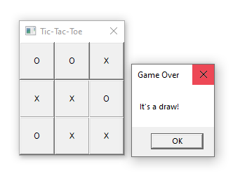
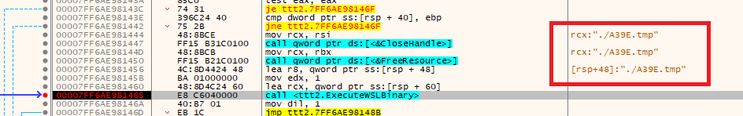
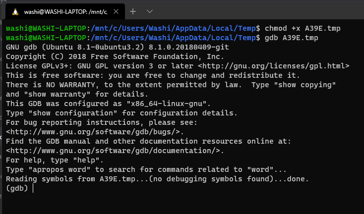
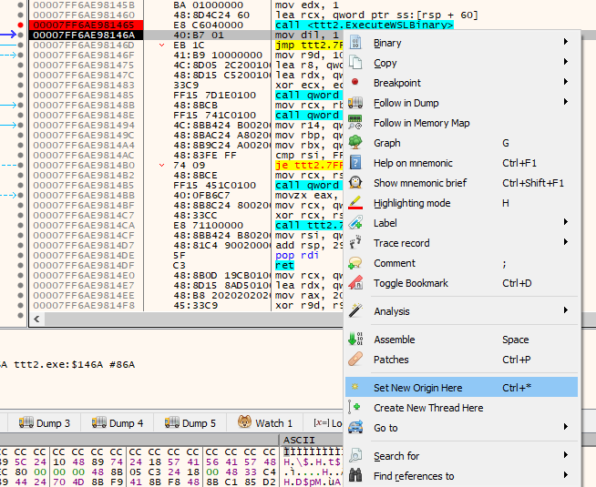
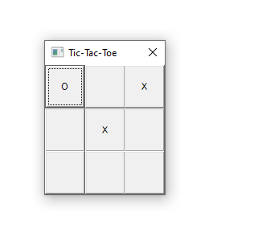
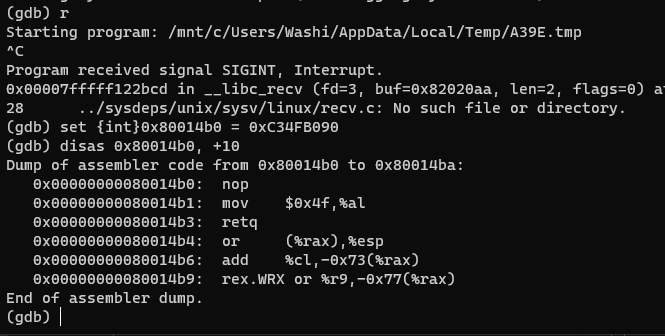
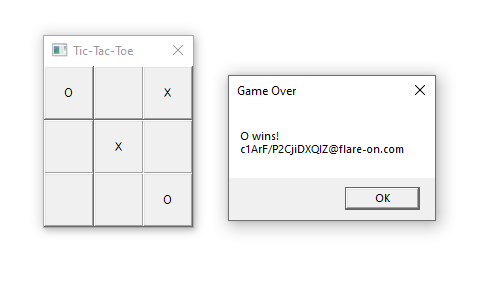

# 8 - re_crowd

**Time spent:** 3-4 hours

**Tools used:** Ghidra, x64dbg, gdb

Challenge 8 is a little bit of a weird one. I am not sure why challenge was placed at number 8, because I found it significantly easier than 7. We are given a binary that implements the game of tic-tac-toe. The note talks about this is going to be hard one to even run, but I had no issues whatsoever:




## Orientation

The problem with the game of tic-tac-toe, is that it is very easy to implement a perfect AI that never loses; either always wins or plays in such a way that the game ends in a draw. If we start playing a few games to see what happens, we can see that this is indeed the case. The AI (X) always gets the first turn, and always puts its X in the middle of the board.

If we cross-reference on calls such as `SetDlgItemTextA`, we can quickly find the main dialog procedure that listens for button clicks. Here's the relevant code:

```c
// FUN_140001520
void SetButtonTextsBasedOnReceiveBuffer(HWND param_1)
{
    uint col;
    uint row;
    char *p;
    CHAR buff [8];
    
    p = BOARD;
    row = 0;
    do {
        col = 0;
        do {
            wsprintfA(buff,"%hc",*p);
            SetDlgItemTextA(param_1,(row | 0x10) << 4 | col,buff);
            col = col + 1;
            p = p + 1;
        } while (col < 3);
        row = row + 1;
    } while (row < 3);
    return;
}

// FUN_140001000
void MainDialogProc(HWND hWnd,uint message,WPARAM wParam,LPARAM lParam)
{
    /* ... */
    
    s = SOCKET_CLIENT;
    local_28 = DAT_14001e048 ^ &stack0xffffffffffffff68;
    if (message < WM_KEYUP + 1) {
        /* ... */
    }
    else {
        if (message != 0x102) {
            // if WM_INITDIALOG...
            if (message == 0x110) {
                // Reset board to whitespaces.
                BOARD._0_8_ = 0x2020202020202020;
                BOARD[8] = ' ';
                recv(SOCKET_CLIENT,BOARD,10,0);
                SetButtonTextsBasedOnReceiveBuffer(hWnd);
                SendMessageA(hWnd,0x401,0x100,0);
            }
            else {
                // if WM_COMMAND...
                if (message == 0x111) {
                    nIDDlgItem_00 = wParam & 0xf;
                    nIDDlgItem = wParam >> 4 & 0xf;
                    lVar1 = nIDDlgItem * 3 + nIDDlgItem_00;
                    // If clicked button == ' '.
                    if (BOARD[lVar1] == ' ') {
                        SEND_BUFFER[0] = nIDDlgItem;
                        SEND_BUFFER[1] = nIDDlgItem_00;
                        BOARD[lVar1] = 'O';
                        send(s,SEND_BUFFER,2,0);
                        recv(SOCKET_CLIENT,BOARD,10,0);
                        SetButtonTextsBasedOnReceiveBuffer(hWnd);
                        if (BOARD[9] != '\0') {
                            recv(SOCKET_CLIENT,local_68,0x40,0);
                            MessageBoxA(hWnd,local_68,"Game Over",0);
                            FUN_1400014e0();
                            SetButtonTextsBasedOnReceiveBuffer(hWnd);
                        }
                    }
                    else {
                        MessageBoxA(hWnd,"That space is already taken","Invalid Move",0);
                    }
                }
            }
        }
    }
    /* ... */
}
```

We see references to winsock? Are we communicating with a remote host? Let's figure out where this socket object is initialized. A quick cross-reference shows us that it is written in the main function of the program:

```c
void main(void)
{
    /* ... */

    DVar4 = GetTempPathA(0x105,local_128);
    if (DVar4 != 0) {
        SetCurrentDirectoryA(local_128);
    }

    // Set up winsock.
    iVar5 = WSAStartup(0x202,&local_2c8);
    if (iVar5 != 0) {
        MessageBoxA(0x0,"Error initializing Winsock","Error",0x10);
        goto LAB_1400017c4;
    }

    // Create a new socket object.
    addr.sa_family = 1;
    bVar1 = true;
    addr.sa_data._0_4_ = 0;
    addr.sa_data._4_4_ = 0;
    addr.sa_data._8_4_ = 0;
    stack0xfffffffffffffcd6 = 0;
    wsprintfA(addr.sa_data,"%s");
    DeleteFileA("496b9b4b.ed5");
    s = socket(1,1,0);
    if (s == 0xffffffffffffffff) {
        MessageBoxA(0x0,"socket failed","Error",0x10);
        lpText = "Error creating Unix domain socket";
    }
    else {
        // Bind to thea ddress.
        iVar5 = bind(s,&addr,0x6e);
        if (iVar5 == -1) {
            lpText = "bind failed";
LAB_140001743:
            MessageBoxA(0x0,lpText,"Error",0x10);
        }
        else {
            // Start listening for clients.
            iVar5 = listen(s,0x7fffffff);
            if (iVar5 == -1) {
                lpText = "listen failed";
                goto LAB_140001743;
            }
        }
        uVar6 = CoInitializeEx(0x0,0);
        if (uVar6 < 2) {
            HVar7 = CoInitializeSecurity(0x0,-1,0x0,0x0,0,3,0x0,0,0x0);
            if (HVar7 == 0) {
                // ???
                cVar3 = MAGIC_FUNCTION();
                if (cVar3 != '\0') {
                    // Accept next client.
                    SOCKET_CLIENT = accept(s,0x0,0x0);
                    hInstance = GetModuleHandleA(0x0);
                    hWnd = CreateDialogParamA(hInstance,"BOARD",0x0,MainDialogProc,0);
                    if (hWnd == 0x0) {
                        lpText = "CreateDialog failed";
                    }
                    else {
                        // Do normal Win32 GUI message loop...
                        iVar5 = GetMessageA(&local_368,0x0,0,0);
                        while (0 < iVar5) {
                            if (((local_360 - 0x100 < 3) && (pHVar2 = hWnd, local_358 - 0x25 < 4)) ||
                               (BVar8 = IsDialogMessageA(hWnd,&local_368), pHVar2 = local_368, BVar8 == 0)) {
                                local_368 = pHVar2;
                                TranslateMessage(&local_368);
                                DispatchMessageA(&local_368);
                            }
                            iVar5 = GetMessageA(&local_368,0x0,0,0);
                        }
                        if (-1 < iVar5) goto LAB_140001925;
                        lpText = "GetMessage failed";
                    }
                    MessageBoxA(0x0,lpText,"Error",0x10);
                }
LAB_140001925:
                CoUninitialize();
                goto LAB_1400017c4;
            }
            CoUninitialize();
        }
        lpText = "Error initializing COM";
    }
    /* ... */
    return;
}
```

We see already a weird string: `Error creating Unix domain socket`. We are on Windows, not on a unix system? Furthermore, we see some weird COM initialization calls, as well as a mysterious call to a `MAGIC_FUNCTION` right before the `accept` call where `SOCKET_CLIENT` is assigned a value. Let's dive in.

```c
void MAGIC_FUNCTION(void)
{
    /* ... */
    UVar1 = GetTempFileNameA(".","",0,local_128);
    if (UVar1 == 0) {
        /* ... */
    }
    else {          
        /* ... */
        hFile = CreateFileA(local_128,0x40000000,0,0x0,3,0x80,0x0);
        /* ... */
        hResInfo = FindResourceA(0x0,0x12c,0x100);
        /* ... */
        nNumberOfBytesToWrite = SizeofResource(0x0,hResInfo);
        hResData = LoadResource(0x0,hResInfo);
        /* ... */
        lpBuffer = LockResource(hResData);
        lpNumberOfBytesWritten = &local_258;
        BVar2 = WriteFile(hFile,lpBuffer,nNumberOfBytesToWrite,lpNumberOfBytesWritten,0x0);
        /* ... */
            CloseHandle(hFile);
            FreeResource(hResData);
            MAGIC_FUNCTION_2(local_238,1,&local_250,lpNumberOfBytesWritten);
        /* ... */
    }
    FreeResource(hResData);
    /* ... */
}
```

Seems like we are extracting a resource to some temp file. Setting a breakpoint at the `CreateFileA` and `CloseHandle` function calls, gives us a file that is similar to [embedded.bin](embedded.bin). Feeding the file into the `file` command, tells us something interesting:
```bash
$ file embedded.bin
embedded.bin: ELF 64-bit LSB shared object, x86-64, version 1 (SYSV), dynamically linked, interpreter /lib64/ld-linux-x86-64.so.2, for GNU/Linux 3.2.0, BuildID[sha1]=e26dfd1a32bf2fc2f804ede74b1b9ef9c73268bf, stripped
```
An ELF binary! If we continue following the trail, and jump into the second `MAGIC_FUNCTION_2` call, we eventually end up in this function:

```c
void CreateWSLInstance(undefined8 param_1,uint param_2)
{
    /* ... */
    HVar2 = CoCreateInstance(&DAT_14001e008,0x0,4,&DAT_14001e018,&local_2d0);
    if (HVar2 == 0) {
        iVar3 = (**(*local_2d0 + 0x58))(local_2d0,&local_290);
        if (iVar3 == 0) {
            /* ... */
            iVar3 = (**(*local_2d0 + 0x68))(local_2d0,local_2d8,&local_2c8);
            if (iVar3 == 0) {
                if (local_2d8[0] != 0) {
                    do {
                        /* ... */
                        if (((*(lVar6 + local_2c8) == local_290) && (*(lVar6 + 8 + local_2c8) == local_288)) &&
                           (*(lVar6 + 0x14 + local_2c8) != 1)) {
                            MessageBoxA(0x0,"Default distribution must be WSL 1","Error",0x10);
                            goto LAB_14000246f;
                        }
                        /* ... */
                    } while (uVar4 < local_2d8[0]);
                }
                if (local_2c8 != 0x0) {
                    CoTaskMemFree(local_2c8);
                }
                /* ... */
                local_340 = L"root";
                /* ... */
                if (iVar3 != 0) {
                    MessageBoxA(0x0,"CreateLxProcess failed","Error",0x10);
                }
            }
            else {
                MessageBoxA(0x0,"EnumerateDistributions failed","Error",0x10);
            }
        }
        else {
            MessageBoxA(0x0,"GetDefaultDistribution failed","Error",0x10);
        }
    }
    else {
        MessageBoxA(0x0,"CoCreateInstance failed","Error",0x10);
    }
    /* ... */
}
```

Even though the pointer-magic that is happening here might be hard to understand, the strings do a great job at explaining what is happening here. We are extracting a resource file, which happens to be an ELF binary, and then run it in an WSL environment. So even though the original binary is a normal Windows PE binary, it seems the real challenge is actually implemented in the ELF binary running in a Unix environment.


## Reversing the ELF binary

After opening the ELF binary in Ghidra, and renaming a few variables and functions, you'll notice that the embedded file is not too complicated. It has one big main procedure that keeps looping until the main program terminates. In this loop, it receives the command from the main application, updates the board, determines the move of the AI player, and then sends the entire board state back to the main application. You will also notice that the AI that is implemented indeed is a perfect AI that either always wins or draws. 

The important thing to notice here is the following snippet:

```c
if (WINNER < '\0') {
    /* Its a draw */
    SEND_BUFFER._0_8_ = 0x6420612073277449;
    SEND_BUFFER._8_8_ = 0x6420612073277449;
    SEND_BUFFER._16_4_ = 0;
    SEND_BUFFER._20_4_ = 0;
    SEND_BUFFER._24_4_ = 0;
    SEND_BUFFER._28_4_ = 0;
    SEND_BUFFER._32_4_ = 0;
    SEND_BUFFER._36_4_ = 0;
    SEND_BUFFER._40_4_ = 0;
    SEND_BUFFER._44_4_ = 0;
    SEND_BUFFER._48_4_ = 0;
    SEND_BUFFER._52_4_ = 0;
    SEND_BUFFER._56_4_ = 0;
    SEND_BUFFER._60_4_ = 0;
}
else {
    /* X wins! */
    if (WINNER == 'X') {
        SEND_BUFFER._0_8_ = 0x21736e69772058;
        SEND_BUFFER._8_8_ = 0;
        SEND_BUFFER._16_4_ = 0;
        SEND_BUFFER._20_4_ = 0;
        SEND_BUFFER._24_4_ = 0;
        SEND_BUFFER._28_4_ = 0;
        SEND_BUFFER._32_4_ = 0;
        SEND_BUFFER._36_4_ = 0;
        SEND_BUFFER._40_4_ = 0;
        SEND_BUFFER._44_4_ = 0;
        SEND_BUFFER._48_4_ = 0;
        SEND_BUFFER._52_4_ = 0;
        SEND_BUFFER._56_4_ = 0;
        SEND_BUFFER._60_4_ = 0;
    }
    else {
        if (WINNER == 'O') {
            send(MAIN_SOCKET,BOARD,10,0);
            BOARD._0_8_ = uVar13 | BOARD[0];
            SEND_BUFFER._0_8_ = 0xa21736e6977204f;
            SEND_BUFFER._8_8_ = 0;
            SEND_BUFFER._16_4_ = 0;
            SEND_BUFFER._20_4_ = 0;
            SEND_BUFFER._24_4_ = 0;
            SEND_BUFFER._28_4_ = 0;
            SEND_BUFFER._32_4_ = 0;
            SEND_BUFFER._36_4_ = 0;
            SEND_BUFFER._40_4_ = 0;
            SEND_BUFFER._44_4_ = 0;
            SEND_BUFFER._48_4_ = 0;
            SEND_BUFFER._52_4_ = 0;
            SEND_BUFFER._56_4_ = 0;
            SEND_BUFFER._60_4_ = 0;
            
            /* A shitton of code... */
            
            puVar17 = __stpcpy_chk(puVar16 + (-3 - CARRY1(bVar4,bVar4)),FLAG,0x40);
    /* @flare-on.com */
            *(puVar17 + 1) = 0x6f632e6e;
            *puVar17 = 0x6f2d6572616c6640;
            *(puVar17 + 0xc) = 0x6d;
            BOARD._0_8_ = uVar13;
```

We see in the above the code that is responsible for building up the final message "It's a draw!", "X wins!" or "O wins!". It depends on a single variable that I called `WINNER`. If `WINNER` is equal to `O`, then it executes a lot of code, that eventually ends in something that works on the string `@flare-on.com`. Figuring out where `WINNER` is set reveals that `FUN_001014b0` determines the winner of the game. 


## Memory patching the game

Let's trick the program into thinking we won the game anyways. One way of doing this, would be to patch this function `FUN_001014b0` in such a way that it always returns 'O' instead of 'X' when a winner is decided.

To do this, I broke execution at the point where the WSL instance was created.



But instead of stepping into this function, we open up a WSL terminal (such as Ubuntu for Linux), and run the generated temp file using `gdb`



... and then skip the call in x64dbg by setting the origin to the next instruction.



If we now continue both the main application (F9 in x64dbg), as well as the WSL instance (using the `r` command in gdb), the application runs fine. We now debug both the main and the WSL instance, and therefore have full control over the game.

Now let's make the AI player win. We do one move:



The AI is about to win, let's break execution in gdb, and patch the winner determination function. We are going to let it return 'O' instead of 'X'. One way of doing that is using the following assembly code:

```
0:  90                      nop
1:  b0 4f                   mov    al,0x4f
3:  c3                      ret 
```

These 4 bytes can be represented as a single integer `0xC34FB090`. So the only thing we need to do is write this integer to the correct address:



Continuing the execution, and pressing one more button:



... reveals the flag. 

At first I didn't think this was the flag, since it looks pretty much like garbage data. As a result, I wasted at least 1 hour finding out what I missed, until I just tried out this flag and it turned out to be right after all. I am not sure if this was intentional, as most challenges are usually some form of l33tsp34k. Personally I think it is bad challenge design, and this is something the FLARE team could learn from.