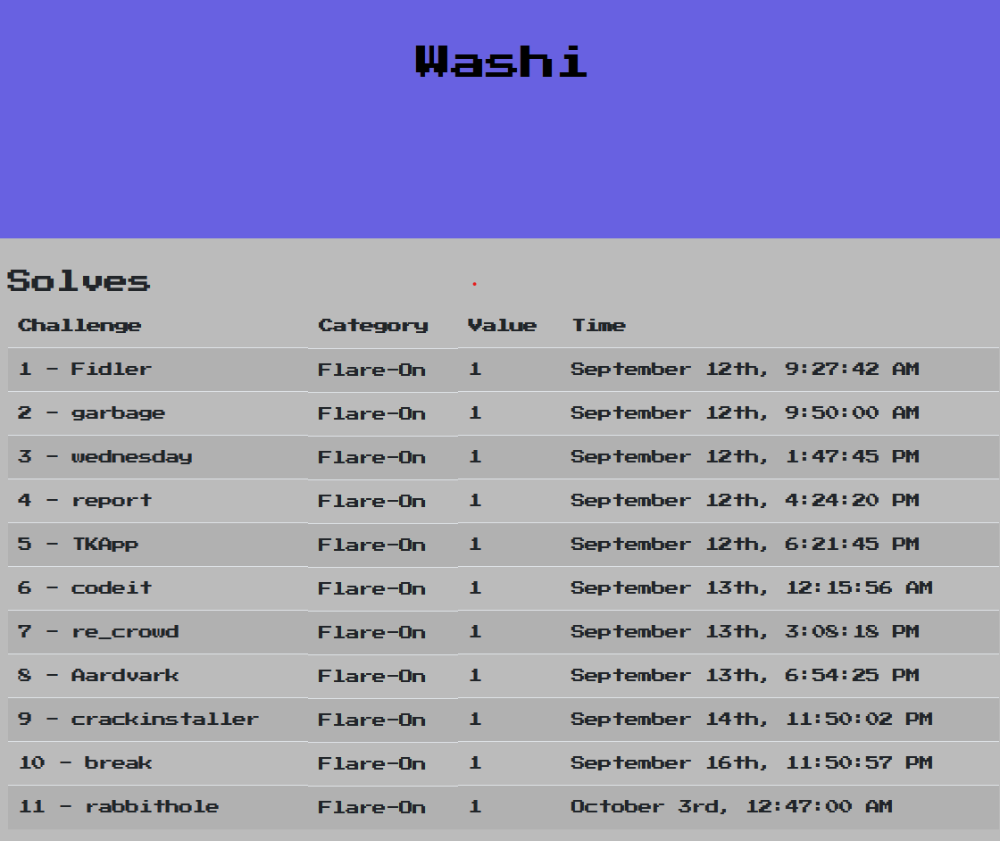

Flare-On 2020
=============

This directory contains write-ups with my solutions for Flare-On 2020 that was hosted by FireEye from September 11 to October 23 2020. 

Table of Contents
-----------------

- [1 - Fidler](1)
- [2 - garbage](2)
- [3 - wednesday](3)
- [4 - report](4)
- [5 - TKApp](5)
- [6 - codeit](6)
- [7 - re_crowd](7)
- [8 - Aardvark](8)
- [9 - crackinstaller](9)
- [10 - break](10)
- [11 - rabbithole](11)

Binaries
--------
Download the binaries [here](http://flare-on.com/files/Flare-On7_Challenges.zip).

Bragging rights
---------------

