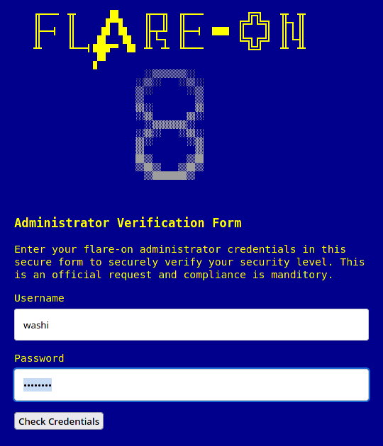
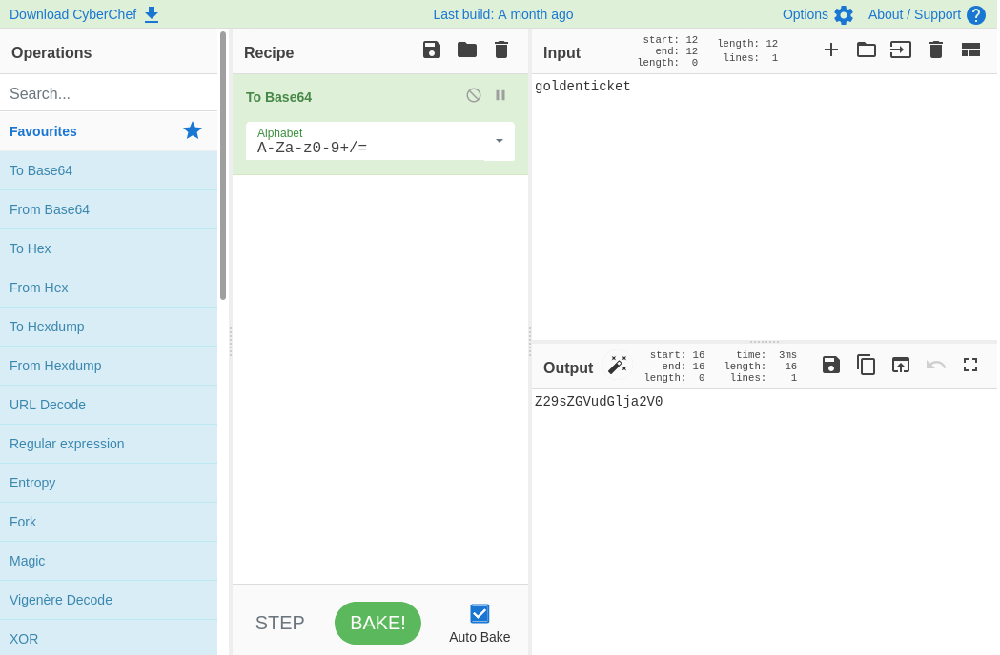

# 1 - credchecker

**Time spent:** 3 minutes

**Tools used:** Firefox, CyberChef

As with every other year, the first challenge is more of a CAPTCHA rather than a real difficult challenge. This time, it is a simple web challenge that when opened shows the following login page:



If we look into the source code of the web page, we see a very basic login verification function implemented in Javascript:

```js
function checkCreds() {
	if (username.value == "Admin" && atob(password.value) == "goldenticket") 
	{
		var key = atob(encoded_key);
		var flag = "";
		for (let i = 0; i < key.length; i++)
		{
			flag += String.fromCharCode(key.charCodeAt(i) ^ password.value.charCodeAt(i % password.value.length))
		}
		document.getElementById("banner").style.display = "none";
		document.getElementById("formdiv").style.display = "none";
		document.getElementById("message").style.display = "none";
		document.getElementById("final_flag").innerText = flag;
		document.getElementById("winner").style.display = "block";
	}
	else
	{
		document.getElementById("message").style.display = "block";
	}
}
```

From the outer-most if-statement, we can clearly see the username is supposed to be `"Admin"`. For the password, we can see the input password is fed to the `atob` function, and the result is compared to the string `"goldenticket"`. 

In Javascript, the `atob` function is used to decode base64 data. This means that in order to get past this if-statement, our password must be the base64 encoded version of the string `"goldenticket"`. We can simply use a tool like CyberChef to do that for us:



Filling in this as password will reveal the flag:


```
enter_the_funhouse@flare-on.com
```