# 10 - wizardcult

**Time spent:** Around a day.

**Tools used:** Wireshark, Ghidra, Ghidra Scripting, InspIRCd, LLDB + Voltron, Python

The last challenge is my second favourite challenge of this year. In this challenge, you are given a PCAP file, together with the following note:

```
We have one final task for you. We captured some traffic of a 
malicious cyber-space computer hacker interacting with our web
server. Honestly, I padded my resume a bunch to get this job 
and don't even know what a pcap file does, maybe you can figure
out what's going on.
```


## Orientation

If we open the file in Wireshark, we can see the capture is more or less split up in two parts. The first part consists of some HTTP traffic, whereas the second (larger) part consists of traffic that seems to be produced by two IRC chat clients. 

If we look at the files that are transferred over HTTP (File > Export Objects > HTTP), we see that there is one file called `induct` that was downloaded from `wizardcult.flare-on.com`, together with some fishy looking requests that seem to exploit some kind of command injection vulnerability in the software of a router.

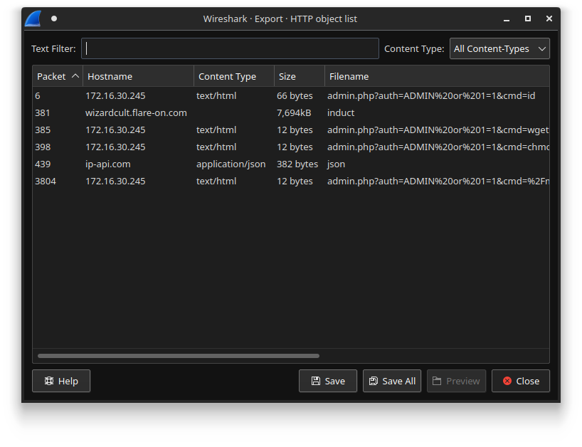

Extracting `induct` and running `file` on it reveals it is an ELF binary. However, opening this application in Ghidra promises some bad news. Firstly, the file is what seems to be a 11MB large binary full of statically linked library code. Secondly, the binary seems to be written in Go. This is problematic as it confuses Ghidra a lot. The Go compiler [does not use the conventional x86 calling conventions](https://dr-knz.net/go-calling-convention-x86-64-2020.html) used by other compilers such as the C or C++ compiler. It results in many stack variables being added to the final decompiler output in front of every function call, while the function calls themselves do not contain any arguments or return value, or instead have many weird stack variables that are not referenced anywhere else. Here is an example of such a decompiler output from function `main.init`:

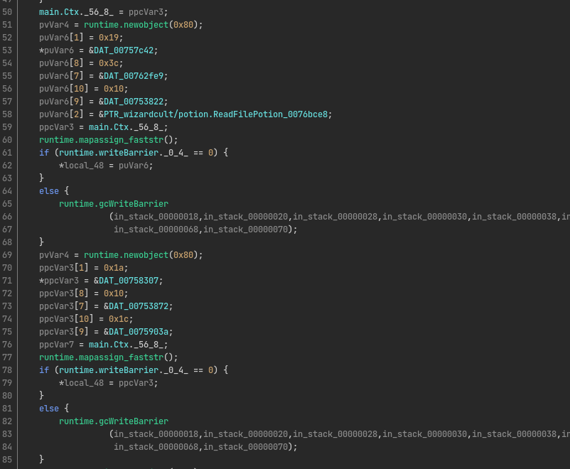

Lucky for us, a lot of the symbols are intact, and as such, it is relatively easy to figure out the general flow of the program, and identifying which functions are part of the statically linked libraries and therefore not as important to look into too much. Furthermore, most of these function names can be looked up on Google to see what they are used for. This is especially useful for identifying that this ELF is a chat bot. In the function `main.main`, we see references to [GIRC](github.com/lrstanley/girc) (a IRC library made by the user lrstanley on GitHub) to connect to an IRC server at the host `wizardcult.flare-on.com`:

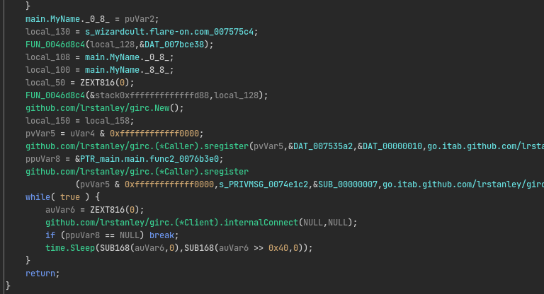

Looking into the IRC messages a bit, we can see it looks like some kind of text-based RPG game that is being played out by two IRC bot users. The two bots have joined a channel called `#dungeon`, and seem to be communicating via 3 types of exchanges, where the user `dung3onm4st3r13` is always the initiator. For example, in the first type of exchange, `dung3onm4st3r13` teaches the player a new potion by listing a huge list of ingredients (including duplicates):

```
:dung3onm4st3r13!user@127.0.0.1 PRIVMSG #dungeon :Izahl, welcome to the party.
:dung3onm4st3r13!user@127.0.0.1 PRIVMSG #dungeon :Izahl, you have learned how to create the Potion of Acid Resistance. To brew it you must combine magnifying glass, kernels of grain, silver spoon, fish tail, undead eyeball, undead eyeball, coal, ash, silver rod, gold-inlaid vial, rose petals, silver rod, honeycomb, phosphorus, undead eyeball, kernels of grain, tarts, bone, undead eyeball, coal, undead eyeball, tentacle of giant octopus or giant s
:dung3onm4st3r13!user@127.0.0.1 PRIVMSG #dungeon :quid, glass sliver, honeycomb, rose petals, pearl, snaketongue, undead eyeball, adamantine, bone, undead eyeball, tentacle of giant octopus or giant squid, focus, polished marble stone, gum arabic, an item distasteful to the target, mistletoe sprig, undead eyeball, kernels of grain, reed, bone, undead eyeball, ice, crystal bead, an item distasteful to the target, mistletoe sprig, gum arabic, an it
:dung3onm4st3r13!user@127.0.0.1 PRIVMSG #dungeon :em distasteful to the target, mistletoe sprig, undead eyeball, kernels of grain, caterpillar cocoon, bone, undead eyeball, adamantine, silk square, gum arabic, an item distasteful to the target, fur of bat, undead eyeball, kernels of grain, sulfur, bone, undead eyeball, adamantine, feather of owl, crystal bead, glass sliver, fur of bat, undead eyeball, kernels of grain, spheres of glass, bone, und
:dung3onm4st3r13!user@127.0.0.1 PRIVMSG #dungeon :ead eyeball, adamantine, feather of owl, chalks and inks infused with precious gems, glass sliver, fur of bat, undead eyeball, kernels of grain, cork, bone, undead eyeball, tentacle of giant octopus or giant squid, fur, pearl, polished marble stone, sweet oil, fur of bat, undead eyeball, kernels of grain, silver cage, bone, bone, bone, sponge, kernels of grain, adder's stomach, fish tail, undead e
:dung3onm4st3r13!user@127.0.0.1 PRIVMSG #dungeon :yeball, undead eyeball, jade dust, focus, polished marble stone, gum arabic, an item distasteful to the target, mistletoe sprig, earth, herbs, moonseeds, pearl, snaketongue, herbs, undead eyeball, kernels of grain, reed, bone, undead eyeball, undead eyeball, undead eyeball, adamantine, ivory portal (miniature), honeycomb, phosphorus, herbs, undead eyeball, rotten egg, bone, bone, bone, rope, kerne
:dung3onm4st3r13!user@127.0.0.1 PRIVMSG #dungeon :ls of grain, jewel-encrusted dagger, fish tail, undead eyeball, undead eyeball, rotten egg, crystal bead, an item distasteful to the target, mistletoe sprig, gum arabic, an item distasteful to the target, mistletoe sprig, earth, herbs, moonseeds, pearl, snaketongue, herbs, undead eyeball, kernels of grain, caterpillar cocoon, bone, undead eyeball, undead eyeball, undead eyeball, adamantine, ivory 
:dung3onm4st3r13!user@127.0.0.1 PRIVMSG #dungeon :portal (miniature), honeycomb, phosphorus, herbs, undead eyeball, rotten egg, bone, bone, bone, tears, kernels of grain, clay and water, spider, undead eyeball, undead eyeball, food morsel, quiver, butter, moonseeds, phosphorus, niter, silk square, gum arabic, an item distasteful to the target, undead eyeball, kernels of grain, sulfur, bone, undead eyeball, kernels of grain, gem as powder, bone, b
:dung3onm4st3r13!user@127.0.0.1 PRIVMSG #dungeon :one, silk square, kernels of grain, clay pot of grave dirt, fish tail, undead eyeball, undead eyeball, fish tail, silk square, gum arabic, an item distasteful to the target, undead eyeball, kernels of grain, gem as powder, bone, undead eyeball, tentacle of giant octopus or giant squid, undead eyeball, fish tail, chalks and inks infused with precious gems, snaketongue, snaketongue, undead eyeball, 
:dung3onm4st3r13!user@127.0.0.1 PRIVMSG #dungeon :adamantine, bone, undead eyeball, fish tail, earth, honeycomb, mistletoe sprig, undead eyeball, adamantine, bone, undead eyeball, spider, ash, snaketongue, undead eyeball, adamantine, bone, undead eyeball, adamantine, silk square, gold-inlaid vial, polished marble stone, humanoid blood, undead eyeball, adamantine, bone, undead eyeball, rotten egg, focus, polished marble stone, fur of bat, mistleto
:dung3onm4st3r13!user@127.0.0.1 PRIVMSG #dungeon :e sprig, silver rod, an item distasteful to the target, snaketongue, mistletoe sprig, pearl, gold-inlaid vial, polished marble stone, fur of bat, undead eyeball, kernels of grain, ammunition, bone, bone, bone, dust, kernels of grain, tiny piece of target matter, spider, undead eyeball, undead eyeball, soil mixture in a small bag, quiver, butter, moonseeds, phosphorus, niter, focus, polished marble
:dung3onm4st3r13!user@127.0.0.1 PRIVMSG #dungeon : stone, fur of bat, mistletoe sprig, silver rod, an item distasteful to the target, snaketongue, mistletoe sprig, pearl, gold-inlaid vial, polished marble stone, undead eyeball, kernels of grain, ammunition, bone, undead eyeball, kernels of grain, flesh, bone, bone, focus, kernels of grain, iron filings or powder, fish tail, undead eyeball, undead eyeball, jade dust, focus, polished marble stone, 
:dung3onm4st3r13!user@127.0.0.1 PRIVMSG #dungeon :fur of bat, mistletoe sprig, silver rod, an item distasteful to the target, snaketongue, mistletoe sprig, pearl, gold-inlaid vial, polished marble stone, undead eyeball, kernels of grain, flesh, bone, undead eyeball, ice, undead eyeball, ice, crystal bead, gum arabic, snaketongue, gold-inlaid vial, humanoid blood, herbs, undead eyeball, adamantine, bone, undead eyeball, spider, chalks and inks inf
:dung3onm4st3r13!user@127.0.0.1 PRIVMSG #dungeon :used with precious gems, hot pepper, undead eyeball, adamantine, bone, undead eyeball, spider, chalks and inks infused with precious gems, pebble, undead eyeball, adamantine, bone, undead eyeball, spider, chalks and inks infused with precious gems, stone, undead eyeball, adamantine, bone, undead eyeball, spider, tallow, phosphorus, undead eyeball, adamantine, bone, undead eyeball, adamantine, silk
:dung3onm4st3r13!user@127.0.0.1 PRIVMSG #dungeon : square, gold-inlaid vial, polished marble stone, humanoid blood, undead eyeball, adamantine, bone, bone, bone, tears, kernels of grain, cloak, spider, undead eyeball, undead eyeball, food morsel, quiver, butter, moonseeds, phosphorus, niter, feather of owl, crystal bead, glass sliver, undead eyeball, kernels of grain, spheres of glass, bone, undead eyeball, kernels of grain, ruby (as dust), bone,
:dung3onm4st3r13!user@127.0.0.1 PRIVMSG #dungeon : bone, distilled spirits, kernels of grain, black pearl (as crushed powder), fish tail, undead eyeball, undead eyeball, fish tail, feather of owl, crystal bead, glass sliver, undead eyeball, kernels of grain, ruby (as dust), bone, undead eyeball, fish tail, undead eyeball, spider, chalks and inks infused with precious gems, hot pepper, undead eyeball, adamantine, bone, undead eyeball, spider, chal
:dung3onm4st3r13!user@127.0.0.1 PRIVMSG #dungeon :ks and inks infused with precious gems, pebble, undead eyeball, adamantine, bone, undead eyeball, adamantine, earth, honeycomb, mistletoe sprig, honeycomb, undead eyeball, kernels of grain, leather loop, bone, bone, bone, makeup, kernels of grain, gilded acorn, spider, undead eyeball, undead eyeball, tentacle of giant octopus or giant squid, quiver, butter, pearl, polished marble stone, mistletoe 
:dung3onm4st3r13!user@127.0.0.1 PRIVMSG #dungeon :sprig, undead eyeball, kernels of grain, leather loop, bone, undead eyeball, adamantine, bone, bone, tears, kernels of grain, alum soaked in vinegar, spider, undead eyeball, undead eyeball, food morsel, quiver, butter, moonseeds, phosphorus, niter, feather of owl, chalks and inks infused with precious gems, glass sliver, undead eyeball, kernels of grain, cork, bone, undead eyeball, kernels of grai
:dung3onm4st3r13!user@127.0.0.1 PRIVMSG #dungeon :n, snakeskin glove, bone, bone, distilled spirits, kernels of grain, cured leather, fish tail, undead eyeball, undead eyeball, fish tail, feather of owl, chalks and inks infused with precious gems, glass sliver, undead eyeball, kernels of grain, snakeskin glove, bone, undead eyeball, fish tail, undead eyeball, spider, chalks and inks infused with precious gems, hot pepper, undead eyeball, adamanti
:dung3onm4st3r13!user@127.0.0.1 PRIVMSG #dungeon :ne, bone, undead eyeball, spider, chalks and inks infused with precious gems, pebble, undead eyeball, adamantine, bone, undead eyeball, adamantine, earth, honeycomb, mistletoe sprig, honeycomb, undead eyeball, kernels of grain, leather loop, bone, bone, bone, salt, kernels of grain, eggshells, spider, undead eyeball, undead eyeball, bitumen (a drop), quiver, butter, moonseeds, phosphorus, niter, f
:dung3onm4st3r13!user@127.0.0.1 PRIVMSG #dungeon :ur, pearl, polished marble stone, sweet oil, undead eyeball, kernels of grain, silver cage, bone, undead eyeball, kernels of grain, flame, bone, bone, pitch, kernels of grain, crystal sphere, fish tail, undead eyeball, undead eyeball, adamantine, fur, pearl, polished marble stone, sweet oil, undead eyeball, kernels of grain, flame, bone, undead eyeball, adamantine, undead eyeball, food morsel, fur
:dung3onm4st3r13!user@127.0.0.1 PRIVMSG #dungeon :, mandrake root, earth, herbs, moonseeds, pearl, snaketongue, herbs, undead eyeball, adamantine, bone, undead eyeball, tentacle of giant octopus or giant squid, fur, mandrake root, feather of owl, herbs, rose petals, undead eyeball, adamantine, bone, undead eyeball, food morsel, feather of owl, mandrake root, earth, herbs, moonseeds, pearl, snaketongue, herbs, undead eyeball, adamantine, bone, und
:dung3onm4st3r13!user@127.0.0.1 PRIVMSG #dungeon :ead eyeball, tentacle of giant octopus or giant squid, feather of owl, mandrake root, feather of owl, herbs, rose petals, undead eyeball, adamantine, bone, bone, bone, fleece, kernels of grain, tarts, undead eyeball, ruby vial, iron, polished marble stone, undead eyeball, bone, undead eyeball, bone, undead eyeball, spider, tentacle of giant octopus or giant squid, coal, undead eyeball, spider, spi
:dung3onm4st3r13!user@127.0.0.1 PRIVMSG #dungeon :der, food morsel, spider, ice, bone, undead eyeball, giant slug bile, undead eyeball, food morsel, undead eyeball, undead eyeball, spider, spider, bone, undead eyeball, spider, undead eyeball, undead eyeball, undead eyeball, spider, spider, adamantine, undead eyeball, spider, bone, undead eyeball, spider, spider, food morsel, spider, ice, undead eyeball, spider, bone, undead eyeball, spider, undea
:dung3onm4st3r13!user@127.0.0.1 PRIVMSG #dungeon :d eyeball, food morsel, undead eyeball, adamantine, spider, ice, bone, undead eyeball, spider, undead eyeball, adamantine, undead eyeball, food morsel, spider, ice, bone, undead eyeball, spider, undead eyeball, food morsel, undead eyeball, spider, spider, ice, bone, bone, tentacle of giant octopus or giant squid, fish tail, undead eyeball, spider, spider, food morsel, spider, ice, bone, undead eye
:dung3onm4st3r13!user@127.0.0.1 PRIVMSG #dungeon :ball, shamrock, undead eyeball, ruby vial, undead eyeball, earth, bone, undead eyeball, spider, undead eyeball, food morsel, fish tail, ice, bone, bone, fish tail, fish tail, fish tail, adamantine, bone, undead eyeball, adamantine, undead eyeball, spider, undead eyeball, spider, bone, undead eyeball, adamantine, undead eyeball, adamantine, undead eyeball, ice, bone, and bone.
PRIVMSG #dungeon :I have now learned to brew the Potion of Acid Resistance
```

In the second exchange, we see the dungeon master guiding the user into a new dungeon:

```
:dung3onm4st3r13!user@127.0.0.1 PRIVMSG #dungeon :Izahl, you enter the dungeon Graf's Infernal Disco. It is frightening, virtual, danish, flimsy, gruesome great, dark oppressive, bad, average, virtual, last, more strange, inhospitable, slimy, average, and few dismal..
PRIVMSG #dungeon :I draw my sword and walk forward into Graf's Infernal Disco carefully, my eyes looking for traps and my ears listening for enemies.
```

And finally, we can witness a battle between the user and a MOB in the third type of exchange:
```
:dung3onm4st3r13!user@127.0.0.1 PRIVMSG #dungeon :Izahl, you encounter a Goblin in the distance. It stares at you imposingly. The beast smells quite foul. What do you do?
PRIVMSG #dungeon :I quaff my potion and attack!
PRIVMSG #dungeon :I cast Moonbeam on the Goblin for 205d205 damage!
PRIVMSG #dungeon :I cast Reverse Gravity on the Goblin for 253d213 damage!
PRIVMSG #dungeon :I cast Water Walk on the Goblin for 216d195 damage!
PRIVMSG #dungeon :I cast Mass Suggestion on the Goblin for 198d253 damage!
PRIVMSG #dungeon :I cast Planar Ally on the Goblin for 199d207 damage!
PRIVMSG #dungeon :I cast Water Breathing on the Goblin for 140d210 damage!
PRIVMSG #dungeon :I cast Conjure Barrage on the Goblin for 197d168 damage!
PRIVMSG #dungeon :I cast Water Walk on the Goblin for 204d198 damage!
PRIVMSG #dungeon :I cast Call Lightning on the Goblin for 193d214 damage!
PRIVMSG #dungeon :I cast Branding Smite on the Goblin!
PRIVMSG #dungeon :I do believe I have slain the Goblin
```

A full transcript of the IRC chat can be obtained by following the appropriate TCP stream in Wireshark (Right Click > Follow > TCP Stream). A copy of it can be found [here](extracted_files/irc/full_conversation.txt). 

Clearly, this is some kind of protocol that we need to reverse engineer, and judging from the present symbols and strings in the ELF binary that we extracted earlier, we will probably be finding it there. Let's get to work!

## Tooling

To make things easier for myself, I decided to simulate the scenario that was portrayed in the chat logs. For that we need our own IRC server, which we can easily set up using software like [InspIRCd](https://www.inspircd.org/). Then, if we add `wizardcult.flare-on.com` to the hosts file, we can make the application connect to our own server. Furthermore, since the IRC protocol is a very simple text-based protocol, we can simulate the dungeon master's input and output system by writing some simple Python script that communicates with the server directly through a TCP socket. This is very useful, since it allows us to do debug the application, test our own inputs, and verify our findings. I used the following script as a skeleton:

```python
import time
from pwn import *

def send_message(msg):
    line_limit = 455 # Change accordingly to your InspIRCd config.
    for i in range(0, len(msg), line_limit):
        x = min(line_limit, len(msg)-i)
        chunk = msg[i:i+x]
        p.sendline("PRIVMSG #dungeon :" + chunk)
        time.sleep(0.25)
    
if __name__ == "__main__":
    p = remote("127.0.0.1", 12346) # Change accordingly to your InspIRCd config.
    p.sendline("NICK dung3onm4st3r13")
    p.sendline("USER dungeonmaster * * :DungeonMaster")

    p.recvuntil("End of message of the day.")
    p.sendline("JOIN #dungeon")

    while True:
        p.recvuntil("Hello, I am ")
        USER_NAME = p.recvuntil(",").decode()[:-1]
        p.recvline()

        send_message(f"Hello :{USER_NAME}, what is your quest?")
        p.recvline()
        send_message(f":{USER_NAME}, welcome to the party.")
        time.sleep(1)

        # do something here..
```

To fix up some of the calling conventions in Ghidra, I wrote a little Ghidra script that allows me to add parameters and return values to a function. This script can be found [here](scripts/GoCallingConv.java). It's very hacky and far from perfect, but it was good enough for me to solve the challenge.


## Interpreting the word lists

Since we know the long lists of ingredients, spells, and adjectives are probably some kind of data that is being communicated between the two users, we want to find in the given IRC bot the code that is responsible for interpreting and/or constructing these lists of words. Lucky for us, with most symbols still being in place, this is very easy to find. The binary defines a function called `wizardcult/comms.ProcessDMMessage`, which calls `wizardcult/tables.GetBytesFromTable` at address `0x00653166` to carve out the individual words and interpret them as bytes:

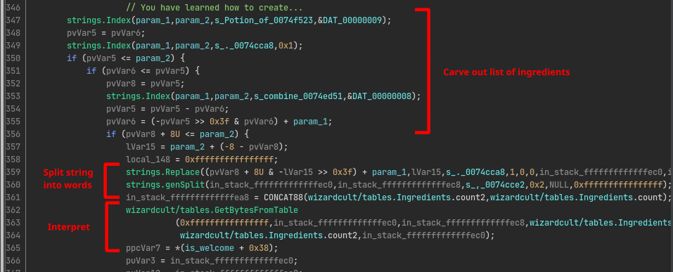

The `wizardcult/tables.GetBytesFromTable` function is very simple, it takes a table of strings, and translates every word to the index within that table. Since the tables don't exceed 256 elements, this results in a mapping from words to bytes.

Let's reimplement this in Python so that we can read messages ourselves, and build up our own messages if we need it. If we look at the structure of such a string table, we can see it is fairly straightforward. The table itself contains a pointer to the beginning of an array of Go string structures, as well as a field that contains the length of the array. A single Go string is very similar; it contains a pointer to the beginning of the raw string data, followed by the length of characters that the string contains:

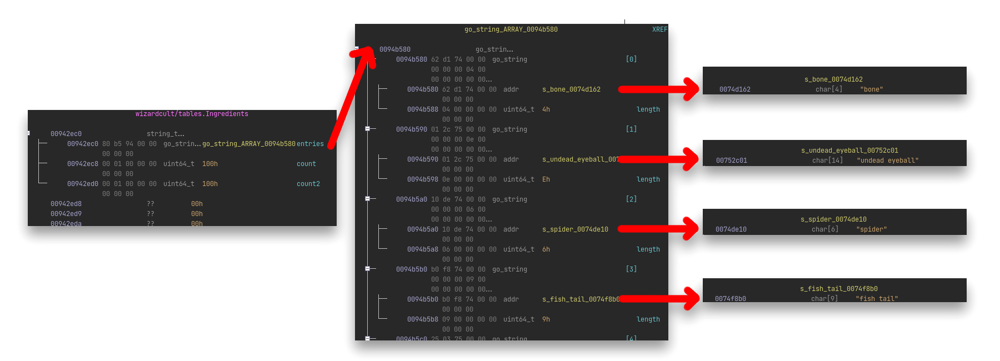

With a simple Ghidra script ([DumpGoStringTable.java](scripts/DumpGoStringTable.java)) we can quickly extract all strings that are stored in the table at the current cursor:

```java
import ghidra.app.script.GhidraScript;
import ghidra.program.model.listing.*;
import ghidra.program.model.data.*;
import ghidra.program.model.symbol.*;
import java.util.*;

public class DumpGoStringTable extends GhidraScript {

    public void run() throws Exception {
        var addressFactory = currentProgram.getAddressFactory();
        var space = addressFactory.getDefaultAddressSpace();
        var memory = currentProgram.getMemory();       

        var entriesAddress = memory.getLong(currentAddress);
        var entriesCount = memory.getLong(currentAddress.add(8));
                
        var rawValues = new long[(int) entriesCount * 2]; 
        memory.getLongs(space.getAddress(entriesAddress), rawValues);

        println("----");

        for (int i = 0; i < rawValues.length; i += 2) {
            var dataAddr = space.getAddress(rawValues[i]);
            var buffer = new byte[(int) rawValues[i + 1]];
            memory.getBytes(dataAddr, buffer);
            println('"' + new String(buffer, "UTF-8") + "\", ");
        }

        println("----");
    }
}
```

We can do this for all tables in the binary, and build up a look up table ([word_lists.py](scripts/word_lists.py)) that we can use in to build yet another script ([words_to_bytes.py](scripts/words_to_bytes.py)) that translates these chat messages to the actual bytes that are being transferred:

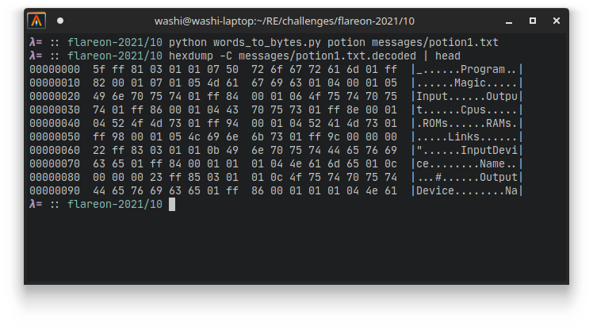

All decoded messages can be found [here](https://github.com/Washi1337/ctf-writeups/writeups/flare-on/2021/10/messages/).


## Finding the meaning behind the potions

Looking at the decoded potions data, we see that it looks like some kind of serialized data format that has some strings in it. Looking in Ghidra, we can also see the decoded data is fed into a function called `wizardcult/vm.LoadProgram`. This function calls yet another decoder function, but this time it is a thing called a `gob` encoder:

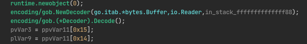

Quick Google search reveals [gob encoding](https://pkg.go.dev/encoding/gob) is some form of data encoding used in Go binaries to serialize arbitrary objects. I don't really know how to write in Go, nor do I have any intention on learning it. Lucky for me however, there is a small library called [pygob](https://github.com/mgeisler/pygob) written by `mgeisler` that allows us to decode this just fine without any problems using Python instead:

```python
import pygob
import sys 

path = sys.argv[1]
data = open(path, "rb").read()
program = pygob.load(data)

print(program)
```

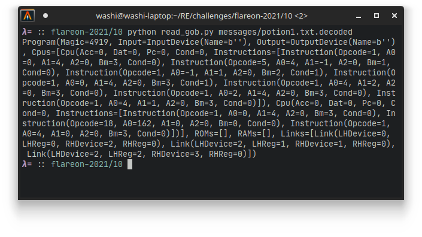

Looking at the output, we see some kind of structure that resembles a class for a Virtual Machine, with a bunch of devices and instructions. It seems the potions are actually more like programs that the chat bot is supposed to execute after receiving. Let's dive into Ghidra more to figure out how exactly it works.


## Analyzing the VM structure

Looking at the output of the `gob` data, we can already identify a couple of components that this VM has. Each program seems to define the following:

- A magic number (seems to be always `4919`),
- An input device,
- An output device,
- A list of CPUs. Each CPU has the following:
    - Four internal registers called `Acc`, `Dat`, `Pc` and `Cond`
    - A list of instructions, which each define:
        - An opcode,
        - Three operands `A0`, `A1` and `A2`,
        - Two special values called `Bm` and `Cond`.
- A list of ROM banks,
- A list of RAM banks, and
- A list of links, which seem to be linking registers of devices together based on some kind of device and register index.

To find what is responsible for executing the instructions, we again refer to the symbols stored in the binary. The function `wizardcult/vm.(*Cpu).ExecuteInstruction` seems to be a very good candidate, which is nothing more than a huge switch statement for all the different operations that the virtual machine defines. We can summarize all of them in the following manner:

| OpCode | Mnemonic             | Semantics                       |
|:------:|----------------------|:--------------------------------|
| `0x00` | `nop`                | Do nothing                      |
| `0x01` | `mov A0, A1`         | Assign register `A1` value `A0` |
| `0x05` | `teq A0, A1`         | Test `A0 == A1`                 |
| `0x06` | `tgt A0, A1`         | Test `A0 > A1`                  |
| `0x07` | `tlt A0, A1`         | Test `A0 < A1`                  |
| `0x08` | `tcp A0, A1`         | Compare `A0` and `A1`           |
| `0x09` | `add A0`             | `acc += A0`                     |
| `0x0a` | `sub A0`             | `acc -= A0`                     |
| `0x0b` | `mul A0`             | `acc *= A0`                     |
| `0x0c` | `div A0`             | `acc /= A0`                     |
| `0x0d` | `not`                | `acc = ~acc`                    |
| `0x10` | `and A0`             | `acc &= A0`                     |
| `0x11` | `or A0`              | `acc |= A0`                     |
| `0x12` | `xor A0`             | `acc ^= A0`                     |
| `0x13` | `shl A0`             | `acc <<= A0`                    |
| `0x14` | `shr A0`             | `acc >>= A0`                    |


Before `wizardcult/vm.(*Cpu).ExecuteInstruction` function starts its instruction decoding, it first tests whether the value of the internal register `Cond` is equal to the `Cond` flag in the instruction. If it is not, then it skips execution. This is the VM's way to realize flow control such as if statements:

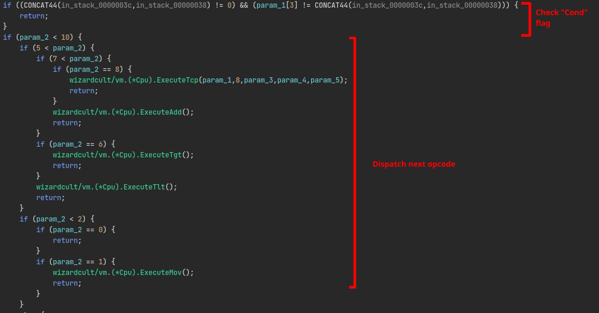

The meaning of the `Bm` flags can be inferred by looking into some of the instructions dispatcher methods. For example, if we look into the handler for the `mov` instruction, we can see the `Bm` flag is tested prior to calling `wizardcult/vm.(*Cpu).SetRegister`. The if statement checks whether a specific bit in `Bm` is set, and if it is, then it will use the value of `A0` as an index and obtain the value of the register at that index, instead of using the operand as a constant literal:

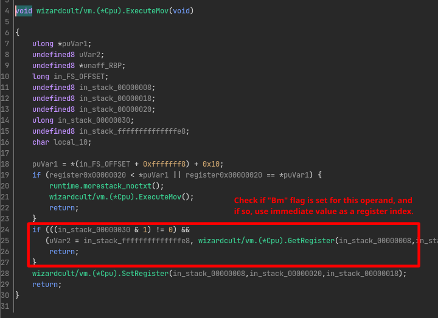

From the functions `wizardcult/vm.(*Cpu).GetRegister` and `wizardcult/vm.(*Cpu).SetRegister` we can infer the register map:

| Index  | Register                      |
|:------:|-------------------------------|
| `0-3`  | IO pin `0-3`                  |
| `4`    | Accumulator register (`acc`)  |
| `5`    | Data register (`dat`)         |


The IO pins are an interesting detail of this VM. They allow the programmer to connect virtual devices together through registers. For example, if we write to register 0 on device A, and IO pin 0 is wired to register 1 of device B, then executing e.g. a `mov 1234, 0` will therefore write the value `1234` to register 1 of device B. This wiring is done by defining links in the VM data. If we look into `wizardcult/vm.LoadProgram`, we can infer the mapping between indices and devices as well by looking at the code that is responsible for realizing these links.

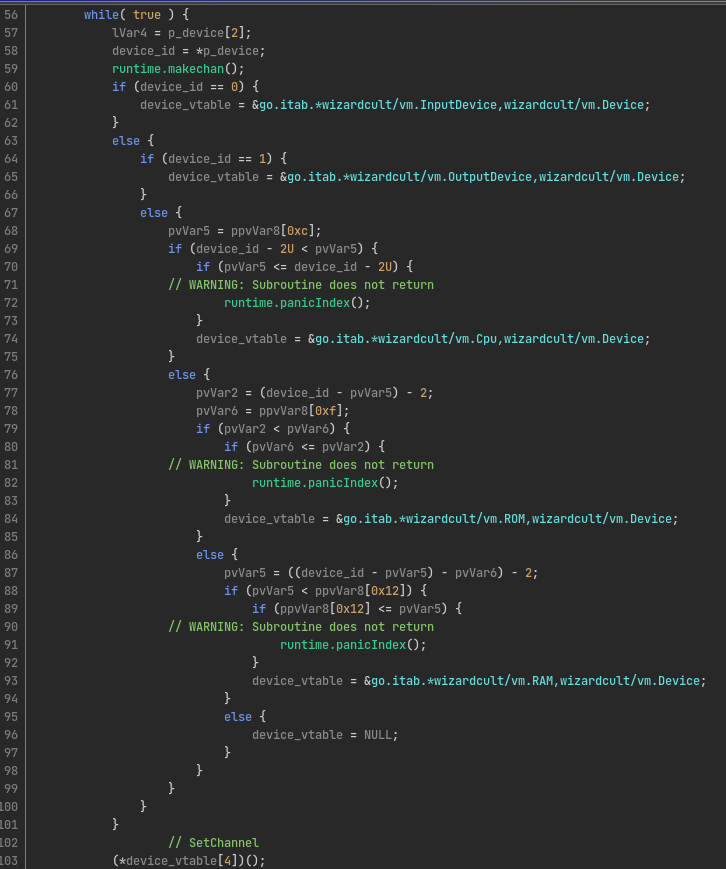

We can summarize this by the following table:

| Index     | Device   |
|:----------|----------|
| `0`       | `stdin`  |
| `1`       | `stdout` |
| `2+n`     | CPU `n`  |
| `2+n+m`   | ROM `m`  | 
| `2+n+m+k` | RAM `k`  |


## Devirtualization

With all the information discussed in the above, we can write a Python script ([disassembler.py](scripts/disassembler.py)) that disassembles and transpiles all of the virtualized bytecode. Copies of the disassemblies of the two potion programs can be found [here](messages/potion1.disassembled) and [here](messages/potion2.disassembled).

For the first potion we get a very simple output.

```
cpu0:
    acc = reg0
    c = acc == -1
    if c == 1 then stdout.reg0 = -1
    if c == 1 then acc = reg0
    cpu1.reg0 = acc
    acc = cpu1.reg0
    stdout.reg0 = acc

cpu1:
    acc = reg0
    acc ^= 162
    reg0 = acc
```

If we transcribe this to normal Python, it would be similar to the code below

```python
def cpu0(x):
    if x == -1:
        return -1
    return cpu1(x)

def cpu1(x):
    return x ^ 162
```

Meaning that every character that is fed into this program is XOR'ed with the constant `162`. We can test that this correct, by looking at the first battle. The dungeon message decodes to what seems to be an `ls` or list files command, and the response is indeed the result XOR'ed with byte `162`:

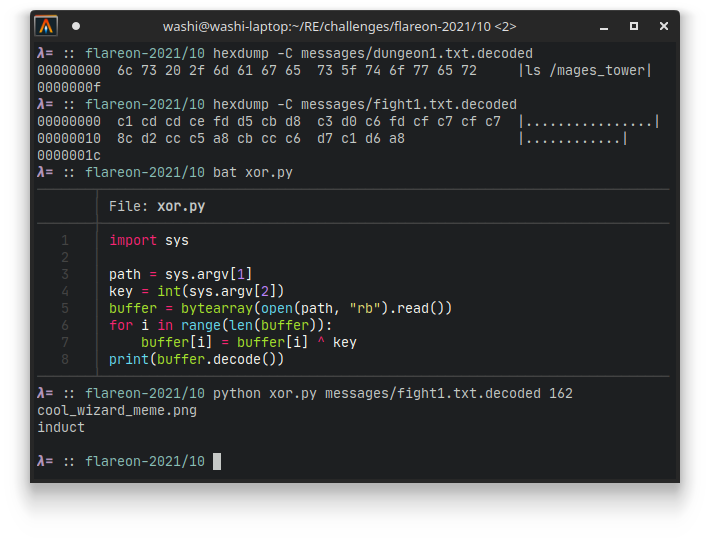

Now that we have verified this, we can move on to the larger second potion, which is more complicated, but not by much. If we rewrite the [disassembled code](messages/potion2.disassembled) to more normal Python code, we can get something like the following:

```python
def cpu0(c):
    return cpu1(c)

def cpu1(c):
    dat = cpu2(cpu5(cpu2(c)))
    if dat & 128 == 128:
        a = dat ^ 66
    else:
        a = dat
    
    return (~a) & 0xFF

def cpu2(c):
    if c > 99:
        return cpu3(c)
    else:
        return rom0(c)

def cpu3(c):
    if c > 199:
        return cpu4(c)
    else:
        return rom1(c - 100)

def cpu4(c):
    return rom2(c - 200)

def cpu5(c):
    x = (rom3(0) & 1) == 1
    a = rom3(1)
    if x:
        a = (~a) & 0xFF
    return a ^ c

def rom0(c):
    data = [90, 132, 6, 69, 174, 203, 232, 243, 87, 254, 166, 61, 94, 65, 8, 208, 51, 34, 33, 129, 32, 221, 0, 160, 35, 175, 113, 4, 139, 245, 24, 29, 225, 15, 101, 9, 206, 66, 120, 62, 195, 55, 202, 143, 100, 50, 224, 172, 222, 145, 124, 42, 192, 7, 244, 149, 159, 64, 83, 229, 103, 182, 122, 82, 78, 63, 131, 75, 201, 130, 114, 46, 118, 28, 241, 30, 204, 183, 215, 199, 138, 16, 121, 26, 77, 25, 53, 22, 125, 67, 43, 205, 134, 171, 68, 146, 212, 14, 152, 20]
    return data[c]

def rom1(c):
    data = [185, 155, 167, 36, 27, 60, 226, 58, 211, 240, 253, 79, 119, 209, 163, 12, 72, 128, 106, 218, 189, 216, 71, 91, 250, 150, 11, 236, 207, 73, 217, 17, 127, 177, 39, 231, 197, 178, 99, 230, 40, 54, 179, 93, 251, 220, 168, 112, 37, 246, 176, 156, 165, 95, 184, 57, 228, 133, 169, 252, 19, 2, 81, 48, 242, 105, 255, 116, 191, 89, 181, 70, 23, 194, 88, 97, 153, 235, 164, 158, 137, 238, 108, 239, 162, 144, 115, 140, 84, 188, 109, 219, 44, 214, 227, 161, 141, 80, 247, 52]
    return data[c]

def rom2(c):
    data = [213, 249, 1, 123, 142, 190, 104, 107, 85, 157, 45, 237, 47, 147, 21, 31, 196, 136, 170, 248, 13, 92, 234, 86, 3, 193, 154, 56, 5, 111, 98, 74, 18, 223, 96, 148, 41, 117, 126, 173, 233, 10, 49, 180, 187, 186, 135, 59, 38, 210, 110, 102, 200, 76, 151, 198]
    return data[c]

rom9_idx = 0
def rom3(c):
    global rom9_idx
    
    if c == 0:
        return rom9_idx 
    
    data = [97, 49, 49, 95, 109, 89, 95, 104, 111, 109, 49, 101, 115, 95, 104, 52, 116, 51, 95, 98, 52, 114, 100, 115]
    x = data[rom9_idx]
    rom9_idx += 1
    return x
```

## Getting the flag

All that is left is writing the reverse of potion 2 to decrypt the second message that was sent through the second (longer) fight.

If we look at the transpiled Python code, we can notice that ROM 0, 1 and 2 are nothing more than a split up S-Box, which is accessed through CPU 2, 3, and 4. ROM 3 seems to look more like a key, as the embedded data contains the bytes for the string `a11_mY_hom1es_h4t3_b4rds`. This means that the algorithm boils down to some simple bitwise operations that can be reversed relatively easily, by simply inverting the S-Box (use `index` instead of `[]`), and reversing the operations one-by-one:

```python
SBOX = [
    90, 132, 6, 69, 174, 203, 232, 243, 87, 254, 166, 61, 94, 65, 8, 208, 51, 34, 33, 129, 32, 221, 0, 160, 35, 175, 113, 4, 139, 245, 24, 29, 225, 15, 101, 9, 206, 66, 120, 62, 195, 55, 202, 143, 100, 50, 224, 172, 222, 145, 124, 42, 192, 7, 244, 149, 159, 64, 83, 229, 103, 182, 122, 82, 78, 63, 131, 75, 201, 130, 114, 46, 118, 28, 241, 30, 204, 183, 215, 199, 138, 16, 121, 26, 77, 25, 53, 22, 125, 67, 43, 205, 134, 171, 68, 146, 212, 14, 152, 20,
    185, 155, 167, 36, 27, 60, 226, 58, 211, 240, 253, 79, 119, 209, 163, 12, 72, 128, 106, 218, 189, 216, 71, 91, 250, 150, 11, 236, 207, 73, 217, 17, 127, 177, 39, 231, 197, 178, 99, 230, 40, 54, 179, 93, 251, 220, 168, 112, 37, 246, 176, 156, 165, 95, 184, 57, 228, 133, 169, 252, 19, 2, 81, 48, 242, 105, 255, 116, 191, 89, 181, 70, 23, 194, 88, 97, 153, 235, 164, 158, 137, 238, 108, 239, 162, 144, 115, 140, 84, 188, 109, 219, 44, 214, 227, 161, 141, 80, 247, 52,
    213, 249, 1, 123, 142, 190, 104, 107, 85, 157, 45, 237, 47, 147, 21, 31, 196, 136, 170, 248, 13, 92, 234, 86, 3, 193, 154, 56, 5, 111, 98, 74, 18, 223, 96, 148, 41, 117, 126, 173, 233, 10, 49, 180, 187, 186, 135, 59, 38, 210, 110, 102, 200, 76, 151, 198,
]

KEY = [97, 49, 49, 95, 109, 89, 95, 104, 111, 109, 49, 101, 115, 95, 104, 52, 116, 51, 95, 98, 52, 114, 100, 115]

def inverse_sbox(b):
    return SBOX.index(b)

def decrypt(data):
    result = bytearray()

    for i in range(len(data)):
        a = (~data[i]) & 0xFF
        if a & 128 == 128:
            a ^= 66

        a = inverse_sbox(a)

        key_idx = i % len(KEY)
        a ^= KEY[key_idx]
        if (key_idx & 1) == 1:
            a = (~a) & 0xFF
        a = inverse_sbox(a)
        result.append(a)

    return result

encrypted = open("messages/fight2.txt.decoded", "rb").read()
decrypted = decrypt(encrypted)
open("output.png", "wb").write(decrypted)
```

Running this script outputs a PNG image...


... revealing the flag:

```
wh0_n33ds_sw0rds_wh3n_you_h4ve_m4ge_h4nd@flare-on.com
```

## Closing words

This challenge was a lot of fun. I really liked the setting, and analyzing virtual machines is one of my favourite parts about software reverse engineering. The structure of the VM was very interesting, and the linking of devices made it feel quite unique in comparison to other VMs that I have analyzed in the past. 

It also made me realize how inefficient Go binaries are with the weird calling conventions going on. I am not sure why exactly Go uses this approach as opposed to the more traditional conventions like `cdecl` or `stdcall`. It almost seems like an obfuscation mechanism that you get for free when you write your program in Go, as Ghidra seems to have a lot of trouble understanding it out of the box. 

Overall, very interesting challenge and hope to see more like this in future installments of Flare-On.

