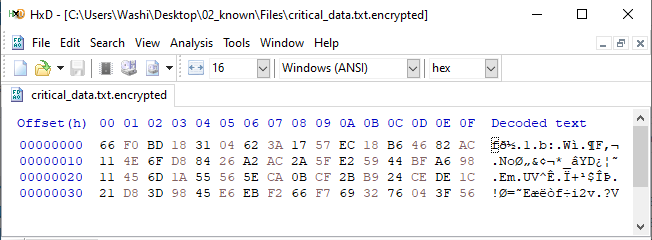
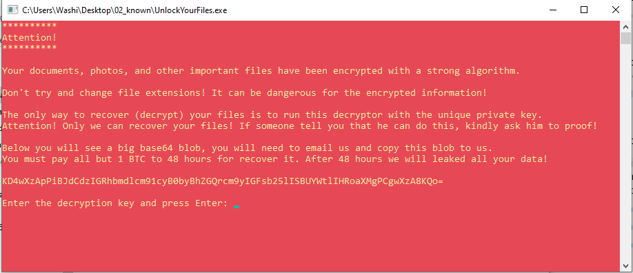

# 2 - known

**Time spent:** 40 minutes

**Tools used:** Ghidra, Python


The second challenge consists of a Windows executable file called `UnlockYourFiles.exe`, as well as a bunch of files with the `.encrypted` extension. The note states:

```
We need your help with a ransomware infection that tied up some of our critical files. Good luck.
```

## Orientation

One of the first thing that you'll probably notice, is that one of the files in the `Files` directory is called `critical_data.txt.encrypted`.  Naturally the contents is encrypted, but it is a pretty good guess that this file probably contains the flag:




When we open the executable file, we are greeted with a scary looking message put into a red command prompt window. It tells us that all our files are encrypted, and the only way to decrypt is to fill in the private key in this decryptor program:




If we open the application in Ghidra, we notice the application is relatively simple. 
```c
void entry(void)
{
    bool bVar1;
    undefined3 extraout_var;
    char password [8];
    DWORD local_c;
    HANDLE local_8;
    
    password._0_4_ = 0;
    password._4_4_ = 0;
    local_8 = GetStdHandle(0xfffffff6);
    CONSOLE_HANDLE = GetStdHandle(0xfffffff5);
    SetConsoleTextAttribute(CONSOLE_HANDLE,0xce);
    WriteConsoleA(CONSOLE_HANDLE,s_**********_Attention!_**********_00403000,0x70a,NULL,NULL);
    ReadConsoleA(local_8,password,8,&local_c,NULL);
    bVar1 = FUN_00401370(password);
                    // WARNING: Subroutine does not return
    ExitProcess(CONCAT31(extraout_var,bVar1));
}
```

It starts off by printing exactly this long message to the standard output, and asks for an input key. The actual decryption magic happens in `FUN_00401370`. This function simply iterates over all files in the `Files` directory, and then calls function `FUN_00401220` for every file. This function reads the file, and then calls `FUN_004011f0` to do the actual decryption of its contents. Let's dive into this last function:

```c
void __cdecl FUN_004011f0(char *contents,char *key)
{
    byte ii;
    uint i;
    
    i = 0;
    while (ii = i, ii < 8) {
        contents[i] = ((contents[i] ^ key[i]) << (ii & 7) | (contents[i] ^ key[i]) >> 8 - (ii & 7)) - ii;
        i = ii + 1;
    }
    return;
}
```

From this loop we know that it is some kind of homebrew XOR encryption, combined with some random bitshifts. Nothing else in this binary shows any hint of the actual key used. How can we use this knowledge to infer the private key that the message talked about?


## Chosen Plaintext Attack

Even though we have no clue about the key that was used, it so turns out we can do something that is known in the world of cryptography as a chosen plaintext attack. Essentially, this means that if we can make a guess on what the contents is supposed to be for one of the files, then we can infer the key that was used.

If we look at the names of the files in the `Files` folder, we see something interesting. One of the files is called `latin_alphabet.txt.encrypted`. A good guess therefore for the expected plaintext would be the following string:

```
ABCDEFGHIJKLMNOPQRSTUVWXYZ
```

From the `ReadConsoleA` call, as well as the loop condition, we can see that the password is only 8 bytes long. Since it is short enough to make bruteforcing feasible, we don't have to bother actually reversing any of the operations, making remainder of the challenge very easy. Let's build a bruteforcer in Python:


```python
cipher_text = open("Files/latin_alphabet.txt.encrypted", "rb").read()
known_plaintext = b"ABCDEFGHIJKLMNOPQRSTUVWXYZ"

key = bytearray()

for i in range(8):
    pt = known_plaintext[i]
    for j in range(0, 255):
        c = cipher_text[i]
        c ^= j
        c = ((c << i) | (c >> (8 - i))) & 0xFF
        c = (c - i) & 0xFF
        if c == pt:
            key.append(j)
            break

print(key)
```

Running this program will print out the following string:

```
No1Trust
````

Entering this password in our original decryptor program successfully decrypts all files in the `Files` directory, including the `critical_data.txt`. This file contains the following string:

```
(>0_0)> You_Have_Awakened_Me_Too_Soon_EXE@flare-on.com <(0_0<)
```

... revealing the flag.