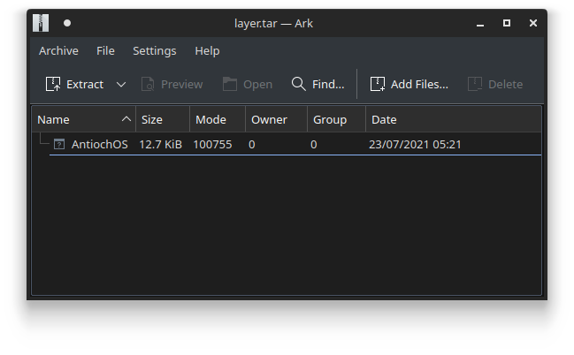

# 3 - antioch

**Time spent:** 1-2 hours

**Tools used:** Ghidra, Docker, Python


The third challenge is a bit of a weird one. You are given a file called `antioch.tar`, with the following note:

```
To solve this challenge, you'll need to ...AAARGH
```

## Orientation

The TAR file format is a very well-known archive file format that essentially just stitches files together into one single file. We can open and extract this using pretty much every archiver software that is available on the internet.


From the structure of the archive, we can recognize this as an exported Docker image. If you have Docker installed on your system, you can load it using the following bash command:

```sh
$ sudo docker load < antioch.tar
```

After building, we can run the image using:


```sh
$ sudo docker run -it --rm antioch:latest
```

We are greeted with some sort of shell. It states that if we type in `help`, we should be getting a list of available commands. But alas, this doesn't seem to work too well:


How to get to know the commands that are available? 


## Finding the AntiochOS binary

To be able to reverse engineer this program, we need to somehow extract some kind of executable file out of the Docker image. For that, we need to dive into the tar file a bit more, and see what we can recover.

A Docker container is almost like its own virtual machine, but very lightweight. Applications that run in a Docker container operate on their own file system, and generally speaking don't leave this bubble. The file system in a Docker image consists of layers. Without going into too much detail of the inner workings of Docker, essentially you can think of these layers as a list of incremental file system snapshots, where files in one layer override the files in the previous.

If you open the TAR archive, you'll notice that there are a lot of folders with names that look like hashcodes or checksums. These are the layers we just discussed. You will also notice there is a file in the root directory called `manifest.json` file. In this file, you will notice the most recent layer that is used to actually run the Docker image. Below the pretty-printed version of the contents of this file:

```json
[{
    "Config": "a13ffcf46cf41480e7f15c7f3c6b862b799bbe61e7d5909150d8a43bd3b6c039.json",
    "RepoTags": ["antioch:latest"],
    "Layers": ["7016b68f19aed3bb67ac4bf310defd3f7e0f7dd3ce544177c506d795f0b2acf3/layer.tar"]
}]

```

If we navigate to and open `7016b68f19aed3bb67ac4bf310defd3f7e0f7dd3ce544177c506d795f0b2acf3/layer.tar`, we can see an ELF file stored in this embedded TAR file:



Great! We can now drop it in Ghidra and start reverse engineering!


## Reversing AntiochOS

When you open the program in Ghidra, you will notice two things that are odd with this binary.

Firstly, you will notice that a lot of the functions look like the ones below:

```c
undefined1 * FUN_004013e0(void)
{
    byte *pbVar1;
    byte *pbVar2;
    byte bVar3;
    
    if (BYTE_ARRAY_004040c0[0] == 0) {
        pbVar1 = BYTE_ARRAY_004040c0;
        bVar3 = BYTE_ARRAY_004040c0[0];
        while( true ) {
            pbVar2 = pbVar1 + 1;
            *pbVar1 = bVar3 ^ 0x8b;
            if (pbVar2 == 0x4040e6) break;
            bVar3 = *pbVar2;
            pbVar1 = pbVar2;
        }
    }
    return BYTE_ARRAY_004040c0 + 1;
}

void FUN_00401360(undefined *param_1)
{
    *param_1 = 'h';
    param_1[1] = 'e';
    param_1[2] = 'l';
    param_1[3] = 'p';
    param_1[4] = '\n';
    param_1[5] = '\0';
    return;
}
```

These are classic tricks to hide strings in a binary. The first one decrypts a hardcoded buffer using a static XOR key, and the second one builds up a string on the stack character by character.

The second thing you will notice is that this application makes use of system calls directly, rather than calling the standard functions as can be found in `libc`. This happens in `FUN_00401980`:


```asm
                    FUN_00401980                                    XREF[8]:     ...
00401980 48 89 f8        MOV        RAX,RDI
00401983 48 89 f7        MOV        RDI,RSI
00401986 48 89 d6        MOV        RSI,RDX
00401989 48 89 ca        MOV        RDX,RCX
0040198c 4d 89 c2        MOV        R10,R8
0040198f 4d 89 c8        MOV        R8,R9
00401992 0f 05           SYSCALL
```

However, using a table such as [this one](http://blog.rchapman.org/posts/Linux_System_Call_Table_for_x86_64/), we can quickly figure out however which system calls are used.

With this in mind, we can start annotating the entrypoint, and see that AntiochOS actually defines 4 commands:

```c
void entry(void)
{
    /* ... */
    
    puVar1 = decrypt_antiochos_str();
    sys_write(1,puVar1,0x25);
    decrypt_type_help_str(local_98);
    sys_write(1,local_98,0x13);
    while( true ) {
        local_98[0] = 0x203e;
        sys_write(1,local_98,2);

        // Read next command:
        puVar4 = local_98;
        auVar5 = sys_read(0,local_98,0x80);
        uVar3 = SUB168(auVar5 >> 0x40,0);
        if (SUB168(auVar5,0) == 0) break;

        // Match command with predefined strings:
        decrypt_quit_str(auStack184);   // "quit"
        puVar4 = auStack184;
        uVar2 = strcmp(local_98,auStack184,5);
        uVar3 = extraout_RDX;
        if (uVar2 == 0) break;

        decrypt_help_str(auStack184);  // "help"
        uVar3 = strcmp(local_98,auStack184,5);
        if (uVar3 == 0) {
            do_help();
        }
        else {
            decrypt_consult_str(auStack184); // "consult"
            uVar3 = strcmp(local_98,auStack184,8);
            if (uVar3 == 0) {
                do_consult();
            }
            else {
                decrypt_approach_str(auStack184);   // "approach"
                uVar3 = strcmp(local_98,auStack184,9);
                if (uVar3 == 0) {
                    do_approach();
                }
            }
        }
    }
    sys_exit(0);
    return;
}
```

Let's dive into the commands and see what they do:

### The "consult" command

If we run the consult command, we are presented with the following seemingly useless string:


Looking at the code-behind, we see that it attempts to read some files from the Docker image with the names `a.dat`, `b.dat`, `c.dat` ... etc. Based on the contents of these files, it constructs some kind of buffer that is eventually used to print the long string:


```c
void do_consult(void)
{            
    /* ... */

    char current_file;
    ulong current_file_name;
    byte file_contents [4096];
    undefined8 out_buff [512];

    /* ... */
    
    current_file = 'a';
    current_file_name = 0x7461642e2e; // ".dat"
    
    /* ... */

    do {
        while( true ) {
            // Construct next file name.
            current_file_name = current_file_name & 0xffffffffffffff00 | current_file;

            // Read file contents.
            file = sys_open(&current_file_name,ptr,in_ptr);
            if (file < 0) break;
            sys_read(file,file_contents,0x1000);
            sys_close(file);

            // Construct some kind of buffer based on the contents of these files ...
            ptr = &stack0xffffffffffffffd8;
            out_ptr = out_buff;
            in_ptr = file_contents;
            do {
                *out_ptr = *out_ptr ^ *in_ptr;
                out_ptr = out_ptr + 1;
                in_ptr = in_ptr + 1;
            } while (out_ptr != ptr);

            // Move to the next file.
            current_file += 1;
            if (current_file == '{') goto exit;
        }

        // Move to the next file.
        current_file += 1;
        in_ptr = extraout_RDX_00;
    } while (current_file != '{');

exit:
    if (DAT_00404100 == '\0') {
        /* ... */
    }

    // Use resulting buffer to print some long string...
    lVar1 = 0;
    do {
        uVar3 = 10;
        if ((lVar1 & 0xf) != 0xf) {
            uVar3 = (&DAT_00404100)[*(out_buff + lVar1)];
        }
        *(out_buff + lVar1) = uVar3;
        lVar1 += 1;
    } while (lVar1 != 0x1000);
    sys_write(1,out_buff,0x1000);
    return;
}
```

The weird thing, however, is that these `*.dat` files do not appear to be in the layer that was referenced in the `manifest.json`. This makes the `sys_open` call always fail, and leave the `out_buff` filled with zeroes, which apparently results in a bunch of V's printed out.

If we look into some of the other layers that are included in the TAR file, we do see some traces of the `*.dat` files that it tries to read:


Maybe the Docker image is damaged / corrupted and only the last layer containing the ELF executable itself retained? I am not sure exactly what happened here, but what we _can_ do however is reconstruct the file system. Since these layers are incremental snapshots of the file system, we should be able to stack them together, and get the original file system back. Our only task is to figure out the right order in which these layers need to be stacked.


### The "approach" command

It so turns out the `approach` command gives us clues on what the order is supposed to be. The `approach` command asks for three questions: Your name, your quest, and your favorite color. If you are a Monty Python fan, you know that this is a reference to the film The Holy Grail. If the right answers are given (and they do seem to align with the original transcript in the film), it gives you a number:


Looking at the code that implements this command, we see that it looks up the number by computing the CRC of the input name and color, and looking up these CRCs in a hardcoded table. If they are not found, the string `AAARGH` is printed instead. Interestingly enough, the answer to the second question is completely ignored:

```c
void do_approach(void)
{
    /* ... */
    
    // Ask for name.
    what_is_your_name(str);
    sys_write(1,str,0x13);
    auVar5 = sys_read(0,input_buff,0x80);

    // Check if CRC of name is in a hardcoded table.
    input_crc = crc32(input_buff,SUB164(auVar5,0));
    table_ptr = MAGIC_TABLE;
    found_crc = 0xb59395a9;
    while (table_ptr = table_ptr + 1, found_crc != input_crc) {
        i = index + 1;
        index = i;
        if (i == 0x1e) goto exit;
        found_crc = table_ptr->name_crc;
    }

    // Ask for quest.
    what_is_your_quest(str);
    sys_write(1,str,0x14);                          
    iVar1 = sys_read(0,input_buff,0x80);
    if (1 < CONCAT44(extraout_var,iVar1)) {

        // Ask for favorite color.
        favorite_color(str);
        sys_write(1,str,0x1d);
        auVar5 = sys_read(0,input_buff,0x80);

        // Check if CRC of color matches the number after the name CRC.
        input_crc = crc32(input_buff,SUB164(auVar5,0));
        if ((MAGIC_TABLE[index].color_crc == input_crc) && ('\0' < MAGIC_TABLE[index].number)) {

            // Print the number after the color CRC.
            int_to_dec(MAGIC_TABLE[index].number,input_buff);
            puVar1 = right_off_you_go();
            sys_write(1,puVar1,0x14);
            
            /* ... */

            return;
        }
    }
exit:
    sys_write(1,"...AAARGH\n\n",0xb);
    return;
}
```

How does this relate to the Docker image?


## Reconstructing the file system

If you have clicked through the layers in the Docker image for a bit, you might have noticed that every layer comes with a `json` file. This `json` file has an `author` field. It so happens to be the case that these are the same names as the names in the original film. For example, in layer `fd8bf3c084c5dd42159f9654475f5861add943905d0ad1d3672f39e014757470/json`, we can see `Sir Lancelot`: 

```json
{
    /* ... */
    "author": "Sir Lancelot",
    /* ... */
}
```

A good guess here is that the number that is printed out by the program is the index of the corresponding layer in the final order of layers. This means that in our example, the layer authored by `Sir Lancelot` is at position 18 of our order.

Lucky for us, we don't need to guess all the names and corresponding colors to get the full ordering of layers. Firstly, all layers have the authors in their `json` file. Secondly, the hardcoded table in the binary contains all the indices in plaintext, which means we can completely ignore the colors all together.

We can thus make a simple Python script that simply goes over all layers, compute the CRC of the author. and look it up in this hardcoded table to get the final index of the layer within the ordering. We can then simply invoke the `tar` commandline to extract the files into a temporary folder and thereby recover the final state of the file system.

```python
import binascii
import os
import json
import shutil
import subprocess

dirs = os.listdir("antioch/")

crc_mapping = dict()

for d in dirs:
    base_dir = "antioch/" + d
    if not os.path.isdir(base_dir):
        continue

    data = json.loads(open(base_dir + "/json","r").read())
    if "author" not in data:
        continue

    crc = binascii.crc32(data["author"].encode() + b'\n')
    crc_mapping[crc] = d


table = [
    # ...
]

entries = []
for i in range(0, len(table), 3):
    entries.append((table[i], table[i+1], table[i+2]))
entries = list(sorted(entries, key=lambda x: x[2]))[2:]

order = [crc_mapping[entry[0]] for entry in entries]

if not os.path.isdir("/tmp/recovered_filesystem"):
    os.mkdir("/tmp/recovered_filesystem")

for d in order:
    tar_file = f"antioch/{d}/layer.tar"
    print(tar_file)
    subprocess.call(["tar", "-xf", tar_file, "-C", "/tmp/recovered_filesystem"])
```

The full script can be found in [scripts/extract.py](scripts/extract.py).

## Getting the flag

If we now move the `AntiochOS` binary into the folder with the reconstructed files, execute it, and run the `consult` command, we get the flag in ascii art:


It reads:
```
Five-Is-Right-Out@flare-on.com
```