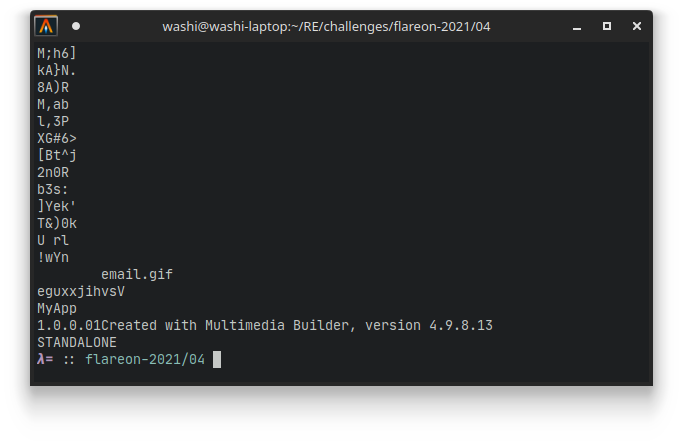

# 4 - myaquaticlife

**Time spent:** 2-3 hours

**Tools used:** Detect-It-Easy, UPX, Winspector, API monitor, MMBuilder, MMUnbuilder, Ghidra, x64dbg, Python


The fourth challenge is the obligatory "obscure-technology" challenge that is often present in the series. We are given another Windows executable file called `myaquaticlife.exe`. The note states:

```
What would Flare-On do without a healthy amount of nostalgia for the abraisive simplicity of 1990's UI design? Probably do more actual work and less writing fun challenges like this.
```


## Orientation

When we open the program, we can see the note did not lie about the "beautiful" UI design. We are greeted with a large window that has lots of GIF animations of sea animals on it.


It seems we can click any of the animals, but no visual feedback is given. If we press the large text written in Comic Sans however, we get the following screen:


We probably need to figure out which animal(s) we need to click (and probably in which order) to get the flag back.

If we drop the application in [Detect-It-Easy](https://github.com/horsicq/Detect-It-Easy), we see the application is packed with [UPX](https://upx.github.io/). However, after unpacking with `upx -d myaquaticlife.exe`, we are left with a file that is 3.0MB large full of code. Not something we really want to sift through! To make matters worse, after unpacking, Detect-It-Easy doesn't recognize anything special in the binary, other than that it is likely to be written in C++:


How do we go about analyzing this?


## Identifying the type of executable

When I first saw the UI, I was reminded of the days when I first discovered the world of web programming using HTML. The application sure looks as "great" as one of my creations back then :). My thought process was; if this indeed is some old-school technology, then maybe this window is just rendering HTML on the screen.

We can easily verify this by using a tool such as Winspector. If we hover our mouse over the window while Winspector is open, we see that indeed the window is nothing more than a host for an Internet Explorer instance:


This means, however, that the HTML that is rendered on the screen probably exists on the disk as files somewhere, which means the executable must have dropped them at that location upon startup. We can easily verify this by using a tool such as [API monitor](http://www.rohitab.com/apimonitor), and log all calls to `CreateFileA` and `CreateFileW`. If we do that, we see all kinds of files dropped in a temp folder called `MMBPlayer`, including a lot of GIF files, two HTML files and a suspicious DLL file. You can find a copy of these files in the [webfiles folder](https://github.com/Washi1337/ctf-writeups/tree/master/writeups/flare-on/2021/4/webfiles/).


If we look into the `index.html` file, we can see that all the images, as well as the paragraph in the middle, are bound to "script" links:

```html

<div class="main">
    
    <a href="script:Script17"><p class="txt1">What's your favorite aquatic animal?</p></a>
    <a href="script:Script1"></a>
    <a href="script:Script2"></a>
    <a href="script:Script3"></a>
    <a href="script:Script4"></a>
    <a href="script:Script5"></a>
    <a href="script:Script6"></a>
    <a href="script:Script7"></a>
    <a href="script:Script8"></a>
    <a href="script:Script9"></a>
    <a href="script:Script10"></a>
    <a href="script:Script11"></a>
    <a href="script:Script12"></a>
    <a href="script:Script13"></a>
    <a href="script:Script14"></a>
    <a href="script:Script15"></a>
    <a href="script:Script16"></a>
    
    
</div>
```

To find out where these links were headed, I decided to search for clues in the original binary itself. When we run `strings` on the binary, we can see a very interesting string the very end of the program:



This seems to align with the name MMBPlayer that was used for the temp directory. Cool! We have a name of the software that was used to create this executable. We can Google this name, and download the toolsuite:


However, all these links point to software that allows you to _build_ these types of executables, and not the reverse. How do we reverse the process and get the original MMB project back?


## Decompiling MMBuilder packages

Lucky for us, there is a tool on GitHub that is adequately called [MMUnbuilder](https://github.com/qprotex/MMUnbuilder), and does _exactly_ what we need. Thanks to user `qprotex` for coding this! 

This script produces a `.mdb` file, which we can open using the official MMBuilder software. Even though I have no idea how exactly this software works, I did immediately recognize that on the right side of the main window, we see all the scripts. Double clicking on any of them opens the original script that is attached to that name:


A copy of the `.mbd` file as well as the scripts can be found [here](https://github.com/Washi1337/ctf-writeups/tree/master/writeups/flare-on/2021/4/mmb/).


## Scripts and the plugin DLL


If you take a look in the scripts, you can see that most of the scripts are very simple and look like the following:

```
part1$='derelict:MZZWP'
PluginSet("PlugIn","part1$")
```

They start off with an assignment to a `part` variable, followed by a function call to `PluginSet`. Important to note here is that the contents of this `part` always starts with either `delerict`, `lagan`, `flotsam` or `jetsam`, and is followed by a couple of random characters (in this case `MZZWP`). 

Script17 is the exception to this, which seems to immediately call a function `PluginFunc19`, and obtain some variable called `var1` before it navigates us to the next page (`index2.html`) and starts animating the text:

```
PluginRun("PlugIn","PluginFunc19")
PluginGet("PlugIn","var1$")
NextPage()

... code related to the animation on index2.html ...

```

This makes sense, since there are 16 buttons / images on the main window of our executable, and one final button / link that seems to verify whether we have chosen the right images.

What we haven't looked at is the mysterious `fathom.dll` that was also dropped next to all the GIF and HTML files. Could this be the plugin that is referenced in these scripts? Opening it up in Ghidra does reveal there is indeed a function called `PluginFunc19`, as well as a couple other exports such as `GetFile` and `SetFile`, as well as `GetData` and `SetData`.

Using x64dbg, we can verify that this DLL is indeed loaded when we run the application, as well as that pressing any of the images results in the function `SetFile` being called.

If we look more closely at the implementation of `SetFile`, we can see that at address `SetFile+0x181 (0x100031C1)` a call happens that seems to concat strings together. In particular, it seems to concatenate the random characters that were specified in the scripts that were activated, as long as they are prefixed using the same animal name. For example, if we click on 1, 5 and then 6, which have the strings `derelict:MZZWP`, `derelict:LDNCVYU` and `derelict:yXQsGB`, we get `MZZWPLDNCVYUyXQsGB` as our final result.


If we activate script 17 (click the big yellow text in the midle), we indeed get transferred to `PluginFunc19`. In this function, we see that two of these strings (the one from `flotsam` and `jetsam`) are used as a key for some random encryption algorithm to decrypt the flag. The result is hashed using MD5, and compared to a hardcoded hash:


```c
// Encrypted flag:
flag[0] = 0xa9a42596;
flag[1] = 0x909a96a3;
flag[2] = 0x38e5af9f;
flag[3] = 0x169e81f9;
flag[4] = 0xa4e4cbf9;
flag[5] = 0xba8f8f87;
flag[6] = 0xd1a79dd2;
flag[7] = 0xa8a3fc;

if (*(FLOTSAM + -0xc) != 0) {
    if (*(JETSAM + -0xc) != 0) {
        if (1 < *(JETSAM + -4)) {
            FUN_10002560(&JETSAM,*(JETSAM + -0xc));
        }
        if (1 < *(FLOTSAM + -4)) {
            FUN_10002560(&FLOTSAM,*(FLOTSAM + -0xc));
        }

        // Decrypt flag
        uVar12 = 0;
        do {
            /* ... Some random decryption algorithm ... */
            uVar12 += 1;
        } while (uVar12 < 0x1f);

        // Hash flag.
        buff[0] = flag[0];
        buff[1] = flag[1];
        buff[2] = flag[2];
        buff[3] = flag[3];
        buff[4] = flag[4];
        buff[5] = flag[5];
        buff[6] = flag[6];
        buff[7] = flag[7];
        result = MD5(buff,hash_buffer);
        ppiVar11 = result >> 0x20;
        if (result != 0) goto LAB_10003016;
        pcVar9 = "6c5215b12a10e936f8de1e42083ba184";
        pbVar6 = hash_buffer;
        do {
            /* ... string compare ... */
        } while (bVar3 != 0);
        uVar12 = 0;
LAB_10002f79:
        if (uVar12 == 0) {
            /* ... Show flag on screen ... */
        }
        ...

```

We cannot really reverse a MD5 string (at least not as easily). How can we get to the flag? 


## Getting the flag

It so turns out we don't need to do any weird cryptography attacks to get the right hash code. If we look at the scripts, we see that the assigned variables are called `part1`, `part2`, `part3` etc. If we build a [Python script](solve.py) that parses all these assignments, and print them out in a nice overview, we see that for the names `flotsam` and `jetsam`, we have the following:

```
flotsam
(4, 'part1', 'PXopvM')
(3, 'part2', 'DFWEyEW')
(13, 'part3', 'BGgsuhn')

jetsam
(11, 'part1', 'SLdkv')
(7, 'part2', 'newaui')
(10, 'part3', 'HwdwAZ')
```

Pressing 4, 3 and 13, followed by 11, 7 and 10 gives us a correct ordering, and the flag:


```
s1gn_my_gu357_b00k@flare-on.com
```