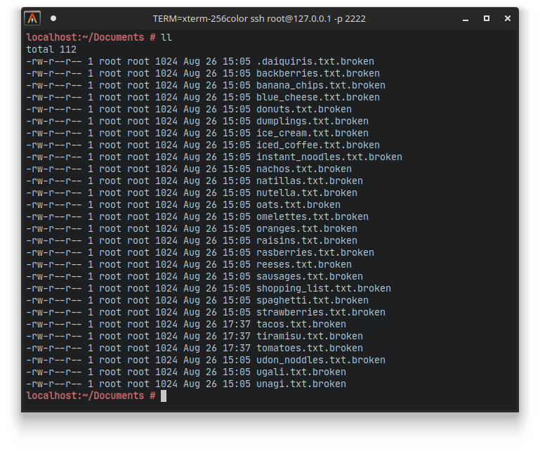
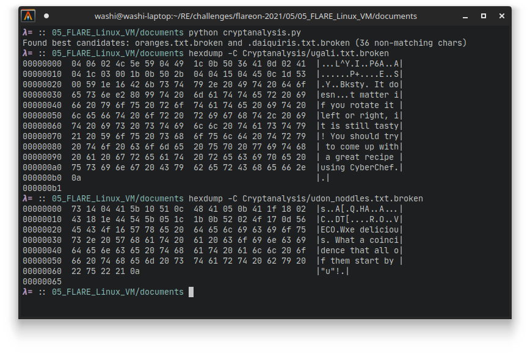
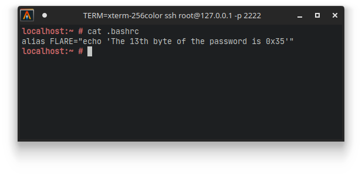
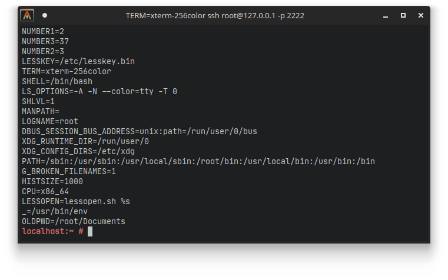
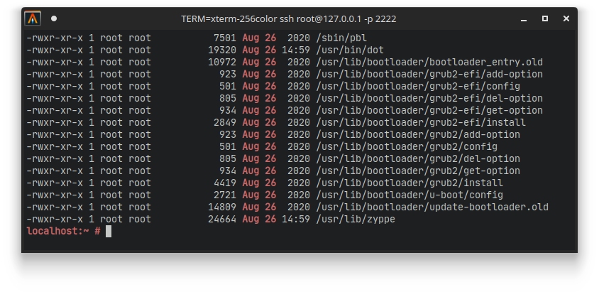
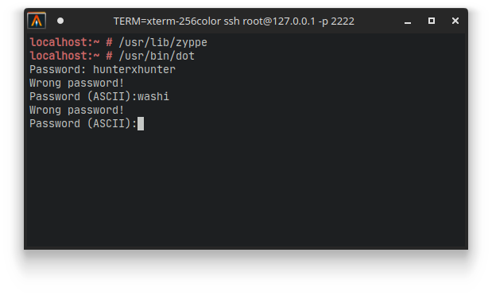
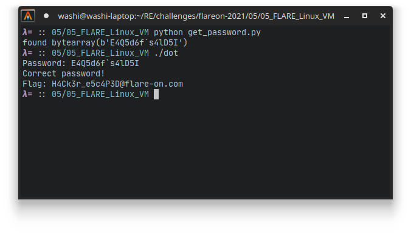

# 5 - FLARE Linux VM

**Time spent:** A stupid amount of time

**Tools used:** Ghidra, Python, CyberChef


Challenge 5 was in my opinion, no offense to the authors, kind of a disaster. It starts off great: Similar to the second challenge of this series, the story is about a machine that got infected with some type of malware, and it is your task to figure out what has happened, and potentially to reverse any damage. In this case, however, you are not just given the decryptor and the encrypted files, but an entire snapshot of a virtual machine. But sooner or later, you will figure out that this is a very guessy challenge, that requires little to no reverse engineering at all.

## Orientation

When we load up the virtual machine, and SSH into it, we see that in the `Documents` folder of the `root` user, there are a bunch of files stored with the `.broken` file extension.



As the story suggested, all these files seem to be in an encrypted form. We also see a random empty `bin` folder in the home directory. No direct trace of any binary to analyze.


## (Wasting time on) Basic Cryptanalysis

**If you are interested in the actual solution of the challenge, you should skip this section.**

I started off by doing some basic cryptanalysis. As it turns out, this is where my experience in playing CTF actually proved to be holding me back for a bit. Still, I wanted to include this part of my process of this challenge in this write-up, because it is still a valid attack and might work out for other types of crypto challenges. 

Many encryption algorithms used by malware are usually some derivation of XOR encryption algorithms. For example, one of the most widely used algorithms in malware is RC4, which is XOR that uses a special key scheduling. Furthermore, certain modes of operations (such as OFB), turn any block cipher (such as AES) into some kind of key scheduling for a simple XOR cipher in the end. We will see how we can exploit this:

If the same keys are used for the encryption of every file, then we can do a little trick. Suppose we have two messages `M1` and `M2`, and they are encrypted using key `K`, giving us cipher texts `C1` and `C2` respectively like so:

```
M1 ^ K = C1
M2 ^ K = C2
```

If we XOR these two ciphertexts together, we actually can see that the keys cancel each other out, and end up with `M1 ^ M2`:
```
C1 ^ C2 = (M1 ^ K) ^ (M2 ^ K) 
        = M1 ^ M2 ^ K ^ K 
        = M1 ^ M2
```

Now this is not necessarily something readable yet, **unless** we know something about the original messages themselves. In the file listing, we can see that all files are all 1024 bytes large. It is very unlikely that all plaintexts are exactly the same length. A common (but insecure!) practice is that every message is padded with zeroes before it was encrypted. Therefore, if a byte of `M2` is zero, then we get `M1 ^ M2 = M1`. Furthermore, if `M2` is very short compared to `M1`, this means that we can get a lot of the plaintext back without having to know the key that was used.

If you do this (using e.g. a [Python script](scripts/cryptanalysis.py)), then you can actually see that this approach works pretty decently, as some of the files actually come out almost completely back in plaintext this way:



Unfortunately, it is still kind of useless, since it seems we are missing some pretty critical information in the first 36 bytes, which is what we can not recover using this approach. Furthermore, other files seem to have additional layers of encryptions or encodings. Therefore this route is kind of a dead-end unfortunately, although it does showcase very well that reuse of an encryption key and using zero bytes for padding is generally a bad idea. It does give us a clue though that the files starting with the letter `u` are probably plaintext, but without knowing the actual key or encryption algorithm that was used, we cannot really proceed.


## Finding the malware

Rather than trying to guess what the exact encryption algorithm or key was that was used, my idea was to find a more systematic approach. 

I got reminded that the encrypted files were all the result of some malware running on the system, and perhaps this malware is still present on the system itself. There are a couple of places we can look at. My first thought was that if the malware was started somehow, it might have been started using the terminal itself via bash. However, looking in `.bash_history` does not seem to have anything interesting. We see some interesting things in `.bashrc` however:



Furthermore, if we look into the environment variables using the `env` command, we see three weird environment variables called `NUMBER1`, `NUMBER2` and `NUMBER3`:



Interesting, seems like clues for some password. But still not a path to the malware itself. 

Then I looked again in the `Documents` folder, and noticed that all files were created on `Aug 26`. Maybe if these files were created at this day, then the malware might have entered the system on the very same day. Let's find all executable files on the file system that are created on this same day.

```
$ find / -executable -type f | xargs ls -l | grep "Aug 26"
```



We see a bunch of files that are related to the bootloader, which are not really relevant to us. But what we can see is two other files called `dot` and `zyppe` which do seem interesting. If you know anything about OpenSUSE (which is the OS that this VM is running), then you know that `zypper` (with an `r` at the end) is the default package manager for installing and maintaining software on the system. However, running this `zyppe` program (without the `r`) doesn't seem to do anything that is similar to the normal `zypper`. Furthermore, `dot` is normally a program that is used to visualize graph structures using a tool like [GraphViz](https://graphviz.org/). However if we run this `dot` program, we are greeted with a `Password` prompt instead...




This settled it for me that these two files must be the files that we should be looking at.


## Analyzing the malware

If we open up the `dot` program in Ghidra, we see that it is a very basic C++ program. It hashes the input password using the SHA256 algorithm, and compares it to a hardcoded hash. If it is equal, it will proceed on using the password to decrypt the flag and print it out:

```c

undefined8 main(void)
{
    /* ... */
    
    basic_string(input);
    operator<<(cout,"Password: ");
    operator>>(cin,input);
    while( true ) {
        basic_string(local_48);
        sha256(register0x00000020 - 0x68,local_48);
        flag = operator!=(local_68,"b3c20caa9a1a82add9503e0eac43f741793d2031eb1c6e830274ed5ea36238bf");
        ~basic_string(local_68);
        ~basic_string(local_48);
        if (flag == false) break;
        pbVar1 = operator<<(cout,"Wrong password!");
        pbVar1 = operator<<(pbVar1,endl<char,std::char_traits<char>>);
        operator<<(pbVar1,"Password (ASCII):");
        operator>>(cin,input);
    }

    allocator();
    basic_string(local_a8,&DAT_00401763);
    ~allocator(&local_1d);
    i = 0;
    while( true ) {
        /* flag decryption */
    }
    operator+=(local_a8,"@flare-on.com");
    pbVar1 = operator<<(cout,"Correct password!");
    pbVar1 = operator<<(pbVar1,endl<char,std::char_traits<char>>);
    pbVar1 = operator<<(pbVar1,"Flag: ");
    pbVar1 = operator<<(pbVar1,local_a8);
    operator<<(pbVar1,endl<char,std::char_traits<char>>);
    ~basic_string(local_a8);
    ~basic_string(input);
    return 0;
}
```

We cannot really reverse a SHA256 hash, so no shortcuts here. 

Looking at `zyppe`, on the other hand, we see that it iterates over all files in the documents folder, and uses a slight modification on the [RC4 encryption algorithm](https://en.wikipedia.org/wiki/RC4) to encrypt the files using password `"A secret is no longer a secret once someone knows it"`. The slight modification comes int the very last step, where we actually include the result of the last iteration of the loop in the XOR'ing of the final data:

```c
void encrypt(char *buffer)
{
    /* ... */
    
    key      = 0x7465726365732041;  // "A secret"
    local_60 = 0x6c206f6e20736920;  // " is no l"
    local_58 = 0x2061207265676e6f;  // "onger a "
    local_50 = 0x6f20746572636573;  // "secret o"
    local_48 = 0x656d6f732065636e;  // "nce some"
    local_40 = 0x776f6e6b20656e6f;  // "one know"
    local_38 = 0x74692073;          // "s it"
    local_34 = 0;

    // Key scheduling
    for (i = 0; i < 0x100; i = i + 1) {
        S[i] = i;
    }
    j = 0;
    for (i_ = 0; i_ < 0x100; i_ = i_ + 1) {
        iVar2 = S[i_] + j + *(&key + i_ % 0x34);
        uVar1 = (iVar2 >> 0x1f) >> 0x18;
        j = (iVar2 + uVar1 & 0xff) - uVar1;
        tmp = S[i_];
        S[i_] = S[j];
        S[j] = tmp;
    }

    // Encryption
    i__ = 0;
    j = 0;
    last = 0; // Extra variable here
    for (x = 0; x < 0x400; x = x + 1) {
        uVar1 = (i__ + 1 >> 0x1f) >> 0x18;
        i__ = (i__ + 1 + uVar1 & 0xff) - uVar1;
        uVar1 = (S[i__] + j >> 0x1f) >> 0x18;
        j = (S[i__] + j + uVar1 & 0xff) - uVar1;
        local_28 = S[i__];
        S[i__] = S[j];
        S[j] = local_28;
        uVar1 = (S[i__] + S[j] >> 0x1f) >> 0x18;
        k = S[(S[i__] + S[j] + uVar1 & 0xff) - uVar1];
        
        // Deviation from the normal algorithm here:
        buffer[x] = buffer[x] ^ last ^ k;
        last = k;
    }
    return;
}
```

Great, now we know how the files are encrypted. Let's build a script that does the reverse. For that I grabbed some random RC4 encryption implementation from the internet, and applied the same change to it as this malware applied. The final script can be found [here](scripts/decrypt_files.py). All decrypted files can be found [here](https://github.com/Washi1337/ctf-writeups/tree/master/writeups/flare-on/2021/5/decrypted_files/), although you will notice that only the files starting with the letter `u` actually are readable. This is something I missed earlier on, and thought my algorithm decryption was wrong. 

Now, let me warn you to fasten your seat belts, because for the remainder of the challenge, we are going in for a ride that goes downhill really fast.


## Riddle Me This, Riddle Me That, Who's afraid of The Big Black ... Disaster?

From now on, the challenge really started crashing down, and turn into a game of guessing. Essentially, what it boils down to, is that every file starting with the same letter is part of a riddle that comes with clues on how to decrypt or decode the next riddle. The riddles are in my opinion pretty bad, have nothing really to do with reverse engineering (something I come to do when I participate in FLARE-ON), and frankly were _very_ guessy. Especially because you have no idea which of the files actually contains the data that the current riddle applies to, you basically end up trying it on all files and hope for the best that one of them spits out some usable data.

Given the quality of the remainder of the challenge, I don't want to spend much time on explaining how I got to my answers much. Therefore, instead I will just share my notes for all the steps and their solutions:

### U:
Solution: Plain text

```
Ugali with Sausages or Spaghetti is tasty. It doesn’t matter if you rotate it left or right, it is still tasty! You should try to come up with a great recipe using CyberChef.
"ugali", "unagi" and "udon noodles" are delicious. What a coincidence that all of them start by "u"!
The 1st byte of the password is 0x45
```

### S:
Solution: Bitwise rotate left by 1.

> Why rotate by 1 to the left? Didn't the hint say something about that it does not matter if you rotate it left or right? The only way that would make sense if it is rotating by 4, since bytes use 8 bits... Very random...

```
In the FLARE team we like to speak in code. You should learn our language, otherwise you want be able to speak with us when you escape (if you manage to escape!). For example, instead of "strawberries" we say "c3RyYXdiZXJyaWVz".
In the FLARE language "spaghetti" is "c3BhZ2hldHRp".
The 2st byte of the password is 0x34
```

### R:
Solution: Base64 decode.
```
We LOVE "Reese's", they are great for everything! They are amazing in ice-cream and they even work as a key for XOR encoding.
The 3rd byte of the password is.. it is a joke, we don't like raisins!
The 3rd byte of the password is: 0x51
```

### B:
Solution: XOR with password `"Reese's"`.

> Why is this the answer for the `B` files and not the `I` files that contain a file called `ice-cream`? The hint clearly seems to suggest that `Reese's` work great with ice-cream... Very random again...

```
Are you good at maths? We love maths at FLARE! We use this formula a lot to decode bytes: "ENCODED_BYTE + 27 + NUMBER1 * NUMBER2 - NUMBER3"
If you are not good in maths, the only thing that can save you is to be a bash expert. Otherwise you will be locked here forever HA HA HA!
The 4th byte of the password is: 0x35
```

### I:
Solution: Apply formula, ends up being just `x - 4`
```
The only problem with RC4 is that you need a key. The FLARE team normally uses this number: "SREFBE" (as an UTF-8 string). If you have no idea what that means, you should give up and bake some muffins.
If this challenge is too difficult and you want to give up or just in case you got hungry, what about baking some muffins? Try this recipe:
0 - Cinnamon
1 - Butter 150gr
2 - Lemon 1/2
3 - Eggs 3
4 - Sugar 150gr
5 - Flour 250gr
6 - Milk 30gr
7 - Icing sugar 10gr
8 - Apple 100gr
9 - Raspberries 100gr

Mix 0 to 9 and bake for 30 minutes at 180°C.
The 5th byte of the password is: 0xMS
```

### N:
Solution: RC4 with key = `"493513"` (derived from the numbers and the first letters of the recipe ingredients)
```
In the FLARE team we really like Felix Delastelle algorithms, specially the one which combines the Polybius square with transposition, and uses fractionation to achieve diffusion.\n'
Do you know natillas? In Spain, this term refers to a custard dish made with milk and KEYWORD, similar to other European creams as cr\xe8me anglaise. In Colombia, the delicacy does not include KEYWORD, and is called natilla.'
The 6th byte of the password is: 0x36
```

### D:
Solution: Bifid cipher with key = `"eggs"`.

> Really, why do I need to look for random ingredients in Spanish recipes on the internet...

```
Did you know that Giovan Battista Bellaso loved microwaves?
Are you missing something? You should search for it better! It's hidden, but not really.
The 7th byte of the password is: 0x66
```

### O:
Solution: Vigenere cipher with key = `"MICROWAVES"`.
```
You should follow the FLARE team in Twitter. Otherwise they may get angry and not let you leave even if you get the flag.
https://twitter.com/anamma_06
https://twitter.com/osardar1
https://twitter.com/MalwareMechanic

You should follow the FLARE team in Twitter. They post a bunch of interesting stuff and have great conversation on Twitter!
https://twitter.com/anamma_06
https://twitter.com/MalwareMechanic

The 8th byte of the password is: 0x60
```

### T:
Solution: This is the worst of them all. You actually have to go to the referenced Twitter feeds, dig into [a random conversation that happened months ago](https://twitter.com/anamma_06/status/1414583864865996803), and derive from there that AES was used with a specific key.

To me this is just blatant advertising shoved into your face while trying to get through a challenge that is not even related to the very thing the CTF is based around (in case you forgot: it is a reverse engineering CTF).  Especially for players that enter the competition later than the very first day, this is just beyond stupid. Since the authors keep using their Twitter, the conversation gets buried more and more as well.

```
It seems you are close to escape... We are preparing the tomatoes to throw at you when you open the door! It is only a joke...
The 11th byte of the password is the number of unique words in /etc/Quijote.txt
The 13th byte of the password is revealed by the FLARE alias
The 9th byte of the password is the atomic number of the element moscovium
The 10th byte of the password is the bell number preceding 203
The 12th byte of the password is the largest known number to be the sum of two primes in exactly two different ways
The 14th (and last byte) of the password is the sum of the number of participants from Spain, Singapore and Indonesia that finished the FLARE-ON 7, FLARE-ON 6 or FLARE-ON 5
Woow! It seems you are very very close to get the flag! Be careful when converting decimal and hexadecimal values to ASCII and hurry up before we run out of tacos!
```

Also, really? Using previous installments of FLARE-ON for clues? Are we this insecure? It isn't hard to be a bit more creative than that...

0/10 would not solve again.

Anyway...

## Getting the flag

If we combine all the clues together in [yet another Python script](scripts/get_password.py), we finally get a password back that we can fill into the `dot` program to get the flag:



```
H4Ck3r_e5c4P3D@flare-on.com
```

Overall, I think this is a very bad challenge, with only 10% actual reversing, and the remainder 90% is filled with nothing but riddle-me-this guesswork. I participate in FLARE because I want to do reverse engineering. The last place I want to look at is a Twitter feeds or statistics of previous installments of FLARE. Please, no more of these challenges next year...