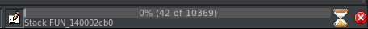

# 7 - spel

**Time spent:** 4-5 hours

**Tools used:** Ghidra, x64dbg, Python

The seventh task in the series is an interesting challenge, and seemed to be a real difficult one for a lot of people. This is why in this write-up, we will be going over it great detail. You are given a large binary, +4MB worth of code. The note next to it is a pretty good introduction to this challenge:

```
Pro-tip: start disassembling this one then take a nice long break, you've earned it kid.
```

One thing I learnt from previous installments of FLARE, is that once there is a mention of taking break and/or relaxing because _you've earned it_, it is never to be trusted (Flashbacks to [last year's challenge 10](/ctf-writeups/writeups/flare-on/2020/10)). And this challenge proved to be no exception to that rule.

## Orientation

If we run the application we are greeted with the following dialog.


No proper interaction, nothing. Just straight up an error. Truth be told, this made me think there was something wrong with my virtual machine. However, after verifying it with other participants, it so turns out this is all intended behavior.

Opening the application in Ghidra, and selecting the default profile of Ghidra analyzers, shows a slight hint of what the note really meant. Ghidra seems to be stuck performing the `Stack` analyzer on a certain function.



Cancelling seems to be broken on the current version of Ghidra (10.x), so we have to resort to killing the Ghidra process all together and retry loading the binary.

If we disable this `Stack` analyzer though, Ghidra _is_ able to complete the analysis (albeit after a good amount of time). However, you have to be careful. If we go to this function **while the decompiler window is open**, Ghidra completely hangs again trying to decompile this function, while consuming all the memory in the world, before it straight up just gives up. Something really fishy is going on with this code...


The remainder of the application is a huge code-base, that seems to be some sort of MFC based application. This is always interesting to reverse, since they often look very different from the more "traditional" binaries. 

Truth be told, I spent a good amount of time figuring out what this application was even supposed to do. Since the application starts up in this weird state, where you cannot even click buttons or write anything into the text box, this proved to be quite a challenge. One thing I did was finding the code responsible for disabling the buttons, and patching it it out. If you do that, you will notice the program is some sort of a broken spelling checker:


There is also a dialog to add a dictionary to the program, but that does not seem to work or yield anything useful either. What are we even supposed to crack if the program is broken to begin with?

## Finding the entry to the rabbit hole

It so turns out that the reason why it is so difficult to figure out what this application does, is simply because the application itself does nothing more than distract you from the real goal :)

One thing I noticed that was odd however, is that whenever you run the executable and close it, the program actually stays running in the background.


I first brushed this off as yet another artifact of the application being broken, but I decided to look into it nonetheless. I started looking for calls to ``CModal::Dialog``, since this the function that is generally used to show dialog boxes. This function is also blocking, meaning that it does not return until the dialog is closed. If anything happens after showing the dialog, then it happens after such a call.

If we go to the place where this function is called for our main dialog, we see it is actually at the start of the very same broken function that Ghidra had trouble decompiling. Looking into the disassembler, we see something weird. You would expect that after the dialog closes, the app exits. But this is not the case. Instead, the app is dynamically resolving ``VirtualAllocExNuma``...


... followed by a lot of assignments of byte values into a humongous stack buffer. And when I say a lot of stack assignments, I mean a lot of stack assignments...


The `mov` instructions start at address `140002d72`, and end at `1401796fb`, giving us a total of a little under 192,000 stack assignments, all assigning a single byte in the buffer! This is probably the reason why Ghidra's stack analysis just broke down. A typical case of information overload will break pretty much any computer system :).

If we look at the instructions _after_ all those `mov` instructions, we can see that the huge buffer is copied into an executable buffer allocated by ``VirtualAllocExNuma``, and then this new buffer is executed as code:


This screams malware to me. Instead of exiting the application normally after the main window has closed, we are apparently dynamically loading and running some additional code! It is probably also the thing we should dive into more to get further with the challenge. Let's get to it!


## Walking down the stairs of loaders

If we [extract the buffer](dumps/layer1.bin) from the mov instructions, and open it into Ghidra as a raw x86 blob, we can see it is actually some kind of an unpacker of a PE file, that decrypts/decompresses itself first and then calls the entrypoint at offset `952`:


We can try figure out exactly how this decompression works, but we can also just let the program do it for us, and just stop execution at the right moment using x64dbg and [dump the file](dumps/layer2.bin).


Opening this binary in Ghidra reveals that it is a fairly simple executable. The main function starts with a call to `FUN_180001fd0`. The address that is fed into this function points to a buffer that conveniently starts with the letters `MZ`. After this call, we see another function that uses the result of the previous function together with the string `"Start"`:


Clearly this is another loader, but this time it seems to load a DLL instead and call a function called `Start`. Let's extract [this DLL](dumps/layer3.bin) and reopen again in Ghidra. 

## The malware

It so turns out this is the last layer of dynamically loading code, making it a total of a three-step loaders. Looking into the `Start` function, we can see it uses a classic API hiding technique that we see a lot in malware, and also have seen before in previous years of Flare. For this reason, I am not going to explain fully how the `get_proc_by_hash` works in this write-up. If you want to know how it works in more detail, you can read my write-up of [last year's challenge 7](/ctf-writeups/writeups/flare-on/2020/7#calling-procedures-by-hash-codes). 

```c
void Start_(void)
{
    /* ... */
    
    setup_iat();

    // Allocate main context object.
    pFun = get_proc_by_hash(NULL,1,0x697a6afe); // VirtualAlloc
    ctx = (*pFun)(0,0x1e0,0x3000,PAGE_READWRITE);

    // Do initialization step of program.
    do_main_step(ctx,1);

    // Some anti analysis....
    iVar1 = verify_current_module_is_called_Spell.Exe(ctx);
    stage = 8;
    if (iVar1 != 0) {
        stage = ctx->next_stage;
    }
    _DAT_1800178e0 = 6;
    uVar2 = 360000;
    if (stage == 0x40) {
        uVar2 = 300000;
    }
    pFun = get_proc_by_hash(NULL,1,0x5cbd6d9e); // SleepEx
    (*pFun)(uVar2);

    // Do next step.
    do_main_step(ctx,stage);
    return;
}
```

The main magic happens in function `do_main_step` (`FUN_180001a40`), which is called twice in the `Start` function, and seems to be some kind of dispatcher of tasks.

```c
void do_main_step(MAIN_STRUCT *ctx,int stage)
{
    /* ... */

    if (stage == 1) {
            /* ... */
    }
    else {
        if (stage == 2) {
            /* ... */
        }
        if (stage == 8) {
            /* ... */
        }
    }
    /* ... */
    return;
}
```

The program starts off with stage 1. Most of it is actually not really important to us, it decrypts some initialization data and loads a Win32 resource called `PNG` from the original `spel.exe` module. The important part here is that at the very end it states the next task to execute is number 2.

```c
if (stage == 1) {
    /* ... */

    pFun = get_proc_by_hash(NULL,1,0x774393e8); // GetModuleFileNameA
    (*pFun)(0,ctx->module_filename,0x104);
    pFun = get_proc_by_hash(NULL,1,0xa48d6762); // GetModuleHandleA
    uVar4 = (*pFun)();
    local_98 = 0;
    local_94 = 0x642ceea9;
    if (true) {
        local_94 = 0x474e50;
    }

    pFun = get_proc_by_hash(NULL,1,0x8fe060c);  // FindResourceA
    uVar5 = (*pFun)(uVar4,0x80,&local_94);      // Get PNG resource 0x80
    pFun = get_proc_by_hash(NULL,1,0x86867f0e); // SizeOfResource
    uVar2 = (*pFun)(uVar4,uVar5);
    *&ctx->size_of_png = uVar2;
    pFun = get_proc_by_hash(NULL,1,0x1a10bd8b); // LoadResource
    (*pFun)(uVar4,uVar5);
    pFun = get_proc_by_hash(NULL,1,0x1510bd8a); // LockResource
    uVar4 = (*pFun)();
    *&ctx->png_data = uVar4;
    ctx->next_stage = 2;
}
```
Looking at the second if branch, we can see it contains some significantly more code, which means it is probably the main program of the malware. After resolving all the APIs and clicking through the functions that it calls, you will come across `FUN_180002070`. Ghidra's decompiler output for this function is a bit weird, perhaps due to the proc-by-hash stuff. Essentially it attempts to connect to the server `"inactive.flare-on.com"` via TCP on port `888` (`0x378`) using winsock, and then listens for three commands `"flare-on.com"`, `"run"` and `"exe"`:

```c
void FUN_180002070(MAIN_STRUCT *ctx)
{
    /* ... */
    
    pFun = get_proc_by_hash(NULL,4,0xfc7af16a); // socket
    sock = (*pFun)(AF_INET,1,IPPROTO_TCP);
    if (sock != -1) {
        /* ... */
        wvsprintfA_wrapper(local_68,"%s_%s",&ctx->subdomain_str,ctx->"flare-on.com");
        pFun = get_proc_by_hash(NULL,4,0xf44318c6); // gethostbyname
        lVar3 = (*pFun)();
        if (lVar3 != 0) {
            /* ... */
            pFun = get_proc_by_hash(NULL,4,0x8e9bf775); // htons
            local_7e = (*pFun)(0x378);                     
            pFun = get_proc_by_hash(NULL,4,0xedd8fe8a); // connect
            result = (*pFun)(sock,&local_80,0x10);
            if (result != -1) {
                /* ... */
                pFun = get_proc_by_hash(NULL,4,0xe797764); // send
                result = (*pFun)(sock,"@",uVar4,0);
                if (result != -1) {
                    buf = ctx->receive_buffer;
                    result = FUN_180002ce0(sock,buf,0x20);
                    if (result < 1) {
                        /* ... */
                    }
                    else {
                        /* ... */
                        if (buf == NULL) {
LAB_1800022f8:
                            /* ... */
                            if (buf == NULL) {
LAB_180002358:
                                /* ... */
                                if (buf != NULL) {
                                    // strcmp("flare-on.com", buf)
                                    pbVar6 = buf;
                                    do {
                                        bVar1 = *pbVar6;
                                        bVar2 = pbVar6["flare-on.com" - buf];
                                        if ((bVar1 < bVar2) || (bVar1 >= bVar2 && bVar1 != bVar2)) goto LAB_18000216e;
                                        pbVar6 = pbVar6 + 1;
                                    } while (pbVar6 - buf < 0xc);
                                    ctx->socket = sock;
                                }
                            }
                            else {
                                // strcmp("run", buf)
                                pbVar6 = buf;
                                do {
                                    bVar1 = *pbVar6;
                                    bVar2 = pbVar6[&"run" - buf];
                                    if ((bVar1 < bVar2) || (bVar1 >= bVar2 && bVar1 != bVar2)) goto LAB_180002358;
                                    pbVar6 = pbVar6 + 1;
                                } while (pbVar6 - buf < 3);
                                handle_run_command(sock);
                            }
                        }
                        else {
                            // strcmp("exe", buf)
                            pbVar6 = buf;
                            do {
                                bVar1 = *pbVar6;
                                bVar2 = pbVar6[&"exe" - buf];
                                if ((bVar1 < bVar2) || (bVar1 >= bVar2 && bVar1 != bVar2)) goto LAB_1800022f8;
                                pbVar6 = pbVar6 + 1;
                            } while (pbVar6 - buf < 3);
                            handle_exe_command(sock);
                        }
                    }
                    goto LAB_18000216e;
                }
            }
        }
        /* ... */
    }
    /* ... */
}
```

The `"exe"` and `"run"` commands are really there for show and are not really important to solving the challenge. The `"flare-on.com"` command however makes this function return and continue execution in our main stage function (`180001cc0`). In particular, it decrypts some chunk of the PNG data we saw earlier in stage 1:

```c
cVar1 = fetch_and_exec_commands(ctx);
if (cVar1 != '\0') {
    /* ... */
    pFun = get_proc_by_hash(NULL,1,0x2d40b8e6); // lstrlen
    iVar10 = (*pFun)(&local_48);
    /* ... */
    cVar1 = decrypt(ctx,*&ctx->png_data + 0x5f);
    if (cVar1 == '\0') {
        /* ... */
    }
    FUN_180002730(ctx);
}
```

## Getting the flag

We can try and dive deep into these functions, figure out how exactly they work, reverse them etc. However, that takes time, time I don't generally want to spend when working on in a CTF. Let's solve it dynamically instead.

First add the following line to your hosts file to reroute all traffic going to localhost.

```
127.0.0.1 inactive.flare-on.com
```

Then we can use this Python script to set up a local TCP server that allows us to send any response back to the program.

```python
import socket
import sys

# Create a TCP/IP socket
sock = socket.socket(socket.AF_INET, socket.SOCK_STREAM)

# Bind the socket to the port
server_address = ('localhost', 888)
sock.bind(server_address)
sock.listen(1)

while True:
    conn, addr = sock.accept()	
    print(addr)
    while True:
        data = conn.recv(1000)
        print(data)
        reply = input("reply:")
        conn.sendall(reply.encode('ascii'))
```

If we break right after the decryption part, we can see the following ASCII string appearing in the context object that is being passed around:


```
l3rlcps_7r_vb33eehskc3
````

Even though it is ASCII string, it isn't really readable, and it does not turn out to be the right flag either. However, if we look into the function that is called _after_ the decryption function (`FUN_180002730`), we can see the decrypted data is processed in a very specific order:

```c
/* ... */

do {
    if (uVar4 < 0x17) {
        switch(uVar4) {
        case 0:
            local_50 = local_50 & 0xffffff00 | local_50 ^ ctx->decrypted_flag[0xc];
            break;
        case 1:
            local_50._0_2_ = CONCAT11(local_50._1_1_ ^ ctx->decrypted_flag[0xd],local_50);
            local_50 = local_50 & 0xffff0000 | local_50;
            break;
        case 2:
            local_50._0_3_ = CONCAT12(local_50._2_1_ ^ ctx->decrypted_flag[6],local_50);
            local_50 = local_50 & 0xff000000 | local_50;
            break;
            
        /* ... More cases ... */

        case 0x14:
            uStack60 ^= ctx->decrypted_flag[0xe];
            break;
        case 0x15:
            uStack60._1_1_ ^= ctx->decrypted_flag[2];
            break;
        case 0x16:
            uStack60._2_1_ ^= 0x40;
        }
    }
    uVar4 += 1;
} while (uVar4 < 0x20);

/* ... */
```    

Applying the same shuffling to our decrypted data, minus the XOR and other bit operations...

```python
s = "l3rlcps_7r_vb33eehskc3"

x = s[0xc] + s[0xD] + s[0x6] + s[8] +s[7] + s[6] + s[5] + s[1] + s[0] + s[3] + s[4] + s[0x11] + s[0xf] + s[0x14] +s[0x13] + s[0x15] + s[2] + s[10] + s[0x10] + s[0xb] + s[0xe] + s[2]

print(x)
```

... reveals the following readable string:

```
b3s7_sp3llcheck3r_ev3r
```

Appending `@flare-on.com` to the end of it is the flag.
