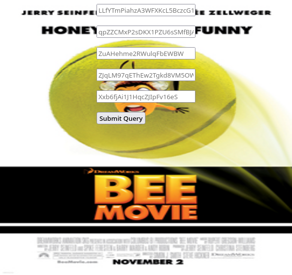
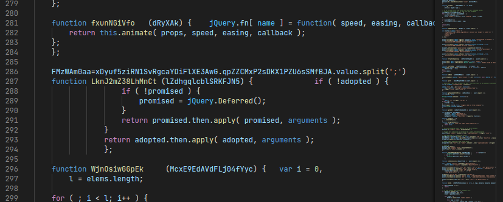
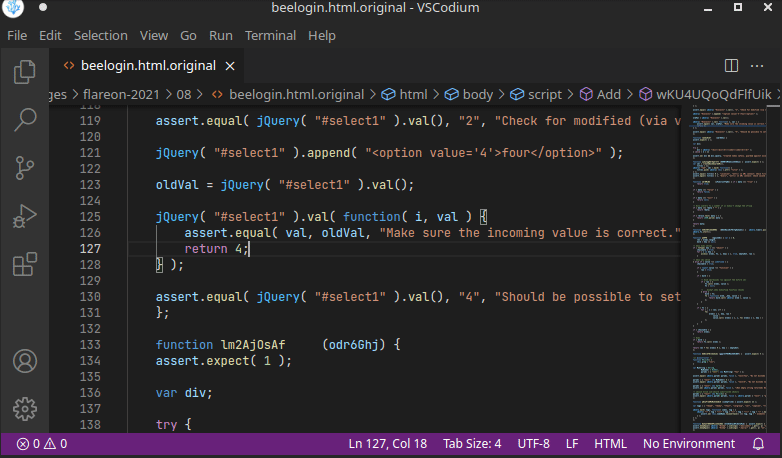
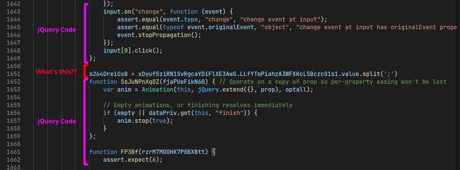
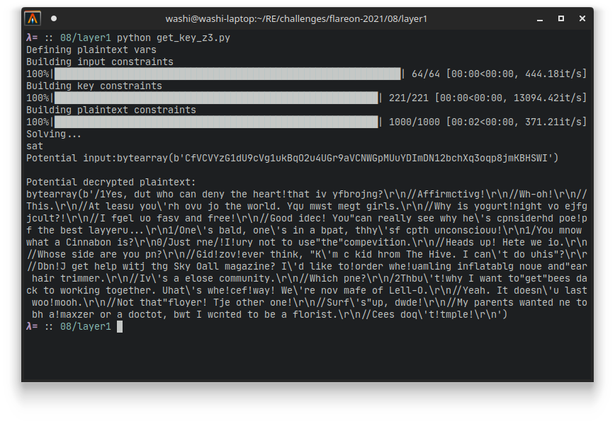
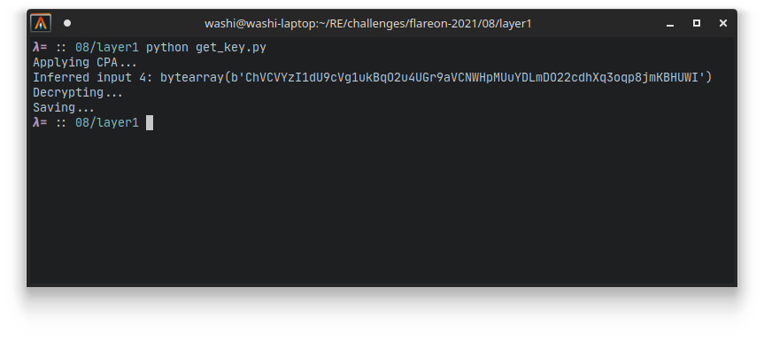
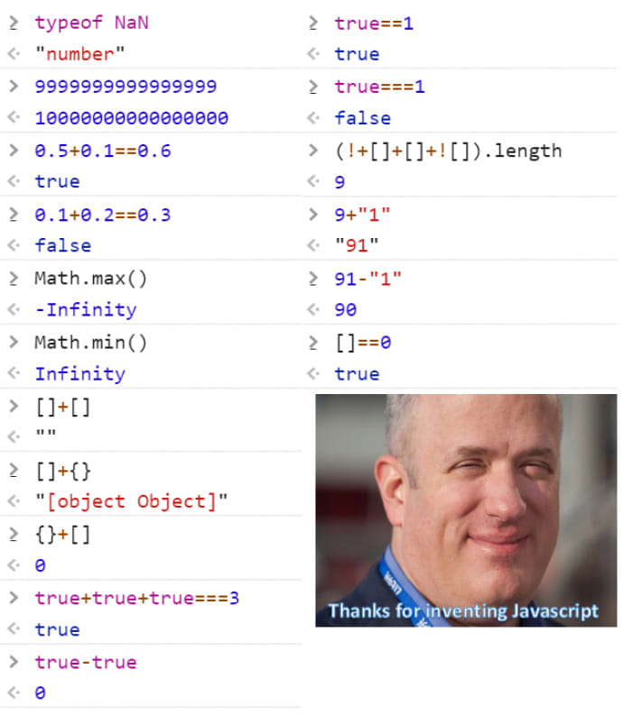
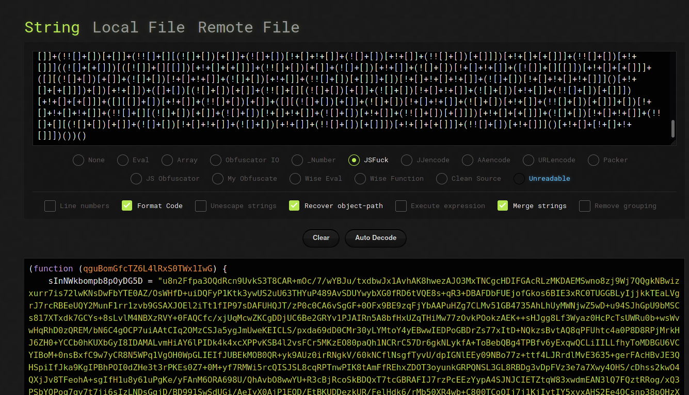

# 8 - beelogin

**Time spent:** 4-5 hours

**Tools used:** Firefox, VSCode with JS Debugger Extension, Python, de4js

Challenge 8 felt a bit overrated in my opinion, but this might be because I have some experience with cryptography and code deobfuscation. In this challenge, you are given a large HTML file, together with the following note:

```
You're nearly done champ, just a few more to go. we put all the hard ones at the 
beginning of the challenge this year so its smooth sailing from this point. Call your
friends, tell 'em you won. They probably don't care. Flare-On is your only friend now.
```

## Orientation

Opening the file in a browser reveals a pretty straightforward form decorated by some pretty amazing web design skills :^):




However, if we look in the back-end HTML code, we can see the Javascript is everything but readable. Most of the code is either obfuscated or part of some random jQuery unit testing library:



Somehow, this Javascript is supposed to verify our inputs after we click the Submit button. Debugging directly in the browser is kind of a pain with this much garbage code, so we probably have to do some deobfuscation first. 

Let's get to work!

## Extracting the relevant code

The first thing I did was pretty printing the Javascript code, such that everything is at least consistent. You can do this with pretty much any code editor nowadays. It may take a while to finish (it did at least on my semi-crappy laptop) since the code is quite large:



If you scroll through the formatted code, you may notice that the jQuery code has some additional code added in between the functions:



Since our code is in a normalized form now, it is very easy to extract all these extra interleaved statements using a simple hacky Python script that removes any line that is not within a function:

```python
expected_indent = "                "
lines = open("beelogin.html", "r").readlines()
result = open("extracted.js", "w")

is_in_function = False

for line in lines:
    if not line.startswith(expected_indent):
        continue
    
    remainder = line[len(expected_indent):]
    if remainder.startswith("function"):
        is_in_function = True
        
    if not is_in_function:
        result.write(line)
        result.write('\n')

    if remainder.startswith('};'):
        is_in_function = False
```

The result can be found in [extracted.js](layer1/extracted.js).


## Deobfuscation 1

One of the first thing you will probably see in the extracted code is that it contains two very large base64 strings, compared with lots of calls to the `eval` function. `eval` allows you to interpret any string as Javascript, effectively allowing for dynamic code execution. This is a pretty tell-tale sign of the Javascript unpacking itself in some way or another, so I decided this was interesting enough to follow this path of code and try to make sense of it.

I wish I had a more rigorous method of deobfuscating to tell you, but frankly most of it was just renaming variables by good old find+replace, finding out which variables were used (and which weren't used at all!), and simplifying the code along the way. I ended up with the following code that is very straightforward:

```js
large_base64_string = "... very large base64 string ..."
small_base64_string = "... small base64 string ...";

input4 = xDyuf5ziRN1SvRgcaYDiFlXE3AwG.ZJqLM97qEThEw2Tgkd8VM5OWlcFN6hx4y2.value.split(';')
input4_buffer = 'gflsdgfdjgflkdsfjg4980utjkfdskfglsldfgjJLmSDA49sdfgjlfdsjjqdgjfj'.split('');

expected_input4_length = 64
if (input4[0].length == expected_input4_length)
    input4_buffer = input4[0].split('');

key = atob(small_base64_string).split('');
for (i = 0; i < key.length; i ++) {
    key[i] = (key[i].charCodeAt(0) + input4_buffer[i % expected_input4_length].charCodeAt(0)) & 0xFF;
}

large_blob = atob(large_base64_string).split('');
large_blob_length = large_blob.length;
decryption_buffer = large_blob

for (i = 0; i < large_blob_length; i ++) {
    decryption_buffer[i] = (decryption_buffer[i].charCodeAt(0) - key[i % key.length]) & 0xFF;
}

decrypted_javascript = "";
for (i = 0; i < large_blob.length; i ++) {
    decrypted_javascript += String.fromCharCode(decryption_buffer[i]);
}

if ('rFzmLyTiZ6AHlL1Q4xV7G8pW32' >= decrypted_javascript) 
    eval(decrypted_javascript)
```

The interleaved code takes the text put into the fourth textbox, does some basic arithmetic on it to construct a decryption key, which is then used to decrypt the large blob of bytes and execute it as Javascript code. How do we get the correct string for input 4 though? 

## Finding the key

To get to the right string for input 4, we are going to use a couple of very important facts about the current situation:

- The cryptography that is used in here is very basic, as only additions and subtractions are involved. This is very similar to a lot of classic cryptographic schemes such as Caesar or Vigenere, which are very susceptible to various  cryptanalysis methods.
- The ciphertext that is decrypted is very long, whereas the key is relatively short (only 64 characters).
- The plaintext behind the ciphertext must be valid Javascript code. Therefore, only certain printable characters are allowed in the final plaintext, or else the `eval` function will fail.

While 64 characters might be too hard to bruteforce in a naive way, the other facts will vastly reduce the search space that we need to go through. Instead of a normal bruteforce, we can do some form of chosen plaintext attack instead. I like to use Z3 for this, so here is the script I came up with:

```python
import base64
import string
import tqdm
from z3 import *

ALLOWED_CHARS = string.ascii_letters + string.digits + ".,?!'\"\r\n\t :-/"
LENGTH = 1000 # Max length, increase for better accuracy of guess, but might take longer / more memory.

encrypted_code = base64.b64decode(open("large_blob.base64", "r").read())
encrypted_key = base64.b64decode(open("small_blob.base64", "r").read())

print("Defining plaintext vars")
PT_VARS    = [BitVec(f"p{i}", 8) for i in range(LENGTH)]
KEY_VARS   = [BitVec(f'k{i}', 8) for i in range(len(encrypted_key))]
INPUT_VARS = [BitVec(f'i{i}', 8) for i in range(64)]

s = Solver()

print("Building input constraints")
for i in tqdm.tqdm(range(len(INPUT_VARS))):
    s.add(Or(*[INPUT_VARS[i] == ord(c) for c in string.ascii_letters + string.digits]))

print("Building key constraints")
for i in tqdm.tqdm(range(len(KEY_VARS))):
    s.add(KEY_VARS[i] == (encrypted_key[i] + INPUT_VARS[i % len(INPUT_VARS)]) & 0xFF)

print("Building plaintext constraints")
for i in tqdm.tqdm(range(len(PT_VARS))):
    s.add(PT_VARS[i] == (encrypted_code[i] - KEY_VARS[i % len(KEY_VARS)]) & 0xFF)
    s.add(Or(*[PT_VARS[i] == ord(c) for c in ALLOWED_CHARS]))

print("Solving...")
status = s.check()
print(status)

if status == sat:
    m = s.model()

    print("Potential input:", end='')
    inferred_input = bytearray(64)
    for i in range(64):
        inferred_input[i] = m[INPUT_VARS[i]].as_long()
    print(inferred_input)

    print("\nPotential decrypted plaintext:")
    pt = bytearray(LENGTH)
    for i in range(LENGTH):
        pt[i] = m[PT_VARS[i]].as_long()
    print(pt)
```

If we run this, we get an almost correct decryption:



It seems that the underlying text is some excerpt of the Bee movie (kind of like [last year's challenge 10](/ctf-writeups/writeups/flare-on/2020/10)), but some of the characters seem wrong. However it is very easy to guess the right keys in this case, so we can calculate the actual key that was used by yet another (much more simple) Python script that simply performs the reverse of the original algorithm:

```python
import base64
encrypted_text = base64.b64decode(open("large_blob.base64", "r").read())
encrypted_key = base64.b64decode(open("small_blob.base64", "r").read())

known_plaintext = b"//Yes, but who can deny the heart that is yearning?\r\n//Affirmative!"

print("Applying CPA...")
key_buffer = bytearray(64)
for i in range(len(key_buffer)):
    key_buffer[i] = (encrypted_text[i] - known_plaintext[i]) & 0xFF

input4 = bytearray(64)
for i in range(len(input4)):
    input4[i] = (key_buffer[i] - encrypted_key[i]) & 0xFF

print("Inferred input 4:", input4)

print("Decrypting...")
key_buffer = bytearray(len(encrypted_key))
for i in range(len(key_buffer)):
    key_buffer[i] = (encrypted_key[i] + input4[i % len(input4)]) & 0xFF

plaintext = bytearray(len(encrypted_text))
for i in range(len(encrypted_text)):
    plaintext[i] = (encrypted_text[i] - key_buffer[i % len(key_buffer)]) & 0xFF

print("Saving...")
with open("layer2.original.js", "wb") as f:
    f.write(plaintext)
```

This yields the correct output almost instantaneously:



```
ChVCVYzI1dU9cVg1ukBqO2u4UGr9aVCNWHpMUuYDLmDO22cdhXq3oqp8jmKBHUWI
```

The output can be found in [layer2.js](layer2/layer2.js).

## Deobfuscation 2

We're not done yet however! Looking in the output file, we see that it starts with a bunch of comments, followed by some very weird Javascript code:

```js
(... truncated ...)
//You want a smoking gun? Here is your smoking gun.
//You're in Sheep Meadow!
//Mamma mia, that's a lot of pages.
//My sweater is Ralph Lauren, and I have no pants.
//Here's your change. Have a great afternoon! Can I help who's next?
[][(![]+[])[+[]]+(![]+[])[!+[]+!+[]]+(![]+[])[+!+[]]+(!![]+[])[+[]]][([][(![]+[])[+[]]+(![]+[])[!+[]+!+[]]+(![]+[])[+!+[]]+(!![]+[])[+[]]]+[])[!+[]+!+[]+!+[]]+(!![]+[][(![]+[])[+[]]+(![]+[])[!+[]+!+[]]+(![]+[])[+!+[]]+(!![]+[])[+[]]])[+!+[]+[+[]]]+([][[]]+[])[+!+[]]+(![]+[])[!+[]+!+[]+!+[]]+(!![]+[])[+[]]+(!![]+[])[+!+[]]+([][[]]+[])[+[]]+([][(![]+[])[+[]]+(![]+[])[!+[]+!+[]]+(![]+[])[+!+[]]+(!![]+[])[+[]]]+[])[!+[]+!+[]+!+[]]+(!![]+[])[+[]]+(!![]+[][(![]+[])[+[]]+(![]+[])[!+[]+!+[]]+(![]+[])[+!+[]]+(!![]+[])[+[]]])[+!+[]+[+[]]]+(!![]+[])[+!+[]]]([][(![]+[])[+[]]+(![]+[])[!+[]+!+[]]+(![]+[])[+!+[]]+(!![]+[])[+[]]][([][(![]+[])[+[]]+(![]+[])[!+[]+!+[]]+(![]+[])[+!+[]]+(!![]+[])[+[]]]+[])[!+[]+!+[]+!+[]]+(!![]+[][(![]+[])[+[]]+(![]+[])[!+[]+!+[]]+(![]+[])[+!+[]]+(!![]+[])[+[]]])[+!+[]+[+[]]]+([][[]]+[])[+!+[]]+(![]+[])[!+[]+!+[]+!+[]]+(!![]+[])[+[]]+(!![]+[])[+!+[]]+([][[]]+[])[+[]]+([][(![]+[])[+[]]+(![]+[])[!+[]+!+[]]+(![]+[])[+!+[]]+(!![]+[])[+[]]]+[])[!+[]+!+[]+!+[]]+(!![]+[])[+[]]+(!![]+[][(![]+[])[+[]]+(![]+[])[!+[]+!+[]]+(![]+[])[+!+[]]+(!![]+[])[+[]]])[+!+[]+[+[]]]+(!![]+[])[+!+[]]]((!![]+[])[+!+[]]+(!![]+[])[!+[]+!+[]+!+[]]+(!![]+[])[+[]]+([][[]]+[])[+[]]+(!![]+[])[+!+[]]+([][[]]+[])[+!+[]]+([]+[])[(![]+[])[+[]]+(!![]+[][(![]+[])[+[]]+(![]+[])[!+[]+!+[]]+(![]+[])[+!+[]]+(!![]+[])[+[]]])[+!+[]+[+[]]]+([][[]]+[])[+!+[]]+(!![]+[])[+[]]+([][(![]+[])[+[]]+(![]+[])[!+[]+!+[]]+(![]+[])[+!+[]]+(!![]+[])[+[]]]+[])[!+[]+!+[]+!+[]]+(!![]+[][(![]+[])[+[]]+(![]+[])[!+[]+!+[]]+(![]+[])[+!+[]]+(!![]+[])[+[]]])[+!+[]+[+[]]]+(![]+[])[!+[]+!+[]]+(!![]+[][(![]+[])[+[]]+(![]+[])[!+[]+!+[]]+(![]+[])[+!+[]]+(!![]+[])[+[]]])[+!+[]+[+[]]]+(!![]+[])[+!+[]]]()[+!+[]+[!+[]+!+[]]]+((!![]+[])[+[]]+[!+[]+!+[]+!+[]+!+[]+!+[]]+[+[]]+(![]+[ 
(... truncated ...)
```

If you have never seen this before, you might think this is not valid Javascript code. But alas, this for some reason is proper executable code that can do all the kinds of things you are used to in any other programming language. Just to give you a glimpse of what horrific things you can do in Javascript (but probably shouldn't), just look at the following overview:



As complicated as it might look at first glance, we are lucky enough that this obfuscation is pretty easy to defeat. So easy in fact, that there is a ready made tool called [de4js](https://lelinhtinh.github.io/de4js/) that is able to deobfuscate this without any problem:



The result can be found in [layer2.deob.js](layer2/layer2.deob.js)

## Getting the flag

It so turns out that this second layer and remaining layers are nothing more than a repetition of the first layer. A new long base64 string is defined at the very start, followed by the same algorithm that decrypts it, but using one of the other 3 inputs found on the original web page. For every layer, we just need to adjust our first Python script to find a good input candidate, followed by making a good guess on the actual plaintext that we can use in our second Python script.

The last layer is a very simple script containing the flag:
```js
alert("I_h4d_v1rtU411y_n0_r3h34rs4l_f0r_th4t@flare-on.com")
```