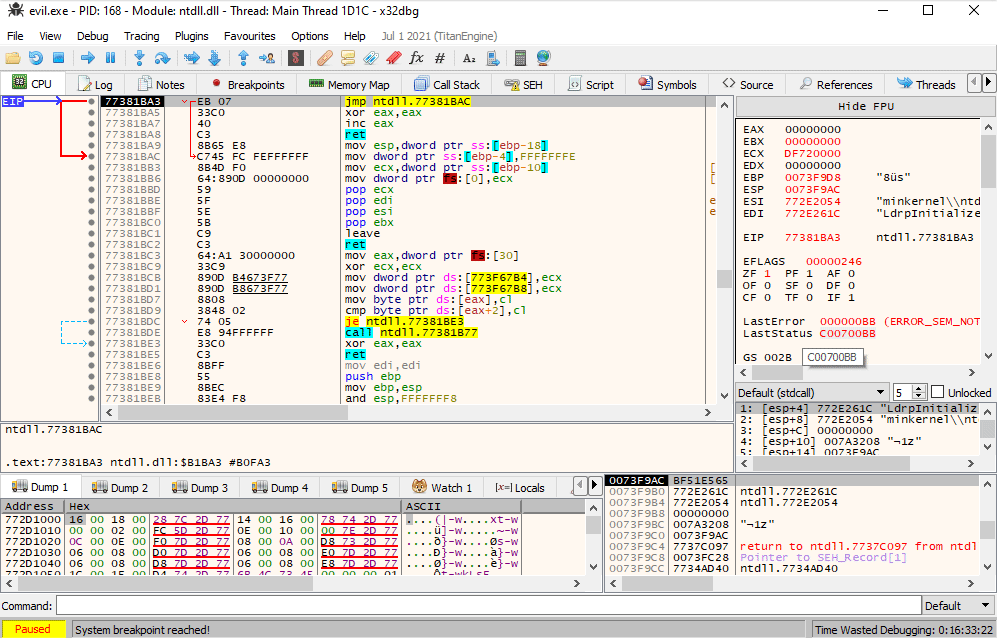
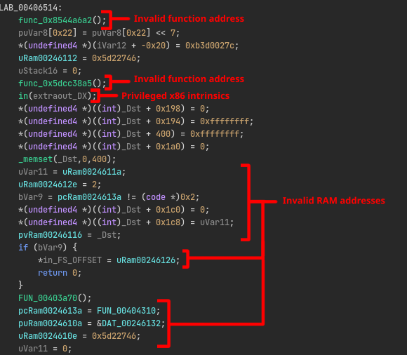
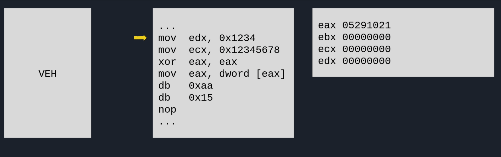
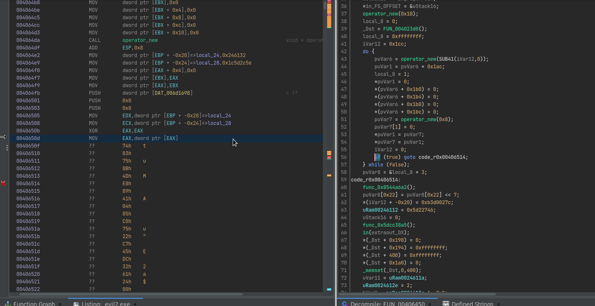
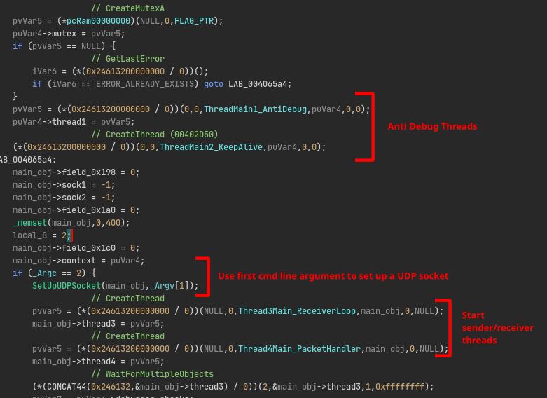
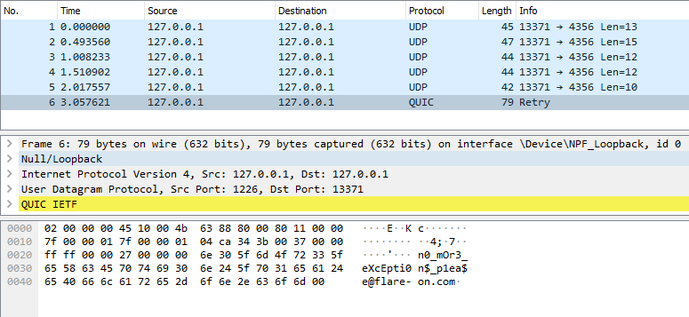

# 9 - evil

**Time spent:** Around a day.

**Tools used:** x64dbg, Ghidra, Ghidra Scripting, C#, Python

Challenge 9 is probably my favourite challenge out of all challenges in this year. The name `evil` is also very accurate. It is a very tricky challenge that uses quite an interesting method to throw off reverse engineerings during their analysis. 

You are given a binary called `evil.exe`, and the following note:

```
Mandiant's unofficial motto is "find evil and solve crime". Well
here is evil but forget crime, solve challenge. Listen kid, RFCs 
are for fools, but for you we'll make an exception :)

The challenge has 3 false flags: 
!t_$uRe_W0u1d_B3_n1ce_huh!@flare-on.com 
1s_tHi$_mY_f1aG@flare-on.com 
N3ver_G0nNa_g1ve_y0u_Up@flare-on.com
```

## Orientation

When we run the application, it seems to immediately close without any visible output. If we look in x64dbg, we see the application seems to be throwing lots of exceptions as well. It also seems that some of the code seems to be changing slightly as time progresses. Stepping through one-by-one also makes x64dbg jump seemingly erradically to the next faulting instruction, rather than the next instruction, making it quite confusing to work with:



Let's try static analysis. If we look at the `main` function in Ghidra, we see a lot of really weird code that is often an indication of invalid code:



What's going on here? This doesn't look like normal code at all. Is the program intentionally broken? How should we proceed?


## Control Flow Obfuscation through Exception Handling

I worked under the assumption that if the application is supposed to do something meaningful, whilst still throwing all these exceptions, then these exceptions must be handled somewhere. This means we are looking for something like like a big fat `try-catch` construct around the entire program, or something of a global exception handler. Generally speaking, there are two ways to register exception handlers: [Structured Exception Handling](https://docs.microsoft.com/en-us/windows/win32/debug/about-structured-exception-handling) or [Vectored Exception Handling](https://docs.microsoft.com/en-us/windows/win32/debug/vectored-exception-handling). And as it so turns out, the latter is used in this sample. If we look in the initialization vectors of the binary (`DAT_00445150`), we can see two very interesting functions at the very end of the list:

```
       0044519c                 addr       FUN_00402130
       004451a0                 addr       FUN_00402150
```

The first function (`FUN_00402130`) reveals that this binary uses a trick to hide API functions by hash code, in a very similar fashion to how it happens in [challenge 7](../7#the-malware):

```c
void FUN_00402130(void)
{
    pRtlAddVectoredExceptionHandler = GetProcByHash(&DAT_00246132,0x542f881e);
    return;
}
```

However, in this case, the hash algorithm has changed slightly:

```c
char * __fastcall GetProcByHash(uint param_1,uint requested_hash)
{
    /* ... */ 

    export_dir_entry = *(image_base + 0x3c) + 0x78 + image_base;
    resolved_address = NULL;
    export_dir = export_dir_entry->VirtualAddress + image_base;
    name_ordinals = *(export_dir_entry->VirtualAddress + 0x24 + image_base) + image_base;
    name_table = export_dir->AddressOfNames + image_base;
    if (export_dir->NumberOfNames != 0) {
        do {
            export_name_length = 0;
            export_name = name_table[j] + image_base;
            c = *export_name;
            while ((c != '\0' && (export_name_length < 0x104))) {
                export_name_length += 1;
                c = export_name[export_name_length];
            }
            i = 0;
            checksum = 0x40;
            if (export_name_length != 0) {
                do {
                    ptr = export_name + i;
                    i += 1;
                    checksum = *ptr + checksum * -0x45523f21;
                } while (i < export_name_length);
            }
            if (checksum == requested_hash) {
                resolved_address = *(export_dir->AddressOfFunctions + name_ordinals[j] * 4 + image_base_2) + image_base_2;
                break;
            }
            j += 1;
            image_base = image_base_2;
        } while (j < export_dir->NumberOfNames);
    }
    if ((resolved_address < export_dir) || (&export_dir->Characteristics + export_dir_entry->Size <= resolved_address)) {
        return resolved_address;
    }

    /* ... */ 
}
```

It so turns out that hash `0x542f881e` results in the address to the function `RtlAddVectoredExceptionHandler`, which as it name implies, registers a function as a vectored exception handler. In the second initialization function (`FUN_00402150`) in the initialization vector, we can see this resolved API being used to register `FUN_00406ad0` as a global handler:

```c
void FUN_00402150(void)
{
    (*pRtlAddVectoredExceptionHandler)(1,FUN_00406ad0);
    return;
}
```

If we look into this handler, we can see some interesting things. It grabs the values of the registers `ECX` and `EDX`, and feed it into the `GetProcByHash` function to lookup an API. If successful, it updates the value of `EAX` to the resolved address, writes a `CALL EAX` instruction at `EIP + 3`, and then specifies execution should continue at `EIP + 3` as well:

```c
undefined4 FUN_00406ad0(_EXCEPTION_POINTERS *info)
{
    /* ... */

    // Get register values of ECX and EDX at the moment the exception occured.
    edx = info->ContextRecord->Edx;
    ecx = info->ContextRecord->Ecx;

    /* ... */

    // Use registers to resolve an API by hash.
    pFun = GetProcByHash(edx,ecx);
    if (pFun != NULL) {
        (*pVirtualProtect)(info_->ContextRecord->Eip,0x1000,PAGE_EXECUTE_READWRITE,&info);
        info_->ContextRecord->Eax = pFun;          // Set EAX to resolved API address.
        *(info_->ContextRecord->Eip + 3) = 0xd0ff; // Write "CALL EAX" instruction at EIP + 3.
        pDVar1 = &info_->ContextRecord->Eip;       // Update EIP to EIP + 3
        *pDVar1 = *pDVar1 + 3;
        (*pVirtualProtect)(info_->ContextRecord->Eip,0x1000,info,&info);                    
        *in_FS_OFFSET = local_10; 
        return 0xffffffff; // Continue Execution
    }

    *in_FS_OFFSET = local_10; 
    return 0; // Continue Search
}
```

To summarize, this basically means that the application is crashing itself deliberately with very specific values for `ECX` and `EDX`. The VEH will then use it to resolve an API and hotpatch the original code with a `CALL EAX` to call external functions. I hacked a quick GIF together that describes the process in a visual manner:




## Deobfuscation

Due to the nature of self-modifying code, Ghidra understandably gets confused about the weird control flow obfuscation that is going on. Lucky for us, it _is_ possible to patch code within Ghidra itself, and simulate exactly what this VEH is doing right within our disassembler.

To do that, we first need to build up a lookup table from hashes to Windows API functions. For that, I used my own library [AsmResolver](https://github.com/Washi1337/AsmResolver) to read all the exports from every library located in the `SysWOW64` directory. Hopefully you don't mind the little self-advertising :).

```csharp
using System;
using System.IO;
using AsmResolver.PE;
using AsmResolver.PE.Exports;

public static class Program
{
    public static void Main()
    {
        foreach (string file in Directory.GetFiles(@"C:\Windows\SysWOW64", "*.dll"))
        {
            try
            {
                Console.WriteLine(file);
                var image = PEImage.FromFile(file);
                if (image.Exports is null)
                    continue;

                foreach (var export in image.Exports.Entries)
                {
                    if (export.IsByName)
                        Console.WriteLine($"{GetHash(export.Name):X8}: {export}");
                }

                Console.WriteLine();
            }
            catch (Exception ex)
            {
                Console.Error.WriteLine(file + " -> "  + ex);
            }
        }
    }

    public static uint GetHash(string name)
    {
        uint sum = 0x40;
        foreach (char c in name)
            sum = (uint)c - sum * 0x45523f21;
        return sum;
    }
}
```

The output can be found in [hashes.txt](scripts/hashes.txt).

We can then write a simple [Ghidra script](scripts/PatchCode.java) that asks for an input hash, looks it up in the hash table, hotpatches the code with a `nop` followed by a `call eax`, and then adds the name of the resolved API call to the current location as a comment:

```java
import ghidra.app.script.GhidraScript;
import ghidra.program.model.listing.*;
import static ghidra.program.model.listing.CodeUnit.*;
import ghidra.program.model.data.*;
import ghidra.program.model.symbol.*;
import java.util.*;
import java.io.*;

public class PatchCode extends GhidraScript {

    public String resolveFunction(long value) {
        var needle = String.format("%08X", value);
        System.out.println(needle);

        try {
            var file = new FileInputStream("hashes.txt");
            var scanner = new Scanner(file);
            while (scanner.hasNextLine()) {
                var line = scanner.nextLine();
                if (line.startsWith(needle)) {
                    println(line);
                    return line.substring(10);
                }
            }
        } catch (FileNotFoundException e) {
            println(e.toString());
        }

        return null;
    }

    public void run() throws Exception {
        long hash = askLong("Hash", "Enter hash");
        String functionName = resolveFunction(hash);

        var memory = currentProgram.getMemory();
        memory.setBytes(currentAddress, new byte[]
        {
            (byte) 0x90,
            (byte) 0xff, (byte) 0xd0
        });

        var listing = currentProgram.getListing();
        listing.setComment(currentAddress, PRE_COMMENT, functionName);
    }
}
```

To see it in action, watch the following GIF:



It's not perfect, I don't know enough about Ghidra scripting yet to fully automate it, but gets the job done for analysing the binary. Let's get to the real work!

## Dissecting the program

The first thing you will notice after hotpatching some of the code in the main function, is that it spins up two anti-debug threads. The next thing you will encounter is the explanation to why the application was closing immediately after startup. The program expects a commandline argument that is used as a host for setting up a server socket. Finally, it spins up two other threads that handle the sender and receiver part repsectively:



Let's dive into the receiver loop first.

## Receiver Loop:

If we look into the receiver loop (`FUN_00404310`), and keep the specification of the IPv4 headers next to it, we can see some very important details. Below an excerpt of the code:
```c
/* ... */

// recvfrom
iVar4 = (*((local_2c << 0x20) / 0))(local_1c,packet_buffer,0x5dc,0,local_28,local_24);
if (iVar4 == -1) {
    /* ... */
}
else {
    piVar8 = packet_buffer;
    if (iVar4 == 0) break;
    if (packet_buffer->protocol == 0x11) {
        local_34 = 0x52325;
        local_38 = 0x8f04bc74;
        local_18 = &packet_buffer->version + (packet_buffer->version & 0xf) * 4;
        local_1c = local_18->length;
        // ntohs
        sVar3 = (*pcRam00000000)(local_18->length);
        piVar8 = packet_buffer;
        if (sVar3 != 0) {
            /* ... */
            // ntohs
            sVar3 = (*pcRam00000000)(local_18->dest_port);
            piVar8 = packet_buffer;
            if ((sVar3 == 0x1104) && ((*&packet_buffer->flags_and_offset & 0x80) != 0)) {
                /* ... */
```

The program listens for packets that have their [protocol field](https://en.wikipedia.org/wiki/IPv4#Header) set to `0x11`. According to [the list of IP protocol numbers](https://en.wikipedia.org/wiki/List_of_IP_protocol_numbers), this refers to the UDP protocol. Looking further down, we can see that [the destination UDP port number](https://en.wikipedia.org/wiki/User_Datagram_Protocol#UDP_datagram_structure) is compared to `0x1104`, and [the flags field](https://en.wikipedia.org/wiki/IPv4#Flags) in the IP header is tested for the reserved bit. Normally, this bit is supposed to be set to zero, but in this case, this program tests whether it is non-zero instead. Finally, if all these checks pass, the contents of the packet is added to some global queue for the packet handler thread to dequeue later (Not shown in the code above).

## Packet Handling

The packet handler thread (`FUN_00404680`) is a lot more involved, and it is a bit hard to sift through in Ghidra, even with the control flow obfuscation patched out. Essentially what it boils down to, is that it reads the first byte of every received packet in the queue, and uses it to differentiate 3 different commands (starting at address `00404793`). Here's a summary of the commands:

| Command       | Description                                                               |
|:-------------:|:--------------------------------------------------------------------------|
| `1`           | Send a fake flag, and draw Rick Ashley on the console.                    |
| `2`           | Read word, compares it to the strings `L0ve`, `5Ex`, `s3cret` and `g0d`, compute the CRC32, and write it to some table. |
| `3`           | Checks if the contents equals `MZ`, and if so decrypt actual flag using the CRC32 table of command `2` as a key.                       |
| Anything else | Echo back the message.                                                    |


## Getting the flag

We can work out exactly how this decryption works, but we can also just make the program do the decryption do all the hard work itself. For that, we need a small script that is able to send a UDP packet to the right port on localhost. Unfortunately, we cannot really use a normal UDP socket, due to the requirement of the reserved flag bit being set. Luckily, there is a Python library called [scapy](https://scapy.net/) that allows us to very easily construct and send any packet we want. [Here's the script I came up with](scripts/send_packets.py):

```python
import struct 
import time
from scapy.all import *

def send_packet(cmd, payload):
	packet = bytearray()
	packet.extend(struct.pack("I", cmd))
	packet.extend(struct.pack("I", len(payload)))
	packet.extend(payload)
	pkt = IP(src="127.0.0.1",dst="127.0.0.1",flags=0x4)/UDP(sport=13371,dport=0x1104)/packet
	send(pkt)

payloads = [
	b"L0ve\x00",
	b"s3cret\x00",
	b"5Ex\x00",
	b"g0d\x00"
]

for i in range(4):
	send_packet(2,  payloads[i])
	time.sleep(0.5)

send_packet(3, b"MZ")
```

Make sure you run this script with Administrator Rights, or else scapy might not have direct access to your network interface. Also notice the zero bytes at the end of every payload. Originally, I forgot about them, which got me stuck for at least 3 hours... Oh well you live and you learn...

This results in the following traffic being generated:



... revealing the flag:

```
n0_mOr3_eXcEpti0n$_p1ea$e@flare-on.com
```

## Closing Words

This challenge was probably my favourite challenge, the control flow obfuscation using vectored exception handling is very interesting, and I really liked how special care needs to be taken when sending these UDP packets. The only complaint I have is the zero bytes that were required in the strings, although this could've just been me missing some obvious clue about that in the code. Hopefully we will see more of these types of challenges in the future!