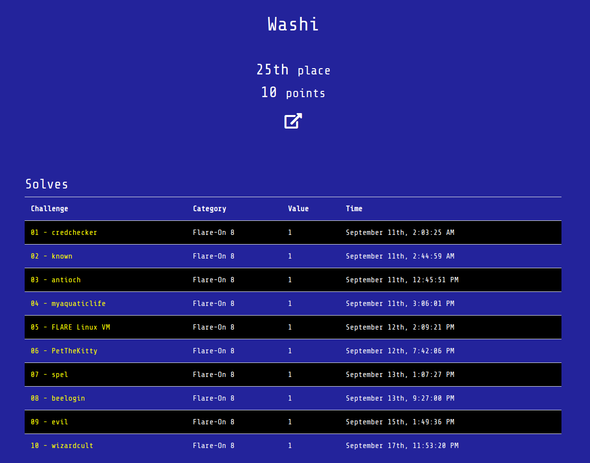

# Flare-On 2021

This directory contains write-ups with my solutions for Flare-On 2021 that was hosted by FireEye from September 10 to October 22 2021. 

## Table of Contents

- [1 - credchecker](01)
- [2 - known](02)
- [3 - antioch](03)
- [4 - myaquaticlife](04)
- [5 - FLARE Linux VM](05)
- [6 - PetTheKitty](06)
- [7 - spel](07)
- [8 - beeloign](08)
- [9 - evil](09)
- [10 - wizardcult](10)

## Binaries
Download the binaries [here](http://flare-on.com/files/Flare-On7_Challenges.zip).

## Bragging rights

