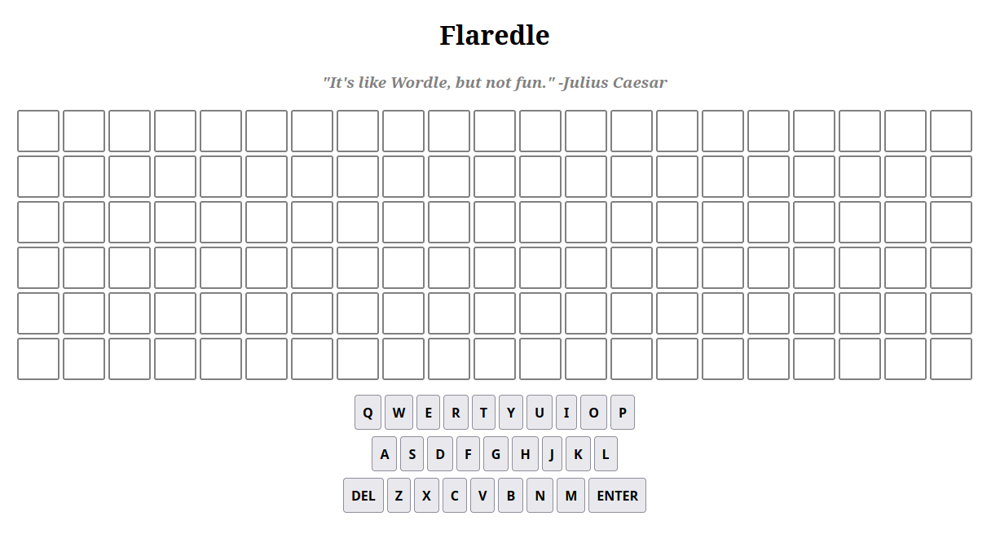
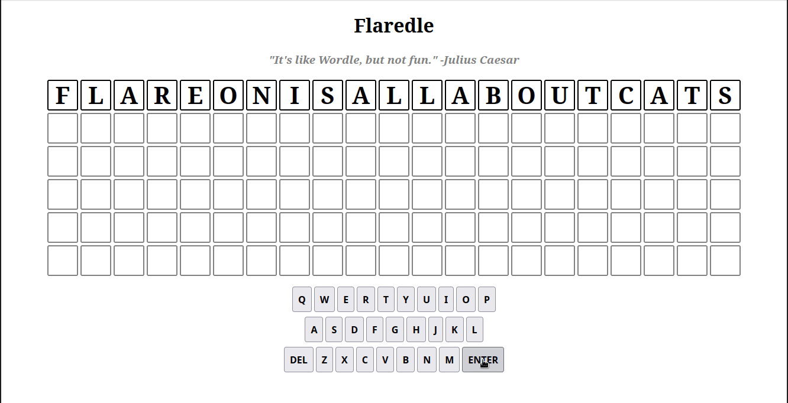

# 1 - Flaredle 

**Time spent:** 3 minutes

**Tools used:** Firefox

Every year's Flare-on starts easy.
This time around, we are presented with a simple web application that resembles one of the many WORDLE game clones, just with many more letters than are usually present in the game.



The description is:

```
You probably won't win. Maybe you're like us and spent the year playing Wordle. 
We made our own version that is too hard to beat without cheating.

Play it live at: http://flare-on.com/flaredle/
```

Looking into the source code of the underlying `script.js` that drives the game, we see a couple of interesting parts.
The file starts off with some fields:

```js
import { WORDS } from "./words.js";

const NUMBER_OF_GUESSES = 6;
const WORD_LENGTH = 21;
const CORRECT_GUESS = 57;
let guessesRemaining = NUMBER_OF_GUESSES;
let currentGuess = [];
let nextLetter = 0;
let rightGuessString = WORDS[CORRECT_GUESS];
```

And there is a function called `checkGuess` that looks a bit like the following:

```js
function checkGuess () {
    /* ... */

    if (guessString === rightGuessString) {
        let flag = rightGuessString + '@flare-on.com';
        toastr.options.timeOut = 0;
        toastr.options.onclick = function() {alert(flag);}
        toastr.success('You guessed right! The flag is ' + flag);

        guessesRemaining = 0
        return
    } else {
        guessesRemaining -= 1;
        currentGuess = [];
        nextLetter = 0;

        if (guessesRemaining === 0) {
            toastr.error("You've run out of guesses! Game over!")
            toastr.info('Try reverse engineering the code to discover the correct "word"!');
        }
    }
}
```

In the code we can see a direct string comparison between the variables `guessString` and `rightGuessString`. 
The latter is one of the global variables initialized to word number 57 of the word list stored in `words.js`.
If we open up the `words.js` file that was included in the archive, we find a index 57 the word `flareonisallaboutcats`.
Typing it into the game reveals the flag:

