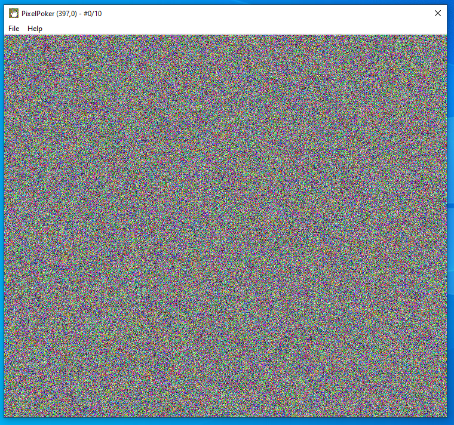
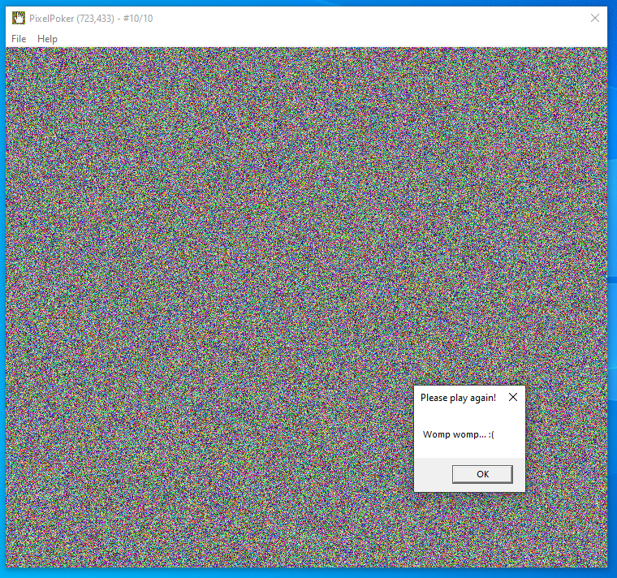
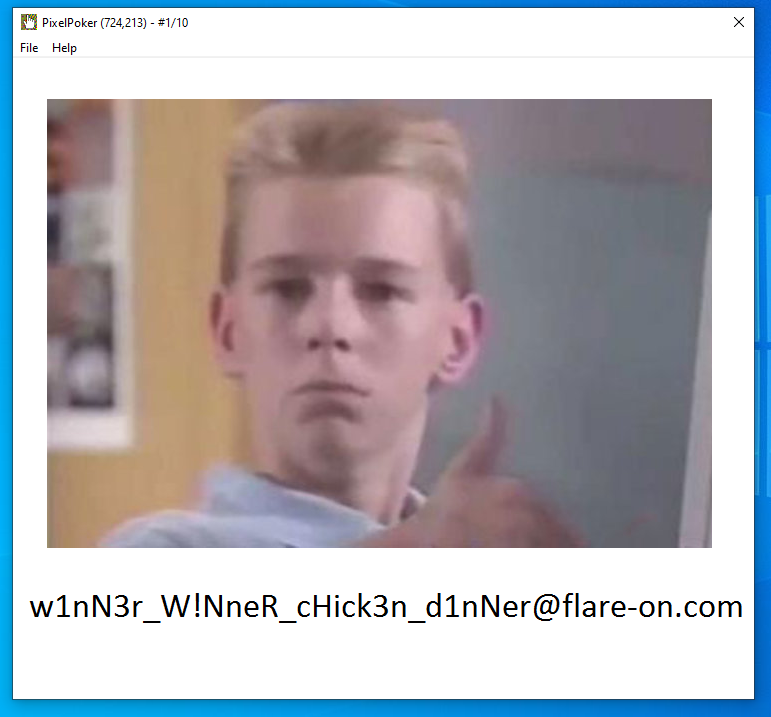

# 2 - Pixel Poker

**Time spent:** 15 minutes

**Tools used:** Ghidra, x64dbg


The second task in the series challenges you to another game that is significantly more difficult.
The note states:

```
I said you wouldn't win that last one. I lied. The last challenge was basically a captcha. 
Now the real work begins. Shall we play another game?
```

## Orientation

If we run the program, we are presented with a large, seemingly randomly generated image.



Clicking a couple of times on the canvas at random will eventually bring up a popup window with the text `"Womp womp... :("`.
The program terminates afterwards.



The name of the challenge suggests that we should be finding the right pixel to click, probably within a limited number of attempts.


## Analyzing the Code

We can find out the code responsible for our bad-boy message by opening the program in a decompiler such as Ghidra.
If you cross reference on this string, you will find that it is used in a `MessageBoxA` call inside of a `WndProc`-like function `FUN_004012c0`.
After renaming, retyping and cleaning up some of the decompiled code, this function looks a bit like the following:

```c
LRESULT FUN_004012c0(HWND hWnd,uint message,uint wParam,LPARAM lParam)
{
    /* ... */
    
    if (message < 0x112) {
        /* ... */
    }
    else {
        sVar1 = (short)((uint)lParam >> 0x10);
        
        /* ... */

        if (message == WM_LBUTTONDOWN) {
            x_cord = (uint)(short)lParam;
            y_cord = (uint)sVar1;
            if (ATTEMPTS == 10) {
                MessageBoxA(NULL,"Womp womp... :(","Please play again!",0);
                DestroyWindow(hWnd);
            }
            else {
                ATTEMPTS += 1;
                if ((x_cord == s_FLARE-On_00412004._0_4_ % (uint)cx_00413280) &&
                   (y_cord == s_FLARE-On_00412004._4_4_ % (uint)cy_00413284)) {
                    if (0 < cy_00413284) {
                        i = 0;
                        iVar4 = cx_00413280;
                        iVar5 = cy_00413284;
                        do {
                            j = 0;
                            if (0 < iVar4) {
                                do {
                                    function_that_sets_pixel(j,i);
                                    j += 1;
                                    iVar4 = cx_00413280;
                                    iVar5 = cy_00413284;
                                } while (j < cx_00413280);
                            }
                            i += 1;
                        } while (i < iVar5);
                    }
                }
                else if ((x_cord < (uint)cx_00413280) && (y_cord < (uint)cy_00413284)) {
                    function_that_sets_pixel(x_cord,y_cord);
                }
            }

            /* ... */
        }
    }
    LVar3 = DefWindowProcW(hWnd,message,wParam,lParam);
    return LVar3;
}
```

When the message loop receives a `WM_LBUTTONDOWN` message, we see that the program increases a global variable (`ATTEMPTS`), followed by some check on the coordinates of the clicked pixel.
If these conditions are met, then the program seems to enter some kind of loop that repeatedly calls _some_ function that calls `GetPixel` and `SetPixel`, presumably changing some pixels on the canvas.
After 10 times increasing the global variable, it gets to our `MessageBoxA` call we saw earlier and then destroys the window.

## Getting the flag

When I see a construction like this, I have no real intention of actually trying to understand how exactly this `function_that_sets_pixel` function works, nor do I care about the exact conditions that are required to enter this loop.
All I want to do is get the program to enter the loop and just do its thing, and the easiest way of achieving this to me is by simply patching the program.

Open up x64dbg, and patch the jumps that make up the if statement at addresses `00401486` and `0040149D` with `nop`s.
Then, clicking anywhere on the canvas...



... reveals the flag!


