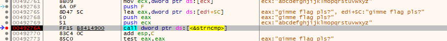

# 3 - Magic 8 Ball

**Time spent:** ~30 minutes

**Tools used:** Ghidra, x64dbg

Challenge 3 resembles a bit of a "game hacking" challenge.

The note states:

```
You got a question? Ask the 8 ball!
```

## Orientation

Opening the program reveals a very basic interface that seems to be rendered using some very pixelated art style:


We can press the arrow keys to shake the ball. 
We can also type in a question and hit enter to let the 8 ball give us what seems to be a random answer every time.

A good guess here is that we need to find the right question and the right sequence of "shaking" operations to get to our flag.


## Analyzing the Code


Judging from the DLL files that were attached to the executable file, this is a program that uses SDL, a library that is often used for game development (or any form of hardware accelerated graphics).
Similar to normal Windows GUI Applications, games that use SDL have a message loop that periodically checks for any input and updates the state of the program accordingly.

This program is no exception to this. 
If we cross reference on some typical SDL functions like `SDL_GetTicks`, we find our main game loop at `FUN_004027a0`:

```c
int FUN_004027a0(void)
{
    /* ... */
    
    // Initialize main game context object.
    pvVar2 = allocate(0x174);
    if (pvVar2 == NULL) {
        MAIN_CONTEXT = NULL;
    }
    else {
        memset(pvVar2,0,0x174);
        MAIN_CONTEXT = context_t::.ctor(pvVar2);
    }
    pvVar4 = NULL;
    strncpy(&stack0xffffffe4,"Magic 8 Ball",0xc);
    uVar1 = FUN_00402090(MAIN_CONTEXT,&stack0xffffffe4,0x2fff0000,0x2fff0000,800,600);
    if (/* ... */) {
        /* ... */
    }
    if (uVar1 != '\0') {

        // Main game loop.
        is_running = MAIN_CONTEXT->is_running;
        while (is_running != false) {
            start_frame_ticks = SDL_GetTicks();
            FUN_00401e50(MAIN_CONTEXT,unaff_ESI,pvVar4,in_stack_ffffffe8,in_stack_ffffffec,in_stack_fffffff0);
            FUN_004024e0(MAIN_CONTEXT);
            FUN_004022a0(MAIN_CONTEXT);
            end_frame_ticks = SDL_GetTicks();
            if (end_frame_ticks - start_frame_ticks < 0x10) {
                SDL_Delay(0x10 - (end_frame_ticks - start_frame_ticks));
            }
            is_running = MAIN_CONTEXT->is_running;
        }
    }

    // Cleanup
    FUN_004019f0(MAIN_CONTEXT);
    return 0;
}
```

In this game loop, we see three functions being called in repetition (`FUN_00401e50`, `FUN_004024e0`, and `FUN_004022a0`).
The first function is a very large function that continuously calls `SDL_PollEvent` to wait for the next event in SDL's event queue and processes it.

```c
undefined4 __thiscall FUN_00401e50(context_t *this,undefined4 *param_2,undefined4 param_3,undefined4 param_4, undefined4 param_5,undefined4 param_6)
{
    /* ... */
    
    iVar3 = SDL_PollEvent(event);
    
    /* ... */

    do {
        if (iVar3 == 0) {
            uVar5 = FUN_004029ab(local_8 ^ &stack0xfffffffc,uVar2,uVar14);
            return uVar5;
        }
        if (event[0] < 0x302) {
            if (event[0] == 0x301) {
                /* ... */
            }
            else if (event[0] == 0x100) {
                this->is_running = false;
            }
            else if (event[0] == 0x300) {
                /* ... */
            }
        }
        else if ((event[0] == 0x303) && (local_34[1] == '\0')) {
            /* ... */
        }
        iVar3 = SDL_PollEvent(event);
        /* ... */
    } while( true );
}
```

I have no real intention to analyze the event processing of this game if I don't have to, so I decided to not dive too deep into this function just yet.

The second function (`FUN_004024e0`) looks more interesting.
It starts with a lot of pointer magic that I again don't really have any reason to fully dive into yet.
However, what took my attention the most is the large array of if-then-else statements that follows it:

```c
void __fastcall FUN_004024e0(context_t *context)
{
    /* ... pointer magic here ... */

    if (context->field_0x159 != '\0') {
        length = *&context->field_0x124;
        pcVar4 = buff;
        if (0xf < length) {
            pcVar4 = *buff;
        }
        if (*pcVar4 == 'L') {
            puVar3 = buff;
            if (0xf < length) {
                puVar3 = *buff;
            }
            if (puVar3[1] == 'L') {
                puVar3 = buff;
                if (0xf < length) {
                    puVar3 = *buff;
                }
                if (puVar3[2] == 'U') {
                    puVar3 = buff;
                    if (0xf < length) {
                        puVar3 = *buff;
                    }
                    if (puVar3[3] == 'R') {
                        puVar3 = buff;
                        if (0xf < length) {
                            puVar3 = *buff;
                        }
                        if (puVar3[4] == 'U') {
                            puVar3 = buff;
                            if (0xf < length) {
                                puVar3 = *buff;
                            }
                            if (puVar3[5] == 'L') {
                                puVar3 = buff;
                                if (0xf < length) {
                                    puVar3 = *buff;
                                }
                                if (puVar3[6] == 'D') {
                                    puVar3 = buff;
                                    if (0xf < length) {
                                        puVar3 = *buff;
                                    }
                                    if (puVar3[7] == 'U') {
                                        puVar3 = buff;
                                        if (0xf < length) {
                                            puVar3 = *buff;
                                        }
                                        if (puVar3[8] == 'L') {
                                            pcVar4 = &context->string2;
                                            if (0xf < *&context->field_0x10c) {
                                                pcVar4 = *pcVar4;
                                            }
                                            iVar1 = strncmp(pcVar4,context->string1,0xf);
                                            if (iVar1 == 0) {
                                                FUN_00401220(&stack0xffffffc0,buff);
                                                FUN_00401a10(context,in_stack_ffffffc0);
                                            }
                                        }
                                    }
                                }
                            }
                        }
                    }
                }
            }
        }
    }
    return;
}
```

It seems to be some kind of unrolled loop of comparisons that systematically checks the contents of two buffers.
The first one (`puVar3`) has to consist of a sequence of four different characters `L`, `R`, `U`, and `D`. 
The second one (`pcVar4`) is passed onto a call to `strncmp`.
If all these tests pass, two functions `FUN_00401220` and `FUN_00401a10` are invoked.
This seems to be a nice place to start analyzing!


## Getting the Flag


Since the `puVar3` buffer comparisons are with four characters only, and the 8 ball can only be moved in four directions, I decided to test this theory that suggests the four characters represent the directions `Left`, `Right`, `Up` and `Down`, and fire up x64dbg.
As the characters used in the if statements read out the string `"LLURULDUL"`, I pressed the arrow keys in the following sequence...

```
Left
Left
Up
Right
Up
Left
Down
Up
Left
```
... and typed in the latin alphabet as an input question and hit enter.
This theory seemed to be correct, as all but the last test passed.
This means that I can skip most of the code that is relevant to the SDL event processing in `FUN_00401e50`, great!
The only thing that remained was the `strncmp`.
However, since we are in a debugger, we can easily find out which strings are compared:



And surprise, we see a direct comparison of our input message with the string `"gimme flag pls?"`!
If we repeat the same process, but this time enter the right question...


... we get our flag!
