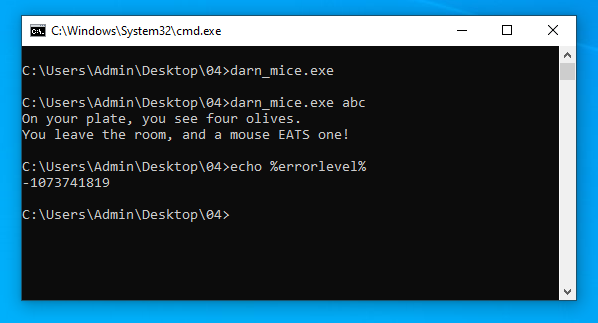
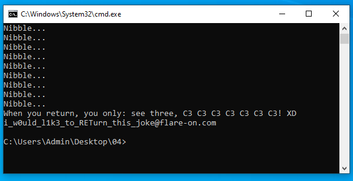

# 4 - darn_mice

**Time spent:** ~20 minutes

**Tools used:** Ghidra, x64dbg, Python

Challenge 4 is quite straightforward.
You are given a small command-line binary, along with the following note:

```
"If it crashes its user error." -Flare Team
```

## Orientation

On its own, the program does not seem to be doing much, as it closes immediately.
If we try to add an argument to the commandline however, we get that the program crashes with an access violation (`-1073741819` = `0xc0000005`) after printing some text to the standard output:



As the note suggests, letting the program crash is user error. 
Since we are the user of the program here, this means that we probably made the mistake of entering an input that does not work.

Let's find an input that _does_ work!


## Analyzing the Code

Opening the file in Ghidra reveals that not a lot of things are going on in this program. 
The main function is very simple:

```c
undefined4 __cdecl main(int argc,char **argv)
{
    if (argc == 2) {
        FUN_00401000(argv[1]);
    }
    return 0;
}
```

The program expects exactly one argument and passes it onto function `FUN_00401000`, where it is being processed:

```c
void __cdecl FUN_00401000(PUCHAR input)
{
    /* ... */
    
    ptr = NULL;
    data[0] = 0x50;
    /* ... a bunch of hardcoded data ... */
    data[34] = 0x7f;
    data[35] = 0;
    
    printf(s_On_your_plate,_you_see_four_oliv_00419034,0,0,0);

    length = _strlen(input);
    if ((length == 0) || (35 < length)) {
        printf(s_No,_nevermind._0041905c,ptr,length);
        uVar3 = SUB41(ptr,0);
        uVar2 = extraout_DL;
    }
    else {
        printf(s_You_leave_the_room,_and_a_mouse_E_0041906c,ptr,length);
        for (i = 0; ((uVar3 = SUB41(ptr,0), i < 36 && (data[i] != 0)) && (input[i] != '\0')); i += 1) {
            ptr = VirtualAlloc(NULL,0x1000,0x3000,PAGE_EXECUTE_READWRITE);
            *ptr = data[i] + input[i];
            (*ptr)();
            printf(s_Nibble..._00419098);
        }
        printf(s_When_you_return,_you_only:_%s_004190a4,input);
        FUN_00401280(&ENCRYPTED_FLAG_BUFFER,s_-_00419030,input,s_salty_004190c4,
                     &ENCRYPTED_FLAG_BUFFER,s_-_00419030);
        printf(s_%s_004190cc,&ENCRYPTED_FLAG_BUFFER);
        uVar2 = extraout_DL_00;
    }

    FUN_00401615(uVar1 ^ &stack0xfffffffc,uVar2,uVar3);
    return;
}
```

It starts with a very long chunk of data being moved into an array of 36 elements (`data`).
Then it tests whether the length of the input string is the same as the length of this data, and if it is, does some verification on it in a `for`-loop, and then feeds it into a function that decrypts the flag.
If we look into this function (`FUN_00401280`), we get discouraged pretty quickly.

```c
void __cdecl FUN_00401280(char *flag_buffer,uint output_length,PUCHAR input,PUCHAR salt,char *input_buffer?,uint input_length)
{
    /* ... */

    NVar3 = BCryptOpenAlgorithmProvider(&local_50,u_SHA512_00419114,NULL,8);
    local_4c = NVar3;
    if (NVar3 < 0) {
        /* ... */
    }
    else {
        /* ... */
        cbSalt = _strlen(salt);
        cbPassword = _strlen(input);
        NVar3 = BCryptDeriveKeyPBKDF2(local_50,input,cbPassword,salt,cbSalt,CONCAT44(uVar6,uVar5),pbDerivedKey,cbDerivedKey,dwFlags);
        local_4c = NVar3;
        if (NVar3 < 0) {
            /* ... */
        }
        else {
            FUN_004015c0(local_48,0x40,flag_buffer,output_length,input_buffer?);
            uVar8 = 1;
            uVar4 = extraout_DL_03;
        }
    }
LAB_004013ba:
    FUN_00401615(local_8 ^ &stack0xfffffffc,uVar4,uVar8);
    return;
}
```

It uses functions from the BCrypt module (`BCryptOpenAlgorithmProvider` and `BCryptDeriveKeyPBKDF2`) to initialize some decryption key based on our input string, to then use it in a function `FUN_004015c0` that does all kinds of complicated cryptographic operations that I really do not want to get into if not necessary.
No luck there!

Let's hunt for some clues in the verification steps that were done in the previous function.
In particular, what is the role of this `data` array that was initialized before?

## Getting the flag

As it so turns out, the answer is hidden within the loop that is executed right before the flag decryption:

```c
for (i = 0; ((uVar3 = SUB41(ptr,0), i < 36 && (data[i] != 0)) && (input[i] != '\0')); i += 1) {
    ptr = VirtualAlloc(NULL,0x1000,0x3000,PAGE_EXECUTE_READWRITE);
    *ptr = data[i] + input[i];
    (*ptr)();
    printf(s_Nibble..._00419098);
}
```

In this loop, we see that the program allocates some **executable** memory for each character, then combines the character with a byte from the hardcoded string in `data`, and then reinterprets this allocated memory as a function body by calling it.

This means that for our input to be valid, we need to craft it in such a way that it results in valid x86 code to be executed.
This also explains why the program crashes with our input.
Our test inputs did not result in proper x86 code!

One way to let this program pass all the checks, is to construct an input in such a way that the dynamically generated function body simply returns.
The easiest way to do this, is to make sure that the characters in our input and the bytes in `data` all add up to the byte `0xC3`, which decodes to the `ret` instruction.
Let's write a quick Python script to calculate the values for which this is exactly the case:

```python
data = [0x50,0x5e,0x5e,0xa3,0x4f,0x5b,0x51,0x5e,0x5e,0x97,0xa3,0x80,0x90,0xa3,0x80,0x90,0xa3,0x80,0x90,0xa3,0x80,0x90,0xa3,0x80,0x90,0xa3,0x80,0x90,0xa3,0x80,0x90,0xa2,0xa3,0x6b,0x7f]
target = 0xc3

result = bytearray()
for b in data:
    result.append(target - b)
print(result)
```

```console
$ python solve.py
bytearray(b'see three, C3 C3 C3 C3 C3 C3 C3! XD')
```

If we plug this into the program...



... we get our flag!