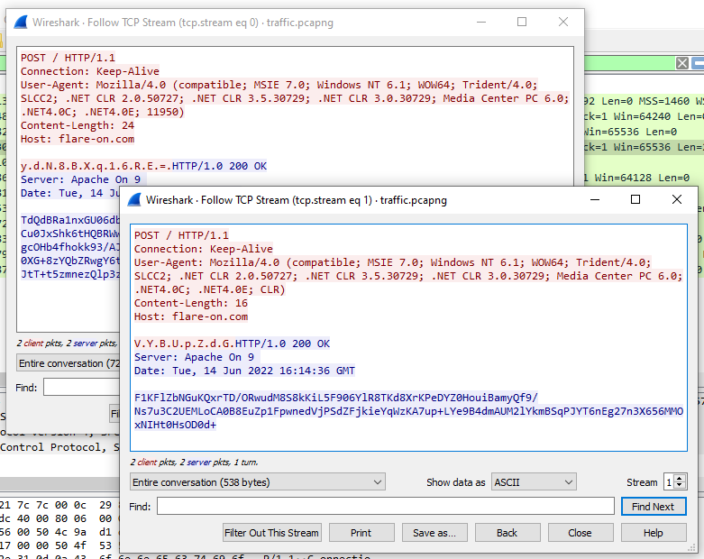
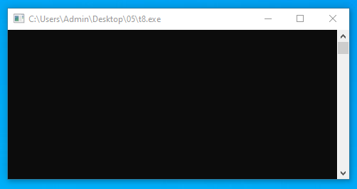
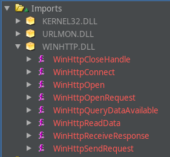
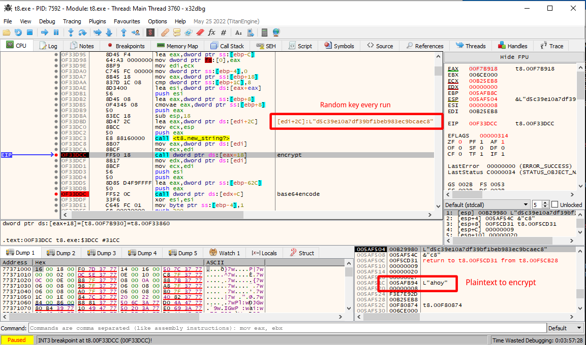
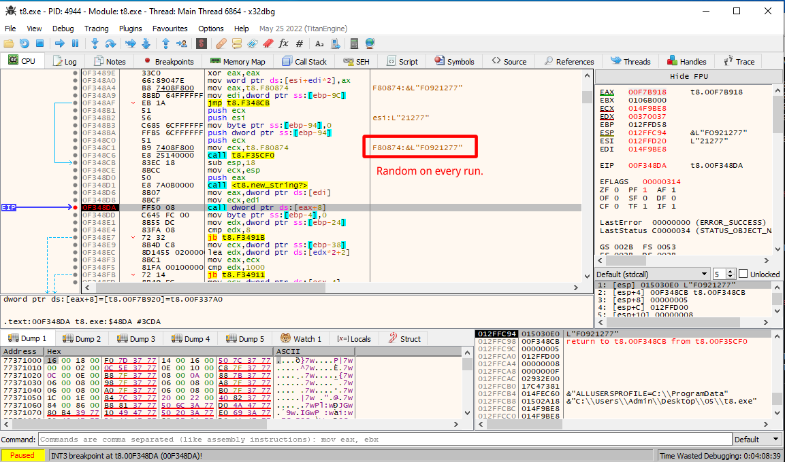
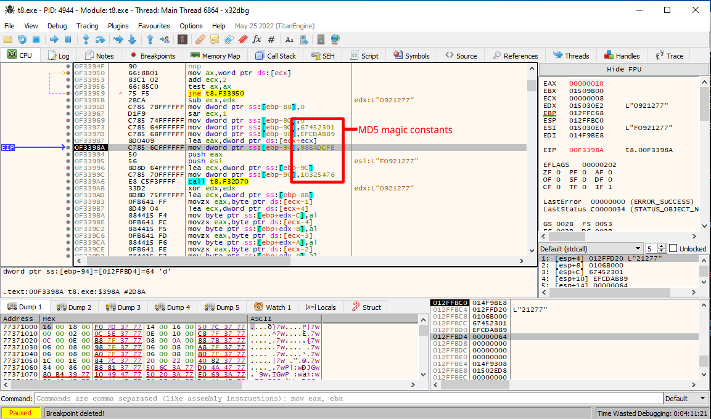
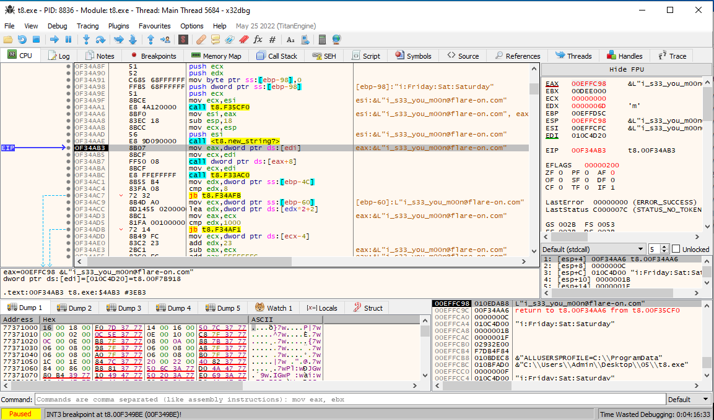

# 5 - T8

**Time spent:** 2-3 hours

**Tools used:** Ghidra, x64dbg, Python

Challenge 5 is where the difficulty starts ramping up a bit in this years series.
We are given an executable and a `.pcapng` file with a network capture that the program supposedly has generated in the past.
The difficulty in this challenge is mainly coming form the the application being written in C++.
Many disassemblers and decompilers often have a hard time decompiling these types of applications and/or making it look nice.
But as it turns out, we do not really have to understand everything in this challenge to let the challenge do most of the work for us.


## Orientation


If we open the network capture in wireshark, we see that there were 2 HTTP requests made to `flare-on.com`.




However, when we run the application ourselves, all it seems to be doing is wait for something, without performing any HTTP operations whatsoever.




## Analyzing the Code

Looking into Ghidra, and navigate to the main function of the program, we see that it starts with a construction that looks like the following:

```c
void FUN_00404680(void)
{
    /* ... */
    iVar6 = FUN_00404570(_DAT_0045088c,uRam00450890);
    while (iVar6 != 0xf) {
        Sleep(43200000);
        iVar6 = FUN_00404570(_DAT_0045088c,uRam00450890);
    }
    /* ... */
}
```

It seems indeed to be indeed waiting for _something_, something that is decided by `FUN_00404570`. 
I have no intention to try and understand what's going on in `FUN_00404570`, so I patched this loop out.

I then looked for traces in the code that would be able to facilitate HTTP requests.
Fortunately, these traces are not difficult to find, the binary imports a variety of procedures from `winhttp.dll` that we can set breakpoints on.



It so turns out function `FUN_00403d70` is responsible for calling these procedures.
And right before it, it encrypts _some_ data with _some_ key.

```c
void __thiscall FUN_00403d70(CClientSock *this,undefined4 *param_2)
{
    /* ... */

    strnew2?(&uStack1676,&this->rc4_key);
    uVar3 = (*this->vtfable->encrypt_rc4)();
    (*this->vtfable->base64_encode)(data_enc,uVar3,in_stack_00000014 * 2);
    
    /* ... */

    HVar4 = ObtainUserAgentString(0,aCStack534 + 2,&local_618);
    if (HVar4 == 0) {
        /* ... */

        http = WinHttpOpen(local_614,0,0,0,0);
        if (http != 0) {
            host = &this->host;
            if (7 < this->field31_0x28) {
                host = *host;
            }
            connection = WinHttpConnect(http,host,0x50,0);
            pWinHttpCloseHandle = WinHttpCloseHandle_exref;
            if (connection != 0) {
                request = WinHttpOpenRequest(connection,&this->method,0,0,0,0,0);
                if (request != 0) {
                    data = data_enc;
                    if (7 < local_61c) {
                        data = data_enc[0];
                    }
                    iVar5 = WinHttpSendRequest(request,0,0,data,length * 2,length * 2,0);
                    if ((iVar5 != 0) && (iVar5 = WinHttpReceiveResponse(request,0), iVar5 != 0)) {
                        pdVar1 = &this->recv_buffer_size;
                        do {
                            while( true ) {
                                *pdVar1 = 0;
                                WinHttpQueryDataAvailable(request,pdVar1);
                                if (*pdVar1 < 0x801) break;
                                this->recv_buffer_size = 0x800;
                            }
                            WinHttpReadData(request,this->recv_buffer,*pdVar1,&local_634);
                            pWinHttpCloseHandle = WinHttpCloseHandle_exref;
                        } while (this->recv_buffer_size != 0);
                    }
                    (*pWinHttpCloseHandle)(request);
                }
                (*pWinHttpCloseHandle)(connection);
            }
            (*pWinHttpCloseHandle)(http);
        }
       /* ... */
    }
    else {
        /* ... */
    }
    /* ... */
}
```

Verifying with x64dbg, we can see that the program attempts to encrypt the string `"ahoy"` with what seems to be some random hash every time you rerun the application:



It seems the program is dependent on some random factor that we have missed.


## Solving the Random Mystery

I worked on the assumption that if there is some randomization going on, it probably is stored somewhere as a variable in the same class object at some point.
This means that it should be set in our `main` function somewhere before the requests are made.
The seemingly random hash looks like an MD5 hash given its length, so it is time to look for code that takes some random input, and produces a hash like that.

Stepping through the code of the main function gives a nice candidate:



If we look up this call in Ghidra, and backtrace a bit to see where the arguments are coming from, we can see that it follows the following pattern:

```python
input = "FO9" + str(DAT_00450870)
```

Stepping into this function also reveals indeed that it is put into an MD5 hashing algorithm.




Cross referenceing on `DAT_00450870` reveals that it is a global variable that is set in `FUN_00401020` using the `rand()` function:

```c
void FUN_00401020(void)
{
    /* ... */

    GetLocalTime(&stack0xffffffdc);
    FUN_00422015(((uStack24 & 0xffff) + (uStack28 >> 0x10) * 0x3c) * 1000 + (uStack24 >> 0x10));
    uVar2 = in_stack_ffffffdc;
    DAT_00450870 = rand();
    
    /* ... */
    return;
}
```

We would need to guess what this `rand` call was seeded with to get the same.
No luck there.
However, instead, I chose to find the resulting random value that corresponds to the traffic that we see in the network trace.
For that I pulled a random implementation of the RC4 encryption algorithm from the internet, and wrote a little bruteforce program:

```python
import base64
import hashlib

# ... RC4 implementation omited ...

def get_rc4_key(seed):
    return hashlib.md5((f"FO9{seed}").encode('utf16')[2:]).hexdigest().encode('utf16')[2:]

known_plaintext = "ahoy".encode('utf16')[2:]

# Data from wireshark
ciphtertext = base64.b64decode(bytes.fromhex("790064004e00380042005800710031003600520045003d00").decode('utf16')) 

for i in range(0, 1000000):
    key = get_rc4_key(i)
    if rc4_encrypt(ciphtertext, key) == known_plaintext:
        seed = i
        break

print("seed found:", hex(i))
```

This yields:

```console
seed found: 0x2eae
```

We can then go back to function `FUN_00401020` that assigned our global variable, and patch out the `rand()` function call with a simple assignment to the number that the script found.
We are now simulating all the conditions that the program was running in the moment the wireshark capture was made.


## Getting the Flag


Since the program used the same RC4 algorithm and also the same key for the input, I decided to also try and decrypt the response that was sent by the server.

```python
msg = "TdQdBRa1nxGU06dbB27E7SQ7TJ2+cd7zstLXRQcLbmh2nTvDm1p5IfT/Cu0JxShk6tHQBRWwPlo9zA1dISfslkLgGDs41WK12ibWIflqLE4Yq3OYIEnLNjwVHrjL2U4Lu3ms+HQc4nfMWXPgcOHb4fhokk93/AJd5GTuC5z+4YsmgRh1Z90yinLBKB+fmGUyagT6gon/KHmJdvAOQ8nAnl8K/0XG+8zYQbZRwgY6tHvvpfyn9OXCyuct5/cOi8KWgALvVHQWafrp8qB/JtT+t5zmnezQlp3zPL4sj2CJfcUTK5copbZCyHexVD4jJN+LezJEtrDXP1DJNg=="

key = get_rc4_key(seed)
print("key:", key.decode('utf16'))

decrypted = encrypt(base64.b64decode(msg), key)
print(decrypted)
```

However, that did not return anything readable.

```console
key: a5c6993299429aa7b900211d4a279848
bytearray(b'\xe5\x07\t\x00\x03\x00\x0f\x00\r\x00%\x00\x03\x00b\x02,\x00\xdc\x07\n\x00\x06\x00\r\x00\r\x00%\x00\t\x00*\x03,\x00\xe1\x07\x0c\x00\x04\x00\x07\x00\r\x00%\x00$\x00\xe5\x00,\x00\xe0\x07\x05\x00\x05\x00\x06\x00\r\x00%\x00\x0b\x00&\x00,\x00\xe2\x07\n\x00\x01\x00\x08\x00\r\x00%\x00\x1f\x00E\x03,\x00\xe6\x07\x03\x00\x02\x00\x01\x00\r\x00%\x002\x00\xda\x00,\x00\xde\x07\x07\x00\x02\x00\x16\x00\r\x00%\x006\x00\xd1\x02,\x00\xde\x07\x05\x00\x03\x00\x0e\x00\r\x00%\x00\x01\x00\xe8\x00,\x00\xda\x07\x04\x00\x01\x00\x05\x00\r\x00%\x00:\x00\x0b\x00,\x00\xdd\x07\n\x00\x04\x00\x03\x00\r\x00%\x00\x16\x00\x16\x03,\x00\xde\x07\x01\x00\x02\x00\x0e\x00\r\x00%\x00\x10\x00\xc9\x00,\x00\xdc\x07\x0c\x00\x01\x00\n\x00\r\x00%\x000\x00\x0c\x02,\x00\xe6\x07\x02\x00\x01\x00\x1c\x00\r\x00%\x00"\x00K\x01,\x00\xe6\x07\t\x00\x05\x00\t\x00\r\x00%\x00!\x00m\x01')
```

Thus, something else must be done with this decrypted data.
To make debugging easier, I added the `flare-on.com` domain to my hosts file, and wrote a little Flask Python script to simulate the original behavior of the server:

```python
from flask import Flask
from flask import request

app = Flask(__name__)

@app.route('/', methods = ['GET', 'POST', 'DELETE'])
def endpoint():
    return "TdQdBRa1nxGU06dbB27E7SQ7TJ2+cd7zstLXRQcLbmh2nTvDm1p5IfT/Cu0JxShk6tHQBRWwPlo9zA1dISfslkLgGDs41WK12ibWIflqLE4Yq3OYIEnLNjwVHrjL2U4Lu3ms+HQc4nfMWXPgcOHb4fhokk93/AJd5GTuC5z+4YsmgRh1Z90yinLBKB+fmGUyagT6gon/KHmJdvAOQ8nAnl8K/0XG+8zYQbZRwgY6tHvvpfyn9OXCyuct5/cOi8KWgALvVHQWafrp8qB/JtT+t5zmnezQlp3zPL4sj2CJfcUTK5copbZCyHexVD4jJN+LezJEtrDXP1DJNg=="
    
if __name__ == '__main__':
   app.run(host='0.0.0.0', port=80)
```   

Funnily enough, this was all I need to solve the challenge.
While stepping through the code of `main` after the requests were made, all of the sudden the flag started to appear in memory everywhere around address `0x404aa1`:



I am not quite sure if this was intentional or not, but hey, a win is a win :).


