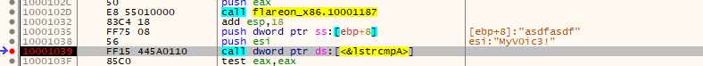

# 6 - à la mode 

**Time spent:** 30 minutes

**Tools used:** Ghidra, x64dbg, Python

Challenge 6 is a bit unusual. 
In this challenge, we are not presented with an executable file that we can simply double-click and see what happens.
Instead, we are provided with a DLL file that we somehow need to interact with.

The note states:
```
FLARE FACT #824: Disregard flare fact #823 if you are a .NET Reverser too.

We will now reward your fantastic effort with a small binary challenge. You've earned it kid!
```

## Orientation

Looking into CFF Explorer, we see that the DLL is actually a binary containing .NET metadata:


Opening it in dnSpy reveals that there is only one class with one method called `GetFlag` available to us:


The code is pretty straight forward.
First it connects to some named pipe and feeding the `password` parameter into it.
It then reads a couple bytes from the pipe, turns it into a UTF-8 string and returns it.
The problem is, we do not have any communication trace of the pipe, nor is there another .NET function available that implements the server side of this pipe.

So where is this password transmitted to?


## Finding the hidden code

I worked under the assumption that if the program is working fine, then _somewhere_ in the binary it has to initialize a named pipe server that this `GetFlag` method connects to.
Besides, the DLL file is 77KB large, which is much more data than that is required for such a small .NET library.

If we look at the imports directory of the binary, we see something unusual:


Normally, .NET binaries have only one entry in this table, referencing `mscoree.dll!_CorExeMain`. 
But this one has many references to `kernel32.dll` as well.
If you know something about .NET applications, this is a pretty big indication that this is a mixed-mode application, possibly written using e.g., C++/CLI.
And indeed, if we look into the .NET data directory header, and check the flags, we can see the Native Entry Point flag has been set.


This means the value stored in the `EntryPointToken` field of the .NET Directory (`0000181A`) is in fact not a token but an RVA pointing to native code instead.

Switching to Ghidra it is!


## Analyzing the native code


If we go to the address in Ghidra, we see it is indeed a function that Ghidra recognized as `__DllMainCRTStartup@12`, which in turn calls `dllmain_dispatch`.
This eventually transfers control to `FUN_10001163`, which is our original `DllMain` function for this library:

```c
undefined4 FUN_10001163(undefined4 param_1,int param_2)
{
    if (param_2 == 1) {
        FUN_100012f1();
        (*DAT_10015a30)(0,0,&LAB_10001094,0,0,0);
    }
    return 1;
}
```

We see a small function body that first calls `FUN_100012f1`, followed by a call to a function pointer stored at `DAT_10015a30`.
If we look into `FUN_100012f1`, we can see that it decrypts a bunch of strings via a simple XOR cipher, which are then each passed onto the function `FUN_1000125c`.
The results are stored in what seems to be some global table, including `DAT_10015a30`:

```c
void FUN_100012f1(void)
{
    /* ... */
    
    peb = FUN_100012db();
    iVar1 = xor_decrypt(s_T{xdr_vys{r_10015060,&DAT_10015a50);
    DAT_10015a24 = FUN_1000125c(peb,iVar1);
    iVar1 = xor_decrypt(s_TxyyrtcYvzrsG~gr_10015070,&DAT_10015a50);
    DAT_10015a28 = FUN_1000125c(peb,iVar1);
    iVar1 = xor_decrypt(s_TervcrYvzrsG~grV_10015084,&DAT_10015a50);
    DAT_10015a2c = FUN_1000125c(peb,iVar1);
    iVar1 = xor_decrypt(s_TervcrC_ervs_10015098,&DAT_10015a50);
    DAT_10015a30 = FUN_1000125c(peb,iVar1);
    iVar1 = xor_decrypt(s_S~dtxyyrtcYvzrsG~gr_100150a8,&DAT_10015a50);
    DAT_10015a34 = FUN_1000125c(peb,iVar1);
    iVar1 = xor_decrypt(s_Q{bd_Q~{rUbqqred_100150bc,&DAT_10015a50);
    DAT_10015a38 = FUN_1000125c(peb,iVar1);
    iVar1 = xor_decrypt(s_Prc[vdcReexe_100150d0,&DAT_10015a50);
    DAT_10015a3c = FUN_1000125c(peb,iVar1);
    iVar1 = xor_decrypt(s_PrcGextrdd_rvg_100150e0,&DAT_10015a50);
    DAT_10015a40 = FUN_1000125c(peb,iVar1);
    iVar1 = xor_decrypt(s_{dcetzgV_100150f0,&DAT_10015a50);
    DAT_10015a44 = FUN_1000125c(peb,iVar1);
    iVar1 = xor_decrypt(s_ErvsQ~{r_100150fc,&DAT_10015a50);
    DAT_10015a48 = FUN_1000125c(peb,iVar1);
    iVar1 = xor_decrypt(s_@e~crQ~{r_10015108,&DAT_10015a50);
    DAT_10015a4c = FUN_1000125c(peb,iVar1);
    return;
}

int __cdecl xor_decrypt(byte *param_1,byte *param_2)
{
    byte bVar1;
    int i;
    int j;
    
    i = 0;
    bVar1 = *param_1;
    if (bVar1 != 0) {
        j = param_2 - param_1;
        do {
            i += 1;
            param_1[j] = bVar1 ^ 0x17;  // <-- key = 0x17
            param_1 = param_1 + 1;
            bVar1 = *param_1;
        } while (bVar1 != 0);
    }
    param_2[i] = 0;
    return param_2;
}
```

If we look in the listing of encrypted strings, we see that they area all nicely placed together in sequence starting from address `0x1001504c`.
We can thus build a simple Python script that decrypts all the strings and print them:

```python
def decrypt_string(x):
    return bytes(b ^ 0x17 for b in x)

# data 0x1001504c - 0x10015112
data = b'\x4b\x4b\x39\x4b\x67\x7e\x67\x72\x4b\x51\x7b\x76\x65\x72\x58\x79\x00\x00\x00\x00\x54\x7b\x78\x64\x72\x5f\x76\x79\x73\x7b\x72\x1d\x00\x00\x00\x00\x54\x78\x79\x79\x72\x74\x63\x59\x76\x7a\x72\x73\x47\x7e\x67\x72\x00\x00\x00\x00\x54\x65\x72\x76\x63\x72\x59\x76\x7a\x72\x73\x47\x7e\x67\x72\x56\x00\x00\x00\x00\x54\x65\x72\x76\x63\x72\x43\x7f\x65\x72\x76\x73\x00\x00\x00\x00\x53\x7e\x64\x74\x78\x79\x79\x72\x74\x63\x59\x76\x7a\x72\x73\x47\x7e\x67\x72\x00\x51\x7b\x62\x64\x7f\x51\x7e\x7b\x72\x55\x62\x71\x71\x72\x65\x64\x00\x00\x00\x00\x50\x72\x63\x5b\x76\x64\x63\x52\x65\x65\x78\x65\x00\x00\x00\x00\x50\x72\x63\x47\x65\x78\x74\x72\x64\x64\x5f\x72\x76\x67\x00\x00\x7b\x64\x63\x65\x74\x7a\x67\x56\x00\x00\x00\x00\x45\x72\x76\x73\x51\x7e\x7b\x72\x00\x00\x00\x00\x40\x65\x7e\x63\x72\x51\x7e\x7b\x72\x00'

# split by zero bytes.
data = [a for a in data.split(b'\00') if a]

# decrypt and print all
for entry in data:
    print(decrypt_string(entry))
```

This outputs:
```
b'\\\\.\\pipe\\FlareOn'
b'CloseHandle\n'
b'ConnectNamedPipe'
b'CreateNamedPipeA'
b'CreateThread'
b'DisconnectNamedPipe'
b'FlushFileBuffers'
b'GetLastError'
b'GetProcessHeap'
b'lstrcmpA'
b'ReadFile'
b'WriteFile'
```

Seems like `FUN_100012f1` sets up a custom import address table.
Let's annotate all the pointers in the table with the corresponding names:


Now, our `DllMain` function makes a lot more sense:

```c
undefined4 FUN_10001163(undefined4 param_1,int param_2)
{
    if (param_2 == 1) {
        FUN_100012f1();
        (*pCreateThread)(0,0,FUN_10001094,0,0,0);
    }
    return 1;
}
```

## Getting the flag

We know now that our DllMain creates a thread with `FUN_10001094` as entry point. 
Let's dive in:

```c
undefined4 FUN_10001094(void)
{
    /* ... */
    
    _memset(buffer,0,0x40);
    (*pGetProcessHeap)();
    /* ... */
    iVar1 = xor_decrypt(b'\\\\.\\pipe\\FlareOn',&DAT_100159d8);
    iVar1 = (*pCreateNamedPipeA)(iVar1,uVar3,uVar4,uVar5,uVar6,uVar7,uVar8,uVar9);
    if (iVar1 != -1) {
        iVar2 = (*pConnectNamedPipe)(iVar1,0);
        if (iVar2 == 0) {
            (*pGetLastError)();
        }
        iVar2 = (*pReadFile)(iVar1,buffer,0x40,&count,0);
        if ((iVar2 == 0) || (count == 0)) {
            (*pGetLastError)();
        }
        else {
            (*pFlushFileBuffers)(iVar1);
            buffer[count] = '\0';
            FUN_10001000(buffer,&local_c);
            (*pWriteFile)(iVar1,buffer,local_c,local_10,0);
        }
        (*pFlushFileBuffers)(iVar1);
        (*pDisconnectNamedPipe)(iVar1);
        (*pCloseHandle)(iVar1);
    }
    return 0;
}
```

With all the imports resolved, this function is pretty trivial to understand.
It creates a new named pipe with exactly the same name as we found in the managed code in dnSpy.
Then it reads a message from the pipe and passes it into `FUN_10001000` as an argument.

```c
bool __cdecl FUN_10001000(undefined4 input_buffer,undefined4 *output)
{
    /* ... */
    
    FUN_100011ef(local_40c,&DAT_10015000,8);
    FUN_10001187(local_40c,&DAT_10015028,9);
    iVar1 = (*plstrcmpA)(&DAT_10015028,input_buffer);
    if (iVar1 == 0) {
        puVar2 = &DAT_10015008;
        FUN_10001187(local_40c,&DAT_10015008,0x1f);
        *output = 0x1f;
        bVar3 = true;
    }
    else {
        *output = 0x15;
        puVar2 = xor_decrypt(&DAT_10015034,&DAT_100159d8);
        bVar3 = false;
    }
    (*pstrlen)(input_buffer,puVar2);
    return bVar3;
}
```

If we look at the code of `FUN_10001000`, we can see that _something_ is decrypted _somehow_ using the functions `FUN_100011ef` and `FUN_10001187`, and then the result is compared with the input message.
If they are equal, the same `FUN_10001187` function is used to decrypt a second string, and the function returns `true`.

If you remember from the .NET code, the input message is our input password.
This means that if we want to solve this, we actually do not really need to know how this decryption works. 
No matter how it is decrypted, the correct password will always be visible in plain text right at the moment the `lstrcmpA` function is called.
Therefore, let's switch to dynamic analysis, and make a quick C# program that calls the `GetFlag` method with some garbage input:

```csharp
using System;
using FlareOn;

public class Program
{
    public static void Main()
    {
        Console.WriteLine(new Flag().GetFlag("asdfasdf"));
    }
}
```

Make sure you compile the program as a 32-bit .NET 4 binary, and rename the `HowDoesThisWork.dll` to `FlareOn_x86.dll` (the original name of the assembly as indicated by dnSpy).
If we then open the program in x64dbg and set a breakpoint on the `lstrcmpA` call, we observe the right password:



Changing the password to `"MyV0ic3!"`...

```console
C:\Users\Admin\Desktop\06\chal06>dotnet run
M1x3d_M0dE_4_l1f3@flare-on.com  
```

...reveals the flag