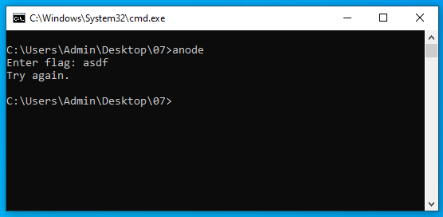
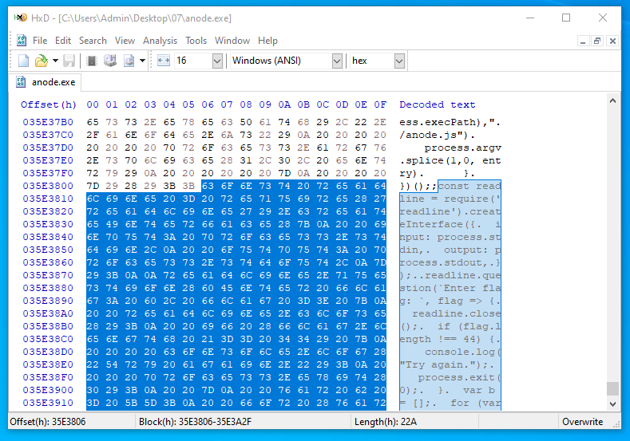

# 7 - anode

**Time spent:** 3 hours

**Tools used:** Python, Javascript

Challenge 7 is where the difficulty really starts increasing in this year's series of challenges. 
You are given a binary that contains a NodeJS compiled binary with some Javascript embedded into it.
But it has some interesting anti-analysis tricks up its sleeves that are quite a challenge to work around.

The trash talk keeps going strong with the following note that is given to us next to the binary:
```
You've made it so far! I can't believe it! 
And so many people are ahead of you!
```

## Orientation

As always, the first thing to do is run the program.



The program seems very straight forward, it asks for the flag and verifies if it is correct or not.
However, the file is 54MB large.
That is way too much code to put into a decompiler and analyze without to my liking.

However, it so turns out we don't need to. 
If we look in the file's metadata, we get a hint that describes exactly what type of executable file this really is:


We can then use a tool like [nexe_unpacker](https://www.npmjs.com/package/nexe_unpacker) to extract the original script out of the file.

```js
const readline = require('readline').createInterface({
  input: process.stdin,
  output: process.stdout,
});

readline.question(`Enter flag: `, flag => {
  readline.close();
  if (flag.length !== 44) {
    console.log("Try again.");
    process.exit(0);
  }
  var b = [];
  for (var i = 0; i < flag.length; i++) {
    b.push(flag.charCodeAt(i));
  }

  // something strange is happening...
  if (1n) {
    console.log("uh-oh, math is too correct...");
    process.exit(0);
  }

  var state = 1337;
  while (true) {
    state ^= Math.floor(Math.random() * (2**30));
    switch (state) {

        /* ... an insane amount of case blocks that operate on 'b' and `state` ... */

      default:
        console.log("uh-oh, math.random() is too random...");
        process.exit(0);
    }
  }

  var target = [106, 196, 106, 178, 174, 102, 31, 91, 66, 255, 86, 196, 74, 139, 219, 166, 106, 4, 211, 68, 227, 72, 156, 38, 239, 153, 223, 225, 73, 171, 51, 4, 234, 50, 207, 82, 18, 111, 180, 212, 81, 189, 73, 76];
  if (b.every((x,i) => x === target[i])) {
    console.log('Congrats!');
  } else {
    console.log('Try again.');
  }
});
```

This script has a relatively simple setup.
It checks if the input flag has a length of 44, and if so, it moves it into an array called `b`.
What follows next is a bunch of weird looking statements that operate on this array, and in the end the result is compared to some hardcoded `target` array.

The interesting part, however, is that if we run this extracted script and feed it some random flag of 44 characters long, we actually get a different output from what we saw in the executable file:

```console
$ node anode.js
Enter flag: 12345678901234567890123456789012345678901234
uh-oh, math is too correct...
```

This is coming from:
```js
// something strange is happening...
if (1n) {
  console.log("uh-oh, math is too correct...");
  process.exit(0);
}
```

OK, maybe my installation of `node` is a slightly different version of sorts. 
Besides, this if statement doesn't seem to be doing anything too useful here.
Let's try commenting it out.

```js
// something strange is happening...
// if (1n) {
//   console.log("uh-oh, math is too correct...");
//   process.exit(0);
// }
```

But this time we get even more troublesome output:

```console
$ node anode.js
Enter flag: 12345678901234567890123456789012345678901234
uh-oh, math.random() is too random...
```

We cannot comment out this block, because it is an indication that the extracted script reached the `default` case of the `switch`, and thus took a path that is not taken in the original program.
Clearly, something fundamental is different from the NodeJS implementation that is running in the binary and the one I have installed on my computer.
But I don't really fancy sifting through all the binary code of NodeJS itself.

Let's try to find a way around that...


## Working around the mods in node

Let's first verify that indeed `Math.random()` returns different values in the compiled binary.
For that, we will do some basic patching.

If you open the executable in a hex editor, you can find that our original script starts at offset `0x35E3806`:



This code is not verified in any shape or form for integrity, so we are free to change any of these bytes, as long as we keep the size of the file intact.
Since I don't really like coding directly in a hex editor, and we are probably going to do this a few times, I prepared a very simple Python script that allows me to copy any Javsacript file into the `anode.exe`.

```python
start_offset = 0x35E3806
end_offset   = 0x363213D

# Read files
template = open("anode.exe", "rb").read()
source   = open("mycode.js", "rb").read()

# Construct new binary.
header  = template[:start_offset]
padding = b' ' * (end_offset - (start_offset + len(source))) # pad with spaces to ensure same size.
footer  = template[end_offset:]

# Write
open("output.exe", "wb").write(header + source + padding + footer)
```

Let's do a quick test, and create a simple hello world Javascript file.

```js
console.log("hello");
```

```console
C:\Users\Admin\Desktop\07\out>python build.py

C:\Users\Admin\Desktop\07\out>output.exe
hello
```

Success, we can now run any Javascript we want!

Let's now see what the values are of `Math.random()` according to this modified version of NodeJS:

```js
for (var i = 0; i < 1000000; i++) {
	console.log(Math.random());
}
```

```console
C:\Users\Admin\Desktop\07\out>output.exe
0.9409662359975814
0.8785819538827613
0.5130407304372815
0.7256221596588996
0.17527533615471103
0.9929672978757351
0.8623205489359524
0.9598383713854883
0.5711906828499043
0.4324858231578699
0.5829236999651066
...
```

What's interesting about this sequence, is that it is always the same sequence, regardless of how many times we run this program.
We therefore need to ensure that our extracted `anode.js` always produces this very same random sequence as well.

For that, we can exploit some nice (or stupid) property of Javascript.
The nice (or weird) thing about Javascript is that everything is mutable.
And when I say everything, I mean _everything_, including standard library objects and classes.
We can use this property to replace the global `Math` object with an object of our own.
In particular, we can let it contain an object that includes our own implementation `Math.random` return numbers from a file that contains exactly the sequence we want.

```js
// Read the random sequence from random.txt
var random_sequence = [];
fs = require('fs');
try {
  const data = fs.readFileSync('random.txt', 'UTF-8')
  const lines = data.split(/\r?\n/)
  lines.forEach(line => {
    random_sequence.push(parseFloat(line));
  });
} catch (err) {
  console.error(err)
}

// Reassign the Math object to our own (YUCK, but works^tm!)
realMath = Math;
Math = {
  _random_sequence_index: 0,
  floor: function(x) { return realMath.floor(x); },
  random: function() { return random_sequence[this._random_sequence_index++]; }
};

/* .. original code .. */
```

We're not quite there yet though.
When we run it, we still get an error:

```console
$ node anode.js
Enter flag: 12345678901234567890123456789012345678901234
uh-oh, math.random() is too random...
```

And this relates to the first if statement that we previously commented out.
Apparently, in the modified NodeJS binary, they somehow changed the way values are evaluated in if-statements.
In particular, some numbers evaluate to `true`, while others to `false`. 
We could spend a lot of time again on how exactly this works, but I am lazy and since we have a nice script already to run arbitrary Javascript in the modified environment anyways, I decided to just let the challenge itself again tell me which values are `true` and `false`.

For this, I created yet another simple Python script that carves out all the numbers for which we need their boolean representation via Regex, and let it generate Javascript if-then-else statements for each of them.

```python
import re

pattern = re.compile("if\s+\((\d+n?)\)")
source = open("anode.js", "r").readlines()

for line in source:
    match = pattern.search(line)
    if match:
        print(f"if ({match.group(1)}) {{ console.log(\"{match.group(1)}\", \"true\"); }} else {{ console.log(\"{match.group(1)}\", \"false\"); }}")
```

This gives us code that looks like this:

```js
if (1n) { console.log("1n", "true"); } else { console.log("1n", "false"); }
if (93909087n) { console.log("93909087n", "true"); } else { console.log("93909087n", "false"); }
if (720624460) { console.log("720624460", "true"); } else { console.log("720624460", "false"); }
if (70881172) { console.log("70881172", "true"); } else { console.log("70881172", "false"); }
if (35127076n) { console.log("35127076n", "true"); } else { console.log("35127076n", "false"); }
if (254681112) { console.log("254681112", "true"); } else { console.log("254681112", "false"); }
if (738704438) { console.log("738704438", "true"); } else { console.log("738704438", "false"); }
...
```

If we shove this into our `anode.exe` and run it, we get ourselves a nice mapping between numbers and their boolean representation:

```console
C:\Users\Admin\Desktop\07\out>output.exe
1n false
93909087n true
720624460 false
70881172 false
35127076n true
254681112 false
738704438 false
...
```

We can now use this to remove all the dead code in the original code using [yet another stupid Python script](scripts/remove_constant_opaques.py), which produces [this Javascript file](scripts/anode.no_constant_opaques.js).
Then, a [similar Python script](scripts/reorder_states.py) can then be used to infer the outcome of all if-statements that involve the `Math.random()` calls, and deobfuscate the entire switch statement into just a bunch of operations of `b` alone.
We can verify that our script has done a good job by patching the original program to print out the final state of `b`, and comparing it with the final state of our deobfuscated script.

A copy of the final script can be found [here](scripts/anode.reordered.js).


## Getting the flag

What we are left with is a file that looks a bit like the following:

```js
b[29] -= b[37] + b[23] + b[22] + b[24] + b[26] + b[10] + 7;
b[29] &= 0xFF;
b[39] += b[34] + b[2] + b[1] + b[43] + b[20] + b[9] + 79;
b[39] &= 0xFF;
b[19] ^= (b[26] + b[0] + b[40] + b[37] + b[23] + b[32] + 255) & 0xFF;
b[28] ^= (b[1] + b[23] + b[37] + b[31] + b[43] + b[42] + 245) & 0xFF;
b[39] += b[42] + b[10] + b[3] + b[41] + b[14] + b[26] + 177;
b[39] &= 0xFF;
/* ... a lot more of these ...*/
b[22] += b[16] + b[18] + b[7] + b[23] + b[1] + b[27] + 50;
b[22] &= 0xFF;
b[39] += b[18] + b[16] + b[8] + b[19] + b[5] + b[23] + 36;
b[39] &= 0xFF;

var target = [106, 196, 106, 178, 174, 102, 31, 91, 66, 255, 86, 196, 74, 139, 219, 166, 106, 4, 211, 68, 227, 72, 156, 38, 239, 153, 223, 225, 73, 171, 51, 4, 234, 50, 207, 82, 18, 111, 180, 212, 81, 189, 73, 76];
console.log(b);
if (b.every((x,i) => x === target[i])) {
  console.log('Congrats!');
} else {
  console.log('Try again.');
}
```

All these operations merely comprise additions, subtractions, XORs and AND operations.
This means that all the operations are trivially reversible without any loss of information.

We have a desired output, and a formula we can reverse.
Let's compute the input!
For that, I put all the expressions into a file called [statements.txt](scripts/statements.txt), and wrote one final Python script to generate the reverse of the original arithmetic operations and run it:

```python
with open("statements.txt", "r") as f:
    lines = f.readlines()

with open("generated.py", "w") as f:
    f.write('b = [106, 196, 106, 178, 174, 102, 31, 91, 66, 255, 86, 196, 74, 139, 219, 166, 106, 4, 211, 68, 227, 72, 156, 38, 239, 153, 223, 225, 73, 171, 51, 4, 234, 50, 207, 82, 18, 111, 180, 212, 81, 189, 73, 76]\n')

    for line in lines[::-1]:
        if "+=" in line:
            x = line.replace("+=", '-=')
        elif "-=" in line:
            x = line.replace("-=", '+=')
        else:
            x = line
        
        f.write(x)


    for i in range(44):
        f.write(f'b[{i}] &= 0xFF\n')

    f.write('print(bytes(b))')

import generated
```

This outputs:
```console
$ out python solve.py
b'n0t_ju5t_A_j4vaSCriP7_ch4l1eng3@flare-on.com'
```

... revealing the flag!