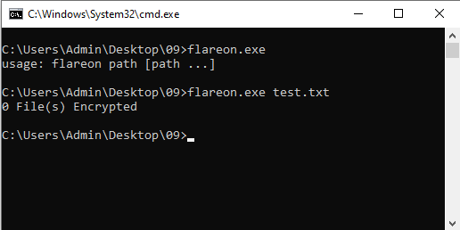
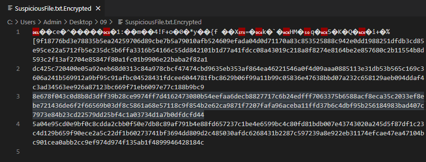
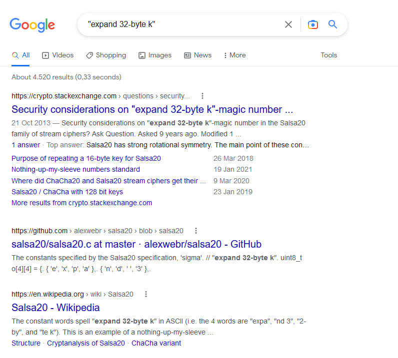
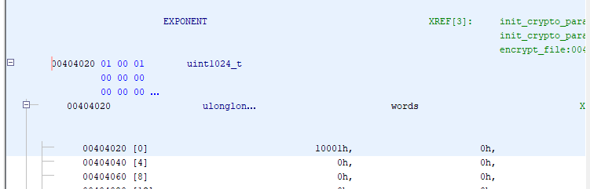
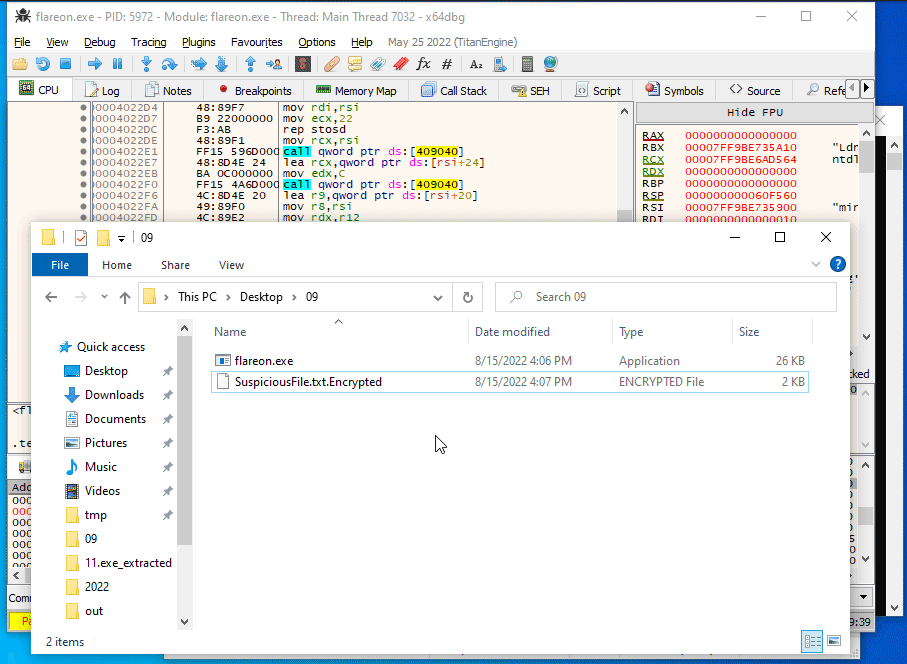

# 9 - encryptor

**Time spent:** 2 hours

**Tools used:** Ghidra, Python


Challenge 9 is the obligatory cryptography challenge of this year.
We are presented with some type of file encrypter `flareon.exe`, an encrypted file called `SuspiciousFile.txt.Encrypted`, and another note where the trash talk from the organizers continues:
```
You're really crushing it to get this far. 
This is probably the end for you. Better luck next year!
```

They really don't want me to finish the challenges, do they?


## Orientation

This challenge is pretty straightforward if you have attended some basic cryptography lessons.

If we run `flareon.exe`, we get greeted with how to use the program, telling us to provide an input path.
However, if we throw in some random text file, it hangs for a bit and then reports back no files were encrypted.



Looking at the contents of `SuspiciousFile.txt.Encrypted`, we see some random gibberish followed by four lines of long hexadecimal strings.



Each of these strings are exactly 256 characters long, which means they encode 128 bytes or 1024 bits each.
To me this is already a strong indicator we are probably going to do something with public key cryptography.

Let's find out in Ghidra the details


## Analyzing the code

Opening it in Ghidra and looking for strings reveals that our main code starts in `FUN_00403bf0`:

```c
undefined4 FUN_00403bf0(int argc,char **argv)
{
    /* ... */

    // Do we have any files passed in as arguments?
    if (1 < argc) {
        // Init our crypto params.
        init_crypto_parameters();

        uVar3 = 0;
        do {
            // Go over each file in the arguments.
            do {
                do {
                    argv = argv + 1;
                    path = *argv;
                    if (path == 0x0) {
                        // We reached the end of the file list, exit out and dump ransom note.
                        src_file = (*PTR_GetFileHandle_00404110)(2);
                        fprintf(src_file,"%u File(s) Encrypted\n",uVar3);
                        if (uVar3 == 0) {
                            return 0;
                        }
                        dump_ransom_note();
                        return 0;
                    }
                    lVar2 = -1;
                    pcVar4 = path;
                    do {
                        if (lVar2 == 0) break;
                        lVar2 += -1;
                        cVar1 = *pcVar4;
                        pcVar4 = pcVar4 + 1;
                    } while (cVar1 != '\0');
                    length = ~lVar2 - 0xb;
                } while (length < 1);

                // Check if file name ends in ".EncryptMe".
                comparison_result = memcmp(path + length,".EncryptMe",10);
            } while ((comparison_result != 0) || (src_file = fopen(path,"rb"), src_file == 0x0));

            // If it does, encrypt it.
            path = _strdup(*argv);
            strcpy(path + length,".Encrypted");
            dest_file = fopen(path,"rb");
            if (dest_file == 0x0) {
                dest_file = fopen(path,"wb");
                if (dest_file != 0x0) {
                    uVar3 += 1;
                    encrypt_file(dest_file,src_file);
                    pcVar4 = *argv;
                    _File = (*PTR_GetFileHandle_00404110)(2);
                    fprintf(_File,"%s\n",pcVar4);
                    goto LAB_00403d59;
                }
            }
            else {
LAB_00403d59:
                fclose(dest_file);
            }
            fclose(src_file);
            free(path);
        } while( true );
    }

    // Else print the help string.
    src_file = (*PTR_GetFileHandle_00404110)(2);
    fputs("usage: flareon path [path ...]\n",src_file);

    
    /* ... */
}
```

This code is quite straightforward. 
It loops over all files, checks if it has the `.EncryptMe` file extension, and then encrypts it.

The cryptography involved is pretty basic as well.
It generates some random key using `RtlGenRandom`, feeds it into the CHACHA20 encryption algorithm to encrypt the file, and then encrypts the key using the RSA crypto system and appends it as one of the long hex strings to the file:

```c
void encrypt_file(FILE *dest_file,FILE *src_file)
{
    /* ... */
    
    (*RtlGenRandom)(state,0x20);
    (*RtlGenRandom)(local_8c,0xc);
    chacha20_file(dest_file,src_file,state,state + 0x20);
    uint1024_t::modpow(encrypted_key,state,&EXPONENT,&MODULUS);
    uint1024_t::write_hex(dest_file,&UNKNOWN1);
    putc(L'\n',dest_file);
    uint1024_t::write_hex(dest_file,&MODULUS);
    putc(L'\n',dest_file);
    uint1024_t::write_hex(dest_file,&UNKNOWN2);
    putc(L'\n',dest_file);
    uint1024_t::write_hex(dest_file,encrypted_key);
    putc(L'\n',dest_file);
    return;
}

longlong chacha20_file(FILE *output_file,FILE *input_file,undefined4 *key,int *counter)
{
    /* ... */
    
    in[4] = *key;
    in[5] = key[1];
    in[6] = key[2];
    in[7] = key[3];
    in[8] = key[4];
    in[9] = key[5];
    in[10] = key[6];
    in[11] = key[7];
    in[12] = *counter;
    in[13] = counter[1];
    in[14] = counter[2];
    in[15] = counter[3];
    in._0_8_ = 0x3320646e61707865; // "expand 32-byte k" 
    in._8_8_ = 0x6b20657479622d32;
    while( true ) {
        sVar2 = fread(buffer,1,0x40,input_file);
        iVar1 = sVar2;
        if (iVar1 < 1) break;
        chacha20_block(out,in);
        i = 0;
        do {
            buffer[i] = buffer[i] ^ *(out + i);
            i += 1;
        } while (i < iVar1);
        fwrite(buffer,1,iVar1,output_file);
        in[12] += 1;
        local_104 = iVar1;
    }
    return local_104;
}
```

Some notes on how to recognize these algorithms:
The first algorithm can be recognized by the hardcoded string `"expand 32-byte k"` that is used in the encryption function.
You will first find the Salsa20 algorithm if you paste this string into Google, but you can easily verify by comparing the code on Wikipedia with the code in the binary that its successor ChaCha20 is used instead:



The RSA algorithm can be recognized by the use of _some_ function taking 3 parameters, one of which is the encryption key of a symmetric encryption algorithm that we used to encrypt the file, and the second parameter referencing a very commonly used RSA exponent `0x10001` (`65537`), giving it the strong suggestion that it is a `modpow` function, a function that interprets the the first parameter as a large number, and raises it to the power by the second:




But both of these algorithms are provably secure.
1024 bits is still too many bits to bruteforce for the average computer, and the ChaCha20 keys seem to be generated properly using a secure random number generator.

How should we proceed?


## Breaking the crypto system


To understand how to solve this challenge, we shall make a small detour with a quick refresher on how exactly the RSA crypto system works.

The RSA cryptosystem starts with a setup phase, where we generate two large primes `p` and `q`, and compute their product used which we call the **modulus** `N`.
Then, we decide on a **public exponent** `e`, which as we pointed out earlier before is typically set to `0x10001`.
`N` and `e` are then to be made public for anyone to use to encrypt messages.

Encryption and decryption are two very similar operations, as both are simply a single exponentiation.
To construct a ciphertext from a message `m`, we compute the following:

```
c = m^e (mod N)
```

Decryption is a bit more involved, but not by much.
We first calculate `p - 1` and `q - 1`, and calculate their product to compute Euler's totient function `phi(N)`.
We do this then to compute the modulo inverse of our public exponent `d = e^(-1) (mod phi(N))`, also known as the **private exponent** of the crypto system.
This number has the nice property that if you raise any ciphertext `c` to the power of it, you get the original `m` back.

```
m = c^d (mod N)
```

Normally, `p`, `q` and `d` are considered part of the private key and are thus not distributed.
And indeed, the `SuspiciousFile.txt.Encrypted` indeed does not contain any trace of it.

Let's have a look how the program computes all these numbers.
If we dive into the function responsible for this (at address `0x004021d0`), we get the following code:

```c
void init_crypto_parameters(void)
{
    undefined8 uVar1;
    uint1024_t p;
    uint1024_t q;
    uint1024_t p_minus_1;
    uint1024_t q_minus_1;
    uint1024_t phiN;
    uint1024_t local_a0;
    
    do {
        uint1024_t::gen_prime_candidate(&p);
        uVar1 = uint1024_t::is_prime(&p);
    } while (uVar1 == 0);
    do {
        uint1024_t::gen_prime_candidate(&q);
        uVar1 = uint1024_t::is_prime(&q);
    } while (uVar1 == 0);
    uint1024_t::multiply(&MODULUS,&p,&q);
    uint1024_t::decrement(&p_minus_1,&p);
    uint1024_t::decrement(&q_minus_1,&q);
    uint1024_t::multiply(&phiN,&p_minus_1,&q_minus_1);
    uint1024_t::modinv(&EXPONENT,&EXPONENT,&phiN);
    uint1024_t::modpow(&UNKNOWN2,&local_a0,&RSA_EXPONENT,&UNKNOWN1);
    return;
}
```

As can be seen, the function starts with a typical setup for the RSA cryptosystem.
First the two large primes and the modulus are generated.
Then `phi(N)` is computed and the inverse of the public exponent is calculated.

But if you take a close look, there is a bug in this code!
Take special note on the way the inverse is calculated:

```c
uint1024_t::modinv(&EXPONENT,&EXPONENT,&phiN);
```

We can see that `EXPONENT` is both used as the source and the destination parameter of the `modinv` function.
This means that after computing the modulo inverse, the program overrides the value of the public exponent and replaces it with the resulting private exponent.

In other words, every time the program is encrypting a file, the program is not "encrypting" it with the public exponent as in the traditional algorithm (`m^e (mod N)`), but "decrypting" it with a private exponent (`m^d (mod N)`).

Now, let's do some mathemagics and reorder some of the exponents:

```
m = c^d       (mod N)
  = (m^e)^d   (mod N)
  = m^(e*d)   (mod N)
  = m^(d*e)   (mod N)
  = (m^d)^e   (mod N)
```

Since our ciphertext is computed as `m^d`, the above proves that we can simply raise it to the power of `e` which is `0x10001` to get back the original message, without having to know any of the private information that was used to "encrypt" the message.


## Getting the flag

We can now extract the encrypted ChaCha20 encryption key from the `SuspiciousFile.txt.Encrypted` file, and RSA "decrypt" it with the public key.
The Python script below does exactly this. 
Take note of the endianness of these numbers! 

```python
with open("SuspiciousFile.txt.Encrypted", "rb") as f:
    raw = f.read()

encrypted_data = raw[:(-256-1)*4]
unknown1       = int.from_bytes(bytes.fromhex(raw[(-256-1)*4:(-256-1)*3].decode('ascii')), 'big')
modulus        = int.from_bytes(bytes.fromhex(raw[(-256-1)*3:(-256-1)*2].decode('ascii')), 'big')
unknown2       = int.from_bytes(bytes.fromhex(raw[(-256-1)*2:-256-1].decode('ascii')), 'big')
encrypted_key  = int.from_bytes(bytes.fromhex(raw[-256-1:-1].decode('ascii')), 'big')

e = 0x10001
key = pow(encrypted_key, e, modulus)
key = int.to_bytes(key, 128, 'little')
print('paste in debugger:', key.hex())
```

This yields:

```
paste in debugger: 01b097a12a39fc420524a2e775a743c928d5a550b1879aa8b415571e38329b98000000000249fc0fc83340fe4d928f950000000000000000000000000000000000000000000000000000000000000000000000000000000000000000000000000000000000000000000000000000000000000000000000000000000000000000
```

While we could write another program to decrypt the file, I am lazy and don't really fancy getting exactly every detail right in my code such that it perfectly reflects the code stored in the original program.

Since the ChaCha20 algorithm is both an encryption and a decryption routine, we can also let the program itself do the work for us.
So, instead, what I did was rename the file `SuspiciousFile.txt.Encrypted` to `SuspiciousFile.txt.EncryptMe`, opened x64dbg and set a breakpoint on the decryption call.
Then at the moment the breakpoint hits, change the generated encryption key with the key that we computed using our Python script:



This will give us a file with the following contents...

```
Hello!

The flag is:

R$A_$16n1n6_15_0pp0$17e_0f_3ncryp710n@flare-on.com
<random gibberish here>
```

... revealing the flag!
