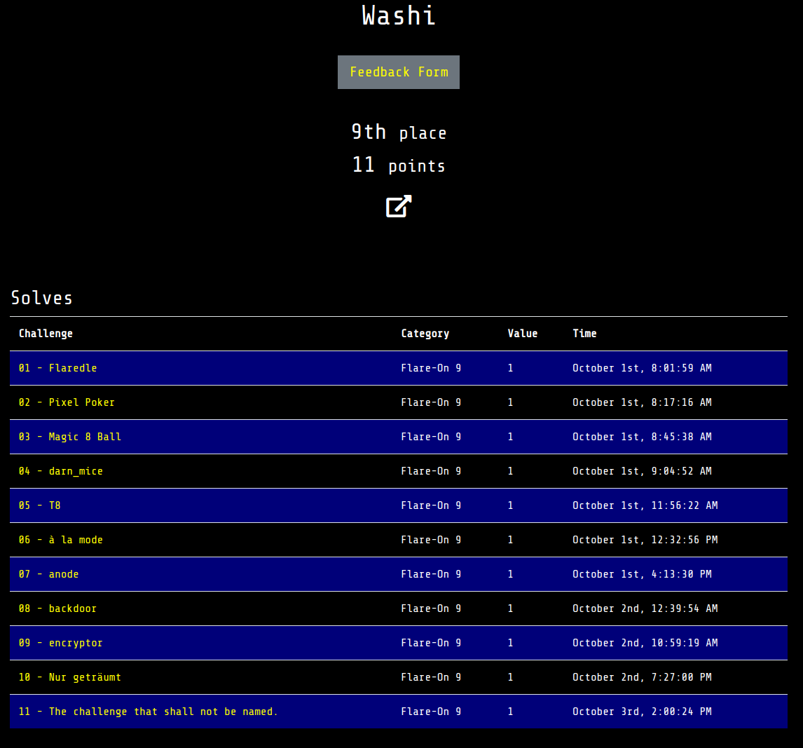

# Flare-On 2022

This directory contains write-ups with my solutions for Flare-On 2022 that was hosted by FireEye from September 30 to November 11 2022. 

## Table of Contents

- [1 - Flaredle](1)
- [2 - Pixel Poker](2)
- [3 - Magic 8 Ball](3)
- [4 - darn_mice](4)
- [5 - T8](5)
- [6 - à la mode](6)
- [7 - anode](7)
- [8 - backdoor](8)
- [9 - encryptor](9)
- [10 - Nur geträumt](10)
- [11 - The challenge that shall not be named.](11)

## Binaries
Download the binaries [here](http://flare-on.com/files/Flare-On9_Challenges.zip).

## Bragging rights

