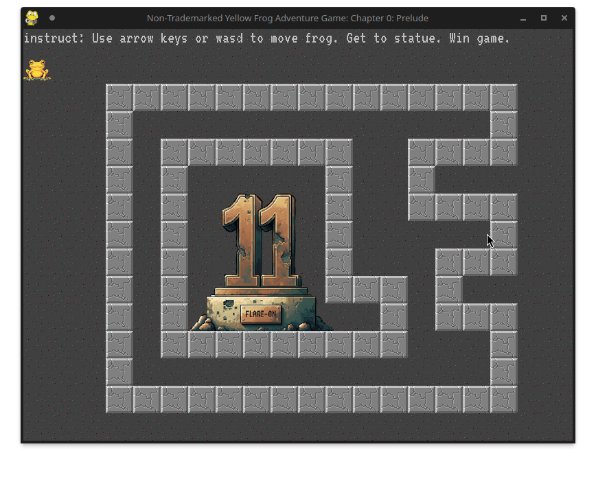

# 1 - frog 

**Time spent:** 3 minutes

**Tools used:** Python

As with any Flare-On, challenge 1 is a glorified CAPTCHA challenge.
This time around, it is a game featuring a frog that needs to get to a statue.

However, the statue is boxed in by walls.

If we look into the provided code in `frog.py`, we can scroll to an interesting function `AttemptPlayerMove`.
It features code that stops the frog from moving through walls.

If we get rid of this code, we are no longer obstructed by any walls, and can easily get the frog to the statue...

... revealing the flag!
