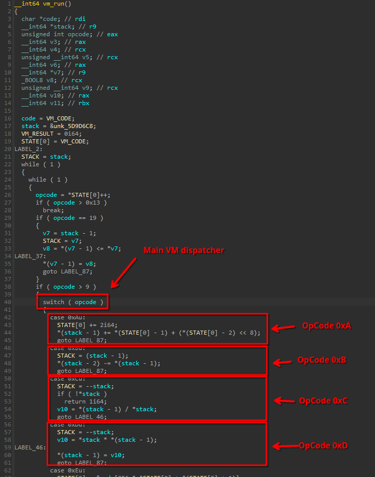
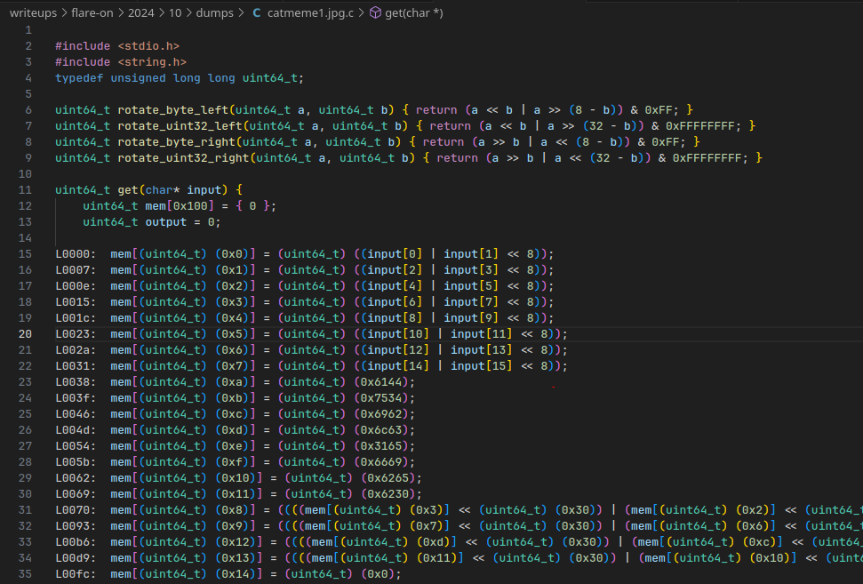
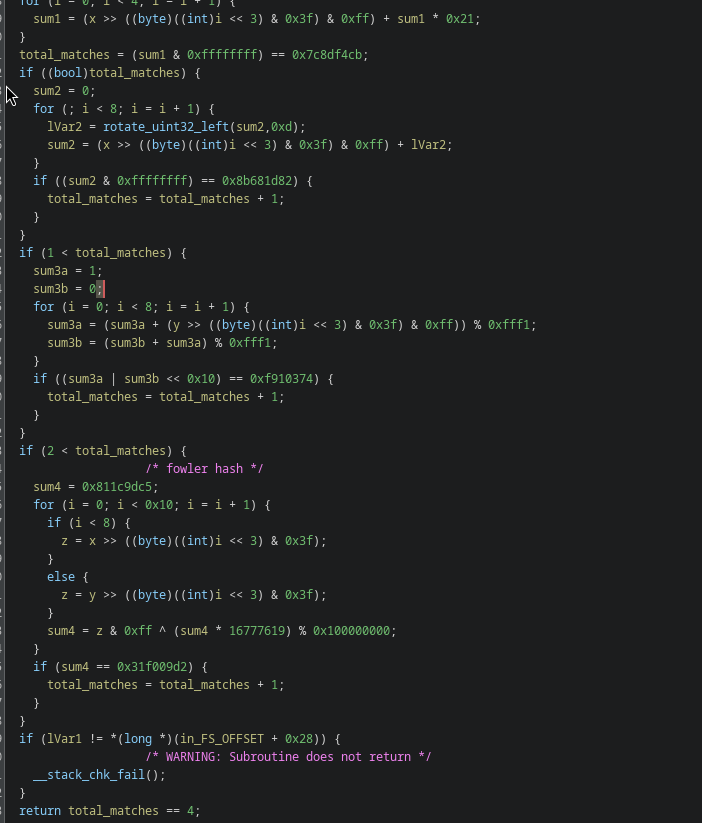
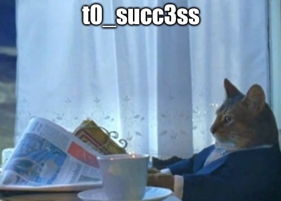

# 10 - Catbert Ransomware

**Time spent:** 1 day

**Tools used:** QEMU, 7-zip, IDA, Ghidra, Python, Z3

Challenge 10 is probably my favorite challenge in this series, and felt like a nice breather after [challenge 9](../9).
It has a nice balance between difficulty and learning something new and unknown.

In this challenge, you are presented with a UEFI image and a raw disk image that you can run under qemu:


The story is that the disk has been hit by ransomware and three JPGs with catmemes were encrypted. 
Your task is to decrypt all three.


## Orientation

The image can be run using QEMU:

```sh
$ qemu-system-x86_64 -s -M pc -bios bios.bin -hda disk.img
```

The cool thing about QEMU is that it can host a GDB server with the `-s` flag.
While Ghidra has a GDB interface since 10.x and there have been great advancements in it so far, I still find it very hard to use.
For this challenge, as much as I dislike IDA, I went with IDA instead.

But before we dive into the disassembler, let's first look around.
The shell mentions mounting the disk using `fs0:`, so let's try that:


There are various ways to view the contents of these files (e.g., using the `hexedit` command).
But lucky for us, 7-zip can also extract the raw `disk.img` file directly just fine:


If we type `help` in the shell, we see that one of the available commands is `decrypt_file`:


## Finding the code

We're left with a `bios.bin` that, supposedly, contains all the code that implements this environment.

Initially, I tried finding a bunch of tooling for IDA or Ghidra to open UEFI images, but then I just tried dragging the file in 7-zip again, and to my surprise, it can also actually extract it just as fine as well:


Is there anything 7-zip can't unpack/extract?

There are a plethora of files in this binary, however.
Which one is the right one to analyze?

This is easy to answer with this monster of a bash one-liner that produces a file with all unicode strings:

```sh
$ find . -type f -exec sh -c 'echo "------ $1 ------"; strings -e l "$1"' _ {} \; > strings.txt
```

If you then look in [strings.txt](dumps/strings.txt) for the string `decrypt_file`, you will quickly find that this string can be found in `./9E21FD93/EE4E5898/VOLUME/Shell/0.efi`.

Opening this file in IDA, and rebasing it to `0000000005CB5000` (this can be figured out by debugging), reveals that this command string is referenced in `sub_5CE6BC4`:


## Understanding the decrypt_file command

Analyzing this code quickly will reveal that every `.c4tb` file must start with 4 header fields:


The fields are the following:
1. File signature (must be `C4TB`)
2. Size of the encrypted data.
3. Offset to the start of a password validation routine
4. Size of the password validation routine.

Every `.c4tb` file has therefore not only its own encrypted data, but also its own customized password validation routine.
This routine is copied into a temporary buffer and then the input password is inlined.
The interesting part is that this routine is not x86 code, but a virtual machine:


The VM is actually quite straightforward.
It is a simple stack-based VM with a traditional switch-based opcode dispatcher:




## Decompiling the Validator Routines

We now know everything to create a disassembler for the VM, and build a recompiler to understand the individual validator routines.

First, we need to map out all opcodes.
This is simply a process of reading the next byte in the validator code, and mapping it to the appropriate switch case label in the VM dispatcher.

This is the mapping I came up with.
Note that not all of the instructions are added.
This is because I only added the ones that were actually used in the end by the validator programs embedded in the files:

| Byte   | Mnemonic              | 
|--------|-----------------------|
| `0x01` | `push`                |  
| `0x05` | `load`                |  
| `0x06` | `store`               |  
| `0x09` | `add`                 |  
| `0x0D` | `mul`                 |  
| `0x0E` | `jmp`                 |  
| `0x10` | `jmpfalse`            |  
| `0x11` | `equals`              |  
| `0x12` | `lessthan`            |  
| `0x14` | `greaterthan`         |  
| `0x18` | `exit`                |  
| `0x19` | `set_output`          |  
| `0x1A` | `xor`                 |  
| `0x1B` | `or`                  |
| `0x1C` | `and`                 |  
| `0x1D` | `rem`                 |  
| `0x1E` | `shift_left`          |  
| `0x1F` | `shift_right`         |  
| `0x21` | `rotate_uint32_right` |  
| `0x22` | `rotate_byte_left`    |  
| `0x23` | `rotate_byte_right`   |  

This gives us 3 disassembly files:
- [catmeme1.jpg.asm](dumps/catmeme1.jpg.asm)
- [catmeme2.jpg.asm](dumps/catmeme2.jpg.asm)
- [catmeme3.jpg.asm](dumps/catmeme3.jpg.asm)

In the disassemblies, I made sure that my disassembler already inlined the input password:


The cool thing about stack-based VMs is that every opcode has an exact expected stack behavior.
For example, `push` always pushes 1 value on the stack, and `add` always pops two values and produces one new value.
We can use this knowledge to lift the raw disassembly into a higher level intermediate representation.
Simply symbolically "emulate" the stack behavior of each instruction, and we can build an abstract syntax tree (AST):

```python
def decompile(instructions: list[Instruction]) -> list[Expression]:
    result = []
    stack = []

    for instr in instructions:
        # Pop the arguments from the stack.
        args = []
        for _ in range(instr.pop_count):
            args.append(stack.pop())
        args.reverse()

        # Build new expression
        expr = Expression(instr, args)

        # If the opcode pushes a value, push it on the stack,
        # otherwise it is a statement.
        if instr.push_count == 1:
            stack.append(expr)
        else:
            result.append(expr)

    return result
```

This yields code that looks similar like this:


- [catmeme1.jpg.ir](dumps/catmeme1.jpg.ir)
- [catmeme2.jpg.ir](dumps/catmeme2.jpg.ir)
- [catmeme3.jpg.ir](dumps/catmeme3.jpg.ir)

Better, but still hard to really distill what's going on.
However, now that everything is in an AST form, we can trivially lift it to a language like C.

```python
def lift_expr(expr: Expression):    
    lifted_args = []
    for arg in expr.args:
        lifted_args.append(lift_expr(arg))
    
    if expr.instr.opcode == "push":
        return f"(uint64_t) ({expr.instr.operand})"
    if expr.instr.opcode == "load":
        return f"mem[{lifted_args[0]}]"
    if expr.instr.opcode == "store":
        return f"mem[{lifted_args[0]}] = {lifted_args[1]}"
    if expr.instr.opcode == "shift_left":
        return f"({lifted_args[0]} << {lifted_args[1]})"
    if expr.instr.opcode == "shift_right":
        return f"({lifted_args[0]} >> {lifted_args[1]})"
    if expr.instr.opcode == "xor":
        return f"({lifted_args[0]} ^ {lifted_args[1]})"
    if expr.instr.opcode == "or":
        return f"({lifted_args[0]} | {lifted_args[1]})"

    # ... (snip, more opcodes) ...
```

Add some boilerplate C harness around it, and you have a nice low-level C representation of the code:



- [catmeme1.jpg.c](dumps/catmeme1.jpg.c)
- [catmeme2.jpg.c](dumps/catmeme2.jpg.c)
- [catmeme3.jpg.c](dumps/catmeme3.jpg.c)

The full recompiler pipeline script can be found in [recompile.py](scripts/recompile.py)

Similar to [challenge 9](../9/), we can then simply feed the program into `GCC` again with `-O1` optimizations enabled, and this gives us very clean code to work with in Ghidra.
This is for instance the code for catmeme3 after renaming and retyping a bit:




## Solving the Validators

The first two password validators are very easy to solve.
This is because both of the implementations simply iterate over the input password, verify independently what the correct character must be, and then count the total number of correct characters.
You can therefore simply slightly change the lifted C code by letting it return this number instead of simply true or false, and then bruteforce all characters one-by-one:

```c
int main() {
    char input[16] = {0};
    memset(input, ' ', 16);
    for (int i = 0; i < 16; i++) {
        for (int j = 0x20; j < 0x7f; j++) {
            input[i] = j;
            int matches = get(input);
            if (matches == i+1) {
                break;
            }
        }
    }

    printf("%s\n", input);
    printf("%llx\n", get(input));
}
```

For `catmeme1`, this means returning `mem[0x17]`, and for `catmeme2` this means returning `mem[0x16]` instead.
The passwords that roll out in a split second for these two memes are:
```
DaCubicleLife101
```
```
G3tDaJ0bD0neM4te
```

The third catmeme is trickier.
The first 8 bytes can be bruteforced/guessed in a similar fashion as `catmeme1` and `catmeme2`.
You will get a few candidates, but only one spells out proper english `VerYDumB`.
The remainder of the code is much more complicated, and as such, you'll need to use something like Z3 instead (see [solve.py](scripts/solve.py) for full script).

This takes a while to run (30-60min), as there are some hashes involved which Z3 is not too great at bruteforcing these, but in the end you get:

```
VerYDumBpassword
```

## Getting the Flag

We can now type in all passwords into the `decrypt_file` command.
Make sure to run all in one go, or else the shell kinda bugs out.


The images decrypt to the following:





However, this is not a full flag yet.
If we look at the final message printed out in the shell, we see that it asks us to run a final `.efi` file, which apparently also got decrypted after decrypting the final image:


Alright, let's just follow the instructions.
In the current directory, we can see it dropped one final file.
Decrypt it with the suggested password to get another part of the flag:


And at last, the decypted `your_mind.jpg` tells us this is the final part of the flag:


```
the3_r04d_t0_succ3ss_1s_alw4ys_und3r_c0nstrucucti0n@flare-on.com
```


## Final Words

I think this was the best and well designed challenge out of all this year.

It was original with the UEFI making me have to learn something new.
I liked how the encrypted files had their own password validation programs.
It had a nice stack-based VM challenge that was not too trivial but also not too painful to solve.
It also confirmed once again, that recompiling to C using `GCC` is such a powerful tool to understand virtualized code.
The underlying code verifying the passwords were interesting.
And of course, great theme with the cats and ascii art :).

All in all, a great challenge and a nice closer to FLARE-ON 11!