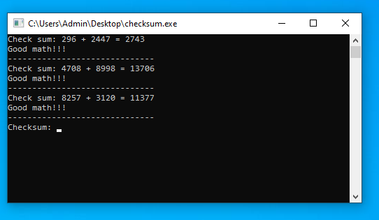
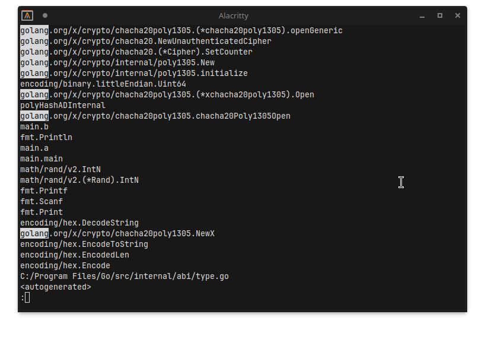
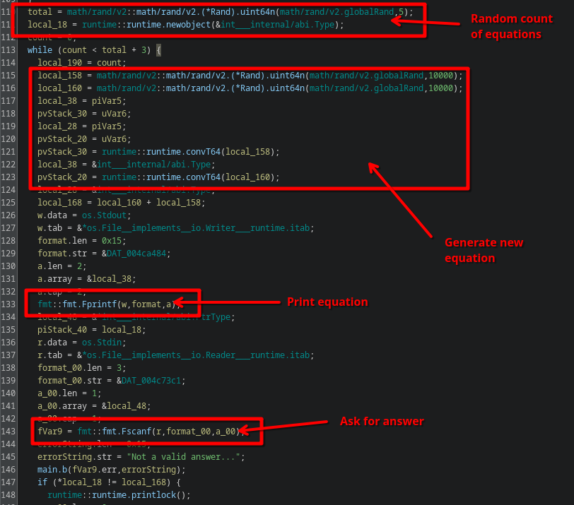
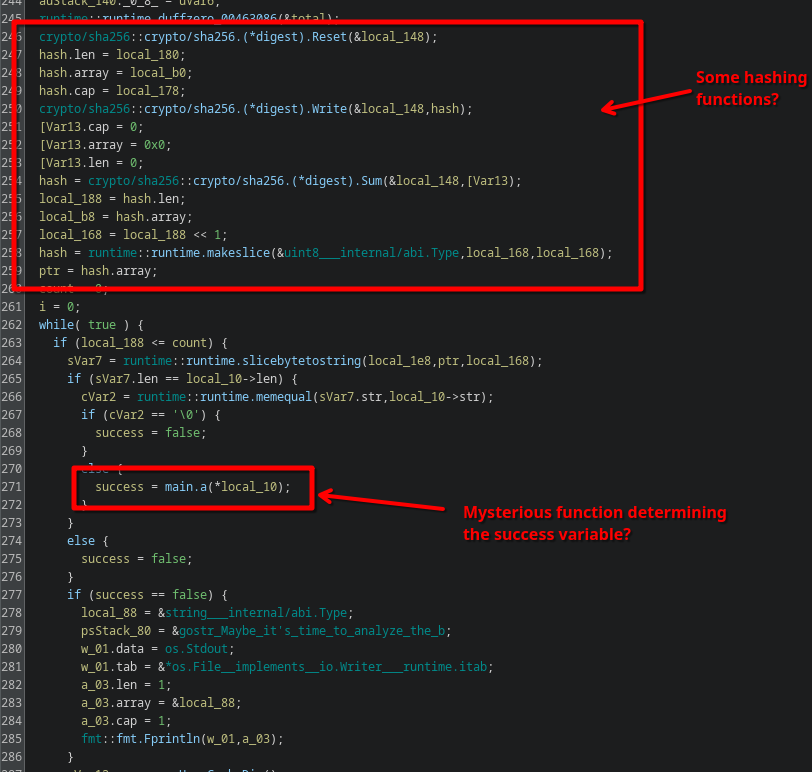
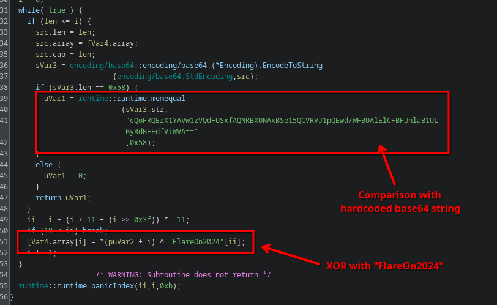
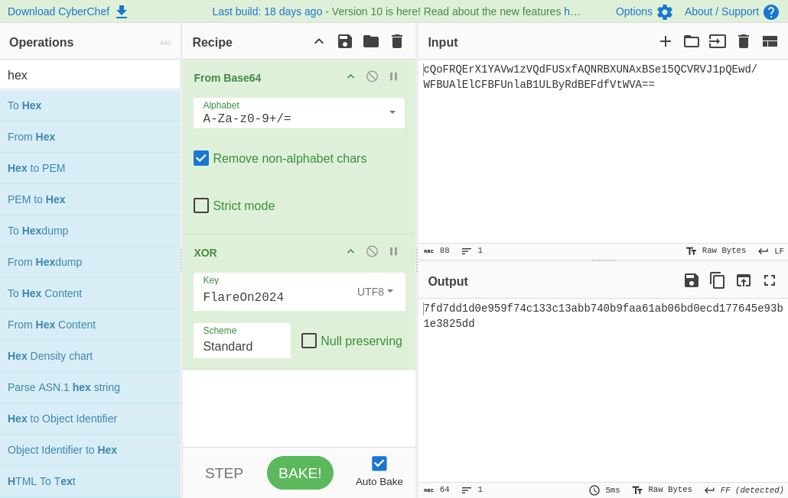
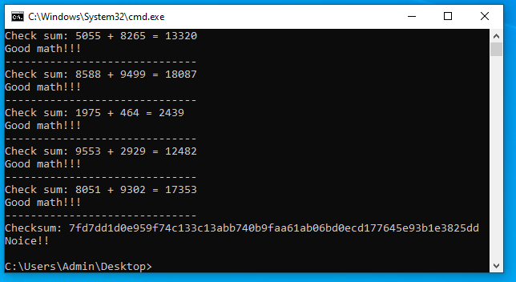
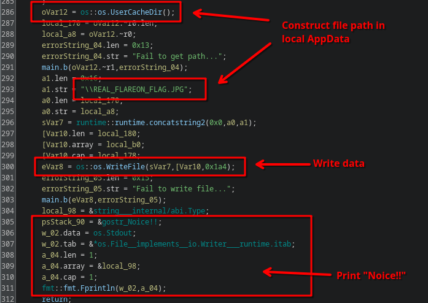
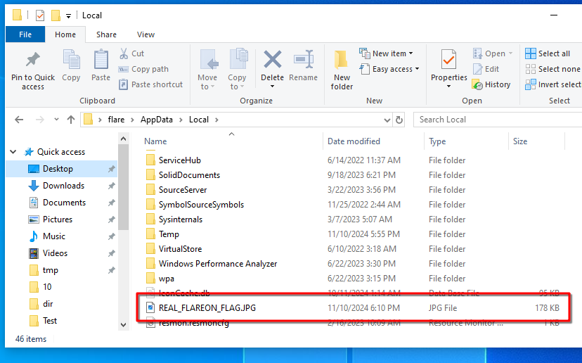

# 2 - checksum

**Time spent:** 2 hours

**Tools used:** Ghidra, CyberChef

Challenge two is a Windows Executable file that first asks for a couple of basic arithmetic equations.
Once you get through them it then asks for a "checksum":

Failing to provide the right answer results in a program exit.

## Orientation

Looking in the strings of the executable (`strings checksum.exe`) reveals this is a binary that was originally written in `golang`:

Opening in Ghidra and going to `main.main`, we can indeed see the code first starts with prompting for the randomized equations:

This turns out to actually be completely unnecessary, and if you want, you could patch out all the code and not be bothered with it.
The more interesting part happens way down the main function.

It computes some SHA256 hash of some data, presumably something related to the input checksum.
There's no chance we can break SHA256, it is a cryptographically secure algorithm.

How do we find the correct input if the test is unbreakable?

## Getting the Checksum

Scrolling down a bit further, we see a call to a mysterious function `main.a` which determines whether the program continues executing or not.
Diving into this function reveals a lot of information:

We see a loop that first XOR's all characters of the input checksum with the string `FlareOn2024`, then encodes it to base64 and compares it to a hardcoded base64 string.
All of these operations are reversible, so we can pull out trusty CyberChef:

Putting this back into the program, gives us a plain `Noice!!` message...

Wait... where is the flag?

## Getting the Flag

Remember the `success` flag in `main.main` that was set to the result of `main.a`? 
Well it turns out that if it ends up being set to `true`, the program executes one final piece of code.
Scrolling down a bit further shows the following final lines:

It constructs a file path in the user's local appdata, and writes some data to it.
Let's have a look:

It's a JPG image...

... revealing the flag!