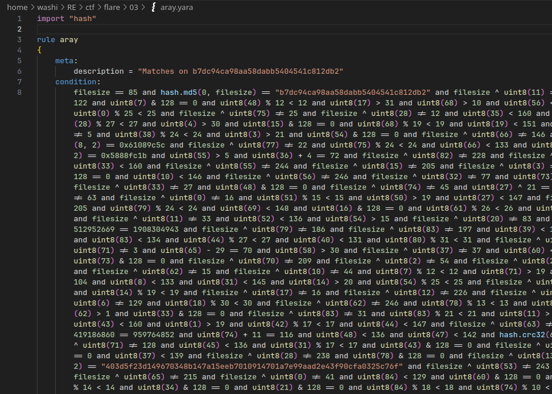
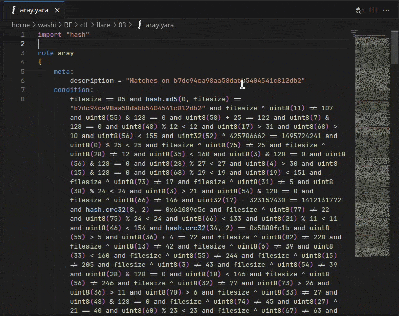
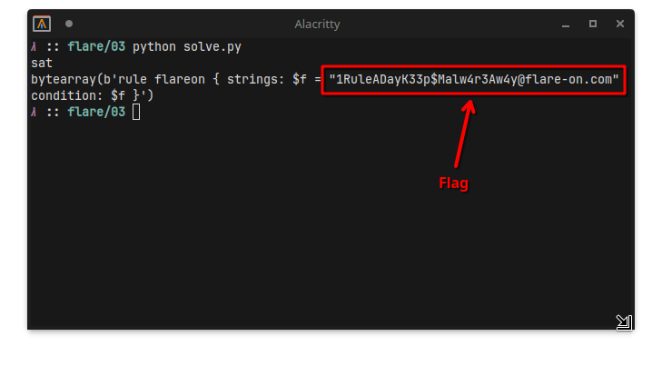

# 3 - aray

**Time spent:** ~20 minutes

**Tools used:** Python, Z3

Challenge 3 is an interesting one.
We are presented with a [YARA](https://virustotal.github.io/yara/) rule, and our task is to find an input that matches this rule.

However, the YARA rule looks like this...




## Orientation

First, let's clean up some of the code.

Sadly, it doesn't seem like Visual Studio Code has a formatter for YARA files.
However, with some regex find+replace magic, we can insert before every `and` keyword a newline (`\n`).
Add a few tab characters (`\t`) as well to fix up the indentation and you get a near clean file:



This reveals that all the YARA rule really does is checking whether a bunch of specific bytes follow a set of constraints.

## Solving the Constraints

We can group the types of constraints based on the type of comparisons or data that they operate on.

The first obvious one is the expected file size, and is the easiest to solve:
```
filesize == 85
```

Then there is a checksum for the full file:

```
hash.md5(0, filesize) == "b7dc94ca98aa58dabb5404541c812db2"
```

Not super interesting to us, we will not be cracking MD5 hashes for 85 bytes of input, but it can be good as a final verification step.

Then, there are a bunch of hashes and checksums computed for very small chunks of the file, each only 2 bytes long:

```
hash.crc32(8, 2) == 0x61089c5c
hash.crc32(34, 2) == 0x5888fc1b
hash.crc32(63, 2) == 0x66715919
hash.crc32(78, 2) == 0x7cab8d64
hash.sha256(14, 2) == "403d5f23d149670348b147a15eeb7010914701a7e99aad2e43f90cfa0325c76f"
hash.sha256(56, 2) == "593f2d04aab251f60c9e4b8bbc1e05a34e920980ec08351a18459b2bc7dbf2f6"
hash.md5(0, 2) == "89484b14b36a8d5329426a3d944d2983"
hash.md5(76, 2) == "f98ed07a4d5f50f7de1410d905f1477f"
hash.md5(50, 2) == "657dae0913ee12be6fb2a6f687aae1c7"
hash.md5(32, 2) == "738a656e8e8ec272ca17cd51e12f558b"
```

Two byte constants are easily bruteforceable.
Even Python, which is a pretty slow language on its own, kills it within seconds:

```python
import hashlib
import binascii

def bruteforce(func, expected):
    result = bytearray(2)
    for i in range(0x10000):
        result[0] = i & 0xFF
        result[1] = (i >> 8) & 0xFF
        if func(result) == expected:
            return result
    return None

crc1 = bruteforce(binascii.crc32, 0x61089c5c)
crc2 = bruteforce(binascii.crc32, 0x5888fc1b)
crc3 = bruteforce(binascii.crc32, 0x66715919)
crc4 = bruteforce(binascii.crc32, 0x7cab8d64)

sha1 = bruteforce(lambda x: hashlib.sha256(x).hexdigest(), "403d5f23d149670348b147a15eeb7010914701a7e99aad2e43f90cfa0325c76f")
sha2 = bruteforce(lambda x: hashlib.sha256(x).hexdigest(), "593f2d04aab251f60c9e4b8bbc1e05a34e920980ec08351a18459b2bc7dbf2f6")

md1 = bruteforce(lambda x: hashlib.md5(x).hexdigest(), "89484b14b36a8d5329426a3d944d2983")
md2 = bruteforce(lambda x: hashlib.md5(x).hexdigest(), "f98ed07a4d5f50f7de1410d905f1477f")
md3 = bruteforce(lambda x: hashlib.md5(x).hexdigest(), "657dae0913ee12be6fb2a6f687aae1c7")
md4 = bruteforce(lambda x: hashlib.md5(x).hexdigest(), "738a656e8e8ec272ca17cd51e12f558b")
```

Then, we are left with all the other constraints, which consist of nothing but simple binary operations (Additions, XORs, ANDs, etc.).

Nothing Z3 cannot solve!

Simply define the entire file contents as a symbolic bitvector:
```python
filesize = 85
data = [BitVec(f"b{i}", 85 * 8) for i in range(filesize)]
```

And then just add the constraints one by one to a solver:

```python
s = Solver()

s.add(filesize ^ data[11] != 107)
s.add(data[55] & 128 == 0)
s.add(data[58] + 25 == 122)
s.add(data[7] & 128 == 0)
s.add(data[48] % 12 < 12)
s.add(data[17] > 31)
s.add(data[68] > 10)
s.add(data[56] < 155)
s.add((data[52] | (data[52+1] << 8) | (data[52+2] << 16) | (data[52+3] << 24)) ^ 425706662 == 1495724241)
s.add(data[0] % 25 < 25)
s.add(filesize ^ data[75] != 25)
s.add(filesize ^ data[28] != 12)
s.add(data[35] < 160)
s.add(data[3] & 128 == 0)
s.add(data[56] & 128 == 0)

# ... (snipped for brevity) ...
```

Of course, also add the bruteforced hash constraints:

```python
s.add(data[8] == crc1[0])
s.add(data[9] == crc1[1])

s.add(data[34] == crc2[0])
s.add(data[35] == crc2[1])

s.add(data[63] == crc3[0])
s.add(data[64] == crc3[1])

s.add(data[78] == crc4[0])
s.add(data[79] == crc4[1])

s.add(data[14] == sha1[0])
s.add(data[15] == sha1[1])

s.add(data[56] == sha2[0])
s.add(data[57] == sha2[1])

s.add(data[0] == md1[0])
s.add(data[1] == md1[1])

s.add(data[76] == md2[0])
s.add(data[77] == md2[1])

s.add(data[50] == md3[0])
s.add(data[51] == md3[1])

s.add(data[32] == md4[0])
s.add(data[33] == md4[1])
```

Finally, let Z3 do its magic and print the solution:

```python
result = s.check()
print(result)
if (result == sat):
    actual = bytearray()
    for b in data:
        actual.append(s.model()[b].as_long())
    print(actual)
```

The full script can be found in [solve.py](scripts/solve.py).

## Getting the Flag 

It only takes Z3 a couple seconds to figure out the exact contents of the file that is expected...



... revealing the flag!