# 4 - FLARE Meme Maker 3000 

**Time spent:** 45 minutes

**Tools used:** Javascript

Challenge 4 is a funny one.
It features a meme generator written in Javascript that generates memes with canned messages relating to FLARE-ON or just Reverse Engineering and Hacking itself.

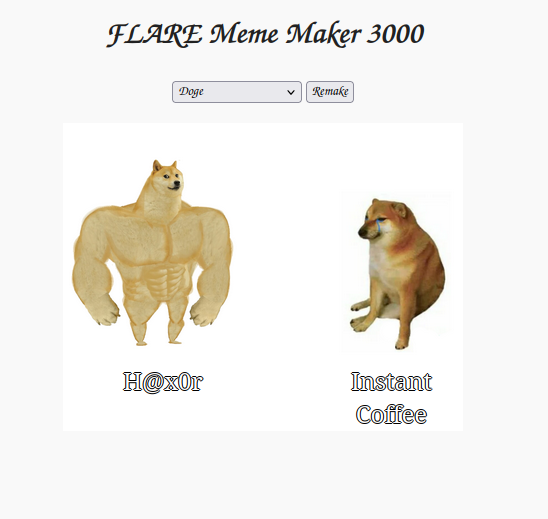


## Orientation

Opening the file in an editor reveals the code is pretty heavily obfuscated.

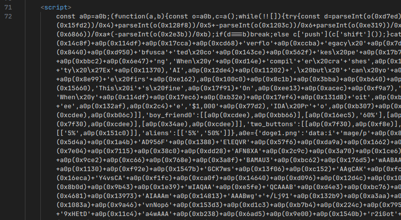

It always blows my mind how many stupid things are allowed in Javascript, makes me wonder if we didn't just make a huge mistake inventing it. 
But I digress...
Visual Studio Code can format code for us just fine:

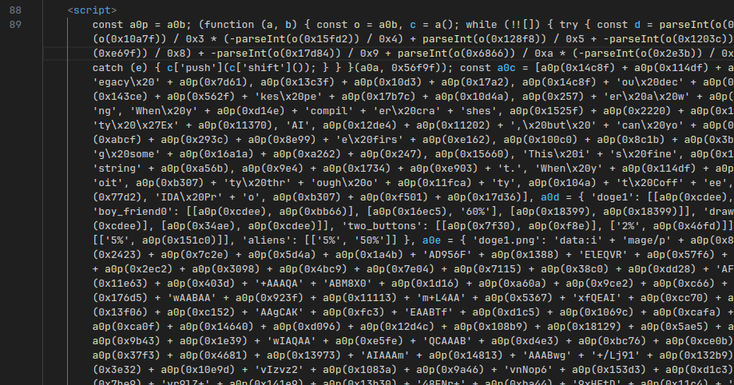

Really? You only added spaces? That's all the Microsoft money could do? Thanks VSCode for being pretty much completely useless here...

Luckily, Firefox's developer tools proves itself to be much more useful:

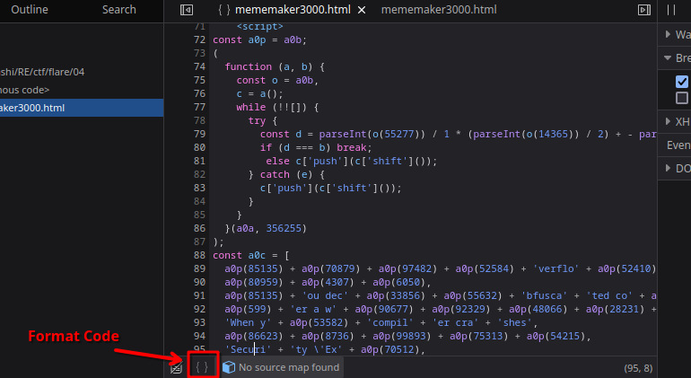

From here on I tried using more online deobfuscators, but it always resulted in either Firefox crashing (probably due to the amount of code), or just simply not working.
Thus, I decided to take matters in my own hands, and just go with what I had ended up with now after formatting.

Formatted file can be found in [mememaker3000.formatted.html](scripts/mememaker3000.formatted.html)

## Making Sense of the Mess

The formatted code is quite a bit of a mess still, but actually not that difficult to understand, provided you know where to look!

I worked under the assumption that, because there are buttons and textboxes that do _something_, then there must be a `click` or `keyup` event registered somewhere.

Turns out, this happens at the very end of the script, starting at line `101511`:

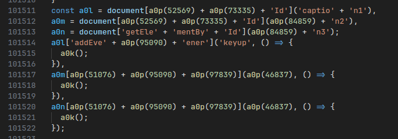

You may wonder, how do I know these are event listener setups?
The nice thing about Javascript loaded on a webpage is that you can pull up your browser's console window, and just copy/paste all the obfuscated code to have the program decrypt itself.

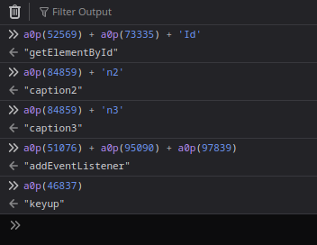

Substituting the strings, makes it pretty clear to read:


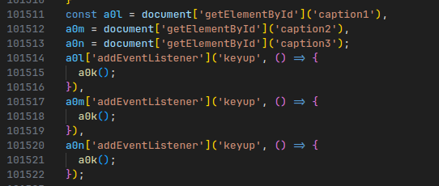

The function that is called on every key press in a textbox is `a0k`.
Let's have a look at it:


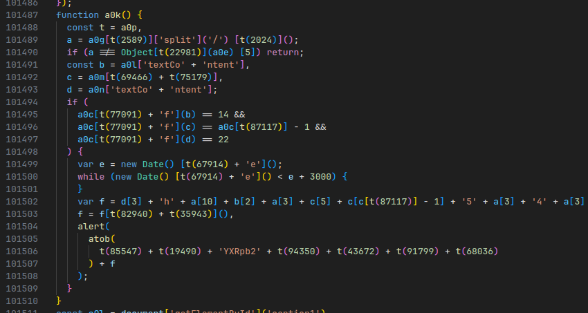

Again, with a very similar trick, we can simply deobfuscate all the obfuscated strings:

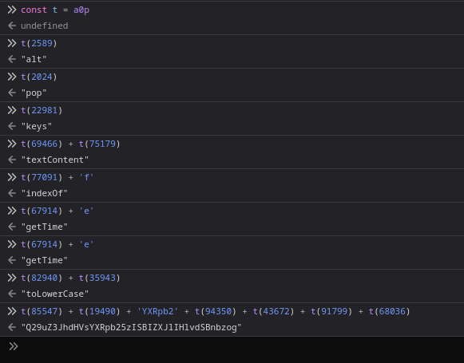

After substituting the strings, we get the following:

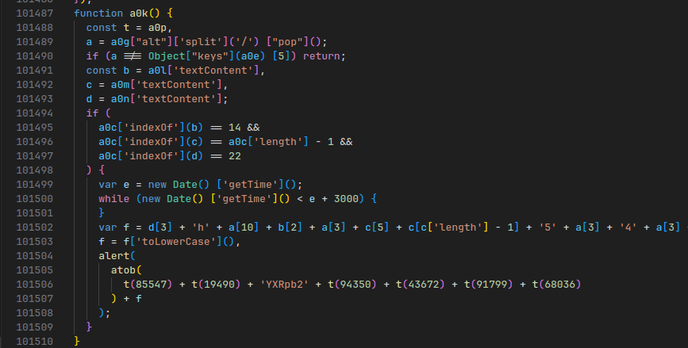

There are a few magic variables here, but with a bit of trial and error and more Javascript console abuse, you can easily figure out the meaning behind each variable:

| Variable | Description              |
|----------|--------------------------|
| `a0g`    | Current Selected Image
| `a0e`    | All Templates
| `a0l`    | First text box
| `a0m`    | Second text box
| `a0n`    | Third text box
| `a0c`    | Array of canned meme messages

This tells us two things.

First, the first if statement tells us which meme template we must use:

```js
if (a !== Object["keys"](a0e) [5]) return;
```

The second if statement tells use what to put in the three text boxes:

```js
if (
    a0c['indexOf'](b) == 14 &&
    a0c['indexOf'](c) == a0c['length'] - 1 &&
    a0c['indexOf'](d) == 22
) {
```

## Getting the Flag

One final time to the Javascript console to get all the info we need:

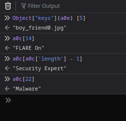

Following these guidelines...

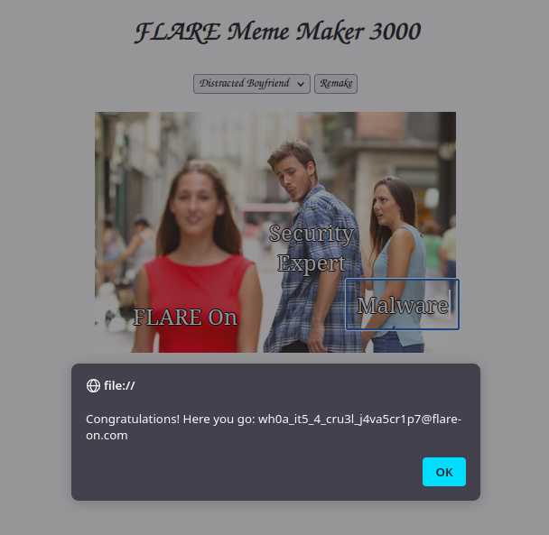

... reveals the flag!