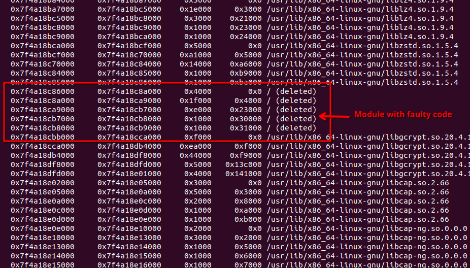
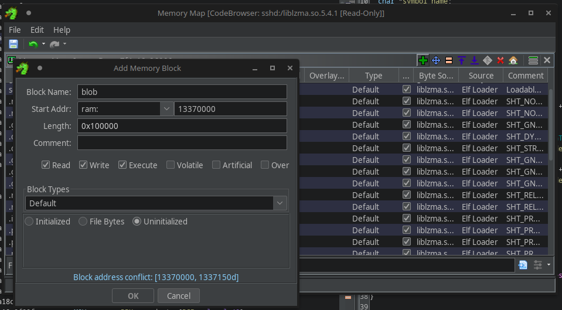

# 5 - sshd

**Time spent:** ~6 hours

**Tools used:** Docker, GDB, Ghidra+Scripting

Challenge 5 is, in my opinion, one of the best challenges in the series of this year.
It is also very relevant to the recent happenings in the world of Cyber, as it relates to a very interesting backdoor of a popular piece of open sourec software that was discovered in the beginning of the year.

You are presented with a file dump of a docker image called `ssh_container`.
The story is that a server running this image crashed and you need to figure out what happened.

## Orientation

A docker image is easily mountable using `docker import`:

```console
$ sudo docker import ssh_container.tar
```

This produces a hash that you can use to run the docker image and get a bash shell:

```console
$ sudo docker run --rm -it <hash> /bin/bash
```


The challenge description tells us that something crashed.
When an application crashes on Linux, typically a coredump will be created by `systemd` and stored in `/var/lib/systemd/coredump`.
And indeed, there is one, apparently for the process `sshd`:


## Finding the Relevant Code

Coredumps can be inspected using GDB:

```console
$ gdb /usr/sbin/sshd sshd.core.93794.0.0.11.1725917676
```

Looking into the backtrace that GDB can provide us with the `bt` command, we can see it tried to execute an instruction at address `0x0000000000000000`, and the function that was responsible for the crash contains address `0x00007f4a18c8f88f`:


Looks like `liblzma` has some faulty code.
Let's locate this library and pull it out of our docker image.


To make cross-referencing easier between GDB and Ghidra, we need to figure out the address where this liblzma was mapped into memory.
We can do this using GDB's `info proc mapping`.
While we may not see the exact name of the liblzma module (it looks broken or perhaps deliberately erased), but the addresses do not lie.
The following address range contains the faulty code address:



Great, now we know that our base address is `0x7f4a18c86000`.
We can now load `liblzma` into Ghidra with it:


The faulting address `0x00007f4a18c8f88f` is part of an unnamed function `FUN_7f4a18c8f820`.
This is weird, because the backtrace also indicated that the function calling our faulty code is at address `0x000055b46c7867c0`, an address within `sshd` itself.
This must mean it is actually an exported function (or else `sshd` wouldn't have a clue about the address to call), but for some reason it wasn't given a specific name.

However, we can easily figure out the original name of this function.
In a similar fashion, we can also load `sshd` itself with base address `0x55b46c6d9000` into Ghidra as well.
If we then go to `0x000055b46c7867c0`, we can actually see this was a call to `RSA_public_decrypt`:


I don't know how this program ended up calling this other function in `liblzma` as opposed to the original one (defined by `libcrypto` of OpenSSL), but that doesn't really matter.
Clearly we are dealing with some kind of hooking / backdoor in `liblzma`, very much akin to the XZ backdoor [that was found earlier this year](https://en.wikipedia.org/wiki/XZ_Utils_backdoor)!


## Understanding the Crash

We now know where it crashed, but still don't know **why** it crashed.

If we look at the code of our custom `RSA_public_decrypt` callback at `0x7f4a18c8f820`, we see that it does two things:


In most cases, it calls the original `RSA_public_decrypt` function dynamically by its name using the `dsym` function (red), and thus behaves exactly like the original `RSA_public_decrypt` function.
However, when a specific condition is met (specifically, when the sender's signature stored in the `from` parameter starts with a specific value), it does some extra stuff (purple), and then appends a space to the original function's name.

We now know where the crash came from.
Clearly, function names in C cannot contain spaces, and as such, `dsym` will fail and return `NULL`.
However, more importantly, this also tells us that the backdoor was actually triggered at the point the coredump was created.
This is great news because that likely means that the actual interesting stuff happens within the purple marked area!

The purple code starts with setting up something that looks like encryption parameters for a Salsa20 or Chacha20 algorithm.
It then maps it into hardcoded encrypted blob into RWX memory using `mmap` and `memcpy`.
This buffer is then decrypted and called.
Finally, after returning, the memory is encrypted again to prevent forensics (like us in this challenge right now!) from reading the decrypted code in plaintext.

Our task is to get this code somehow now anyway.


## Decrypting the Code

One approach would be to reimplement everything exactly how the program also implements it in C or Python.
However, this is time consuming and very error prone, especially if they slightly modified the encryption algorithm.
Therefore, instead I "replayed" the decryption algorithms exactly in the way the program executed them, with the help of Ghidra's Emulator.

First, we need to get all the relevant information from GDB.
That means, we need the memory that was stored in the `from` parameter.
Lucky for us, the moment the program crashed, the program tried to call `RSA_public_decrypt` again with the original parameters in their expected registers.
Given that `from` is our second parameter, it must be stored in register `RSI`:


We know this is correct because the first value contains `0xc5407a48`, the same value used in the if statement the backdoor code was guarded by. Great!

Now we can just map some new memory in Ghidra at a random address (I chose `0x13370000`) and write the `from` data into it:



Then, we can just let the emulator do its thing using a simple Ghidra script:

```java
private void stage1() throws Exception {
    long FROM = 0x13370000; // <-- Address of FROM parameter data
    long STATE = 0x13370200; // <-- Address to store the resulting chacha state in.

    long ENCRYPTED_CODE = 0x13370578; // <-- Address to put the encrypted/decrypted code buffer at.
    long LENGTH = 0x00000F96;

    println("Running");

    var emulator = new EmulatorHelper(currentProgram);

    // Call chacha_init
    emulator.writeRegister("RIP", 0x7f4a18c8f8e2L);
    emulator.writeRegister("RDI", STATE);
    emulator.writeRegister("RSI", FROM + 4);
    emulator.writeRegister("RDX", FROM + 0x24); 
    emulator.writeRegister("RCX", 0);
    while (emulator.getEmulator().getPC() != 0x7f4a18c8f8e7L) // Execute till return
        emulator.step(monitor);
    
    // Read out the init buffer.
    byte[] state = emulator.readMemory(emulator.getExecutionAddress().getNewAddress(STATE), 0xc0);

    // Call chacha_encrypt_decrypt
    emulator.writeRegister("RIP", 0x7f4a18c8f930L);
    emulator.writeRegister("RDI", STATE); 
    emulator.writeRegister("RSI", ENCRYPTED_CODE);
    emulator.writeRegister("RDX", LENGTH);
    while (emulator.getEmulator().getPC() != 0x7f4a18c8f935L) // Execute till return
        emulator.step(monitor);

    // Read out the decrypted code memory.
    byte[] code = emulator.readMemory(emulator.getExecutionAddress().getNewAddress(ENCRYPTED_CODE), (int) LENGTH);

    // Write it to the disk.
    Files.write(Paths.get("/tmp/output.bin"), code);
    println("Done");
}
```

The final resulting code blob can be found in [output.bin](dumps/output.bin)
This code can then also be added to Ghidra again using `File > Add to Program`, again at a random address of your choice.


## Analyzing Stage 2

Stage 2 is pretty straightforward (especially after running the `ResolveX86orX64LinuxSyscallsScript` shipped with Ghidra).


It first receives two messages over a socket, which are used later as encryption key/IV.
Then it receives a third message containing a path of a file to exfiltrate.
It then performs yet another encryption, which also looks again similar to Salsa20 or ChaCha20, and then sends the encrypted data back over the same socket.

We know the drill by now, let's just replay again using Ghidra's emulator!

The tricky part is to find the data however this time.
We don't have a pcap containing all the network traffic, so we must rely again on the coredump.
This time we are not so lucky however with the registers.
The moment the coredump was created is way past the moment this code was executed in a call frame that was popped from the stack long ago.
None of the registers will contain any of that data anymore...

Or does it?


## Finding the Encrypted Traffic and Getting the Flag

When returning from a function, a typical function adjusts the stack pointer (`RSP`).
However, this does not mean the memory is necessarily cleared out!
This is the difference between simply deallocating/freeing memory and actually erasing memory.

Additionally, Ghidra's decompiler has detected that some of the stack variables in this function are huge:

```c
...
undefined receive_buff [32];
undefined receive_buff2 [16];
char file_path [256];
byte file_contents [4224];
...
```

As such, even though the stack memory was deallocated, there is a big chance these variables are still (partially) present on the stack.
All we have to do is find some memory close to the `RSP` that looks somewhat similar to a file path, and use this as an anchor point for the offset to the `file_path` local variable.

It so turns out a file path exists at `RSP-0x1280`.
You can then just simply add/subtract the sizes to get to the other variables easily:


Map the data into Ghidra memory again, and with almost exactly the same code as before, we can emulate-to-win!

```java
private void stage2() throws Exception {
    long DATA = 0x55550000L;  // <-- Encrypted file contents
    long BUFF1 = 0x55550e77L; // <-- Key
    long BUFF2 = 0x55550d1eL; // <-- IV
    long STATE = 0x555508acL; // <-- Random address for Chacha state.

    long LENGTH = 0x80;

    println("Running");

    var emulator = new EmulatorHelper(currentProgram);

    // Call chacha_init
    emulator.writeRegister("RIP", 0x12340eb1L);
    emulator.writeRegister("RCX", BUFF2);
    emulator.writeRegister("RDX", BUFF1); 
    emulator.writeRegister("RAX", STATE);
    while (emulator.getEmulator().getPC() != 0x12340eb6L)
        emulator.step(monitor);

    // Call chacha_encrypt_decrypt
    emulator.writeRegister("RIP", 0x12340ecaL);
    emulator.writeRegister("RDX", DATA); 
    emulator.writeRegister("RCX", LENGTH);
    emulator.writeRegister("RAX", STATE);
    while (emulator.getEmulator().getPC() != 0x12340ecfL)
        emulator.step(monitor);
    
    // Read decrypted memory and write to file.
    byte[] code = emulator.readMemory(emulator.getExecutionAddress().getNewAddress(DATA), (int) LENGTH);
    Files.write(Paths.get("/tmp/decrypted-file.bin"), code);
    println("Done");
}
```

Opening the decrypted data reveals, among some garbage data, the flag:


## Final Words

This challenge was great!
A super nice balance of digital forensics / incident response, combined with some nice reverse engineering.
It also made me realize once again that while stack memory is supposed to be temporary, it is not as temporary as you may think!

Also, I later learned from other people that the second stage's encryption algorithm actually wasn't ChaCha20, but a slightly modified version of it (using a slightly different constant).
However, thanks to Ghidra's emulator, I didn't need to know nor take this into account at all. Ghidra rocks!
