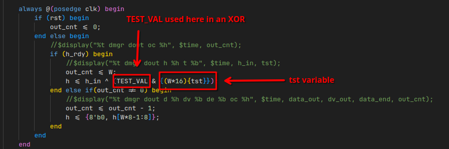

# 6 - bloke2

**Time spent:** ~3 hours

**Tools used:** Verilog and a lot of Random Luck&#8482;

Challenge 6 is the obligatory "weird-architecture" challenge that FLARE-ON typically does at least one of every year.
You are presented with a folder full of verilog source code files.
The description tells you it is implementing a variant of the BLAKE2 hashing algorithm.
Your task is to find an input that spits out the flag as hash.

Honestly, I am not sure what the idea behind it was.
For me, the flag just kind of appeared out of nowhere, and frankly, I have no idea why this was the solution.


## Orientation

The file structure is quite complicated and looks very foreign, especially for a person like me that has near zero experience with any hardware.
There are a bunch of files that apparently implement a circuit of sorts.


Luckily the README had some guidelines, including the suggestion to use [iverilog](https://github.com/steveicarus/iverilog) and the accompanied `Makefile` commands:


Looking into the `Makefile` and using the `Received message:` string as anchor point, I figured the `_tb` files are the test benches:


This clause is evaluated on every positive clock edge of the circuit.
It prints the output message if the `dout_end` signal (presumably data output end) was observed.
This is related to a... "function" (?) called `hash_message` that is defined right below it, which also waits for this signal:


Here we can see that we're dealing with some important variables `start`, `finish` and `din` (presumably "data input"), which are used to reference input and output pins for our circuit.

Looking at where this `hash_message` "function" is... ehm... "called" (?), we can see some of the test inputs:


Cross referencing on these pins, we can figure out that these signals come from input and output pints of a circuit component called `bloke2b`:


`bloke2b` is nothing more than just an instance of the `bloke2` component, with a bunch of hardcoded parameters:


The `bloke2` component is very complicated.
It consists of two more sub components.
It has an `f_unit` which again consists of a collection of `g_unit`s, of which I have 0 clue what it does.
The other component is called `data_mgr` which, presumably, manages data (who would've guessed!).


## Getting the Flag ... at Random?

At this point, I wasted a good amount of time trying to figure out what the exact differences were between BLOKE2 and the original BLAKE2 hash algorithm.
Most implementations I found for BLAKE2 were written in C or other C-like languages, and cross-referencing it with Verilog, a language that doesn't look anything like C nor I have any real experience with to begin with, is let me tell you a real pain.

But, after an hour or so of painful cross-referencing, it seemed like the `f_unit`s and `g_unit`s looked similar enough to their original code that I was pretty quickly convinced this is not the place to look for flaws.

I decided to look into `data_mgr` instead.
And something weird stood out immediately.
At line 64, a very weird `TEST_VAL` parameter is defined with a suspiciously looking hardcoded value:

```verilog
localparam TEST_VAL = 512'h3c9cf0addf2e45ef548b011f736cc99144bdfee0d69df4090c8a39c520e18ec3bdc1277aad1706f756affca41178dac066e4beb8ab7dd2d1402c4d624aaabe40;
```

This variable only has one use, in a `posedge` clause defined right below it:



It is bitwise-AND with another variable `tst`, and then XOR'ed with the final BLOKE2 hash value.
Some testing revealed that this `tst` pretty much always is set to 0, so I tried looking for the place where it would be set.
A quick Ctrl+F reveals it is bound to an input pin `finish`:


I looked back at the test-bench, and just decided to set `finish` to `1`, just to see what would happen.

```verilog
...

start <= 1'b1;
finish <= 1'b1; // <-- set finish to 1 instead of 0.
@(posedge clk);
start <= 1'b0;
finish <= 1'b0;

...
```

And, all of the sudden the flag appeared?


Why did this work? No clue, but I'll take it.


## Final Words

The challenge has an interesting idea but the execution seemed poor.

I spent a good amount of time learning Verilog, getting stuck with  "what are the differences between this and normal BLAKE2" and "how am I supposed to find an input for which the hash is a flag?".
But in the end, none of that mattered: All you needed was guess that one of the **sample inputs** was actually producing the flag when flipping one bit.
As far as I can tell, there is basically zero indication that one of the test inputs should've been used.
This set me back several HOURS of time, as I had changed the test inputs to something else.
Not until redownloading the challenge again, in fear I had broken something while debugging and tracing everything, the flag apparead out of the blue.

... Just why?

In any case, this challenge made me feel like I wasted a lot of time learning things I didn't need.
I am kind of curious whether this was the intended solution.
If it was then why make me learn all about Verilog? If it wasn't, then maybe the challenge wasn't tested properly? 

I was very confused by this one.